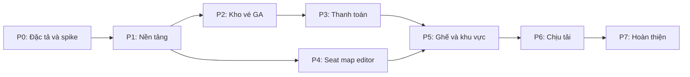
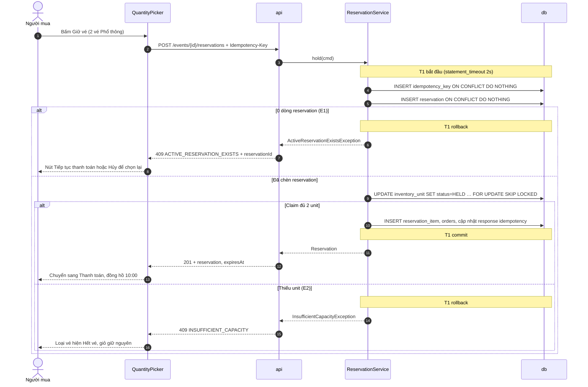

# Master Plan: xây dựng Hệ thống đặt vé sự kiện từ đầu đến cuối

> Trạng thái: **Approved v1.1** · Cập nhật: 2026-10-07 (Owner duyệt P0-00, P0-01; hoãn S-02…S-06 tới gate của phase cần (DR-152); mọi DR đã Chốt hoặc Đổi; Owner đổi DR-05, 06, 10, 12, 13, 21, 28, 31, 37, 38, 41, 44, 45, 52, 56, 58, 60, 62, 74; theo template mới của skill: thêm luồng chi tiết DOC-82…90, FL-01…35) · Đi kèm: [00-decision-register.md](00-decision-register.md) · Nguồn: `event-ticket-booking-sdd.md` (**SDD gốc**) và canvas thiết kế màn hình "Ticket — Design system & luồng mua vé"

Tài liệu này gồm bốn phần: (1) các khoảng trống của SDD gốc, đối chiếu với canvas màn hình, mỗi khoảng trống đã thành một mục trong [sổ quyết định](00-decision-register.md); (2) toàn bộ tài liệu cần viết, nội dung bắt buộc và gate của từng tài liệu; (3) toàn bộ công việc theo phase kèm tiêu chí nghiệm thu đo được; (4) ma trận truy vết từ yêu cầu tới công việc và cách kiểm chứng.

Mục tiêu: khi bắt đầu một task, mọi thứ cần cho task đó đã có trong tài liệu. Không ai phải hỏi lại.

## 0. Cách dùng tài liệu này

### 0.1 Ngôn ngữ

| | |
| --- | --- |
| Tài liệu (`docs/`, sổ quyết định, master plan) | Tiếng Việt (`vi`) · vocabulary: `locales/vi.md` có sẵn của skill |
| Code, log, mã lỗi API, commit, tiêu đề PR | English |
| Chuỗi giao diện và email | Đa ngôn ngữ qua i18n: locale `vi` (mặc định và dự phòng, chuỗi từ canvas) và `en`; key viết tiếng Anh theo nghĩa — DR-10 |
| Quyền tự chốt khi viết tài liệu | Claude được tự chốt mọi câu hỏi nhỏ, dễ đảo ngược, ghi "Claude (Owner ủy quyền)"; mục mơ hồ hoặc mức kiến trúc thì hỏi Owner |
| Chốt | 2026-10-05, Owner; mở rộng quyền tự chốt 2026-10-06 |

### 0.2 Thứ tự đọc

Người mới đọc theo thứ tự: §1 → §4 → phase hiện tại ở §5 → các tài liệu mà phase đó tham chiếu. SDD gốc vẫn là nguồn cho "vì sao"; tài liệu trong `docs/` là nguồn cho "chính xác làm thế nào". Khi hai nơi khác nhau, sổ quyết định và tài liệu `docs/` thắng, và sự khác biệt được ghi ⚠ ở DR tương ứng.

### 0.3 Luật gate tài liệu

Mỗi phase có task `Pn-00` duyệt tài liệu. Một phase chỉ bắt đầu khi mọi tài liệu và ADR có Gate = Pn ở §3.2 đều `Approved` (định nghĩa ở §3.3). Tài liệu đánh dấu "khung ở P1" được duyệt phần khung ở P1 và bổ sung ở các phase sau; mỗi lần bổ sung đi cùng PR của task.

### 0.4 Định danh

| Tiền tố | Nghĩa | Định nghĩa ở |
| --- | --- | --- |
| `FR-xx` / `FR-xx.y` | Yêu cầu chức năng / yêu cầu con (giữ mã của SDD gốc) | DOC-03 |
| `NFR-xx` | Yêu cầu phi chức năng (giữ mã của SDD gốc) | DOC-03 |
| `UC-xx` | Use case (UC-01…11 của SDD gốc, UC-12 trở đi bổ sung) | DOC-04, danh sách ở §3.4 |
| `PS-x`, `J-x` | Persona, hành trình | DOC-02 |
| `F-<NHÓM>-xx` | Tính năng | DOC-05 |
| `BR-xx` | Quy tắc nghiệp vụ được đánh số | DOC-04 |
| `DOC-xx` | Tài liệu | §3.1 |
| `ADR-xxxx` | Quyết định kiến trúc | `04-adr/NNNN-*.md` |
| `DR-xx` | Mục trong sổ quyết định | `00-decision-register.md` |
| `Pn-xx` | Task của phase n; `Pn-00` luôn là gate tài liệu | §5 |
| `Mn` | Milestone đóng phase n | §4.1 |
| `S-xx` | Spike (≤ 1–2 ngày) | §5, Phase 0 |
| `E-xx` | Endpoint API | DOC-37 |
| `FL-xx` / `FL-xx.y` | Luồng chi tiết / luồng con | DOC-83…90, mục lục ở DOC-82 |
| `EXP-xx` | Thực nghiệm (giữ mã của SDD gốc) | `10-testing/experiments/` |
| `RB-xx` | Runbook | `09-operations/runbooks/` |
| `INV-xx` | Mục kiểm tra bất biến | DOC-30 |
| `MAP-xx` | Mã vấn đề validate sơ đồ (dạng số, ánh xạ tới mã chữ của DR-35) | DOC-21 |
| `<X>-xx` | Test bắt buộc của một tài liệu, mỗi tài liệu một tiền tố; danh mục ở DOC-69 | Mục "Test bắt buộc" của tài liệu đó |

Tiền tố test đã dành trước (không dùng cho việc khác): `AU-` (DOC-19), `EV-` (DOC-20), `GEO-` (DOC-21), `ED-` (DOC-22), `MV-` (DOC-23), `INVT-` (DOC-24), `IDEM-` (DOC-25), `PAY-` (DOC-26), `TN-` (DOC-27), `ADM-` (DOC-28), `AV-` (DOC-29), `IC-` (DOC-30), `SEC-` (DOC-32), `FLA-` (DOC-83), `FLS-` (DOC-84), `FLG-` (DOC-85), `FLO-` (DOC-86), `FLP-` (DOC-87), `FLM-` (DOC-88), `FLV-` (DOC-89), `FLW-` (DOC-90), `ARC-` (DOC-12), `DM-` (DOC-14), `OM-` (DOC-15), `I18N-` (DOC-31), `OBS-` (DOC-33), `ERR-` (DOC-35), `APIG-` (DOC-36), `ENDP-` (DOC-37), `UX-` (DOC-38), `DS-` (DOC-39), `COPY-` (DOC-40), `SCR-` (DOC-41), `LGN-` (DOC-44), `EML-` (DOC-51), `ERP-` (DOC-52), `OPS-` (DOC-61…63, dải ID chia theo tài liệu), `TST-` (DOC-69), `CFG-` (DOC-34).

### 0.5 Vòng đời trạng thái

| Loại | Vòng đời |
| --- | --- |
| Tài liệu | `Draft` → `Review` → `Approved` → `Superseded` |
| ADR | `Proposed` → `Accepted` → `Superseded by ADR-yyyy` |
| DR | `Đề xuất` → `Chốt` hoặc `Đổi` (ghi phương án được chọn) |
| Task | trống → `**Xong YYYY-MM-DD** (\`sha\`)`; task hoãn hoặc cắt ghi lý do |

## 1. Phân tích SDD gốc

### 1.1 Những gì đã tốt, giữ nguyên

- **Bất biến được ép ở database** (SDD gốc 4.2, 8.1, 11.2): mọi đổi trạng thái là câu ghi có điều kiện hoặc ràng buộc; Redis không bao giờ quyết định. Đây là xương sống của NEVER OVERSELL và không bị đổi.
- **Một dòng mỗi vé, claim bằng `SKIP LOCKED`** (SDD gốc 10.3) cho cả ba mô hình SEAT/ZONE/GA, có phân tích phương án A–D và EXP-10 để kiểm chứng bằng số.
- **Trạng thái `EXPIRING` làm trọng tài giữa confirm và expire** (SDD gốc 8.4): kho vé chỉ được trả sau khi PaymentIntent đã hủy chắc chắn.
- **Idempotency và loại trùng webhook nằm trong cùng transaction nghiệp vụ** (SDD gốc 8.6, 9.3).
- **Tài liệu sơ đồ tham số với UUID ổn định cho ghế** (SDD gốc 7.1, 7.8): điều kiện để sửa sơ đồ sau khi mở bán mà không lệch kho vé.
- **Mười thực nghiệm có chỉ số và kỳ vọng rõ** (SDD gốc 15.2), mỗi thực nghiệm kết thúc bằng lệnh kiểm tra bất biến.
- **Thứ tự triển khai từ lõi ra ngoài** (SDD gốc 16): GA → thanh toán → editor song song → ghế/zone → chịu tải; và thứ tự cắt giảm đã nêu.
- **Canvas màn hình đầy đủ trạng thái**: mỗi màn có biến thể đang tải, rỗng, lỗi, bản điện thoại 390 px, và design system "Vé giấy" v0.1 với token cụ thể.

### 1.2 Khoảng trống chính

| # | Khoảng trống | Hậu quả nếu để mở | DR |
| --- | --- | --- | --- |
| 1 | Không có DDL; trạng thái `REMOVED` của unit có ở 7.8, 14.3 nhưng không có trong vòng đời 8.1 | Mỗi module tự đặt cột; kiểm tra bất biến "unit chưa REMOVED = capacity" không chạy được | DR-14–19 (Chốt) |
| 2 | Request tạo PaymentIntent và job trả vé có thể đan xen: job đọc `payment_intent_id` = NULL trước khi request lưu ID | Job trả vé "vì chưa từng có PaymentIntent", người mua vẫn trả được tiền → thanh toán đến trễ, đơn phải hoàn tiền thủ công | DR-47 (Chốt) |
| 3 | Thanh toán đến trễ "giữ lại vé" nhưng máy trạng thái coi `EXPIRED`/`CANCELLED` là cuối, thiếu `CANCELLED → PAID` | Code luồng trễ vi phạm chính máy trạng thái; test máy trạng thái chặn luồng an toàn cuối cùng. **Đã đổi:** không giữ lại vé, đơn sang `REFUND_PENDING` | DR-44 (Đổi) |
| 4 | Hủy sự kiện "khi chưa có đơn PAID" là check-then-act; Owner muốn hủy được cả sự kiện đã bán | Webhook commit ngay sau kiểm tra → đơn `PAID` trên sự kiện đã hủy. **Đã đổi:** hủy được khi đã bán, mọi đơn `PAID` sang `REFUND_PENDING` dưới khóa dòng event | DR-28 (Đổi) |
| 5 | Sơ đồ "dùng lại cho nhiều sự kiện" nhưng tài liệu sơ đồ chứa `ticketTypeId` của một sự kiện | Dùng chung cho sự kiện thứ hai thì mọi ghế trỏ sai loại vé, sai giá. **Đã đổi:** dùng lại bằng nhân bản toàn bộ, sinh ID mới | DR-31 (Đổi) |
| 6 | Magic link đi qua outbox nhưng token chỉ được lưu dạng hash; hủy PaymentIntent "qua outbox" nhưng job cần kết quả đồng bộ | Hoặc vi phạm NFR-07, hoặc job outbox không dựng được link; job trả vé không biết khi nào được trả vé | DR-21 (Đổi: gửi trực tiếp sau commit, không qua outbox), DR-53 |
| 7 | "Tự bật phòng chờ khi chạm `max_active`" mà không có tập `admitted` khi hàng đợi tắt; `pass_ttl` 10 phút ≠ canvas 5 phút; không có endpoint rời hàng | Không cài đặt được điều kiện tự bật; giao diện và server lệch thời hạn | DR-57 (Chốt: luôn bật) |
| 8 | Tình trạng chỗ trả "danh sách ghế không còn trống" | 20.000 ghế ≈ 750 KB mỗi lần, mỗi người hỏi 3–5 giây một lần → băng thông và CPU JSON vượt xa đường giữ vé | DR-62 (Chốt) |
| 9 | Canvas cần endpoint SDD không có: danh sách sự kiện studio kèm số vé, điều kiện xuất bản, sơ đồ theo trạng thái, ảnh, đổi ngôn ngữ | Màn hình không có nguồn dữ liệu; frontend tự ghép hoặc chờ backend | DR-65, DR-38, DR-71 |
| 10 | Validate sơ đồ chạy ở cả client và server, không nói cách giữ hai bản cài đặt khớp nhau | Editor báo "đạt" rồi server từ chối khi xuất bản, hoặc ngược lại | DR-35 |
| 11 | Giới hạn vé "mỗi đơn" (6.1) hay "mỗi người" (5.3); chọn lại khi đã có reservation mở | Hai cách hiểu cho hai bộ test khác nhau; người mua bấm "Chọn lại chỗ" bị chặn bởi unique index | DR-41 (Đổi: bỏ giới hạn), DR-43 |
| 12 | NFR-02 "100.000 người dùng đồng thời" không có mô hình tải; không có cổng thanh toán giả cho EXP-06 | Thực nghiệm chính không chạy được trên một máy; EXP-06 phụ thuộc Stripe test mode và rate limit của nó | DR-75, DR-51 |
| 13 | Giao diện đa ngôn ngữ (Owner chọn) không có trong SDD; canvas chỉ có tiếng Việt | Chuỗi cứng trong component, email chỉ một ngôn ngữ, phải sửa lại toàn bộ sau | DR-10 |
| 14 | Phiên bản stack: SDD chọn Java 21 + Spring Boot 3, dòng 3.x đã hết hỗ trợ OSS tại 2026-10 | Bắt đầu trên nền hết hỗ trợ, phải nâng cấp lớn giữa dự án | DR-02 |

### 1.3 Điều chỉnh so với kế hoạch trong SDD gốc

| Điều chỉnh | Lý do |
| --- | --- |
| Thêm **Phase 0: đặc tả và spike** trước giai đoạn 1 | Chốt 78 DR, chạy 6 spike, viết tài liệu gate P1 trước khi có code |
| Giữ nguyên 7 giai đoạn của SDD gốc thành P1–P7 | Thứ tự lõi trước của SDD gốc đã đúng |
| CI tối thiểu từ P1 (DR-08) thay vì để sau | Test đồng thời và tích hợp là bằng chứng của NFR-01; phải chạy ở mọi PR |
| Log JSON, metric Prometheus và profile `obs` từ P1/P6 (DR-09) | EXP-05 cần p95, số connection, thời gian giữ connection |
| Giao diện mua vé GA (danh sách, chi tiết, chọn số lượng, kết quả, vé của tôi) và studio GA (hồ sơ, thông tin, loại vé, xem trước, xuất bản) làm ở P2 | SDD gốc yêu cầu "nhận vé GA 0 đồng đầu cuối" ở giai đoạn 2; không có giao diện thì không có đầu cuối |
| Phiên bản sơ đồ khi event còn `DRAFT` làm ở P4; xuất bản phiên bản mới trước giờ mở bán (dựng lại kho vé) và khóa sơ đồ từ giờ mở bán ở P5 | P4 chỉ phụ thuộc P1 (SDD gốc 16); dựng lại kho vé cần unit ghế của P5 |
| Thêm object storage tương thích S3 cho ảnh và bảng metadata `media` (DR-38), cổng thanh toán giả (DR-51), bản claim thay thế cho thực nghiệm (DR-76) | Các luồng của SDD gốc cần chúng để chạy hoặc để đo |
| i18n `vi` (mặc định) + `en` từ P1 (DR-10) | Owner chọn giao diện đa ngôn ngữ; thêm sau tốn hơn nhiều |
| `docker compose up` mặc định chạy với `PAYMENTS_MODE=fake` (DR-72) | NFR-08 phải đạt mà không cần tài khoản Stripe |
| Cắt giảm thêm bước 4–5 vào thứ tự của SDD gốc (§4.3) | Thứ tự gốc chỉ có ba bước; P4 là phase lớn nhất |
| Cho hủy sự kiện đã bán vé; đơn đã thanh toán chuyển chờ hoàn tiền thủ công (DR-28) | Owner chốt 2026-10-05; SDD gốc 6.1 chỉ cho hủy khi chưa có đơn `PAID` |
| Thanh toán đến trễ không phát hành vé, luôn chờ hoàn tiền; `NEEDS_REVIEW` đổi thành `REFUND_PENDING`/`REFUNDED` (DR-44) | Owner chốt 2026-10-05; luồng an toàn cuối đơn giản, không chạm kho vé |
| Nhân bản sơ đồ từ sự kiện khác làm ngay ở P4 (DR-31) | Owner chốt 2026-10-05; thay cho "dùng chung sơ đồ" của SDD gốc 7.8 |
| Bỏ giới hạn số vé mỗi đơn/mỗi người; chỉ giữ giới hạn kỹ thuật 50 unit mỗi lệnh giữ vé (DR-41) | Owner chốt 2026-10-06; SDD gốc 5.3, 6.1 có giới hạn |
| Ảnh lưu ở object storage tương thích S3, compose dùng SeaweedFS (DR-38) | Owner chốt 2026-10-06; tách byte ảnh khỏi PostgreSQL, chuyển sang S3/R2 chỉ bằng cấu hình |
| Sơ đồ khóa toàn bộ từ giờ mở bán, kể cả khi chưa ai mua (DR-37); sau đó chỉ sửa thông tin, giá, sức chứa, tạm dừng, đóng bán sớm (mới, DR-24), hủy | Owner chốt 2026-10-06; SDD gốc 7.8 cho sửa sơ đồ khi đang bán theo diff, phần nặng nhất của P5 |
| Đơn giản hóa phần không thuộc lõi (dự án để học): magic link gửi trực tiếp (DR-21), không token vào cửa (DR-58), `admit_rate` cố định (DR-60), không limiter dự phòng khi mất Redis (DR-56), cache tình trạng chỗ trong tiến trình (DR-62) | Owner chốt 2026-10-06; bớt mã hóa, hai thư viện, một vòng điều khiển và ba họ key Redis mà không đụng tới NEVER OVERSELL |
| Thêm nhóm luồng chi tiết `06-design/flows/` (DOC-82…90): mỗi UC có ít nhất một `FL-xx` đi từ thao tác trên màn hình tới PostgreSQL/Redis/Stripe và quay lại | Mọi UC đi qua ≥ 3 tầng (màn hình, SPA, API, service, PostgreSQL, Redis, Stripe, job); thiếu luồng chi tiết thì người viết code tự ghép từ 5–6 tài liệu (màn hình, endpoint, thiết kế, DDL, lỗi, microcopy) và nhánh lỗi dễ bị sót |

## 2. Nguyên tắc thực hiện

1. **Lõi đúng trước, đầy đủ sau.** P2 (kho vé GA) và P3 (thanh toán) là phần chứng minh NEVER OVERSELL; không bao giờ bị cắt (SDD gốc 16).
2. **Mỗi phase kết thúc bằng thứ chạy được và trình diễn được** (milestone `Mn` ở §4.1).
3. **Tài liệu đi cùng code.** Thay đổi hành vi thì sửa tài liệu trong cùng PR; đổi quyết định thì viết ADR mới thay ADR cũ.
4. **Mọi ngưỡng là cấu hình; mọi key cấu hình có trong DOC-34.**
5. **Mọi đổi trạng thái là một câu ghi có điều kiện, kiểm tra số dòng.** Code review từ chối mọi cặp "đọc rồi quyết định ghi" trên `inventory_unit`, `reservation`, `orders`, `event.status` (SDD gốc 4.2).
6. **Mỗi tranh chấp có một test đồng thời trước khi viết code nghiệp vụ quanh nó**: claim ghế, claim pool, confirm với expire, tạo PaymentIntent với expire, hủy sự kiện với webhook, xuất bản phiên bản với giữ vé.
7. **Không gọi ra ngoài khi đang mở transaction** (Stripe, SMTP, Redis); mọi vi phạm là lỗi review (SDD gốc 10.4).
8. **Mỗi thực nghiệm kết thúc bằng `make invariants` sạch**; kết quả ghi số đo kèm ngày, máy, git SHA.
9. **Không chuỗi giao diện cứng trong component**: mọi chuỗi qua key i18n có đủ `en` và `vi` (DR-10).
10. **Backend và frontend tách task, làm song song theo hợp đồng API.** Việc có cả API và màn hình tách thành `Pn-xx.1` (backend) và `Pn-xx.2` (frontend); frontend không chờ backend mà chạy trên mock, quy ước ở §7.4.

## 3. Bộ tài liệu cần viết

### 3.1 Cây thư mục docs/

```
docs/
  README.md                                   # mục lục, trạng thái
  00-master-plan.md
  00-decision-register.md
  01-product/
    vision-and-scope.md                       # DOC-01
    personas-and-journeys.md                  # DOC-02
    requirements.md                           # DOC-03
    use-cases.md                              # DOC-04
    feature-catalog.md                        # DOC-05
  02-glossary.md                              # DOC-06
  03-architecture/
    system-context-and-containers.md          # DOC-07
    data-flows.md                             # DOC-08
    integration-contracts.md                  # DOC-09
    quality-attributes.md                     # DOC-10
    tech-stack-and-versions.md                # DOC-11
    code-architecture.md                      # DOC-12
  04-adr/
    README.md                                 # DOC-13
    0001-record-architecture-decisions.md
    0002-modular-monolith-postgres-source-of-truth.md
    0003-one-row-per-ticket-skip-locked.md
    0004-reservation-row-as-arbiter-expiring-state.md
    0005-stripe-paymentintent-cards-webhook-truth.md
    0006-transactional-outbox-for-email.md
    0007-magic-link-server-sessions.md
    0008-redis-for-load-shedding-and-waiting-room.md
    0009-parametric-seat-map-document-immutable-versions.md
    0010-one-seat-map-per-event.md
    0011-java-25-spring-boot-4.md
    0012-spring-data-jdbc-and-modulith-boundaries.md
    0013-availability-bitmap-snapshot.md
    0014-editor-store-outside-react-konva-custom-shape.md
    0015-media-in-s3-compatible-object-storage.md
    0016-multilingual-ui-vi-en.md
    0017-payment-gateway-port-with-fake-adapter.md
    0018-uuidv7-primary-keys.md
  05-data/
    domain-model.md                           # DOC-14
    ops-model.md                              # DOC-15
    seat-map-document.md                      # DOC-16
    redis-keys.md                             # DOC-17
    data-lifecycle.md                         # DOC-18
  06-design/
    auth-and-sessions.md                      # DOC-19
    events-and-ticket-types.md                # DOC-20
    map-core-geometry-and-validation.md       # DOC-21
    seat-map-editor.md                        # DOC-22
    map-versioning-and-diff.md                # DOC-23
    inventory-and-reservation.md              # DOC-24
    idempotency.md                            # DOC-25
    checkout-and-payment.md                   # DOC-26
    tickets-and-notifications.md              # DOC-27
    admission-control.md                      # DOC-28
    seat-viewer-and-availability.md           # DOC-29
    invariant-checker.md                      # DOC-30
    i18n.md                                   # DOC-31
    security.md                               # DOC-32
    observability.md                          # DOC-33
    configuration-reference.md                # DOC-34
    error-handling.md                         # DOC-35
    flows/
      README.md                               # DOC-82
      auth-and-account.md                     # DOC-83
      studio-events.md                        # DOC-84
      ga-purchase.md                          # DOC-85
      operations.md                           # DOC-86
      payment.md                              # DOC-87
      seat-map-editing.md                     # DOC-88
      seat-sales.md                           # DOC-89
      waiting-room.md                         # DOC-90
  07-api/
    api-guidelines.md                         # DOC-36
    api-endpoints.md                          # DOC-37
  08-ux-ui/
    ux-principles-and-ia.md                   # DOC-38
    design-system.md                          # DOC-39
    ui-states-and-copy.md                     # DOC-40
    screens/
      README.md                               # DOC-41
      event-list.md                           # DOC-42
      event-detail.md                         # DOC-43
      login.md                                # DOC-44
      waiting-room.md                         # DOC-45
      seat-picker.md                          # DOC-46
      quantity-picker.md                      # DOC-47
      checkout.md                             # DOC-48
      order-result.md                         # DOC-49
      my-tickets.md                           # DOC-50
      emails.md                               # DOC-51
      error-pages.md                          # DOC-52
      studio-organizer-profile.md             # DOC-53
      studio-overview.md                      # DOC-54
      studio-event-info.md                    # DOC-55
      studio-ticket-types.md                  # DOC-56
      studio-map-editor.md                    # DOC-57
      studio-preview.md                       # DOC-58
      studio-publish.md                       # DOC-59
      studio-sales.md                         # DOC-60
  09-operations/
    local-dev.md                              # DOC-61
    deploy-compose.md                         # DOC-62
    ci-cd.md                                  # DOC-63
    runbooks/
      README.md                               # DOC-64
      RB-01-manual-refund.md                  # DOC-65
      RB-02-invariant-violation.md            # DOC-66
      RB-03-stuck-reservations-and-webhooks.md # DOC-67
      RB-04-reset-demo-data.md                # DOC-68
  10-testing/
    test-strategy.md                          # DOC-69
    experiments/
      README.md                               # DOC-70
      EXP-01-single-seat-contention.md        # DOC-71
      EXP-02-pool-contention.md               # DOC-72
      EXP-03-idempotency.md                   # DOC-73
      EXP-04-expiry-under-load.md             # DOC-74
      EXP-05-admission-and-connection-pool.md # DOC-75
      EXP-06-confirm-vs-expire-race.md        # DOC-76
      EXP-07-duplicate-out-of-order-webhooks.md # DOC-77
      EXP-08-fault-injection.md               # DOC-78
      EXP-09-editor-performance.md            # DOC-79
      EXP-10-unit-rows-vs-counter.md          # DOC-80
    demo-script.md                            # DOC-81
```

Nhóm `11-report` không dùng (không có báo cáo học thuật); số nhóm khác giữ nguyên. DOC-82…90 (luồng chi tiết) được thêm sau khi đã đánh số DOC-01…81 nên lấy số kế tiếp dù nằm trong `06-design/`.

### 3.2 Nội dung bắt buộc của từng tài liệu

Cột Gate là phase cần tài liệu ở trạng thái `Approved` trước khi bắt đầu. Mục **in đậm** là mục dễ bị bỏ sót nhất.

#### 01-product

| DOC | Tài liệu | Nội dung bắt buộc | Gate |
| --- | --- | --- | --- |
| DOC-01 | Tầm nhìn và phạm vi | Bối cảnh và bốn vấn đề thực tế (SDD gốc 1.2); hai lớp giá trị; bài toán cốt lõi và NEVER OVERSELL; **mục tiêu đo được gắn với NFR-01…08 và EXP chứng minh**; trong phạm vi / để sau / ngoài phạm vi có lý do (thêm: giới hạn số vé mỗi đơn/mỗi người và chống đầu cơ theo số lượng, dark mode, hoàn tiền tự động — DR-41, DR-28, DR-44); giả định (một máy, Stripe test mode, `PAYMENTS_MODE=fake` mặc định); ràng buộc (1 người, tài nguyên máy thực nghiệm); thứ tự cắt giảm §4.3 | P1 |
| DOC-02 | Persona và hành trình | `PS-1` người mua trên điện thoại (ưu tiên, SDD gốc 13.2), `PS-2` người mua trên máy tính trong đợt mở bán đông, `PS-3` người tổ chức nhà hát (sơ đồ ghế), `PS-4` người tổ chức hội thảo (chỉ GA), `PS-5` người vận hành/nghiên cứu (chạy thực nghiệm, hoàn tiền đơn `REFUND_PENDING`); mỗi persona: mục tiêu, nỗi đau, cần gì, không cần gì, màn hình dùng; **hành trình `J-x` cho mỗi persona kèm màn hình (DOC-42…60) và endpoint**; `J-2` gồm phòng chờ và tranh ghế | P1 |
| DOC-03 | Yêu cầu | FR-01…12 giữ mã SDD gốc, tách `FR-xx.y` với **tiêu chí G/W/T có số** (thời hạn 10 phút, tối đa 50 unit mỗi lệnh giữ vé, 15 phút magic link, 3 link/15 phút…); FR bổ sung đánh dấu "(bổ sung)": FR-13 hồ sơ tổ chức, FR-14 hủy/tạm dừng sự kiện (kể cả khi đã bán, đơn sang chờ hoàn tiền), FR-15 khóa sơ đồ từ giờ mở bán và đóng bán sớm (DR-37, DR-24), FR-16 phòng chờ có rời hàng, FR-17 đa ngôn ngữ, FR-18 ảnh sự kiện, FR-19 email đổi lịch, FR-20 số liệu bán vé theo trạng thái ghế, FR-21 nhân bản sơ đồ từ sự kiện khác; NFR-01…08 với chỉ tiêu, cách đo, công cụ, EXP; **NFR-02 ghi rõ mô hình "người dùng đồng thời" theo DR-75**; ma trận FR → UC → F → DOC thiết kế | P1 |
| DOC-04 | Use case | Sơ đồ tổng (Mermaid); mỗi UC trong §3.4 theo mẫu A.2: actor, trigger, tiền điều kiện, luồng chính đánh số, luồng thay thế, **luồng lỗi với mã lỗi của DR-64 và key chuỗi giao diện**, hậu điều kiện, quy tắc `BR-xx` (tối thiểu: không giới hạn số vé mỗi đơn nhưng một lệnh giữ ≤ 50 unit, một reservation mở mỗi sự kiện, hủy sự kiện chuyển mọi đơn PAID sang chờ hoàn tiền, thanh toán đến trễ không phát hành vé, giá chụp lúc giữ vé, giảm sức chứa không dưới số đang dùng), màn hình, endpoint, **luồng chi tiết `FL-xx` của UC** (bảng UC → FL ở DOC-82) | P1 |
| DOC-05 | Danh mục tính năng | Nhóm `F-AUTH`, `F-EVT`, `F-MAP`, `F-INV`, `F-PAY`, `F-TKT`, `F-ADM`, `F-STU`, `F-OPS`; mỗi tính năng: FR, UC, phase hoàn thành, MoSCoW, cờ tính năng nếu có (`PAYMENTS_MODE`, `inventory.strategy`), app chạy, **bước trong thứ tự cắt giảm** | P1 |

#### 02 · Thuật ngữ

| DOC | Tài liệu | Nội dung bắt buộc | Gate |
| --- | --- | --- | --- |
| DOC-06 | Thuật ngữ | Bảng theo nhóm: thuật ngữ (tên trong code) · tên tiếng Việt · định nghĩa 1–3 câu · liên quan. **Danh sách tối thiểu:** event, show, organizer, buyer, ticket type, inventory model, SEAT, ZONE, GA, seat map, draft, revision, map clone, seat map version, checksum, section, row, seat, zone, decoration, path (line/arc/polyline/bezier), seat diameter, min spacing, numbering scheme, accessible seat, blocked seat, inventory pool, inventory unit, unit status (AVAILABLE/HELD/SOLD/REMOVED), claim, SKIP LOCKED, hot row, reservation, hold duration, reservation status (ACTIVE/EXPIRING/CONFIRMED/EXPIRED/CANCELLED), order, order status (PENDING_PAYMENT/PAID/EXPIRED/CANCELLED/REFUND_PENDING/REFUNDED), refund reason, manual refund, ticket, ticket status (ISSUED/VOID), ticket code, PaymentIntent, client secret, Payment Element, webhook, Stripe event, late payment, reconciliation, idempotency key, outbox, magic link, login token, session, CSRF token, admission control, waiting room, pre-queue, admitted set, admission pass, admission token, pass TTL, admit rate, max active, idle timeout, backpressure, sold-out flag, bulkhead, token bucket, availability snapshot, display status, invariant check, NEVER OVERSELL, naive implementation, fake payment gateway, locale, high demand event | P1 |

#### 03-architecture

| DOC | Tài liệu | Nội dung bắt buộc | Gate |
| --- | --- | --- | --- |
| DOC-07 | Bối cảnh hệ thống và container | C4 mức 1 (người mua, người tổ chức, người vận hành, Stripe, SMTP); C4 mức 2 (nginx, api gồm job nền, postgres, redis, storage S3 (SeaweedFS), mailpit, stripe-cli, prometheus/grafana profile `obs`) kèm giao thức; bảng đơn vị triển khai; **bảng sở hữu dữ liệu: mỗi bảng PostgreSQL và mỗi họ key Redis do module nào ghi, module nào đọc** (đầu vào cho luật ArchUnit của DR-05); ranh giới tin cậy (trình duyệt ↔ nginx, Stripe → webhook, trình duyệt → Stripe) | P1 |
| DOC-08 | Luồng dữ liệu | Sequence diagram ở mức container (nginx, api, job, postgres, redis, storage, Stripe, SMTP), chỉ rõ điểm commit, điểm gọi ra ngoài và điểm ghi outbox, cho: đăng nhập magic link; giữ vé (SEAT + ZONE + GA trong một request); tạo PaymentIntent với giao thức `FOR SHARE` (DR-47); xác nhận qua webhook; job trả vé (hủy PaymentIntent thành công / đã succeeded / Stripe lỗi); hủy giữ đường nhanh; thanh toán đến trễ (chuyển `REFUND_PENDING`, DR-44); hủy sự kiện đã bán đua với webhook (DR-28); nhân bản sơ đồ (DR-31); xuất bản sự kiện tạo kho vé; xuất bản phiên bản sơ đồ khi đang bán; phòng chờ từ prequeue tới giữ vé. **Luồng lỗi:** API dừng giữa transaction giữ vé; API dừng sau commit trước response; PostgreSQL mất kết nối giữa job trả vé; Redis mất khi đang có hàng đợi; webhook đến trước khi `payment_intent_id` được lưu. **Ranh giới:** DOC-08 theo dữ liệu giữa các container; luồng của một UC qua từng tầng (màn hình, endpoint, method, câu SQL, trạng thái giao diện) nằm ở `flows/` (DOC-83…90) và dẫn ngược về DOC-08 cho điểm commit | P2 |
| DOC-09 | Hợp đồng tích hợp | Stripe: phiên bản SDK và API, tham số PaymentIntent (DR-47), mã lỗi khi hủy theo trạng thái (kết quả S-02), danh sách event webhook đăng ký, **payload mẫu đầy đủ** cho `payment_intent.succeeded`, `payment_failed`, `canceled`, header `Stripe-Signature`, dung sai 300 giây; định dạng chữ ký của cổng giả (DR-51); SMTP: biến cấu hình, `Message-ID` | P3 |
| DOC-10 | Thuộc tính chất lượng | Với mỗi NFR: chiến thuật → cơ chế → nơi cài đặt → kiểm chứng; **ngân sách độ trễ của lệnh giữ vé theo chặng** (nginx, rate limit Redis, kiểm tra lượt vào `ZSCORE`, lấy connection, transaction, commit) cho p95 < 500 ms; **ước lượng dung lượng**: số dòng `inventory_unit` cho sự kiện 5.000/100.000 chỗ, request/giây của phòng chờ với 100.000 người theo nhịp `retryAfter` (DR-59), băng thông availability (DR-62), số connection; ngân sách tài nguyên container trên máy thực nghiệm | P2 |
| DOC-11 | Stack và phiên bản | Bảng thư viện và công cụ khóa phiên bản (DR-02, DR-03, DR-04) kèm lý do và giấy phép; công cụ dev; **bảng tương thích từ S-01** | P1 |
| DOC-12 | Kiến trúc code | **Layer trong mỗi module `io.ticket.<module>`: điểm vào `controller`/`job`/`listener` → `service` → `repository`/`client`, cùng `entity`, `dto`; việc của từng layer và việc nó không được làm; cây thư mục mẫu của một module** (DR-06); **luật modular monolith: package gốc là API công khai (`…Api`, DTO, event), gọi đồng bộ qua `…Api`, báo ngược bằng event, không vòng phụ thuộc** (DR-06); test Spring Modulith `verify()` + ArchUnit `layeredArchitecture()` (DR-05, DR-06); nơi mở transaction (chỉ service), propagation `MANDATORY`; **Spring Data JDBC: danh sách aggregate, luật "không đổi `status` bằng `save()`", chèn bằng `JdbcAggregateTemplate.insert`, converter `jsonb`, custom fragment dùng `JdbcClient` cho SQL phức tạp** (DR-05); DTO dạng `record`, mapper viết tay; cấu trúc frontend `features/*`, `map-core`, `api`, `locales`; **checklist review: câu ghi có điều kiện, không gọi ra ngoài trong transaction, không chuỗi cứng** | P1 |

#### 04-adr

`DOC-13` (`04-adr/README.md`): bảng ADR · tiêu đề · trạng thái · gate · nguồn. Gate P1.

| ADR | Chủ đề | Nguồn | Gate |
| --- | --- | --- | --- |
| ADR-0001 | Ghi quyết định kiến trúc bằng ADR (MADR rút gọn) | Quy ước | P1 |
| ADR-0002 | Modular monolith, bên trong mỗi module chia layer, PostgreSQL là nguồn chuẩn duy nhất | SDD gốc 4, DR-06 | P1 |
| ADR-0003 | Một dòng mỗi vé, claim bằng `SKIP LOCKED` | SDD gốc 10.3 | P2 |
| ADR-0004 | Dòng reservation làm trọng tài, trạng thái `EXPIRING`; thanh toán đến trễ chuyển chờ hoàn tiền | SDD gốc 8.4, DR-44 | P2 |
| ADR-0005 | Stripe PaymentIntent + Payment Element, chỉ thẻ, trạng thái đơn chỉ đổi theo webhook | SDD gốc 9.1, DR-47 | P3 |
| ADR-0006 | Outbox giao dịch cho email; hủy PaymentIntent gọi trực tiếp | SDD gốc 4.2, DR-53 | P1 |
| ADR-0007 | Magic link và session phía server | SDD gốc 5, DR-21, DR-22 | P1 |
| ADR-0008 | Redis chỉ để giảm tải; phòng chờ bằng Lua, luôn chạy | SDD gốc 10.2, DR-57 | P6 |
| ADR-0009 | Tài liệu sơ đồ tham số, phiên bản bất biến | SDD gốc 7.1, 7.8, DR-32 | P4 |
| ADR-0010 | Một sơ đồ cho mỗi sự kiện, dùng lại bằng nhân bản sinh ID mới | DR-31 | P4 |
| ADR-0011 | Java 25 và Spring Boot 4 | DR-02 | P1 |
| ADR-0012 | Spring Data JDBC (trạng thái đổi bằng `@Modifying @Query` có điều kiện), ranh giới module bằng Spring Modulith | DR-05 | P1 |
| ADR-0013 | Tình trạng chỗ dạng bitmap, snapshot cache trong tiến trình | DR-62 | P5 |
| ADR-0014 | Store editor ngoài React, ghế vẽ bằng một Konva custom shape | SDD gốc 7.9, 13.2, DR-39 | P4 |
| ADR-0015 | Ảnh lưu ở object storage tương thích S3, API phục vụ qua cache nginx | DR-38 | P2 |
| ADR-0016 | Giao diện đa ngôn ngữ `vi` (mặc định)/`en` | DR-10 | P1 |
| ADR-0017 | Port cổng thanh toán với adapter giả | DR-51 | P3 |
| ADR-0018 | Khóa chính UUIDv7 | DR-11 | P1 |

#### 05-data

| DOC | Tài liệu | Nội dung bắt buộc | Gate |
| --- | --- | --- | --- |
| DOC-14 | Mô hình miền | ERD Mermaid; **DDL chạy được** cho `app_user`, `organizer`, `event`, `ticket_type`, `seat_map` (kèm `cloned_from_seat_map_id`), `seat_map_version` (kèm trigger bất biến), `media`, `inventory_pool`, `inventory_unit`, `reservation`, `reservation_item`, `orders`, `ticket` (DR-14…18, DR-38, DR-44) với comment; index kèm lý do (truy vấn nào dùng); **sơ đồ trạng thái** cho `event.status`, `inventory_unit.status` (có `REMOVED`), `reservation.status`, `orders.status` (có `REFUND_PENDING`, `REFUNDED` và bảng chuyển trạng thái của DR-44), `ticket.status`; câu claim, câu trả vé, câu xác nhận mẫu; thứ tự chèn trong transaction giữ vé (reservation trước unit); DDL thử trên PostgreSQL 18 thật (P0-14) | P1 |
| DOC-15 | Mô hình vận hành | DDL `login_token`, `session`, `idempotency_key`, `stripe_event`, `outbox` (DR-14, DR-19), bảng `fake_payment_intent` (profile riêng), `inventory_pool_counter` (profile `experiment`); **sơ đồ trạng thái outbox** (`PENDING → SENT/FAILED`, lease); payload JSON mẫu đầy đủ của 3 loại outbox (`EMAIL_TICKETS`, `EMAIL_EVENT_CHANGED`, `EMAIL_REFUND_PENDING`; magic link gửi trực tiếp, DR-21); quy ước migration và thư mục `db/migration-fake`, `db/migration-experiment` | P1 |
| DOC-16 | Tài liệu sơ đồ | JSON Schema v1 đầy đủ (DR-32); **ví dụ tài liệu hợp lệ có đủ 4 kiểu đường, 3 kiểu shape, ghế accessible/blocked, ghi đè số ghế, ảnh nền**; giới hạn; quy tắc ID; checksum JCS + SHA-256 kèm ví dụ đầu vào/đầu ra; **quy tắc sinh lại ID khi nhân bản** (DR-31); chính sách nâng `schemaVersion` | P4 |
| DOC-17 | Key Redis | Mọi họ key: `rl:*`, `prequeue:{e}`, `queue:{e}`, `queue-seq:{e}`, `admitted:{e}`, `seen:{e}`, `queue-state:{e}`, `queue:events`, `admit-lock:{e}`, `admit-hist:{e}`, `soldout:pool:{p}`, `sales:{e}`; kiểu, TTL, ai ghi/đọc; **mã nguồn và test của `token_bucket.lua`, `admit.lua`, `join.lua`, `leave.lua`**; hành vi khi Redis mất (DR-56: không limiter dự phòng) | P5 |
| DOC-18 | Vòng đời dữ liệu | Bảng lưu giữ (DR-74), `RetentionJob` (lịch, lô, câu SQL), dữ liệu cá nhân ở đâu và không bao giờ ở đâu, xử lý ảnh không còn tham chiếu (DR-38); object sót trong bucket được chấp nhận, không có job quét | P2 |

#### 06-design

Khung chung của mọi tài liệu nhóm này (mẫu B.1): Mục đích và phạm vi → Thành phần và interface (chữ ký code thật) → Thuật toán (giả mã đánh số) → Transaction và đồng thời → Cấu hình → Metrics và log → Lỗi và cách xử lý → Test bắt buộc (bảng có ID theo tiền tố ở §0.4) → Câu hỏi còn mở (rỗng khi Approved).

| DOC | Tài liệu | Nội dung bắt buộc | Gate |
| --- | --- | --- | --- |
| DOC-19 | Xác thực và session | Luồng magic link (DR-21) gồm supersede, đếm giới hạn theo email và IP trong DB, gửi SMTP trực tiếp sau commit và 503 `EMAIL_PROVIDER_UNAVAILABLE` khi SMTP lỗi; verify bằng câu ghi có điều kiện; session hash, cache Caffeine, cập nhật `last_seen_at` theo giờ (DR-22); CSRF synchronizer; `return_to`; vai trò và hồ sơ tổ chức (DR-23); **test: verify song song 50 request cùng token → đúng 1 thành công; token cũ sau khi xin token mới → 401; SMTP lỗi → 503 và không có dòng outbox nào** | P1 |
| DOC-20 | Sự kiện và loại vé | Trạng thái lưu và `displayStatus` (DR-24); quy tắc trường (DR-25) kèm múi giờ (DR-12); loại vé (DR-26); **transaction xuất bản tạo kho vé** (DR-27, kết quả S-03); tạm dừng/mở lại; đóng bán sớm `close-sale` (DR-24); **hủy sự kiện với khóa `FOR UPDATE` / `FOR SHARE`** (DR-28); đổi sức chứa và giá khi đang bán (DR-30); email đổi lịch (DR-29); `EventLifecycleJob`; endpoint `publish-checks` | P2 |
| DOC-21 | Hình học và validate của map-core | Rải ghế theo độ dài cung cho 4 kiểu đường, cung qua 3 điểm và trường hợp suy biến, lấy mẫu bezier 64 điểm, góc tiếp tuyến (SDD gốc 7.4, DR-34); số ghế tối đa; kéo dài đường; nhân bản song song; khối ghế; đánh số và nhãn hàng (DR-33) **kèm bảng ví dụ đầu vào → đầu ra**; polylabel; 12 quy tắc validate với mã, mức, thuật toán ở client và server (DR-35); bộ fixture chung; **property test fast-check: N ghế cách đều, nằm trên đường, ghế đầu/cuối ở hai đầu mút** | P4 |
| DOC-22 | Seat map editor | Store Zustand và command (DR-39); 4 layer Konva; công cụ V/H/R/B/Z/D/ảnh nền và phím tắt (SDD gốc 7.3); máy trạng thái của công cụ Hàng ghế (chọn kiểu → vẽ → popover → chốt); chỉnh sửa, bảng thuộc tính, chọn nhiều; undo 200 bước, một command mỗi lần kéo; tự lưu, xung đột revision, IndexedDB (DR-36); luồng "Dùng lại sơ đồ từ sự kiện khác" (DR-31); **chế độ chỉ đọc khi đã tới giờ mở bán, lưu nháp bị từ chối** (DR-37); mức chi tiết theo zoom, R-tree, bitmap khi kéo; **cách đo fps của NFR-06** | P4 |
| DOC-23 | Phiên bản sơ đồ, nhân bản và so sánh | Tạo phiên bản bất biến khi chưa mở bán (P4); **nhân bản sơ đồ: sao chép toàn bộ, sinh lại mọi ID, ánh xạ loại vé theo tên** (DR-31); **xuất bản phiên bản mới khi event đã `PUBLISHED` nhưng chưa tới giờ mở bán: transaction dựng lại kho vé ghế và zone, kiểm số dòng chống đua với giây mở bán; khóa sơ đồ từ `sale_starts_at`** (DR-37); `lock_timeout`; `seat_index` và nhãn (DR-40) | P4 |
| DOC-24 | Kho vé và giữ vé | Bất biến (SDD gốc 8.1 + `REMOVED`); **transaction giữ vé từng câu theo DR-41**; câu claim ghế/pool; mã lỗi và payload 409; job trả vé (DR-42) với lease; thủ tục "trả vé" dùng chung cho job và đường nhanh (DR-43); đổi sức chứa (DR-30); interface `InventoryClaimer` và hai bản thực nghiệm (DR-76); **tác động index một phần lên HOT update và autovacuum**; test đồng thời: 64 luồng tranh 1 ghế, 64 luồng tranh pool 50 vé xin 1–4 vé, giữ + hết hạn + giữ lại liên tục | P2 |
| DOC-25 | Idempotency | Endpoint áp dụng; hash request; giao thức `INSERT … ON CONFLICT DO NOTHING` ở đầu transaction và điền response trước commit (DR-45); chỉ lưu 2xx; header `Idempotent-Replayed`; payment-intent idempotent tự nhiên; **test: cùng key 20 request song song → 1 reservation, 20 response giống nhau; cùng key khác body → 422** | P2 |
| DOC-26 | Checkout và thanh toán | Port `PaymentGateway` và hai adapter (DR-51); **giao thức tạo PaymentIntent với `FOR SHARE`** (DR-47); hủy PaymentIntent trong job; webhook (DR-48); transaction xác nhận (SDD gốc 9.2 bước 5) mở đầu bằng `FOR SHARE` trên event; **luồng thanh toán đến trễ chuyển `REFUND_PENDING`, bảng chuyển trạng thái order** (DR-44); hủy sự kiện chuyển đơn `PAID` (DR-28); job đối chiếu (DR-49); xác nhận đơn 0 đồng; thời điểm phía client (DR-50); kiểm tra số tiền | P3 |
| DOC-27 | Vé và thông báo | Mã vé (DR-52); phát hành vé trong transaction xác nhận; outbox relay với lease và backoff (DR-53); 4 loại email và payload (gồm `EMAIL_REFUND_PENDING` theo `refund_reason`); Thymeleaf + `MessageSource` theo locale; `Message-ID`; email đổi lịch fan-out (DR-29) | P1 |
| DOC-28 | Kiểm soát tiếp nhận | 6 lớp (SDD gốc 10.1); rate limit nginx (DR-55); token bucket theo người dùng, không limiter dự phòng (DR-56); **mô hình phòng chờ luôn chạy, `pass_ttl` 5 phút, gia hạn khi giữ vé, rời hàng** (DR-57); kiểm tra lượt vào bằng `ZSCORE admitted` theo session (DR-58); job cấp lượt, xáo prequeue, `retryAfter`, ước lượng thời gian chờ (DR-59); `admit_rate` cố định từ cấu hình (DR-60); cờ hết vé (DR-46); bulkhead và pool (DR-61); hành vi khi mất Redis | P6 |
| DOC-29 | Trình xem sơ đồ và tình trạng chỗ | Renderer chỉ đọc dùng chung `map-core`; lớp tình trạng 4 trạng thái theo design system; **định dạng bitmap và cách dựng snapshot, cache Caffeine trong tiến trình** (DR-62); cache, nhịp hỏi, dừng khi tab ẩn, tải lại khi đổi `mapVersion`; xử lý 409 đánh dấu lại ghế; đồng hồ theo `X-Server-Time` (DR-66); `seat-status` cho studio (DR-71) | P5 |
| DOC-30 | Kiểm tra bất biến | Danh mục `INV-xx` (SDD gốc 14.3 + DR-73) với **câu SQL chạy được** và ngưỡng (DR-42); lịch 5 phút; chế độ CLI, JSON đầu ra, mã thoát; cách thực nghiệm gọi | P2 |
| DOC-31 | Đa ngôn ngữ | Locale hỗ trợ, thứ tự chọn locale, namespace và quy ước key (DR-10); định dạng số, tiền, ngày theo locale và múi giờ sự kiện, hậu tố offset khi khác múi giờ mặc định (DR-12); `MessageSource` backend cho email và Problem Details; quy trình thêm chuỗi; script `i18n:check`; dữ liệu do người tổ chức nhập không dịch | P1 |
| DOC-32 | Bảo mật | Xác thực và phân quyền; **ma trận endpoint × vai trò** (khách, người mua, người tổ chức sở hữu, webhook); kiểm tra sở hữu trả 404 (DR-23); CSRF; CORS (cùng origin, tắt); rate limit; secret theo môi trường (`.env`); dữ liệu thẻ không qua server; header bảo mật ở nginx (CSP cho phép `js.stripe.com`); STRIDE rút gọn cho 3 ranh giới tin cậy; quét phụ thuộc trong CI | P1 |
| DOC-33 | Observability | Trường log bắt buộc (DR-09); **danh mục metric** (tên, kiểu, label, nơi phát, ý nghĩa); dashboard Grafana của profile `obs` (danh sách panel cho EXP-05); không có alerting ở giai đoạn này | P1 |
| DOC-34 | Tham chiếu cấu hình | Mỗi key: kiểu, mặc định, biến môi trường, profile, mô tả — gồm mọi key của DR-13, 21, 22, 42, 54–61, 72, 74–76; danh sách profile (`dev`, `fake-payments`, `experiment`, `invariants`, `obs`, `stripe`). Khung ở P1 | P1 |
| DOC-35 | Xử lý lỗi | Lớp lỗi (nghiệp vụ / hạ tầng tạm thời / lập trình); **bảng exception → mã lỗi → HTTP → `type`** gồm mọi mã của SDD gốc 12.3 và DR-64; quy tắc log theo lớp; retry phía client (SDD gốc 10.5) | P1 |

**Luồng chi tiết (`06-design/flows/`).** Mỗi file là một khu vực chức năng, mỗi luồng là một mục `FL-xx` theo mẫu A.8: UC/FR, màn hình, endpoint, sự kiện; trigger; tiền điều kiện; bảng thành phần tham gia (tới class, bảng, họ key Redis); `sequenceDiagram` có `autonumber` từ thao tác trên màn hình tới PostgreSQL/Redis/Stripe và quay lại giao diện, **mỗi luồng lỗi của UC là một nhánh `alt`**, `Note over` đánh dấu bắt đầu/commit/rollback transaction; bảng chi tiết từng bước (lời gọi, dữ liệu, quy tắc, lỗi → xử lý); transaction và đồng thời (bước nào là trọng tài khi tranh chấp, người dùng thấy gì nếu tiến trình chết sau mỗi commit); bảng lỗi (HTTP, `code` của SDD gốc 12.3/DR-64, **key chuỗi i18n và hành vi giao diện**); test bắt buộc với tiền tố của file (§0.4). Luồng dài quá ~25 mũi tên tách thành `FL-xx.y`. Luồng không chép DDL hay schema endpoint: dẫn `DOC-14 §n`, `E-xx`, `DOC-17`. Gate của file là phase đầu tiên cài đặt backend của nó.

| DOC | Tài liệu | Nội dung bắt buộc | Gate |
| --- | --- | --- | --- |
| DOC-82 | Mục lục luồng chi tiết | Bảng `FL · Luồng · UC · Màn hình · Endpoint · File` cho FL-01…35; **quy ước tên thành phần tham gia dùng chung cho mọi sơ đồ**: màn hình (tên component theo DOC-41), `web` (SPA), `nginx`, `api` (controller theo module `io.ticket.<module>`), service, job (`OutboxRelay`, job trả vé, `PaymentReconcileJob`, `AdmissionTicker`, `EventLifecycleJob`, `InvariantChecker`), `db`, `redis`, `s3`, `stripe` (hoặc cổng giả), `smtp`; **bảng UC → FL chứng minh mọi UC ở §3.4 có ít nhất một FL** | P1 |
| DOC-83 | Luồng: Đăng nhập và tài khoản | FL-01 xin magic link (UC-01: supersede token cũ, commit, gửi SMTP trực tiếp (DR-21); alt: vượt giới hạn 3 link/15 phút → 202 kèm `X-Magic-Link-Throttled`, email sai định dạng → 422 `VALIDATION_FAILED`, SMTP lỗi → 503 `EMAIL_PROVIDER_UNAVAILABLE`); FL-02 mở link và nhận session (UC-01: `/auth/callback` → `POST /auth/verify`, câu `UPDATE login_token … RETURNING` (DR-21), tạo `session`, cookie, quay về `returnTo` còn nguyên lựa chọn (DR-67); alt: link đã dùng, hết hạn hoặc bị thay → 401 `LOGIN_LINK_INVALID`); FL-03 đăng xuất và hết phiên (UC-01: xóa session và cache Caffeine, request kế tiếp 401 `UNAUTHENTICATED` → màn hết phiên); FL-04 đổi ngôn ngữ giao diện (UC-20: cookie `tb_lang`, `PATCH /me` khi đã đăng nhập, email và Problem Details theo locale mới) | P1 |
| DOC-84 | Luồng: Studio sự kiện | FL-05 lập hồ sơ tổ chức (UC-07; alt `ORGANIZER_EXISTS`, `ORGANIZER_PROFILE_REQUIRED`); FL-06 tạo và sửa thông tin sự kiện kèm ảnh (UC-07: `POST /organizer/media` → storage S3 → bảng `media`, `PATCH` với `rowVersion` (DR-70); alt `STALE_EVENT_VERSION`, 422 theo ô (DR-25), `PAYLOAD_TOO_LARGE`, `MEDIA_INVALID`); FL-07 quản lý loại vé (UC-07; alt `TICKET_TYPE_LIMIT_REACHED`, `TICKET_TYPE_IN_USE`, `CAPACITY_BELOW_USED`); FL-08 xuất bản và mở bán (UC-09: `publish-checks`, **một transaction tạo pool và unit** (DR-27), `EventLifecycleJob` mở bán đúng giờ; alt `PUBLISH_PRECONDITIONS_FAILED`, `EVENT_STATE_CONFLICT`); FL-09 tạm dừng, mở lại và đóng bán sớm (UC-09: lệnh giữ vé đang chạy nhận `EVENT_NOT_ON_SALE`; `close-sale` (DR-24), alt chưa tới giờ mở bán hoặc đã đóng → 409 `EVENT_STATE_CONFLICT`); FL-10 hủy sự kiện đã bán (UC-13: **khóa `FOR UPDATE` trên event đua với webhook giữ `FOR SHARE`** (DR-28), đơn `PAID` → `REFUND_PENDING`, vé `VOID`, outbox email chờ hoàn tiền); FL-11 đổi giờ hoặc địa điểm (UC-17: fan-out `EMAIL_EVENT_CHANGED`, response `notifiedOrders`) | P2 |
| DOC-85 | Luồng: Mua vé GA | FL-12 xem danh sách và chi tiết sự kiện (UC-02: `displayStatus` (DR-24), ảnh qua cache nginx); FL-13 giữ vé GA (UC-03: giữ lựa chọn qua đăng nhập, `Idempotency-Key`, **thứ tự câu trong transaction giữ vé: idempotency → reservation → claim `SKIP LOCKED` → điền response** (DR-41, DR-45); alt: `INSUFFICIENT_CAPACITY`, `ACTIVE_RESERVATION_EXISTS`, `EVENT_NOT_ON_SALE`, 51 unit → 422, cùng key gửi lại → `Idempotent-Replayed`, mất mạng → thử lại cùng key); FL-14 nhận vé đơn 0 đồng (UC-04, UC-05: `confirm-free`, phát hành vé, outbox `EMAIL_TICKETS`; alt `RESERVATION_NOT_ACTIVE`); FL-15 hủy giữ vé đường nhanh (UC-06, DR-43; alt `PAYMENT_ALREADY_SUCCEEDED`); FL-16 job trả vé khi hết hạn (UC-11: lease, batch 200, `ACTIVE → EXPIRING → EXPIRED`, unit về `AVAILABLE` (DR-42); alt API chết sau khi đặt `EXPIRING`; nhánh có PaymentIntent ở FL-22); FL-17 xem vé của tôi (UC-05: `GET /me/tickets`, `GET /orders/{id}`, đơn `REFUND_PENDING`, vé `VOID`) | P2 |
| DOC-86 | Luồng: Vận hành và thực nghiệm | FL-18 kiểm tra bất biến định kỳ và chạy tay (UC-18: lịch 5 phút, `make invariants`, JSON đầu ra, mã thoát (DR-73); alt có sai lệch → log ERROR, RB-02); FL-19 chạy một thực nghiệm (UC-21: `make exp EXP=xx` gồm reset, seed, profile `experiment`, k6, thu số đo, `make invariants`, ghi bảng kết quả; alt bất biến đỏ → lần chạy bị loại) | P2 |
| DOC-87 | Luồng: Thanh toán | FL-20 thanh toán bằng thẻ (UC-04: `POST /orders/{id}/payment-intent` với **`FOR SHARE` trên reservation** (DR-47), Payment Element, nhịp hỏi đơn (DR-50); alt `PAYMENT_WINDOW_TOO_SHORT`, `PAYMENT_PROVIDER_UNAVAILABLE`, thẻ bị từ chối, hết hạn giữ khi đang nhập thẻ); FL-21 xác nhận qua webhook (UC-04: chữ ký, `stripe_event`, `FOR SHARE` trên event, reservation → `CONFIRMED`, đơn `PAID`, phát hành vé, outbox; alt chữ ký sai → 400, event trùng, số tiền lệch → `REFUND_PENDING` lý do `AMOUNT_MISMATCH`); FL-22 job trả vé hủy PaymentIntent (UC-11: `EXPIRING` làm trọng tài; alt hủy thành công, đã succeeded → gọi xác nhận, Stripe lỗi → giữ `EXPIRING` chờ lease); FL-23 thanh toán đến trễ (UC-15: `REFUND_PENDING` lý do `LATE_PAYMENT`, không phát hành vé, email (DR-44)); FL-24 đối chiếu khi webhook thất lạc (UC-16: `PaymentReconcileJob`, DR-49); FL-25 hoàn tiền thủ công (UC-19: người vận hành, Stripe Dashboard, câu `UPDATE … WHERE status = 'REFUND_PENDING'` của RB-01) | P3 |
| DOC-88 | Luồng: Soạn sơ đồ chỗ ngồi | FL-26 vẽ hàng ghế và tự lưu bản nháp (UC-08: command trong store, `PUT /organizer/maps/{id}/draft` với `revision`, IndexedDB khi mất mạng (DR-36); alt `REVISION_CONFLICT` do tab khác, `PAYLOAD_TOO_LARGE`); FL-27 validate và xuất bản sơ đồ trước mở bán (UC-08: validate ở client, `POST …/validate`, `POST …/publish` tạo `seat_map_version` bất biến; alt `MAP_VALIDATION_FAILED` kèm `issues`, client đạt nhưng server từ chối); FL-28 dùng lại sơ đồ từ sự kiện khác (UC-22: `GET /organizer/maps`, `POST /organizer/maps/{id}/clone`, sinh lại ID, ánh xạ loại vé theo tên (DR-31); alt `MAP_ALREADY_EXISTS`) | P4 |
| DOC-89 | Luồng: Bán theo ghế và khu vực | FL-29 xem sơ đồ kèm tình trạng chỗ (UC-02: `GET /events/{id}/map?version=`, `GET /events/{id}/availability` dạng bitmap (DR-62), nhịp hỏi, dừng khi tab ẩn, tải lại khi đổi `mapVersion`); FL-30 giữ ghế và vé khu vực (UC-03: dòng SEAT + ZONE trong một transaction; alt `SEATS_UNAVAILABLE` kèm `unavailableSeatIds` → bỏ ghế khỏi đơn và báo "Hàng C · Ghế 10 vừa có người giữ", `OVERLOADED` → tự thử lại sau 3 giây); FL-31 sửa sơ đồ của sự kiện đã xuất bản (UC-14: trước giờ mở bán xuất bản phiên bản mới và dựng lại kho vé (DR-37); từ giờ mở bán editor chỉ đọc; alt 409 `MAP_LOCKED_AFTER_SALE`, `MAP_PUBLISH_BUSY`); FL-32 theo dõi bán vé (UC-10: `GET …/sales`, `GET …/seat-status`, làm mới 15 giây (DR-71)) | P5 |
| DOC-90 | Luồng: Phòng chờ | FL-33 vào phòng chờ và nhận lượt (UC-12: `POST /events/{id}/queue`, xáo prequeue lúc mở bán, `admit.lua`, `AdmissionTicker`, `GET …/queue` theo `retryAfter` (DR-57, DR-59)); FL-34 giữ vé khi đã có lượt (UC-12, UC-03: `ZSCORE admitted` theo `userId` của session (DR-58), gia hạn lượt khi giữ vé; alt chưa có lượt hoặc lượt hết hạn 5 phút → 429 `QUEUE_REQUIRED`); FL-35 rời hàng hoặc mất kết nối (UC-12: `DELETE …/queue`, tự thử lại trong 2 phút; alt Redis mất) | P6 |

#### 07-api

| DOC | Tài liệu | Nội dung bắt buộc | Gate |
| --- | --- | --- | --- |
| DOC-36 | Hướng dẫn API | Tiền tố, đặt tên, JSON, thời gian UTC, tiền (DR-63, DR-12, DR-13); Problem Details với ví dụ đầy đủ; phân trang cursor với ví dụ; header `Idempotency-Key`, `Idempotent-Replayed`, `X-CSRF-Token`, `X-Request-Id`, `X-Server-Time`, `Retry-After`; cache; quy ước OpenAPI và sinh client | P1 |
| DOC-37 | Danh mục endpoint | Một mục `E-xx` theo mẫu A.4 cho mỗi endpoint của SDD gốc 12.1 và DR-65 (khoảng 45 endpoint); **mỗi mục có JSON request/response đầy đủ, mã lỗi, nguồn dữ liệu (bảng, câu chính, index), cache, chỉ tiêu hiệu năng**. Khung (nhóm xác thực) ở P1; các nhóm khác bổ sung trước phase dùng chúng | P1 |

#### 08-ux-ui

| DOC | Tài liệu | Nội dung bắt buộc | Gate |
| --- | --- | --- | --- |
| DOC-38 | Nguyên tắc UX và kiến trúc thông tin | Nguyên tắc đánh số (một nút chính mỗi màn; trạng thái chỉ là gợi ý, kết quả thật là lệnh giữ vé; không trạng thái chỉ ở client; tự thử lại khi quá tải…); sitemap mua vé và studio; **bản đồ URL (DR-67)** và chunk tải lười; điều hướng theo vai trò (menu tài khoản); responsive: mua vé ưu tiên 390 px, editor ≥ 1024 px; giữ lựa chọn qua đăng nhập; ngân sách hiệu năng (JS ban đầu ≤ 200 KB gzip cho trang sự kiện) | P1 |
| DOC-39 | Design system | Token "Vé giấy" v0.1 (DR-68): màu, chữ, khoảng cách, bo góc, họa tiết vé; màu loại vé `type-1…5`; **mã hóa 4 trạng thái ghế không chỉ dựa vào màu**; catalog component theo canvas (nút, ô nhập, chip, ghế/khu vực, đồng hồ giữ vé, bước, thông báo, thẻ vé, bước soạn sự kiện, nhãn trạng thái, ô số liệu, danh sách điều kiện, hộp thoại xác nhận, menu tài khoản, trang lỗi); Payment Element `appearance`; tiêu chí tiếp cận (44 px, 4,5:1) | P1 |
| DOC-40 | Trạng thái giao diện và microcopy | Mẫu đang tải/rỗng/lỗi/quá tải/không quyền; **toàn bộ microcopy dạng bảng key · `vi` · `en`** lấy từ canvas (bản `vi`) và dịch `en`; định dạng số, tiền, ngày (DR-10, DR-12); nhãn `displayStatus` (DR-24); ánh xạ mã lỗi → key thông báo | P1 |
| DOC-41 | Danh mục màn hình | Bảng màn hình → artboard canvas → file spec → luồng chi tiết `FL-xx` → phase; quy ước dùng mẫu A.5 | P1 |
| DOC-42 | Màn: Danh sách sự kiện | Canvas 00, M00; trạng thái có sự kiện/đang tải/rỗng/lỗi; thẻ sự kiện có ảnh hoặc tem ngày; nhãn trạng thái | P2 |
| DOC-43 | Màn: Sự kiện | Canvas 01, M01; 6 biến thể bán (`ON_SALE`, `UPCOMING` có đếm ngược và nhắc đăng nhập trước, `SOLD_OUT`, `PAUSED`, `ENDED`, `CANCELLED`); bảng loại vé và "Giá từ"; "Cách mua" | P2 |
| DOC-44 | Màn: Đăng nhập | Canvas 02, 02b, E2, M02, 03; 7 biến thể (nhập email, đã gửi, gửi quá nhiều, đang xác minh, link hết hạn, đã đăng xuất, hết phiên); trang callback gọi `POST /auth/verify`; ghi chú "sau khi đăng nhập" theo ngữ cảnh | P1 |
| DOC-45 | Màn: Phòng chờ | Canvas 04, M04; 6 trạng thái (DR-57); vị trí, ước tính chờ, đồng hồ lượt vào 5 phút, rời hàng, mất kết nối tự thử lại trong 2 phút | P6 |
| DOC-46 | Màn: Chọn chỗ | Canvas 05, M05; sơ đồ pan/zoom, chú giải theo loại vé, chế độ Danh sách (DR-69), giỏ "Đơn của bạn" (dừng ở 50 ghế mỗi lệnh giữ, DR-41), **xử lý 409 "Hàng C · Ghế 10 vừa có người giữ"**, "Đang rất đông" tự thử lại 3 giây, thông báo thu nhỏ < 40% | P5 |
| DOC-47 | Màn: Chọn số lượng | Canvas 05b, M05b; bộ tăng giảm theo loại vé GA, "Hết vé", tổng dừng ở 50 vé mỗi lệnh giữ (DR-41, không hiện như quy tắc bán), nút giữ vé | P2 |
| DOC-48 | Màn: Thanh toán | Canvas 06, M06; 7 trạng thái (đang giữ, sắp hết giờ < 2 phút, thẻ bị từ chối, hết hạn giữ, đơn 0 đồng, đang tải, lỗi tải); Payment Element (P3) và nút "Nhận vé" (đơn 0 đồng, P2); hủy giữ vé; đồng hồ theo giờ server | P2 |
| DOC-49 | Màn: Kết quả | Canvas 07, M07; 3 biến thể (đã thanh toán với thẻ vé, đang xác nhận với nhịp hỏi DR-50, tiền về trễ chờ hoàn tiền với cấu hình hỗ trợ DR-44) | P2 |
| DOC-50 | Màn: Vé của tôi | Canvas 08, M08; nhóm theo sự kiện, thẻ vé có mã, trạng thái có vé/chưa có/đang tải/lỗi; **đơn chờ hoàn tiền, đã hoàn tiền, sự kiện đã hủy (vé `VOID`)** (DR-28, DR-44) | P2 |
| DOC-51 | Email | Canvas 03, 07b, 07c và email `refund-pending` mới (ba lý do: thanh toán trễ, sự kiện bị hủy, số tiền lệch); mỗi mẫu: tiêu đề, nội dung HTML và text, biến, key i18n `en`/`vi`, link | P1 |
| DOC-52 | Trang lỗi | Canvas E1–E5 (404, 401 hết phiên, 403 studio, 503 tự thử lại có thanh tiến trình, 500 có mã yêu cầu) | P1 |
| DOC-53 | Màn Studio: Lập hồ sơ tổ chức | Canvas Studio 00; 3 biến thể; tên bắt buộc, email liên hệ tùy chọn | P2 |
| DOC-54 | Màn Studio: Tổng quan | Canvas Studio 01; thẻ sự kiện theo trạng thái với số đã bán/đang giữ/còn trống; rỗng/tải/lỗi | P2 |
| DOC-55 | Màn Studio: Thông tin sự kiện | Canvas Studio 02; 4 biến thể; lỗi theo ô (DR-25); ô chọn múi giờ, khóa sau khi xuất bản (DR-12); bỏ ô "Số vé tối đa mỗi đơn" của canvas (DR-41); ảnh (DR-38); bật phòng chờ; khung xem trước "Người mua sẽ thấy"; lưu và `rowVersion` (DR-70); thông báo đổi lịch | P2 |
| DOC-56 | Màn Studio: Loại vé và giá | Canvas Studio 03; 6 biến thể; mô hình Ghế/Khu vực/Tự do, giá 0, sức chứa, khóa xóa khi đã có vé, giới hạn 5 loại (DR-26) | P2 |
| DOC-57 | Màn Studio: Seat map editor | Canvas Studio 04 và 04b…04m (14 cảnh); thanh công cụ, popover số ghế, vượt mức, chọn hàng và nhân bản, sửa từng ghế, khối ghế, khu vực, vấn đề, xuất bản, bị từ chối, tab khác đã lưu, sơ đồ trống (thêm lựa chọn "Dùng lại sơ đồ từ sự kiện khác", DR-31), thu nhỏ < 40%, màn hình hẹp; chế độ chỉ đọc "Sơ đồ đã khóa vì sự kiện đã mở bán" (DR-37) | P4 |
| DOC-58 | Màn Studio: Xem trước | Canvas Studio 05; máy tính/điện thoại; có sơ đồ/chỉ GA; "Bản xem trước không giữ vé và không thu tiền" | P2 |
| DOC-59 | Màn Studio: Xuất bản và mở bán | Canvas Studio 06; 11 biến thể; danh sách điều kiện từ `publish-checks`; hộp thoại xuất bản; **hộp thoại hủy báo số đơn sẽ chờ hoàn tiền** (DR-28); nút Đóng bán sớm có xác nhận (DR-24); vòng đời sự kiện | P2 |
| DOC-60 | Màn Studio: Theo dõi bán vé | Canvas Studio 07; 7 biến thể; ô số liệu, bảng theo loại vé, sơ đồ theo trạng thái với bộ lọc, làm mới 15 giây (DR-71) | P5 |

#### 09-operations

| DOC | Tài liệu | Nội dung bắt buộc | Gate |
| --- | --- | --- | --- |
| DOC-61 | Môi trường dev | Yêu cầu máy (RAM ≥ 16 GB, Docker, JDK 25, Node 22, pnpm 10); cài đặt; **các target `make`** (DR-01); bảng cổng (DR-72); tài khoản demo và cách đăng nhập qua Mailpit; seed/reset; chạy với Stripe thật (`make up-stripe`); lỗi thường gặp (cookie Secure trên Safari, cổng bị chiếm) | P1 |
| DOC-62 | Triển khai compose | Profile compose, thứ tự khởi động, healthcheck, giới hạn tài nguyên mỗi container, biến môi trường và secret (`.env.example` đầy đủ), cấu hình nginx (rate limit DR-55, cache, CSP, `/api` proxy, `proxy_cache` cho `/media/`), service `storage` SeaweedFS và biến `STORAGE_S3_*` (DR-38), tham số PostgreSQL cho thực nghiệm (DR-61), migration khi khởi động, dọn dẹp | P1 |
| DOC-63 | CI | Workflow `ci.yml` (DR-08): các bước, điều kiện chặn merge, cache Gradle/pnpm, kiểm tra `schema.d.ts`, `oasdiff`, `i18n:check`. Khung ở P1 | P1 |
| DOC-64 | Danh mục runbook | Bảng runbook, khi nào dùng, quyền cần có | P3 |
| DOC-65 | RB-01 Hoàn tiền thủ công đơn REFUND_PENDING | Liệt kê đơn theo `refund_reason` (một đơn lẻ, hoặc cả sự kiện bị hủy), xác minh trên Stripe Dashboard, hoàn tiền, `UPDATE … SET status = 'REFUNDED', refund_reference, refunded_at WHERE status = 'REFUND_PENDING'`, kiểm tra lại bằng `make invariants` | P3 |
| DOC-66 | RB-02 Sai lệch bất biến | Với mỗi `INV-xx`: ý nghĩa, câu SQL điều tra, hướng xử lý, khi nào dừng bán (tạm dừng sự kiện) | P2 |
| DOC-67 | RB-03 Reservation kẹt và webhook thất lạc | Truy vấn reservation `EXPIRING` lâu, kiểm tra trạng thái PaymentIntent, chạy lại đối chiếu, gửi lại webhook bằng stripe-cli | P3 |
| DOC-68 | RB-04 Đặt lại dữ liệu demo | `make reset seed`, kiểm tra sau khi đặt lại, các bẫy (Mailpit còn thư cũ, cache Redis) | P7 |

#### 10-testing

| DOC | Tài liệu | Nội dung bắt buộc | Gate |
| --- | --- | --- | --- |
| DOC-69 | Chiến lược kiểm thử | Kim tự tháp test; ma trận module × mức test; công cụ (SDD gốc 15.1, DR-77); đặt tên; fixture và dữ liệu test; **ngưỡng coverage theo module**; test đồng thời; contract (`oasdiff`, payload webhook mẫu); E2E với Mailpit và cổng giả; test nào chạy ở bước CI nào; **danh mục tiền tố test của mọi tài liệu** | P1 |
| DOC-70 | Thực nghiệm: giao thức chung | Máy và giới hạn tài nguyên, mô hình tải và S-06 (DR-75), seed người dùng, `PAYMENTS_MODE=fake`, allowlist rate limit, 3 lần lặp, công thức chung (p95, thông lượng, thời gian giữ connection), bản cài đặt ngây thơ và bản bộ đếm (DR-76), `make invariants` sau mỗi lần chạy, mẫu bảng kết quả | P2 |
| DOC-71 | EXP-01 Tranh một ghế | Theo mẫu A.6; 10.000 request đồng thời giữ A1; chạy thêm trên `naive` | P5 |
| DOC-72 | EXP-02 Tranh một pool | 100.000 người dùng ảo (mô hình DR-75), pool 5.000, 1–4 vé mỗi request; chạy thêm trên `naive` | P2 |
| DOC-73 | EXP-03 Idempotency | Gửi lại tuần tự và song song cùng key, gồm cả hủy giữ và nhận vé 0 đồng | P2 |
| DOC-74 | EXP-04 Hết hạn dưới tải | 5.000 reservation hết hạn cùng lúc, dừng API giữa chừng; đo thời gian tới khi trả hết so với NFR-03 | P2 |
| DOC-75 | EXP-05 Kiểm soát tiếp nhận và connection pool | Tăng dần `admit_rate`; so với baseline không kiểm soát; đo p95, số connection, thời gian giữ connection, điểm gãy; hiệu chỉnh tham số DR-57, DR-60, DR-61 | P6 |
| DOC-76 | EXP-06 Confirm đua với expire | Cổng giả bơm webhook trong ±2 giây quanh `expires_at`; thêm kịch bản tạo PaymentIntent đua với expire (DR-47) | P3 |
| DOC-77 | EXP-07 Webhook trùng và sai thứ tự | Mỗi event phát lại 3 lần, xáo thứ tự | P3 |
| DOC-78 | EXP-08 Sự cố | Dừng API giữa transaction, khởi động lại PostgreSQL, tắt Redis khi có tải | P6 |
| DOC-79 | EXP-09 Hiệu năng editor | 1.000/5.000/10.000/20.000 ghế, đo fps theo cách của DR-39, thời gian mở, kích thước tài liệu | P4 |
| DOC-80 | EXP-10 Một dòng mỗi vé và bộ đếm | Kịch bản EXP-02 trên `skip-locked` và `counter`; thông lượng, p95, thời gian chờ lock (`pg_stat_activity`, `pg_locks`) | P2 |
| DOC-81 | Kịch bản demo | 6 bước (SDD gốc 16.1) với lời dẫn, thao tác, kết quả mong đợi, **dự phòng mỗi bước** (DR-78), checklist trước demo, đặt lại | P7 |

### 3.3 Định nghĩa "Approved" cho một tài liệu

Một tài liệu là **Approved** khi đủ cả năm điều:

1. Có mọi mục nội dung bắt buộc ở §3.2.
2. "Câu hỏi còn mở" rỗng ("Không còn."), hoặc mỗi câu có một DR ở trạng thái Chốt.
3. Mọi thuật ngữ có trong DOC-06; mọi ID (FR, UC, DR, E, FL, INV…) trỏ tới mục có thật.
4. Tài liệu phụ thuộc được liệt kê ở header.
5. Mọi chỗ có thể hiểu hai cách đều có ví dụ cụ thể (payload, SQL, bảng test).

Chỉ Owner chuyển tài liệu sang Approved, trừ khi Owner đã ủy quyền.

### 3.4 Danh sách use case cần viết

| UC | Tên | Actor chính | FR |
| --- | --- | --- | --- |
| UC-01 | Đăng nhập bằng magic link, đăng xuất | Mọi vai trò | FR-01 |
| UC-02 | Xem danh sách, chi tiết sự kiện và sơ đồ kèm tình trạng chỗ | Người mua | FR-02 |
| UC-03 | Giữ vé (ghế, khu vực, GA) | Người mua | FR-06, FR-07, FR-08 |
| UC-04 | Thanh toán bằng thẻ trong thời hạn giữ | Người mua | FR-09 |
| UC-05 | Nhận vé qua email, xem đơn và vé của tôi | Người mua | FR-10 |
| UC-06 | Hủy giữ vé | Người mua | FR-07, FR-08 |
| UC-07 | Lập hồ sơ tổ chức; tạo, sửa sự kiện và loại vé | Người tổ chức | FR-02, FR-13 |
| UC-08 | Vẽ sơ đồ chỗ ngồi | Người tổ chức | FR-03, FR-04 |
| UC-09 | Xuất bản, mở bán, tạm dừng bán, đóng bán sớm | Người tổ chức | FR-02, FR-05 |
| UC-10 | Theo dõi số vé đã bán | Người tổ chức | FR-20 |
| UC-11 | Tự trả vé khi hết hạn giữ | Hệ thống | FR-07 |
| UC-12 | Vào phòng chờ, nhận lượt, rời hàng | Người mua | FR-11, FR-16 |
| UC-13 | Hủy sự kiện, đơn đã thanh toán chuyển chờ hoàn tiền | Người tổ chức | FR-14 |
| UC-14 | Sửa sơ đồ của sự kiện đã xuất bản trước giờ mở bán | Người tổ chức | FR-05, FR-15 |
| UC-15 | Xử lý thanh toán đến trễ | Hệ thống | FR-09 |
| UC-16 | Đối chiếu thanh toán khi webhook thất lạc | Hệ thống | FR-09 |
| UC-17 | Thông báo đổi giờ hoặc địa điểm cho người đã mua | Hệ thống | FR-19 |
| UC-18 | Kiểm tra bất biến định kỳ và chạy tay | Hệ thống, người vận hành | FR-12 |
| UC-19 | Hoàn tiền thủ công đơn `REFUND_PENDING` | Người vận hành | FR-09, FR-14 |
| UC-20 | Đổi ngôn ngữ giao diện | Mọi vai trò | FR-17 |
| UC-21 | Chạy một thực nghiệm và ghi kết quả | Người vận hành/nghiên cứu | FR-12 |
| UC-22 | Dùng lại sơ đồ của sự kiện khác bằng nhân bản | Người tổ chức | FR-21 |

Mỗi UC có ít nhất một luồng chi tiết `FL-xx` (bảng ở §3.2, nhóm luồng chi tiết); UC có các đường đi rất khác nhau có nhiều FL (UC-03: FL-13 GA, FL-30 ghế và khu vực, FL-34 qua phòng chờ).

## 4. Lộ trình

### 4.1 Tổng quan các phase

Số tuần là ước lượng để lập kế hoạch, hiệu chỉnh lại sau mỗi milestone.

| Phase | Tên | Ước lượng (1 người, toàn thời gian) | Milestone |
| --- | --- | --- | --- |
| P0 | Đặc tả, chốt DR, spike | 2,5 tuần | **M0**: mọi DR chặn P1/P2 đã Chốt; S-01 có kết luận (S-02…S-06 hoãn tới gate của phase cần, DR-152); mọi tài liệu gate P1 Approved |
| P1 | Nền tảng | 2 tuần | **M1**: `docker compose up` → mọi container healthy ≤ 3 phút; đăng nhập magic link qua Mailpit bằng `en` và `vi`; CI xanh |
| P2 | Kho vé GA | 3,5 tuần | **M2**: tạo, xuất bản sự kiện GA từ studio; giữ vé, hết hạn, nhận vé 0 đồng đầu cuối kèm email vé; EXP-02, 03, 04, 10 có số liệu, `make invariants` sạch |
| P3 | Thanh toán | 2 tuần | **M3**: mua vé GA bằng thẻ test Stripe, nhận vé qua email; thanh toán đến trễ ra `REFUND_PENDING` có email chờ hoàn tiền; EXP-06, 07 đạt 0 sai lệch |
| P4 | Seat map editor | 4 tuần | **M4**: vẽ, validate, xuất bản sơ đồ 180 ghế + 1 zone đa giác chỉ bằng giao diện; EXP-09 đạt ≥ 30 fps ở 10.000 ghế trên máy chuẩn |
| P5 | Bán theo ghế và khu vực | 2,5 tuần | **M5**: mua ghế cụ thể và vé khu vực; hai trình duyệt tranh một ghế thấy đúng kết quả; sửa sơ đồ trước giờ mở bán dựng lại đúng kho vé, từ giờ mở bán bị từ chối; EXP-01 đạt |
| P6 | Chịu tải | 2,5 tuần | **M6**: phòng chờ với 100.000 người dùng ảo (hoặc trần đã hiệu chỉnh ở S-06) không sập, p95 giữ vé < 500 ms; EXP-05, 08 có số liệu |
| P7 | Hoàn thiện | 1,5 tuần | **M7**: E2E xanh cả hai locale; chạy lại 10 thực nghiệm trên bản cuối; demo chạy hết kịch bản; tag `v1.0.0` |
| | **Tổng** | **20,5 tuần** | Làm bán thời gian (~20 giờ/tuần): nhân 2 |

### 4.2 Phụ thuộc giữa các phase



P4 chỉ phụ thuộc P1 (SDD gốc 16). Với hai người, một người làm P2 → P3 trong khi người kia làm P4; P5 gộp lại. Tài liệu của P2 viết song song với P1.

### 4.3 Thứ tự cắt giảm khi thiếu thời gian

Kích hoạt khi một milestone trễ quá 50% ước lượng. Cắt theo thứ tự (cắt bước trước rồi mới tới bước sau):

1. Phòng chờ: bỏ P6-05, P6-07 (giữ rate limit, cờ hết vé, bulkhead) — SDD gốc 16.
2. Kiểu đường gấp khúc và cong tự do trong editor: phần tương ứng của P4-06 (giữ thẳng và cung tròn) — SDD gốc 16.
3. Sửa sơ đồ sau khi xuất bản sự kiện: P5-05.1; khóa sơ đồ ngay từ lúc xuất bản thay vì từ giờ mở bán — SDD gốc 16 (phạm vi đã thu hẹp ở DR-37).
4. Công cụ khối ghế và ảnh nền: phần tương ứng của P4-07; dashboard Grafana P6-08.
5. EXP-08 chỉ chạy kịch bản "dừng API giữa transaction" (bỏ khởi động lại PostgreSQL, tắt Redis).

**Không được cắt:** P2, P3 (chứng minh NEVER OVERSELL), lệnh kiểm tra bất biến, EXP-01…04, EXP-06, EXP-07, giao diện đa ngôn ngữ `en`/`vi` (Owner chọn).

## 5. Chi tiết công việc từng phase

Mỗi bảng có các cột **ID · Việc · Đầu ra và tiêu chí nghiệm thu · Phụ thuộc · Tài liệu**.

### Phase 0: Đặc tả, chốt DR, spike

Mục tiêu: chốt mọi quyết định chặn P1/P2 và có đủ tài liệu gate P1 trước khi viết dòng code đầu tiên.

**Spike**

| ID | Spike | Đầu ra | Cập nhật |
| --- | --- | --- | --- |
| S-01 | Java 25 + Spring Boot 4 với Spring Web, Security, Spring Data JDBC (insert với ID gán trước, converter `jsonb`, `@Modifying @Query`), Flyway (PostgreSQL 18), springdoc, stripe-java, AWS SDK v2 S3 với SeaweedFS, Spring Modulith, Testcontainers | Repo nháp, một test tích hợp xanh, bảng phiên bản; hoặc kết luận lùi về Java 21 + Boot 3.5 | DR-02, ADR-0011, DOC-11 |
| S-02 | Stripe test mode với VND: PaymentIntent chỉ thẻ, mức tối thiểu, hủy ở từng trạng thái, stripe-cli trong compose | Ghi chú kèm mã lỗi thật, giá trị `payment.min-amount` | DR-13, DR-47, DOC-09 |
| S-03 | Thời gian transaction xuất bản: 20.000 ghế + 80.000 unit pool trên PostgreSQL 18; tác động HOT update của index một phần | Số đo `INSERT … SELECT` và `generate_series`, kết luận có cần `COPY` | DR-27, DR-17, DOC-24 |
| S-04 | Nguyên mẫu Konva custom shape 20.000 ghế: fps pan/zoom, thời gian mở | Số đo trên máy chuẩn, kết luận về mức chi tiết | DR-39, DOC-22 |
| S-05 | Validate server 20.000 ghế + 200 zone với JTS và lưới băm | Thời gian < 500 ms hoặc thiết kế lại | DR-35, DOC-21 |
| S-06 | k6 trên máy thực nghiệm: số người dùng ảo tối đa trong mô hình phòng chờ | Trần thực tế; nếu < 100.000 thì DR mới hiệu chỉnh NFR-02 | DR-75, DOC-70 |

| ID | Việc | Đầu ra và tiêu chí nghiệm thu | Phụ thuộc | Tài liệu |
| --- | --- | --- | --- | --- |
| P0-00 | Gate: SDD gốc, canvas màn hình, sổ quyết định và master plan ở trạng thái Review — **Xong 2026-10-07** (`b87c24a`) | Owner đã đọc §1 và bảng "Tổng hợp theo mức ảnh hưởng" | — | — |
| P0-01 | Owner duyệt sổ quyết định: trước hết các DR chặn P1, P2 — **Xong 2026-10-07** (`b87c24a`) | Mọi DR chặn P1/P2 ở trạng thái Chốt hoặc Đổi; nhật ký chốt có dòng tương ứng; master plan `Approved v1.0` | P0-00 | Sổ quyết định |
| P0-02 | Chạy S-01 — **Xong 2026-10-06** (`c664945`) | Kết luận ghi vào DR-02; DOC-11 có bảng tương thích | P0-01 | DOC-11 |
| P0-03 | Chạy S-02 — **Hoãn 2026-10-07**: chạy trước P3-00 (DR-152) | Ghi chú spike; DR-13, DR-47 cập nhật số | P0-01 | DOC-09 |
| P0-04 | Chạy S-03 — **Hoãn 2026-10-07**: chạy trước P2-00 (DR-152) | Số đo ghi vào DR-27; quyết định `INSERT … SELECT` hay `COPY` | P0-01 | DOC-24 |
| P0-05 | Chạy S-04 — **Hoãn 2026-10-07**: chạy trước P4-00 (DR-152) | Số đo fps; DR-39 chốt | P0-01 | DOC-22 |
| P0-06 | Chạy S-05 — **Hoãn 2026-10-07**: chạy trước P4-00 (DR-152) | Số đo; DR-35 chốt | P0-01 | DOC-21 |
| P0-07 | Chạy S-06 — **Hoãn 2026-10-07**: chạy trước P2-00 (DR-152) | Trần người dùng ảo; DR-75 chốt (và DR hiệu chỉnh NFR-02 nếu cần) | P0-01 | DOC-70 |
| P0-08 | Viết DOC-06 Thuật ngữ — **Approved 2026-10-07** | Có đủ danh sách tối thiểu ở §3.2; Approved | P0-01 | DOC-06 |
| P0-09 | Viết DOC-01, DOC-02 — **Approved 2026-10-07** | Approved | P0-08 | DOC-01, DOC-02 |
| P0-10 | Viết DOC-03 Yêu cầu — **Approved 2026-10-07** | FR-01…21, NFR-01…08 có G/W/T với số; Approved | P0-09 | DOC-03 |
| P0-11 | Viết DOC-04 Use case và DOC-05 Danh mục tính năng — **Approved 2026-10-07** | UC-01…22 theo mẫu A.2; Approved | P0-10 | DOC-04, DOC-05 |
| P0-12 | Viết DOC-07, DOC-11, DOC-12, DOC-13 và ADR-0001, 0002, 0006, 0007, 0011, 0012, 0016, 0018 — **Approved 2026-10-07** | Bảng sở hữu dữ liệu đủ mọi bảng; ADR `Accepted`; Approved | P0-02, P0-11 | DOC-07, DOC-11, DOC-12, DOC-13 |
| P0-13 | Viết DOC-14, DOC-15 — **Approved 2026-10-07** | **DDL chạy sạch trên `postgres:18-alpine`** bằng `psql -f` (script lưu ở `deploy/compose/scratch/ddl-check.sql`); Approved | P0-12 | DOC-14, DOC-15 |
| P0-14 | Viết DOC-61, DOC-62, DOC-63, DOC-69 — **Approved 2026-10-07** | Approved (DOC-63 phần khung) | P0-13 | DOC-61, DOC-62, DOC-63, DOC-69 |
| P0-15 | Viết DOC-19, DOC-27, DOC-31, DOC-32, DOC-33, DOC-34 (khung), DOC-35 — **Approved 2026-10-07** | Approved | P0-13 | DOC-19, DOC-27, DOC-31, DOC-32, DOC-33, DOC-34, DOC-35 |
| P0-16 | Viết DOC-36, DOC-37 (khung: nhóm xác thực, `/me`) — **Approved 2026-10-07** | Approved | P0-15 | DOC-36, DOC-37 |
| P0-17 | Viết DOC-38, DOC-39, DOC-40, DOC-41, DOC-44, DOC-51, DOC-52 — **Approved 2026-10-07** | Microcopy có đủ `en` và `vi` cho các màn gate P1; Approved | P0-15 | DOC-38, DOC-39, DOC-40, DOC-41, DOC-44, DOC-51, DOC-52 |
| P0-19 | Viết DOC-82 Mục lục luồng chi tiết và DOC-83 Luồng đăng nhập và tài khoản — **Approved 2026-10-07** | FL-01…04 có sơ đồ tuần tự với mọi nhánh lỗi của UC-01, UC-20; thành phần tham gia khớp DOC-07, DOC-37, DOC-44; Approved | P0-16, P0-17 | DOC-82, DOC-83 |
| P0-18 | Duyệt M0 | Checklist M0 đạt; `check_docs.py` không còn E1/E2 cho ID đã định nghĩa | P0-02, P0-08…17, P0-19 | — |

**Tiêu chí thoát (M0):** mọi DR chặn P1 và P2 ở trạng thái Chốt/Đổi; S-01 có ghi chú kết luận, S-02…S-06 hoãn tới gate của phase cần (DR-152); 34 tài liệu và 8 ADR gate P1 Approved; DDL của DOC-14/15 chạy sạch trên PostgreSQL 18.

### Phase 1: Nền tảng

| ID | Việc | Đầu ra và tiêu chí nghiệm thu | Phụ thuộc | Tài liệu |
| --- | --- | --- | --- | --- |
| P1-00 | Gate: DOC-01…07, DOC-11…15, DOC-19, DOC-27, DOC-31…41, DOC-44, DOC-51, DOC-52, DOC-61…63, DOC-69, DOC-82, DOC-83; ADR-0001, 0002, 0006, 0007, 0011, 0012, 0016, 0018 | Approved | M0 | — |
| P1-01 | Khởi tạo monorepo: `backend/` Gradle Kotlin DSL + version catalog, `frontend/` Vite + pnpm, `Makefile`, `.github/workflows/ci.yml` — **Xong 2026-10-07** (`f6bfa3a`) | `make lint test` chạy được trên repo rỗng; CI xanh trên PR đầu tiên | P1-00 | DOC-11, DOC-12, DOC-63 |
| P1-02 | `deploy/compose/docker-compose.yml`: nginx, api, postgres, redis, storage (SeaweedFS), mailpit; healthcheck; `.env.example` với `PAYMENTS_MODE=fake` | `docker compose up` → mọi service healthy ≤ 3 phút trên máy dev | P1-01 | DOC-62, DOC-61 |
| P1-03 | Migration Flyway: `app_user`, `organizer`, `login_token`, `session`, `outbox`, `idempotency_key`, `stripe_event`, hàm `forbid_update` | API khởi động chạy migration sạch; test Testcontainers kiểm tra mọi bảng và CHECK tồn tại | P1-02 | DOC-14, DOC-15 |
| P1-04 | Module `common`: Problem Details theo DR-63/64, `X-Request-Id` vào MDC, log JSON ECS, header `X-Server-Time`, `MessageSource` `en`/`vi` | Test: lỗi validate trả `application/problem+json` có `code`, `requestId`; `Accept-Language: vi` đổi `title`; log có `trace_id` khớp header | P1-03 | DOC-35, DOC-36, DOC-33, DOC-31 |
| P1-05 | Khung module `auth`, `event`, `map`, `inventory`, `reservation`, `order`, `payment`, `ticket`, `admission`, `notification`, `invariant`, `media`; cấu hình Spring Data JDBC (converter `jsonb`, enum); khuôn package của DR-06 (gốc `…Api`; `controller`, `job`, `listener`, `service`, `repository`, `client`, `entity`, `dto` khi cần); test Spring Modulith `verify()`, ArchUnit layer, sở hữu bảng và luật không `save()` để đổi `status` | Test kiến trúc xanh; cố ý cho controller gọi repository, module này import `service` hay `repository` của module khác, hai module gọi vòng nhau, hoặc gọi `save()` trên `Order` sau khi chèn, làm test đỏ | P1-04 | DOC-12, DOC-07, DOC-82 |
| P1-06 | `OutboxRelay` với lease và backoff; gửi SMTP | Test: SMTP lỗi 3 lần → `attempts = 3`, `next_attempt_at` tăng theo backoff; lần 4 thành công → `SENT`; Mailpit nhận đúng 1 thư | P1-05 | DOC-27, DOC-51 |
| P1-07 | `POST /auth/magic-link`, `POST /auth/verify`: supersede, giới hạn theo email và IP, gửi SMTP trực tiếp sau commit (DR-21); mẫu email `magic-link` HTML + text `en`/`vi` | Test AU: 50 verify song song cùng token → 1 thành công, 49 nhận 401 `LOGIN_LINK_INVALID`; yêu cầu lần 4 trong 15 phút → 202 kèm `X-Magic-Link-Throttled: 1`, không thư mới; SMTP tắt → 503 `EMAIL_PROVIDER_UNAVAILABLE`, bảng `outbox` không có dòng mới | P1-06 | DOC-19, DOC-83 |
| P1-08 | Session filter với Caffeine, CSRF synchronizer, `POST /auth/logout`, `GET /me`, `PATCH /me`; `make contract`: OpenAPI do springdoc sinh khớp `api/openapi.yaml` cho các endpoint đã làm | Test: request ghi thiếu `X-CSRF-Token` → 403; đăng xuất → request kế tiếp 401 trong ≤ 1 giây; `last_seen_at` chỉ cập nhật khi cũ hơn 1 giờ | P1-07 | DOC-19, DOC-32, DOC-83 |
| P1-09 | Khung frontend: router theo DR-67, TanStack Query, client sinh từ OpenAPI, i18next `en`/`vi` với bộ chọn ngôn ngữ, token và font tự host, header và menu tài khoản; `VITE_API_MOCK=1 pnpm dev` chạy được không cần backend | `pnpm build` thành công; bundle trang `/` ≤ 200 KB gzip; `pnpm i18n:check` xanh; đổi ngôn ngữ cập nhật `PATCH /me` | P1-01, hợp đồng `E-xx` nhóm auth (mock tới khi P1-07, P1-08 xong) | DOC-38, DOC-39, DOC-40, DOC-31, DOC-83 |
| P1-10 | Màn Đăng nhập (7 biến thể), `/auth/callback`, trang lỗi E1–E5 | Playwright: nhập email → mở link từ Mailpit → quay về `returnTo`; link dùng lần hai → biến thể "Đường dẫn không còn dùng được"; chạy cả `en` và `vi` | P1-09 (mock tới khi P1-07, P1-08 xong) | DOC-44, DOC-52, DOC-41, DOC-83 |
| P1-11 | Seed tài khoản demo; `make dev`, `make seed`, `make reset` | Từ máy sạch theo DOC-61, người mới đăng nhập `buyer1@demo.test` trong ≤ 15 phút | P1-10 | DOC-61 |
| P1-12 | DOC-34 và DOC-37 bổ sung mọi key và endpoint của P1 | Mỗi key trong `application.yml` có dòng trong DOC-34; mỗi endpoint có mục `E-xx` | P1-11 | DOC-34, DOC-37 |

**Tiêu chí thoát (M1):** `docker compose up` từ máy sạch → healthy ≤ 3 phút; E2E đăng nhập xanh ở `en` và `vi`; CI xanh với test kiến trúc; không chuỗi giao diện cứng (`i18n:check` xanh).

### Phase 2: Kho vé GA

Mục tiêu: lõi NEVER OVERSELL chạy đầu cuối trên mô hình đơn giản nhất.

| ID | Việc | Đầu ra và tiêu chí nghiệm thu | Phụ thuộc | Tài liệu |
| --- | --- | --- | --- | --- |
| P2-00 | Gate: DOC-08, DOC-10, DOC-18, DOC-20, DOC-24, DOC-25, DOC-30, DOC-42, DOC-43, DOC-47…50, DOC-53…56, DOC-58, DOC-59, DOC-66, DOC-70, DOC-72, DOC-73, DOC-74, DOC-80, DOC-84…86; ADR-0003, 0004, 0015 | Approved | M1, P0-04, P0-07 | — |
| P2-01 | Migration: `media`, `event`, `ticket_type`, `seat_map`, `seat_map_version` + trigger, `inventory_pool`, `inventory_unit`, `reservation`, `reservation_item`, `orders`, `ticket` | Test: `UPDATE seat_map_version` bị từ chối; chèn unit `HELD` không có `reservation_id` bị CHECK từ chối; hai reservation `ACTIVE` cùng (user, event) bị unique index từ chối | P2-00 | DOC-14 |
| P2-02.1 | **BE** `POST /organizer`, `GET /me` trả `organizer` | Test: lập hồ sơ lần hai → 409 `ORGANIZER_EXISTS`; `/organizer/**` khi chưa có hồ sơ → 403 `ORGANIZER_PROFILE_REQUIRED` | P2-01 | DOC-19, DOC-37, DOC-84 |
| P2-02.2 | **FE** Màn Studio 00 (lập hồ sơ tổ chức, 3 biến thể) | Playwright với mock: gửi form → vào Studio; mock 409 `ORGANIZER_EXISTS` → hiện đúng biến thể; `en` và `vi`. Tích hợp thật khi P2-02.1 xong | P1-10, hợp đồng `E-xx` (mock tới khi P2-02.1 xong) | DOC-53, DOC-41, DOC-84 |
| P2-03.1 | **BE** Sự kiện: tạo, sửa (`rowVersion`), đọc, danh sách studio; `POST /organizer/media` (ghi object vào storage S3), `GET /media/{id}` | Test EV: mỗi quy tắc DR-25 có một ca 422 đúng `field`/`rule`; PATCH với `rowVersion` cũ → 409; ảnh 3 MB cho `EVENT_IMAGE` → 413; tải lên rồi `GET /media/{id}` trả đúng byte và `Cache-Control: immutable` (Testcontainers SeaweedFS) | P2-02.1 | DOC-20, DOC-37, DOC-18, DOC-84 |
| P2-03.2 | **FE** Màn Studio 02 (thông tin sự kiện, múi giờ, ảnh, lỗi theo ô) | Playwright với mock: mỗi mã 422 `field`/`rule` của DR-25 hiện lỗi đúng ô; 409 `rowVersion` hiện hộp thoại tải lại; mock 413 ảnh hiện thông báo; `en` và `vi`. Tích hợp thật khi P2-03.1 xong | P2-02.2, hợp đồng `E-xx` (mock tới khi P2-03.1 xong) | DOC-55, DOC-84 |
| P2-04.1 | **BE** Loại vé: thêm, sửa, xóa, `color_index`, giới hạn 5 | Test: loại vé thứ 6 → 422 `TICKET_TYPE_LIMIT_REACHED`; trùng tên khác hoa thường → 422 | P2-03.1 | DOC-20, DOC-37, DOC-84 |
| P2-04.2 | **FE** Màn Studio 03 (phần GA) | Playwright với mock: thêm tới 5 loại vé, loại thứ 6 hiện `TICKET_TYPE_LIMIT_REACHED`; tên trùng hiện lỗi ở ô tên. Tích hợp thật khi P2-04.1 xong | P2-03.2, hợp đồng `E-xx` (mock tới khi P2-04.1 xong) | DOC-56, DOC-84 |
| P2-05.1 | **BE** Xuất bản sự kiện GA (tạo pool và unit), `publish-checks`, tạm dừng, mở lại, đóng bán sớm (DR-24), hủy theo DR-28, `EventLifecycleJob` | Test: xuất bản pool 5.000 → đúng 5.000 unit `AVAILABLE`; hủy song song với 1.000 lần xác nhận giả lập → 0 sự kiện `CANCELLED` còn đơn `PAID` hay vé `ISSUED`; sự kiện có 3 đơn `PAID` bị hủy → 3 đơn `REFUND_PENDING`, 3 email chờ hoàn tiền; đóng bán sớm → `SALE_CLOSED`, giữ vé mới 409 `EVENT_NOT_ON_SALE`, reservation đang mở vẫn thanh toán được | P2-04.1 | DOC-20, DOC-37, DOC-58, DOC-59, DOC-84 |
| P2-05.2 | **FE** Màn Studio 01 (tổng quan), 05 (xem trước, GA), 06 (xuất bản, tạm dừng, đóng bán sớm, hủy) | Playwright với mock: danh sách điều kiện từ `publish-checks` (đủ/thiếu), hộp thoại hủy hiện số đơn sẽ chờ hoàn tiền, đóng bán sớm có xác nhận, 11 biến thể của màn 06; `en` và `vi`. Tích hợp thật khi P2-05.1 xong | P2-04.2, hợp đồng `E-xx` (mock tới khi P2-05.1 xong) | DOC-54, DOC-58, DOC-59, DOC-84 |
| P2-06 | `SkipLockedClaimer` cho pool; test đồng thời | Test INVT: 64 luồng × 20 lần tranh pool 50 vé xin 1–4 vé → tổng unit `HELD` ≤ 50 mọi lần, không deadlock | P2-01 | DOC-24 |
| P2-07 | Hạ tầng idempotency (DR-45) | Test IDEM: 20 request song song cùng key → 1 reservation, 20 response giống nhau, 19 có `Idempotent-Replayed: true`; cùng key khác body → 422 | P2-01 | DOC-25 |
| P2-08 | `POST /events/{id}/reservations` (GA), `GET /reservations/{id}`, `POST /orders/{id}/confirm-free`, phát hành vé và email vé | Test: đơn 0 đồng → vé `ISSUED` đủ số, outbox `EMAIL_TICKETS`; giữ khi đã có reservation mở → 409 `ACTIVE_RESERVATION_EXISTS` kèm ID; 51 vé trong một lệnh → 422 `VALIDATION_FAILED` `too_many_units`; 50 vé → 201 | P2-06, P2-07 | DOC-24, DOC-27, DOC-08, DOC-85 |
| P2-09 | Job trả vé (lease, batch 200), `DELETE /reservations/{id}` đường nhanh (chưa có PaymentIntent) | Test: 1.000 reservation quá hạn → mọi unit về `AVAILABLE` trong ≤ 30 giây; hủy → 200 `CANCELLED` và unit trả ngay | P2-08 | DOC-24, DOC-85 |
| P2-10 | Giao diện mua vé GA: Danh sách sự kiện, Sự kiện, Chọn số lượng, Thanh toán (đơn 0 đồng), Kết quả, Vé của tôi; giữ lựa chọn qua đăng nhập | Playwright: khách chọn 2 vé → đăng nhập → lựa chọn còn nguyên → giữ → "Nhận vé" → thấy 2 mã vé, Mailpit có email vé; chạy ở 390 px | P1-10, hợp đồng `E-xx` (mock tới khi P2-08, P2-09 xong) | DOC-42, DOC-43, DOC-47, DOC-48, DOC-49, DOC-50, DOC-85 |
| P2-11 | `InvariantChecker` và chế độ CLI | `make invariants` trên dữ liệu sạch → exit 0; cố ý `UPDATE` sai một unit → exit 1, JSON nêu đúng `INV-xx` | P2-09 | DOC-30, DOC-66, DOC-86 |
| P2-12 | `RetentionJob` | Test: dữ liệu quá hạn theo DR-74 bị xóa, dữ liệu trong hạn còn | P2-11 | DOC-18 |
| P2-13 | Hạ tầng thực nghiệm: seed 100.000 người dùng, script k6 giữ vé GA, `CounterClaimer`, `NaiveClaimer` sau profile `experiment` | `make exp EXP=02 SCALE=0.01` chạy xong và in bảng kết quả; khởi động với `inventory.strategy=naive` không có profile → API dừng | P2-12 | DOC-70, DOC-24, DOC-10, DOC-86 |
| P2-14 | Chạy EXP-02, EXP-03, EXP-04, EXP-10 | Kết quả ghi vào §Kết quả của từng EXP; `naive` cho thấy bán vượt, `skip-locked` 0 | P2-13 | DOC-72, DOC-73, DOC-74, DOC-80 |

**Tiêu chí thoát (M2):** demo đầu cuối sự kiện GA 0 đồng từ studio tới email vé; EXP-02: tổng unit giữ và bán ≤ 5.000 ở cả 3 lần, bán hết; EXP-03: 1 reservation mỗi key; EXP-04: NFR-03 đạt khi job chạy, 0 trả nhầm; EXP-10 có bảng so sánh; `make invariants` sạch sau mỗi thực nghiệm.

### Phase 3: Thanh toán

| ID | Việc | Đầu ra và tiêu chí nghiệm thu | Phụ thuộc | Tài liệu |
| --- | --- | --- | --- | --- |
| P3-00 | Gate: DOC-09, DOC-26, DOC-64, DOC-65, DOC-67, DOC-76, DOC-77, DOC-87; ADR-0005, 0017 | Approved | M2, P0-03 | — |
| P3-01 | Port `PaymentGateway`, adapter Stripe và adapter giả với webhook ký HMAC | Test: adapter giả và Stripe test mode cho cùng chuỗi trạng thái trên 5 kịch bản của S-02 | P3-00 | DOC-26, DOC-09 |
| P3-02 | `POST /orders/{id}/payment-intent` với giao thức `FOR SHARE` | Test PAY: chèn trễ giữa tạo và lưu PaymentIntent, cho hết hạn đúng lúc, 500 lần → 0 PaymentIntent thành công mà vé đã trả | P3-01 | DOC-26, DOC-87 |
| P3-03 | Job trả vé và đường nhanh gọi hủy PaymentIntent; nhánh "đã succeeded" gọi handler xác nhận | Test: Stripe timeout → reservation giữ `EXPIRING`, unit vẫn `HELD`; lease 30 giây sau thử lại thành công | P3-02 | DOC-26, DOC-24, DOC-87 |
| P3-04 | Webhook: chữ ký, `stripe_event`, handler succeeded/failed/canceled, kiểm tra số tiền, `FOR SHARE` trên event | Test: chữ ký sai → 400; cùng event 3 lần → 1 bộ vé; số tiền lệch → `REFUND_PENDING` lý do `AMOUNT_MISMATCH` | P3-03 | DOC-26, DOC-09, DOC-87 |
| P3-05 | Luồng thanh toán đến trễ, email `refund-pending`; RB-01 chuyển `REFUND_PENDING → REFUNDED` | Test: succeeded sau `EXPIRED` (ghế còn trống hay không) → đơn `REFUND_PENDING` lý do `LATE_PAYMENT`, không vé nào phát hành, unit không đổi, 1 email; `UPDATE` sang `REFUNDED` thiếu `refund_reference` bị CHECK từ chối | P3-04 | DOC-26, DOC-27, DOC-87 |
| P3-06 | `PaymentReconcileJob` | Test: bỏ webhook, PaymentIntent succeeded → sau ≤ 60 giây kể từ ngưỡng, đơn `PAID` | P3-05 | DOC-26, DOC-67, DOC-87 |
| P3-07 | Email đổi giờ/địa điểm (DR-29) | Test: đổi `startsAt` của event có 3 đơn PAID → 3 outbox `EMAIL_EVENT_CHANGED`, PATCH trả `notifiedOrders: 3` | P3-04 | DOC-20, DOC-27, DOC-51, DOC-84 |
| P3-08 | Giao diện Thanh toán với Payment Element, thẻ bị từ chối, sắp hết giờ, hết hạn; Kết quả với nhịp hỏi DR-50 và biến thể tiền về trễ | Playwright (`make e2e-stripe`): thẻ `4242…` → vé; thẻ `4000 0000 0000 0002` → "Thẻ bị từ chối", thử lại thẻ khác thành công | P2-10, hợp đồng `E-xx` (mock tới khi P3-02, P3-04 xong; `make e2e-stripe` cần backend thật) | DOC-48, DOC-49, DOC-87 |
| P3-09 | Thử RB-01, RB-03 trên dev | Làm theo runbook từ đầu tới cuối không cần hỏi; ghi chú sửa runbook nếu có | P3-08 | DOC-64, DOC-65, DOC-67, DOC-87 |
| P3-10 | Chạy EXP-06, EXP-07 | 0 vé không có tiền, 0 khoản tiền không có vé; đúng một bộ vé mỗi đơn | P3-09 | DOC-76, DOC-77 |

**Tiêu chí thoát (M3):** mua vé GA bằng thẻ test đầu cuối; EXP-06 và EXP-07 đạt 0/0; `make invariants` sạch; coverage `payment`, `order` ≥ 85%.

### Phase 4: Seat map editor

| ID | Việc | Đầu ra và tiêu chí nghiệm thu | Phụ thuộc | Tài liệu |
| --- | --- | --- | --- | --- |
| P4-00 | Gate: DOC-16, DOC-21, DOC-22, DOC-23, DOC-57, DOC-79, DOC-88; ADR-0009, 0010, 0014 | Approved | M1, P0-05, P0-06 | — |
| P4-01 | `map-core`: kiểu TypeScript, JSON Schema v1, validate schema ở client và server, checksum JCS ở server | Test: tài liệu ví dụ của DOC-16 hợp lệ ở cả hai phía; checksum khớp vector mẫu | P4-00 | DOC-16 |
| P4-02 | Thuật toán rải ghế 4 kiểu đường, đánh số, nhãn hàng, kéo dài, nhân bản song song, khối ghế | Property test fast-check (1.000 ca mỗi kiểu đường): N điểm, cách đều theo cung sai số ≤ 0,5, đầu/cuối trùng đầu mút; bảng ví dụ đánh số DOC-21 xanh | P4-01 | DOC-21 |
| P4-03 | 12 quy tắc validate ở TypeScript và Java, fixture chung | Mọi fixture cho cùng danh sách mã ở Vitest và JUnit; 20.000 ghế validate server < 500 ms | P4-02 | DOC-21 |
| P4-04 | API sơ đồ: tạo, đọc, `PUT draft` với `revision`, `validate`, `publish` (chưa mở bán), danh sách phiên bản, danh sách sơ đồ của tổ chức, nhân bản | Test: hai PUT cùng `revision` → 1 thành công, 1 nhận 409 `REVISION_CONFLICT`; xuất bản tạo `seat_map_version` bất biến; nhân bản sơ đồ 180 ghế → 180 UUID mới không trùng nguồn, loại vé ánh xạ theo tên, loại không khớp để trống | P4-03 | DOC-23, DOC-37, DOC-88 |
| P4-05 | Khung editor: store Zustand, command, undo/redo 200, Konva 4 layer, pan/zoom 10–800%, LOD, rbush | Test: 200 command rồi undo hết → tài liệu trùng ban đầu; mở tài liệu 20.000 ghế < 2 giây | P4-03 (mock `PUT draft` tới khi P4-04 xong) | DOC-22 |
| P4-06 | Công cụ Hàng ghế 4 kiểu đường, popover số ghế, cảnh báo vượt mức, kéo dài, khóa khoảng cách | Playwright: vẽ cung, nhập 20 → 20 ghế; nhập 99 trên đường ngắn → thông báo số tối đa và hai cách sửa | P4-05 | DOC-22, DOC-57 |
| P4-07 | Công cụ Khối ghế, Khu vực (chữ nhật, ellipse, đa giác), Trang trí, Ảnh nền | Playwright: đa giác 5 đỉnh sức chứa 1.000 → nhãn nằm trong shape; ảnh nền tải lên, chỉnh độ mờ, khóa | P4-06 | DOC-22, DOC-57 |
| P4-08 | Chỉnh sửa: biến đổi, sửa điểm điều khiển, sửa từng ghế (loại vé, accessible, blocked, ghi đè số), bảng thuộc tính chọn nhiều, nhân bản song song, sao chép, căn lề | Kịch bản demo bước 1 (cung 20 ghế nhân thành 10 hàng) hoàn tất bằng giao diện | P4-07 | DOC-22, DOC-57 |
| P4-09 | Tự lưu, xung đột tab, IndexedDB, bảng vấn đề, hộp thoại xuất bản, màn hình hẹp, sơ đồ trống với "Dùng lại sơ đồ từ sự kiện khác" | Playwright: hai tab cùng sơ đồ → tab thứ hai hiện "Một tab khác đã lưu bản mới hơn"; tắt mạng 30 giây rồi bật → bản nháp được lưu | P4-08 | DOC-22, DOC-57, DOC-88 |
| P4-10 | Chạy EXP-09 | Bảng fps 1.000/5.000/10.000/20.000 ghế; ≥ 30 fps p5 ở 10.000 ghế trên máy chuẩn | P4-09 | DOC-79 |

**Tiêu chí thoát (M4):** sơ đồ demo (10 hàng cung × 20 ghế + zone đa giác 1.000) vẽ, validate, xuất bản bằng giao diện; EXP-09 đạt NFR-06; coverage `map-core` ≥ 90%.

### Phase 5: Bán theo ghế và khu vực

| ID | Việc | Đầu ra và tiêu chí nghiệm thu | Phụ thuộc | Tài liệu |
| --- | --- | --- | --- | --- |
| P5-00 | Gate: DOC-17, DOC-29, DOC-46, DOC-60, DOC-71, DOC-89; ADR-0013 | Approved | M3, M4 | — |
| P5-01 | Xuất bản sự kiện có sơ đồ: unit ghế có `seat_index` và nhãn, pool zone; ghế blocked không có unit | Test: sơ đồ 180 ghế (2 blocked) + zone 300 → 178 unit ghế + 300 unit pool; `seat_index` liên tục từ 0 | P5-00 | DOC-20, DOC-24 |
| P5-02 | Giữ vé có dòng SEAT và ZONE, kiểm tra loại vé khớp mô hình | Test INVT: 64 luồng tranh ghế A1 × 20 lần → đúng 1 thành công mỗi lần; request trộn ghế + zone + GA thiếu 1 ghế → không giữ gì | P5-01 | DOC-24, DOC-89 |
| P5-03 | Snapshot tình trạng: bitmap, cache Caffeine trong tiến trình, `GET /events/{id}/availability`, `GET /events/{id}/map?version=` | Test AV: 1.000 request đồng thời trong 1 giây → ≤ 1 lần dựng từ database; bitmap giải mã khớp trạng thái unit | P5-02 | DOC-29, DOC-17, DOC-89 |
| P5-04 | Màn Chọn chỗ: renderer chỉ đọc, lớp tình trạng, chọn ghế, khu vực, chế độ Danh sách, xử lý 409, điện thoại | Playwright: hai trình duyệt chọn cùng ghế, một giữ được, bên kia thấy ghế bị bỏ khỏi đơn và thông báo; điều hướng hoàn toàn bằng bàn phím ở chế độ Danh sách | P2-10, P4-09, hợp đồng `E-xx` (mock tới khi P5-03 xong) | DOC-46, DOC-29, DOC-89 |
| P5-05.1 | **BE** Sửa sơ đồ sau khi xuất bản (DR-37): trước giờ mở bán xuất bản phiên bản mới và dựng lại kho vé; từ giờ mở bán khóa lưu nháp và xuất bản | Test MV: event `UPCOMING`, thêm 10 ghế rồi xuất bản → số unit ghế = số ghế không blocked mới, `seat_index` khớp tài liệu; qua `sale_starts_at` (chưa có đơn nào) → lưu nháp và xuất bản đều 409 `MAP_LOCKED_AFTER_SALE`; xuất bản đúng giây mở bán song song với 100 lệnh giữ vé → hoặc 409, hoặc kho vé mới đầy đủ, không unit `HELD` nào bị xóa | P5-02, P4-04 | DOC-23, DOC-89 |
| P5-05.2 | **FE** Editor chuyển chỉ đọc khi sơ đồ bị khóa; luồng xuất bản phiên bản mới trước giờ mở bán | Playwright với mock: mock 409 `MAP_LOCKED_AFTER_SALE` → editor chỉ đọc kèm thông báo, nút lưu và xuất bản bị vô hiệu. Tích hợp thật khi P5-05.1 xong | P4-09, hợp đồng `E-xx` (mock tới khi P5-05.1 xong) | DOC-23, DOC-57, DOC-89 |
| P5-06.1 | **BE** Loại vé mô hình SEAT/ZONE gắn với sơ đồ; `sales` và `seat-status` cho Theo dõi bán vé | Test: sau một lần mua, `sales` trả đúng số đã bán/đang giữ theo loại vé; `seat-status` trả đúng trạng thái từng ghế | P5-05.1 | DOC-60, DOC-56, DOC-37, DOC-89 |
| P5-06.2 | **FE** Studio: Loại vé (SEAT/ZONE), Xem trước có sơ đồ, Theo dõi bán vé (Studio 07) | Playwright với mock: màn Bán vé hiện số đã bán/đang giữ và ghế tô đúng trạng thái sau "Làm mới"; sau khi tích hợp thật, một lần mua thật cho cùng kết quả | P5-05.2, P5-04, hợp đồng `E-xx` (mock tới khi P5-06.1 xong) | DOC-60, DOC-56, DOC-58, DOC-89 |
| P5-07 | Chạy EXP-01 | Đúng 1 thành công trên 10.000 request; `naive` cho thấy ghế có hai chủ | P5-06.1 | DOC-71 |

**Tiêu chí thoát (M5):** kịch bản demo bước 2–3 chạy; EXP-01 đạt; `make invariants` sạch.

### Phase 6: Chịu tải

| ID | Việc | Đầu ra và tiêu chí nghiệm thu | Phụ thuộc | Tài liệu |
| --- | --- | --- | --- | --- |
| P6-00 | Gate: DOC-28, DOC-45, DOC-75, DOC-78, DOC-90; ADR-0008 | Approved | M5 | — |
| P6-01 | Rate limit nginx, cache edge, allowlist máy sinh tải | Test bằng `curl` lặp: 41 request/giây từ một IP → 429 ở request vượt burst; IP allowlist không bị chặn | P6-00 | DOC-28, DOC-62 |
| P6-02 | Token bucket Lua theo người dùng; hành vi khi mất Redis (DR-56) | Test ADM: 6 lệnh giữ liên tiếp → lệnh thứ 6 nhận 429 kèm `Retry-After`; dừng Redis → sự kiện thường vẫn giữ vé được, sự kiện `high_demand` nhận 503 `OVERLOADED` | P6-01 | DOC-28, DOC-17 |
| P6-03 | Cờ hết vé pool và kiểm tra ghế từ snapshot | Test: pool hết → lệnh kế tiếp 409 không chạm database (đếm truy vấn = 0); trả vé → cờ xóa | P6-02 | DOC-28 |
| P6-04 | Bulkhead 24 permit, pool 40, timeout | Test: 100 lệnh giữ đồng thời bị chặn ở database → 24 vào, 76 nhận 503 `OVERLOADED`; webhook vẫn xử lý được trong lúc đó | P6-03 | DOC-28 |
| P6-05 | Phòng chờ: `POST/GET/DELETE /events/{id}/queue`, `admit.lua`, `AdmissionTicker`, xáo prequeue, kiểm tra lượt vào bằng `ZSCORE` ở endpoint giữ vé (DR-58) | Test ADM: `max_active` = 10, 100 người vào → không lúc nào `|admitted|` > 10; người rời hàng → người kế tiếp vào ở vòng sau; người chưa được cấp lượt gọi giữ vé → 429 `QUEUE_REQUIRED` | P6-04 | DOC-28, DOC-17, DOC-90 |
| P6-06 | ~~Backpressure AIMD~~ **Cắt 2026-10-06**: `admit_rate` cố định, chỉnh sau EXP-05 (DR-60) | — | P6-05 | DOC-28 |
| P6-07 | Màn Phòng chờ 6 trạng thái; đồng hồ lượt vào ở Chọn chỗ | Playwright với `max_active = 1`: người thứ hai thấy vị trí 1, tự chuyển sang Chọn chỗ khi người thứ nhất rời hàng | P5-04, hợp đồng `E-xx` (mock tới khi P6-05 xong) | DOC-45, DOC-90 |
| P6-08 | Profile `obs`: Prometheus, Grafana với dashboard EXP-05 | `docker compose --profile obs up` → dashboard hiện p95 giữ vé, connection đang dùng, `admitted` | P6-07 | DOC-33 |
| P6-09 | Chạy EXP-05 | Bảng nhịp vào → p95, connection, điểm gãy; tham số DR-57/60/61 hiệu chỉnh bằng DR mới nếu đổi | P6-08 | DOC-75 |
| P6-10 | Chạy EXP-08 | 0 vé bán vượt, `make invariants` sạch sau phục hồi ở cả 3 kịch bản | P6-09 | DOC-78 |

**Tiêu chí thoát (M6):** EXP-02 chạy lại với phòng chờ ở quy mô đã chốt ở S-06: không sập, p95 lệnh giữ vé được tiếp nhận < 500 ms; EXP-05, EXP-08 có số liệu.

### Phase 7: Hoàn thiện

| ID | Việc | Đầu ra và tiêu chí nghiệm thu | Phụ thuộc | Tài liệu |
| --- | --- | --- | --- | --- |
| P7-00 | Gate: DOC-68, DOC-81 | Approved | M6 | — |
| P7-01 | Rà bảo mật: test ma trận endpoint × vai trò, header CSP, quét phụ thuộc | Test SEC: mỗi ô của ma trận DOC-32 có một test; không có lỗ hổng mức High chưa xử lý | P7-00 | DOC-32 |
| P7-02 | Bộ E2E đầy đủ (mua vé, studio) ở `en` và `vi`, desktop và 390 px | Playwright xanh 3 lần liên tiếp | P7-01 | DOC-69 |
| P7-03 | Rà tiếp cận bằng axe và kiểm tra thủ công bàn phím | 0 lỗi axe mức serious/critical trên mọi màn mua vé | P7-02 | DOC-38, DOC-39 |
| P7-04 | Dữ liệu demo theo DR-78, RB-04 | `make reset seed` → ba sự kiện mẫu đúng như canvas trong ≤ 2 phút | P7-03 | DOC-68, DOC-81 |
| P7-05 | Chạy lại EXP-01…10 trên bản cuối | Bảng kết quả tổng hợp ở DOC-70 kèm git SHA | P7-04 | DOC-70 |
| P7-06 | Rà tài liệu: mọi DOC đúng với code, README cập nhật trạng thái | `check_docs.py --strict` không lỗi | P7-05 | — |
| P7-07 | Tag `v1.0.0`, ghi chú phát hành | Tag trên `main`, CI xanh | P7-06 | — |

**Tiêu chí thoát (M7):** kịch bản demo 6 bước chạy hết trên máy demo; E2E xanh; 10 thực nghiệm có kết quả trên bản cuối; tag `v1.0.0`.

## 6. Ma trận truy vết

| Yêu cầu | Tài liệu thiết kế | Công việc | Kiểm chứng |
| --- | --- | --- | --- |
| FR-01 Đăng nhập magic link | DOC-19, DOC-44, DOC-51, DOC-83 | P1-06, P1-07, P1-08, P1-10 | Test AU, E2E đăng nhập `en`/`vi`, test FLA |
| FR-02 Quản lý sự kiện và loại vé | DOC-20, DOC-55, DOC-56, DOC-59, DOC-84 | P2-03.1, P2-03.2, P2-04.1, P2-04.2, P2-05.1, P2-05.2, P5-06.1, P5-06.2 | Test EV, E2E studio, test FLS |
| FR-03 Vẽ hàng ghế theo đường | DOC-21, DOC-22, DOC-57, DOC-88 | P4-02, P4-05, P4-06, P4-08 | Property test, E2E editor, test FLM |
| FR-04 Vẽ khu vực bằng shape | DOC-21, DOC-22, DOC-57 | P4-07 | Test GEO, E2E editor |
| FR-05 Validate và phiên bản bất biến | DOC-16, DOC-21, DOC-23, DOC-88, DOC-89 | P4-01, P4-03, P4-04, P5-05.1, P5-05.2 | Fixture chung TS/Java, test trigger bất biến, test MV, test FLM, FLV |
| FR-06 Giữ vé nguyên tử ba mô hình | DOC-24, DOC-14, DOC-85, DOC-89 | P2-06, P2-08, P5-02 | Test INVT, EXP-01, EXP-02, test FLG, FLV |
| FR-07 Giữ có thời hạn, tự trả vé | DOC-24, DOC-26, DOC-85, DOC-87 | P2-09, P3-03 | EXP-04, test lease, test FLG, FLP |
| FR-08 Idempotency-Key | DOC-25, DOC-85 | P2-07 | Test IDEM, EXP-03, test FLG |
| FR-09 Stripe PaymentIntent, trạng thái theo webhook | DOC-26, DOC-09, DOC-87 | P3-01…P3-06, P3-08 | Test PAY, EXP-06, EXP-07, `make e2e-stripe`, test FLP |
| FR-10 Vé điện tử có mã duy nhất, gửi email | DOC-27, DOC-51, DOC-85 | P2-08, P1-06 | Test TN, unique index `ticket.code`, test FLG |
| FR-11 Kiểm soát tiếp nhận | DOC-28, DOC-17, DOC-90 | P6-01…P6-05 | Test ADM, EXP-05, test FLW |
| FR-12 Lệnh kiểm tra bất biến | DOC-30, DOC-66, DOC-86 | P2-11 | Test IC, chạy sau mọi EXP, test FLO |
| FR-13 Hồ sơ tổ chức (bổ sung) | DOC-19, DOC-53, DOC-84 | P2-02.1, P2-02.2 | Test ORGANIZER_EXISTS, E2E, test FLS |
| FR-14 Tạm dừng, hủy sự kiện kể cả khi đã bán (bổ sung) | DOC-20, DOC-26, DOC-59, DOC-65, DOC-84, DOC-87 | P2-05.1, P2-05.2, P3-05 | Test hủy song song với xác nhận, test chuyển `REFUND_PENDING`, test FLS, FLP |
| FR-15 Khóa sơ đồ từ giờ mở bán, đóng bán sớm (bổ sung) | DOC-20, DOC-23, DOC-89 | P2-05.1, P2-05.2, P5-05.1, P5-05.2 | Test MV, test FLV |
| FR-16 Phòng chờ có rời hàng (bổ sung) | DOC-28, DOC-45, DOC-90 | P6-05, P6-07 | Test ADM, E2E phòng chờ, test FLW |
| FR-17 Đa ngôn ngữ (bổ sung) | DOC-31, DOC-40, DOC-83 | P1-04, P1-09, P7-02 | `i18n:check`, E2E hai locale, test FLA |
| FR-18 Ảnh sự kiện (bổ sung) | DOC-15, DOC-55, DOC-84 | P2-03.1, P2-03.2 | Test giới hạn ảnh, magic bytes, test FLS |
| FR-19 Email đổi lịch (bổ sung) | DOC-20, DOC-27, DOC-51, DOC-84 | P3-07 | Test fan-out outbox, test FLS |
| FR-20 Số liệu bán vé theo trạng thái ghế (bổ sung) | DOC-29, DOC-60, DOC-89 | P5-06.1, P5-06.2 | E2E Bán vé, test FLV |
| FR-21 Nhân bản sơ đồ từ sự kiện khác (bổ sung) | DOC-16, DOC-23, DOC-57, DOC-88 | P4-04, P4-09 | Test nhân bản sinh ID mới, E2E editor, test FLM |
| NFR-01 Không bán vượt | DOC-24, DOC-14, DOC-30 | P2-06, P2-14, P5-02, P5-07 | EXP-01, EXP-02, EXP-04, EXP-08 |
| NFR-02 Chịu tải 100.000/5.000, p95 < 500 ms | DOC-10, DOC-28, DOC-70 | P6-01…P6-09 | EXP-02 (với phòng chờ), EXP-05; quy mô theo S-06 |
| NFR-03 Trả vé ≤ 30 giây sau `expires_at` | DOC-24 | P2-09 | EXP-04 |
| NFR-04 Idempotency N lần → 1 reservation, 1 lần thu tiền | DOC-25, DOC-26 | P2-07, P3-02 | EXP-03, test PAY |
| NFR-05 Tiền khớp vé | DOC-26, DOC-30 | P3-02…P3-06 | EXP-06, EXP-07, `INV-xx` đơn PAID đủ vé |
| NFR-06 Editor 10.000 ghế ≥ 30 fps | DOC-22 | P4-05, P4-10 | EXP-09 |
| NFR-07 Không lưu thẻ, token hash, không hard-code secret | DOC-19, DOC-32 | P1-07, P1-08, P7-01 | Test payload outbox, quét secret trong CI, test SEC |
| NFR-08 Một lệnh `docker compose up` | DOC-62, DOC-61 | P1-02, P1-11 | M1, chạy trên máy sạch |

## 7. Quy ước làm việc

### 7.1 Definition of Ready

- Mọi tài liệu ở cột Tài liệu của task đã Approved.
- Không DR liên quan nào còn ở trạng thái Đề xuất.
- Tiêu chí nghiệm thu đo được (lệnh, test, con số).
- Task phụ thuộc đã xong.
- Task `.2` (frontend) chỉ cần các `E-xx` liên quan ở DOC-37 đã Approved và `api/openapi.yaml` có endpoint đó; không cần task `.1` xong.

### 7.2 Definition of Done

- Merge vào `dev`, CI xanh.
- Có test cho hành vi mới; mọi bug fix có test tái hiện.
- Metric, log, key cấu hình, chuỗi i18n mới đã ghi vào DOC-33, DOC-34, DOC-40.
- Tài liệu sửa trong cùng PR khi hành vi đổi, gồm luồng chi tiết `FL-xx` khi đổi endpoint, câu SQL, mã lỗi hoặc thông báo trên giao diện.
- Chạy được bằng `docker compose up` (hoặc `make dev`).
- Test kiến trúc (Spring Modulith, ArchUnit) xanh; không chuỗi giao diện cứng.
- Task chạm kho vé, reservation, order: `make invariants` sạch sau test tích hợp.

### 7.3 Git và code

- Nhánh: `main` (ổn định, merge ở mỗi milestone), `dev` (tích hợp), `feat/<task-id>-<slug>` (DR-07).
- Commit: Conventional Commits tiếng Anh, scope là module, footer `Refs: P2-08`.
- Ngôn ngữ: code, log, mã lỗi, commit, PR tiếng Anh; chuỗi giao diện qua i18n `en`/`vi`; tài liệu tiếng Việt (§0.1).
- PR template: mục đích, task ID, DOC/DR liên quan, cách kiểm thử, ảnh chụp màn hình (nếu UI), checklist §7.2.
- Formatter: Spotless + google-java-format cho Java; Prettier + ESLint cho TypeScript; chạy trong `make lint`.
- Migration: `V<yyyymmddHHmm>__<snake_case>.sql`; không sửa migration đã merge.

### 7.4 Backend và frontend song song, mock

- **Đánh số.** `Pn-xx.1` là backend, `Pn-xx.2` là frontend của cùng một việc; ID trần `Pn-xx` (trong sổ quyết định, commit cũ) chỉ cả hai. Task chỉ có một phía giữ ID không hậu tố (ví dụ P2-08 là backend, P2-10 là frontend). Mỗi task một nhánh `feat/<task-id>-<slug>` và một PR (`feat/p2-03.2-event-info-screen`).
- **Hợp đồng là nguồn chung.** `E-xx` ở DOC-37 (JSON request/response, mã lỗi) là bản gốc; `api/openapi.yaml` viết theo đó trước khi hai phía bắt đầu. Backend cài đặt theo hợp đồng và `make contract` so OpenAPI do springdoc sinh với tệp này; frontend sinh client từ chính tệp đó. Muốn đổi hợp đồng thì sửa `E-xx` và `api/openapi.yaml` trong một PR nhỏ riêng, hai phía rebase lên.
- **Mock khi backend chưa xong.** Dùng MSW, bật bằng `VITE_API_MOCK=1`, handler đặt ở `frontend/src/mocks/<nhóm>.ts`. Mock trả đúng JSON ví dụ của `E-xx`, gồm cả các lỗi Problem Details mà tiêu chí nghiệm thu của task nêu (409, 422, 413…) để màn hình xử lý đủ nhánh lỗi. Mock chỉ là dữ liệu mẫu có chọn kịch bản, không chứa logic nghiệp vụ (không tự tính hết hạn, không tự giữ vé).
- **Nghiệm thu hai bước cho task `.2`.** (A) Với mock: Vitest và Playwright xanh, đủ `en` và `vi`; đạt thì được merge. (B) Tích hợp thật: khi task `.1` tương ứng đã merge, tắt mock cho nhóm endpoint đó (xóa handler hoặc bỏ khỏi danh sách bật) rồi chạy lại Playwright với backend thật. Người merge sau (`.1` hoặc `.2`) chịu trách nhiệm chạy bước B trong PR của mình. Task `.2` chỉ `Done` khi B xanh, và mọi milestone `Mn` yêu cầu B.
- **Backend không chờ frontend.** Test backend dùng Testcontainers và HTTP client trong test, không cần màn hình.
- **Một người làm cả hai.** Mặc định làm `.1` trước rồi `.2` với backend thật; mock chỉ dùng khi muốn dựng màn trước hoặc backend bị chặn.

## 8. Rủi ro bổ sung (ngoài SDD gốc)

| Rủi ro | Dấu hiệu sớm | Xử lý |
| --- | --- | --- |
| Hệ sinh thái Spring Boot 4 chưa đủ cho springdoc, Spring Modulith, Spring Data JDBC hoặc stripe-java | S-01 có thư viện không khởi động được | Lùi toàn bộ về Java 21 + Boot 3.5 (DR-02), ghi ADR thay ADR-0011 |
| Mức tối thiểu của VND trên tài khoản Stripe test cao hơn dự kiến (phụ thuộc tiền tệ quyết toán của nước đăng ký) | S-02 trả lỗi `amount_too_small` | Nâng `payment.min-amount` lên mức đo được (giá vé khác 0 tối thiểu tăng theo); giá trong dữ liệu mẫu (DR-78) đặt ≥ mức đó; vẫn chỉ VND (DR-13) |
| Một máy không sinh nổi 100.000 người dùng ảo | S-06 dưới mục tiêu | DR mới hiệu chỉnh NFR-02 theo trần đo được, giữ tỉ lệ người/vé 20:1 |
| Konva không đạt 30 fps ở 10.000 ghế | S-04 hoặc EXP-09 dưới 30 fps | Vẽ layer ghế bằng Canvas 2D thuần với cache theo tile; hạ ngưỡng chi tiết xuống 60% zoom |
| Hai bản cài đặt validate (TS, Java) lệch nhau | Fixture chung đỏ ở một phía | Fixture là nguồn chuẩn; server là kết quả cuối (SDD gốc 7.7); thêm fixture cho mọi bug |
| Index một phần trên `status` làm HOT update không áp dụng, bảng `inventory_unit` phình | S-03, `n_dead_tup` tăng nhanh trong EXP-02 | `autovacuum_vacuum_scale_factor = 0.02` theo bảng; `VACUUM` sau thực nghiệm; đo lại ở EXP-10 |
| i18n làm gấp đôi khối lượng microcopy và kiểm thử | `i18n:check` đỏ thường xuyên, E2E chỉ chạy một locale | Bản `vi` lấy từ canvas là nguồn, `en` dịch trong cùng PR; E2E chạy hai locale ở CI cho luồng chính |
| Cổng thanh toán giả lệch hành vi Stripe | EXP-06 đạt với cổng giả nhưng `make e2e-stripe` lỗi | P3-01 so sánh hai adapter trên 5 kịch bản S-02; chạy EXP-06 rút gọn trên Stripe test mode trước M3 |
| Hủy sự kiện đã bán nhiều vé tạo hàng trăm đơn `REFUND_PENDING` phải hoàn tay (DR-28) | Số đơn `REFUND_PENDING` trong báo cáo bất biến tăng đột biến | RB-01 có truy vấn liệt kê theo sự kiện kèm `payment_intent_id` để hoàn hàng loạt trên Stripe Dashboard; hoàn tiền tự động là hạng mục đầu tiên của giai đoạn sau |
| Email magic link chậm hoặc vào spam khi demo trên SMTP thật | Thư tới sau > 1 phút | Demo dùng Mailpit; session 30 ngày; đăng nhập trước demo (DOC-81) |
| Khối lượng tài liệu (90 DOC) làm chậm tiến độ | P0 trễ > 50% | Chỉ viết tài liệu gate của phase kế tiếp; tài liệu P4–P7 viết song song với code phase trước |
| Bỏ giới hạn số vé (DR-41): một người hoặc bot giữ tới 50 vé mỗi lần, mua nhiều đơn liên tiếp | Một `user_id` chiếm tỉ lệ lớn vé của một sự kiện | Rate limit DR-55/56 và phòng chờ DR-57; nếu cần, thêm lại giới hạn cộng dồn theo người bằng DR mới (một truy vấn đếm trong transaction giữ vé) |
| Image SeaweedFS đổi hành vi S3 hoặc ngừng phát hành (như MinIO năm 2026) | Test tích hợp `media` lỗi sau khi nâng tag | Code chỉ dùng API S3 chuẩn (DR-38); đổi sang Garage hoặc S3/R2 thật bằng cấu hình |
| Safari không nhận cookie `Secure` trên `http://localhost` | Đăng nhập lặp trên Safari | Profile `dev` đặt `auth.cookie-secure=false` (DR-22); E2E chạy WebKit |
| Luồng chi tiết (DOC-83…90) lệch với tài liệu thiết kế, DOC-37 hoặc code khi một bên được sửa | Review PR thấy sơ đồ tuần tự nhắc endpoint, cột hoặc mã lỗi không còn tồn tại; `check_docs.py` báo E1 cho `E-xx` | Luồng chỉ dẫn `E-xx`, `DOC-14 §n`, không chép DDL hay schema; checklist PR (§7.2) có mục "FL-xx liên quan đã cập nhật"; P7-06 rà toàn bộ FL với code |
| PostgreSQL 18 hoặc Redis 8 có thay đổi hành vi so với tài liệu quen thuộc | Test Testcontainers lỗi khó hiểu | Khóa minor (DR-04); S-01 và S-03 chạy đúng image dùng thật |

## 9. Bắt đầu ngay: 10 việc đầu tiên

1. Owner duyệt các DR chặn P1 (DR-01–12, 14, 19, 21–23, 53, 54, 63, 64, 67, 68, 72, 77), rồi các DR chặn P2 (P0-01).
2. Chạy S-01 (stack) — P0-02.
3. S-02…S-06 hoãn tới gate của phase cần (DR-152): S-03, S-06 trước P2-00; S-02 trước P3-00; S-04, S-05 trước P4-00 — P0-03…07.
4. Viết DOC-06 Thuật ngữ (P0-08).
5. Viết DOC-01…05: tầm nhìn, persona, yêu cầu FR-01…21 và NFR, use case UC-01…22, danh mục tính năng (P0-09…11).
6. Viết kiến trúc DOC-07, 11, 12, 13 và 8 ADR gate P1 (P0-12).
7. Viết DOC-14, DOC-15 và chạy thử toàn bộ DDL trên `postgres:18-alpine` (P0-13).
8. Viết tài liệu vận hành nền tảng DOC-61, 62, 63, 69, rồi thiết kế, API, UX gate P1 (P0-14…17), rồi luồng chi tiết DOC-82, DOC-83 (P0-19).
9. Duyệt M0 (P0-18), bắt đầu P1.
10. Trong lúc làm P1, viết tài liệu gate P2 (DOC-08, 10, 18, 20, 24, 25, 30, các màn GA, luồng chi tiết DOC-84…86 và EXP-02/03/04/10).

---

## Phụ lục A: Template dùng chung

Các template dưới đây là mẫu cho tài liệu trong `docs/`. Nhãn và tiêu đề theo `locales/vi.md`; ID, giá trị trạng thái, code và tên file giữ nguyên.

### A.1 ADR

```markdown
# ADR-XXXX: <Tiêu đề nói rõ quyết định>

- Trạng thái: Proposed | Accepted | Superseded by ADR-YYYY
- Ngày: YYYY-MM-DD · Liên quan: DR-xx, DOC-xx, FR-xx, NFR-xx

## Bối cảnh
<Vấn đề, ràng buộc, vì sao quyết định lúc này. Dẫn SDD gốc / DR.>

## Các phương án
1. **<Tên>.** <Một câu mô tả> — ưu / nhược.
2. …

## Quyết định
Chọn phương án **N**.
- <Chi tiết cụ thể: cơ chế, cấu hình, ranh giới.>

## Hệ quả
**Tích cực**
- …

**Tiêu cực**
- …

**Việc phát sinh**
- …
```

### A.2 Use case

```markdown
## UC-XX · <Tên>

- **Actor:** <chính> (vai trò), <phụ>
- **Trigger:** …
- **Tiền điều kiện:** …
- **Luồng chính:**
  1. …
  2. …
- **Luồng thay thế:**
  - 2a. …
- **Luồng lỗi:**
  - E1. … → <hành vi, mã lỗi `ACTIVE_RESERVATION_EXISTS`, key chuỗi `checkout.hold.activeExists`>
- **Hậu điều kiện:** …
- **Quy tắc:** BR-xx …
- **Liên quan:** FR-…; màn `screens/<x>.md`; endpoint E-…; luồng chi tiết FL-…
```

### A.3 Yêu cầu và tiêu chí nghiệm thu

```markdown
### FR-06 · Giữ vé nguyên tử

| ID | Yêu cầu | Tiêu chí nghiệm thu | Ưu tiên | Kiểm chứng |
| --- | --- | --- | --- | --- |
| FR-06.2 | Request nhiều ghế giữ theo kiểu tất cả hoặc không | **G** ghế C9 trống, C10 đang `HELD` **W** gửi giữ C9 và C10 **T** 409 `SEATS_UNAVAILABLE`, `unavailableSeatIds = [C10]`; C9 vẫn `AVAILABLE` | M | Test INVT, EXP-01 |
```

Dạng đầy đủ (khi một yêu cầu cần nhiều kịch bản):

```markdown
### FR-07.1 <Tên>
Ưu tiên: Must · Nguồn: SDD gốc 8.5 · UC: UC-11
- Given …
- When …
- Then …
Kiểm chứng: P2-09, EXP-04
```

NFR:

```markdown
| ID | Yêu cầu | Chỉ tiêu | Cách đo | Kiểm chứng |
| --- | --- | --- | --- | --- |
| NFR-03 | Thời hạn giữ vé | Trả về kho ≤ 30 giây sau `expires_at` | `closed_at − expires_at` trên mọi reservation hết hạn | EXP-04 |
```

### A.4 Endpoint API

```markdown
### E-xx `POST /api/v1/events/{eventId}/reservations` · `createReservation`

- **Mục đích / UC:** …
- **Quyền:** người mua đã đăng nhập; đã được cấp lượt vào (`admitted:{e}`, DR-58) khi sự kiện trong khung kiểm soát tiếp nhận
- **Tham số:**

  | Tên | Ở đâu | Kiểu | Bắt buộc | Mặc định | Ràng buộc |
  | --- | --- | --- | --- | --- | --- |

- **Response 201:** schema + ví dụ JSON đầy đủ
- **Lỗi:** 409 `SEATS_UNAVAILABLE`, 422 `VALIDATION_FAILED` (Problem Details)
- **Nguồn dữ liệu:** bảng, câu chính, index dùng
- **Cache:** không
- **Hiệu năng:** p95 < … ms
- **Sự kiện real-time liên quan:** không có (tình trạng chỗ lấy bằng nhịp hỏi `GET /events/{id}/availability`, DR-62)
```

### A.5 Đặc tả màn hình

```markdown
# Màn hình: <Tên>

> Trạng thái: **Draft** · Cập nhật: YYYY-MM-DD · DOC-xx
> Phụ thuộc: …; canvas: artboard "<tên artboard>"
> Người dùng chính: Px-xx

## 1. Persona, use case, quyền
## 2. URL và search params
## 3. Wireframe            (ASCII, desktop và 390 px)
## 4. Vùng và component    (tham chiếu DOC-39)
## 5. Dữ liệu              (endpoint E-xx · kênh real-time: không có · nhịp làm mới)
## 6. Tương tác            (thao tác → endpoint E-xx → kết quả → lỗi; luồng FL-xx)
## 7. Trạng thái           (đang tải · rỗng · lỗi · quá tải · không quyền · các biến thể của canvas)
## 8. Microcopy            (key · en · vi)
## 9. Tiêu chí nghiệm thu  (Given/When/Then, có ID)
## 10. Ca kiểm thử E2E
## 11. Câu hỏi còn mở
```

### A.6 Giao thức thực nghiệm

```markdown
# EXP-XX: <Tên nêu điều cần chứng minh>

> Trạng thái: … · DOC-xx / EXP-XX
> Phụ thuộc: [giao thức chung](README.md), …
> Người dùng chính: Px-xx

## 1. Giả thuyết       (H1 (NFR-xx): … đo bằng …)
## 2. Biến             (độc lập · phụ thuộc · kiểm soát)
## 3. Baseline         (ví dụ: `inventory.strategy=naive`, `counter`)
## 4. Môi trường       (máy, giới hạn container, git SHA)
## 5. Các bước         (lệnh `make exp EXP=XX`)
## 6. Chỉ số và công thức
## 7. Tiêu chí đạt     (luôn gồm `make invariants` sạch)
## 8. Phân tích        (script, biểu đồ)
## 9. Mẫu bảng kết quả
## 10. Mối đe dọa tới tính hợp lệ
## 11. Kết quả         (trống cho tới khi chạy)
## 12. Câu hỏi còn mở
```

### A.7 Runbook

```markdown
# RB-XX: <Tên thao tác hoặc sự cố>

> Trạng thái: … · DOC-xx / RB-XX
>
> Alert: không có (giai đoạn này chưa có alerting) · Dashboard: profile `obs` nếu bật · Liên quan: DOC-xx §n

## Triệu chứng và ảnh hưởng
## Kiểm tra               (lệnh, truy vấn metric, SQL — chạy nguyên văn được)
## Xử lý                  (bước 1, 2, 3)
## Xác nhận đã xong        (`make invariants`)
## Phòng ngừa và việc sau sự cố
```

### A.8 Luồng chi tiết

Mỗi khu vực chức năng một file (`06-design/flows/<area>.md`) với header thường, rồi mỗi luồng một mục:

````markdown
## FL-xx · <Tên luồng: actor + hành động, ví dụ "Người mua giữ vé GA">

- **UC / FR:** UC-03, FR-06, FR-08 · **Màn hình:** `screens/quantity-picker.md` · **Endpoint:** E-… (`POST /events/{id}/reservations`) · **Sự kiện:** không
- **Trigger:** người mua bấm "Giữ vé" ở màn Chọn số lượng
- **Tiền điều kiện:** đã đăng nhập; sự kiện `PUBLISHED` trong khung bán; chưa có reservation mở cho sự kiện

### Thành phần tham gia

| Thành phần tham gia | Loại | Code | Định nghĩa tại |
| --- | --- | --- | --- |
| `QuantityPicker` | Màn hình | `frontend/src/features/checkout/QuantityPicker.tsx` | DOC-47 |
| `api` | API | `ReservationController.create` | DOC-37 E-… |
| `ReservationService` | Service | `ReservationService.hold(cmd)` | DOC-24 §3 |
| `db` | Kho dữ liệu | `idempotency_key`, `reservation`, `inventory_unit`, `reservation_item`, `orders` | DOC-14 §n, DOC-15 §n |

### Sơ đồ tuần tự



### Chi tiết từng bước

| Bước | Từ → Đến | Lời gọi | Dữ liệu | Quy tắc và kiểm tra | Lỗi → xử lý |
| --- | --- | --- | --- | --- | --- |
| 2 | UI → API | `POST /events/{id}/reservations` (E-…) | `{ "items": [{ "ticketTypeId": "…", "quantity": 2 }] }` | Header `Idempotency-Key` (DR-45); tổng ≤ 50 unit (DR-41) | Mất mạng → thử lại một lần cùng key |
| 4 | Service → DB | `INSERT … ON CONFLICT DO NOTHING` (DOC-25 §n) | `user_id`, `idem_key`, `request_hash` | 0 dòng và cùng hash → trả response đã lưu | Khác hash → 422 `IDEMPOTENCY_KEY_REUSED` |
| 9 | Service → DB | Câu claim (DOC-24 §n) | `pool_id`, `quantity` | `SKIP LOCKED` là trọng tài giữa các request (DR-41) | Thiếu → E2 |

### Transaction và đồng thời

<T1 gồm bước 4–5 và 9–10; câu claim là trọng tài khi tranh chấp; tiến trình chết trước commit → rollback, không giữ gì; chết sau commit trước response → client gửi lại cùng key và nhận response đã lưu.>

### Lỗi và cách xử lý

| Tình huống | Bước | HTTP status / problem type | Hành vi UI và thông báo |
| --- | --- | --- | --- |
| E1 Đã có reservation mở | 5 | 409 `ACTIVE_RESERVATION_EXISTS` | Hộp thoại với key `checkout.hold.activeExists` |
| E2 Không đủ vé | 9 | 409 `INSUFFICIENT_CAPACITY` | Loại vé chuyển "Hết vé", key `checkout.hold.soldOut` |

### Test bắt buộc

| ID | Kịch bản | Kỳ vọng |
| --- | --- | --- |
| FLG-01 | Hai tab gửi giữ vé cùng lúc khác key | Một tab 201, tab kia 409 `ACTIVE_RESERVATION_EXISTS` |
````

Quy tắc sơ đồ: `autonumber` để bảng chi tiết dẫn theo số mũi tên; tên thành phần tham gia theo DOC-82; mỗi mũi tên ghi lời gọi thật (endpoint kèm `E-xx`, method, câu SQL, họ key Redis); mỗi luồng lỗi của UC là một nhánh `alt`/`else`; `Note over` đánh dấu bắt đầu/commit/rollback transaction. Luồng dài quá ~25 mũi tên tách thành luồng con (`FL-13.1`, `FL-13.2`) dẫn qua lại nhau. Nội dung tin nhắn trong `sequenceDiagram` không đặt trong dấu nháy (dấu nháy hiện nguyên văn) và tránh `;`, `#`.
