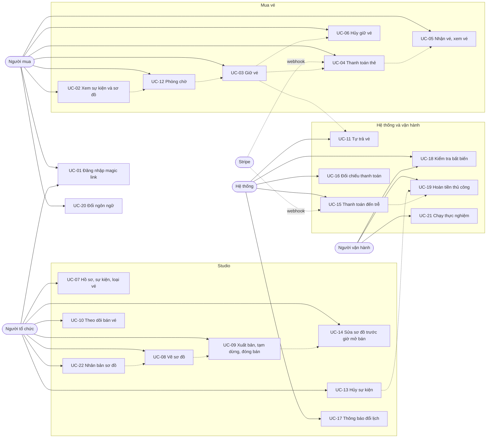

# Use case

> Trạng thái: **Approved** · Cập nhật: 2026-10-06 · DOC-04
> Phụ thuộc: SDD gốc §3.2, §5, §8–§10, §13, [DOC-02](personas-and-journeys.md), [DOC-03](requirements.md), [DOC-06](../02-glossary.md), [Sổ quyết định](../00-decision-register.md) (DR-21…24, 28, 31, 37, 41…47, 57, 58, 64, 65, 67, 70, 73)
> Người dùng chính: P0-11; DOC-83…90 (luồng chi tiết `FL-xx` bám sát từng UC); tác giả màn hình DOC-42…60; DOC-37 (endpoint)

Tài liệu mô tả 22 use case theo mẫu: actor, trigger, tiền điều kiện, luồng chính đánh số, luồng thay thế, luồng lỗi (mã lỗi và chuỗi giao diện), hậu điều kiện, quy tắc nghiệp vụ `BR-xx`. Yêu cầu có số đo nằm ở [DOC-03](requirements.md); thứ tự lời gọi từng tầng (SQL, class, trạng thái giao diện) nằm ở luồng chi tiết `FL-xx` (DOC-83…90, mục lục DOC-82), không lặp ở đây.

## 0. Quy ước

- **Endpoint** viết `METHOD /đường dẫn`, bỏ tiền tố `/api/v1` (DR-63); riêng `GET /media/{id}` không có tiền tố. Mã `E-xx` gán ở DOC-37. Header `Idempotency-Key` có ở bốn endpoint của FR-08.
- **Chuỗi giao diện** trích nguyên văn bản `vi` (mặc định, lấy từ canvas thiết kế) trong dấu `"…"`, kèm key i18n trong dấu huyền (`auth.login.email.invalid`). Bản `en` và chuỗi đầy đủ ở DOC-40; chuỗi đánh dấu *(mới)* chưa có trong canvas và được DOC-40 bổ sung. Key theo DR-10: tiếng Anh theo nghĩa, namespace theo feature (`auth`, `events`, `seats`, `checkout`, `tickets`, `queue`, `studio`, `editor`, `error`, `common`).
- **Mã lỗi** theo DR-64 và SDD gốc 12.3; lỗi trường 422 có `errors[{field, rule}]`, client tra `validation.<rule>` (DR-25).
- Mọi lỗi 429/503 có nhịp thử lại tự động ở client theo FR-11.6; 409 không tự thử lại.
- "Người dùng" là tài khoản đã đăng nhập; "khách" chưa đăng nhập. Trạng thái `displayStatus`, `ON_SALE`… theo DR-24.

## 1. Sơ đồ tổng

## 2. Quy tắc nghiệp vụ

| ID | Quy tắc | Nguồn |
| --- | --- | --- |
| BR-01 | **Không giới hạn số vé mỗi đơn hay mỗi người.** Chỉ có giới hạn kỹ thuật: một lệnh giữ vé claim tối đa `reservation.max-units-per-hold` = 50 unit (tổng số ghế + tổng `quantity`); vượt → 422 `VALIDATION_FAILED` `rule = too_many_units`. Giao diện dừng ở mức này và không hiện như quy tắc bán | DR-41 |
| BR-02 | Mỗi người có tối đa một reservation `ACTIVE` hoặc `EXPIRING` cho mỗi sự kiện (unique index một phần `reservation_open_uq`) | DR-18, DR-41 |
| BR-03 | Hủy sự kiện chuyển mọi đơn `PAID` sang `REFUND_PENDING` (`EVENT_CANCELLED`), vé `VOID`; hoàn tiền làm tay | DR-28 |
| BR-04 | Thanh toán đến sau khi reservation đã đóng **không phát hành vé**, đơn sang `REFUND_PENDING` (`LATE_PAYMENT`), kể cả khi ghế còn trống | DR-44 |
| BR-05 | Giá và tên loại vé được chụp lúc giữ vé vào `reservation_item`; đổi giá sau đó chỉ áp cho reservation tạo sau. `orders.amount` tính ở server và không đổi | DR-20, DR-30 |
| BR-06 | Giảm sức chứa pool (GA, zone) không xuống dưới số unit đang `HELD` + `SOLD`; tăng thì thêm unit | DR-26, DR-30 |
| BR-07 | Sơ đồ khóa toàn bộ từ `sale_starts_at`, bất kể đã có ai mua; trước giờ đó xuất bản phiên bản mới thì dựng lại kho vé | DR-37 |
| BR-08 | Thời hạn giữ vé 10 phút cho mọi sự kiện, tính bằng `now()` của database; hết hạn thì trả vé, không bao giờ nghiêng về bán trùng | DR-42, DR-12 |
| BR-09 | Trạng thái đơn chỉ đổi sang `PAID` theo webhook đã xác minh chữ ký (hoặc đơn 0 đồng do người mua xác nhận); tín hiệu từ trình duyệt không được tin | SDD gốc 9, DR-48 |
| BR-10 | Magic link dùng một lần, hết hạn sau 15 phút, chỉ link mới nhất của mỗi email hợp lệ; trình duyệt nào mở link thì trình duyệt đó có session | DR-21 |
| BR-11 | Mỗi event có đúng một sơ đồ; dùng lại bằng nhân bản toàn bộ và sinh ID mới | DR-31 |
| BR-12 | Người tổ chức chỉ thấy và sửa tài nguyên của tổ chức mình; tài nguyên của tổ chức khác trả 404 `NOT_FOUND` | DR-23 |
| BR-13 | `PAUSED`, `SALE_CLOSED` chặn lệnh giữ vé mới (409 `EVENT_NOT_ON_SALE`); reservation đã `ACTIVE` vẫn thanh toán tới hết hạn | DR-24 |
| BR-14 | Phải đăng nhập mới giữ được vé; lựa chọn chỗ được giữ ở `localStorage` qua đăng nhập (30 phút) | SDD gốc 5.3, DR-67 |
| BR-15 | Đơn 0 đồng bỏ qua Stripe: người mua bấm "Nhận vé" thì chạy transaction xác nhận | SDD gốc 9.2 |
| BR-16 | Phòng chờ luôn chạy cho mọi sự kiện trong khung mở bán; mỗi tài khoản một chỗ trong hàng; lượt vào gắn với `userId` của session | DR-57, DR-58 |
| BR-17 | Chỉ VND; giá loại vé bằng 0 hoặc trong `[payment.min-amount, payment.max-amount]` | DR-13 |

## 3. Use case

### UC-01 · Đăng nhập bằng magic link, đăng xuất

- **Actor:** Mọi vai trò (khách → người dùng); SMTP.
- **Trigger:** Khách bấm "Gửi đường dẫn đăng nhập"; hoặc bấm giữ vé, vào studio khi chưa đăng nhập (chuyển tới `/login?returnTo=…`); hoặc mở link trong email; hoặc bấm "Đăng xuất".
- **Preconditions:** Có địa chỉ email nhận được thư. Với đăng xuất: có session hợp lệ.
- **Main flow:**
  1. Khách nhập email vào ô "Email"; client kiểm tra regex `^[^@\s]+@[^@\s]+\.[^@\s]+$`.
  2. Client gọi `POST /auth/magic-link` với `{email, returnTo, locale}`.
  3. Server chuẩn hóa email (`trim`, chữ thường), một transaction: đếm giới hạn gửi, đặt `superseded_at` cho token chưa dùng của email, chèn `login_token` mới (`expires_at = now() + 15 phút`), commit (BR-10).
  4. Sau commit, server gửi email `magic-link` qua SMTP ngay trong request (timeout 5 giây, không thử lại).
  5. Server trả 202; giao diện hiện "Kiểm tra hộp thư" kèm email vừa nhập.
  6. Người dùng mở link `/auth/callback?token=…`; trang hiện "Đang xác minh đường dẫn" (không tiêu thụ token khi tải).
  7. Trang gọi `POST /auth/verify` với `{token}`; server chạy `UPDATE login_token SET used_at = now() WHERE token_hash = :h AND used_at IS NULL AND superseded_at IS NULL AND expires_at > now() RETURNING …`.
  8. Server tạo `app_user` nếu chưa có, tạo `session`, đặt cookie `tb_session`, trả `{returnTo, csrfToken}`.
  9. SPA chuyển về `returnTo` và khôi phục lựa chọn chỗ đã lưu (BR-14).
  10. Đăng xuất: `POST /auth/logout` thu hồi session, xóa cache session; giao diện hiện "Bạn đã đăng xuất khỏi trình duyệt này."
- **Alternative flows:**
  - 2a. Khách mở link trên thiết bị khác: thiết bị đó có session; trình duyệt đã yêu cầu link không tự đăng nhập.
  - 5a. Bấm "Gửi lại": quay lại bước 2, token cũ bị thay. "Dùng email khác" quay về ô nhập.
  - 9a. `returnTo` không hợp lệ: dùng `/`.
- **Error flows:**
  - E1. Email sai định dạng → client chặn; server 422 `VALIDATION_FAILED` → "Email chưa đúng định dạng." `auth.login.email.invalid`.
  - E2. Vượt 3 link/email/15 phút hoặc 10 link/IP/giờ → vẫn 202 kèm `X-Magic-Link-Throttled: 1`, không gửi → "Bạn đã yêu cầu quá nhiều lần" + "Mỗi email nhận tối đa 3 đường dẫn trong 15 phút. Hãy dùng đường dẫn mới nhất trong hộp thư, hoặc thử lại sau." `auth.sent.throttled.title`, `auth.sent.throttled.body`.
  - E3. SMTP lỗi → 503 `EMAIL_PROVIDER_UNAVAILABLE`, không dòng outbox → "Chưa gửi được email, thử lại" *(mới)* `auth.sent.emailUnavailable`; nút "Gửi lại".
  - E4. Link hết hạn, đã dùng hoặc bị thay → 401 `LOGIN_LINK_INVALID` → "Đường dẫn không còn dùng được" + "Đường dẫn này đã hết hạn hoặc đã được dùng một lần. Hãy lấy một đường dẫn mới." + nút "Gửi đường dẫn mới" `auth.verify.invalid.title`, `auth.verify.invalid.body`, `auth.verify.invalid.action`.
  - E5. Session hết hạn khi đang dùng → 401 `UNAUTHENTICATED` → màn "Đăng nhập lại" + "Phiên đăng nhập đã hết hạn. Đăng nhập lại để tiếp tục; trang bạn đang xem dở sẽ mở lại." `auth.session.expired.notice`.
  - E6. nginx `auth_ip` (10 r/phút, burst 5) → 429 `RATE_LIMITED` → "Bạn thao tác quá nhanh. Hãy thử lại sau ít giây." *(mới)* `error.rateLimited.body`.
- **Postconditions:** Có `session` (cookie `HttpOnly; Secure; SameSite=Lax`); token đã `used_at`. Đăng xuất: `revoked_at` khác NULL.
- **Business rules:** BR-10, BR-14.
- **Related:** FR-01, FR-17; screen `screens/login.md` (DOC-44), `screens/error-pages.md` (DOC-52), `screens/emails.md` (DOC-51); endpoint `POST /auth/magic-link`, `POST /auth/verify`, `POST /auth/logout`, `GET /me`; detailed flow FL-01, FL-02, FL-03.

### UC-02 · Xem danh sách, chi tiết sự kiện và sơ đồ kèm tình trạng chỗ

- **Actor:** Khách hoặc người mua.
- **Trigger:** Mở `/`, `/events/:eventId`, hoặc vào màn Chọn chỗ.
- **Preconditions:** Có ít nhất một sự kiện `PUBLISHED` hoặc `PAUSED` chưa qua `ends_at` (với danh sách).
- **Main flow:**
  1. `GET /events` (cursor, 20 mục): thẻ sự kiện có ảnh hoặc tem ngày, nhãn `displayStatus`, "Giá từ".
  2. Người dùng mở một sự kiện: `GET /events/{id}` trả thông tin, loại vé, `displayStatus`, khung mở bán, múi giờ.
  3. Trang hiện biến thể theo `displayStatus`: `ON_SALE` → nút "Mua vé"; `UPCOMING` → "Mở bán sau 4 ngày 22:10:05" và nhắc "Đăng nhập trước"; `SOLD_OUT`, `PAUSED`, `SALE_CLOSED`, `ENDED`, `CANCELLED` → nhãn và lời giải thích, không có nút mua.
  4. Bấm "Mua vé" → `/events/:eventId/seats` (hoặc `/queue` nếu `WAITING`, UC-12). Sự kiện có sơ đồ: `GET /events/{id}/map?version=n` (không `version` → 302 tới phiên bản đang dùng), vẽ bằng renderer chỉ đọc; sự kiện chỉ GA: bộ chọn số lượng.
  5. `GET /events/{id}/availability` mỗi 4 ± 0,5 giây; bitmap `held`/`sold` tô ghế; dừng khi tab ẩn.
- **Alternative flows:**
  - 5a. Response có `mapVersion` khác bản đang xem → tải lại sơ đồ.
  - 3a. Đồng hồ đếm ngược tính theo `X-Server-Time` (DR-66); về 0 thì gọi lại API.
- **Error flows:**
  - E1. Event không tồn tại hoặc `DRAFT` → 404 → "Trang này không tồn tại" `error.notFound.title`.
  - E2. Lỗi mạng khi tải → "Không tải được sự kiện" + "Kiểm tra kết nối mạng rồi thử lại." + "Thử lại" `events.detail.error.title`.
  - E3. Danh sách rỗng → "Chưa có sự kiện nào đang mở" + "Sự kiện mới sẽ xuất hiện ở đây ngay khi người tổ chức xuất bản." `events.list.empty.title`.
  - E4. Không tải được sơ đồ → "Không tải được sơ đồ" + "Kiểm tra kết nối mạng rồi thử lại. Chỗ bạn đã chọn vẫn được nhớ." `seats.map.error.title`.
- **Postconditions:** Không đổi dữ liệu. Tình trạng hiển thị chỉ là gợi ý; kết quả thật là lệnh giữ vé (UC-03).
- **Business rules:** BR-13.
- **Related:** FR-02, FR-20; screen DOC-42, DOC-43, DOC-46, DOC-47; endpoint `GET /events`, `GET /events/{id}`, `GET /events/{id}/map`, `GET /events/{id}/availability`; detailed flow FL-12, FL-29.

### UC-03 · Giữ vé (ghế, khu vực, GA)

- **Actor:** Người mua (đã đăng nhập).
- **Trigger:** Bấm "Giữ vé trong 10 phút" ở màn Chọn chỗ hoặc Chọn số lượng.
- **Preconditions:** Sự kiện `ON_SALE`; người dùng đăng nhập; chưa có reservation mở cho sự kiện; có lượt vào (`ADMITTED`) khi sự kiện có kiểm soát tiếp nhận.
- **Main flow:**
  1. Người dùng chọn ghế (bấm vào ghế hoặc ở chế độ Danh sách), hoặc chọn khu vực và số lượng, hoặc số lượng GA; lựa chọn lưu `localStorage["tb.selection.<eventId>"]`.
  2. Bấm giữ vé: client sinh `Idempotency-Key` một lần cho lần bấm, giữ cả chuỗi body đã serialize.
  3. `POST /events/{id}/reservations` với `{items:[{type:"SEAT",seatIds},{type:"ZONE",zoneId,quantity},{type:"GA",ticketTypeId,quantity}]}`.
  4. Server kiểm tra hình thức (1–20 dòng, tổng ≤ 50 unit), lấy permit bulkhead, token bucket `rl:hold:{userId}`, lượt vào `ZSCORE`.
  5. Một transaction (`statement_timeout` 2 giây, `lock_timeout` 1 giây): idempotency → đọc event → chèn `reservation` → claim ghế, rồi từng pool → chèn `reservation_item`, `orders` (`PENDING_PAYMENT`) → điền response → commit (DR-41).
  6. Server trả 201 `{reservationId, orderId, status:"ACTIVE", expiresAt, amount, currency:"VND"}`.
  7. Client chuyển tới `/checkout/:reservationId`, xóa lựa chọn đã lưu.
- **Alternative flows:**
  - 1a. Khách chưa đăng nhập: chuyển `/login?returnTo=…` (UC-01), quay lại với lựa chọn còn nguyên.
  - 3a. Sự kiện chỉ GA: chỉ có dòng `GA`.
  - 3b. Mất mạng sau commit: client thử lại cùng key, nhận 201 kèm `Idempotent-Replayed: true`.
  - 6a. Tổng 0 đồng: vẫn tạo order `PENDING_PAYMENT`; màn thanh toán hiện "Nhận vé" (UC-05).
- **Error flows:**
  - E1. 409 `SEATS_UNAVAILABLE` (`unavailableSeatIds`) → ghế bị bỏ khỏi đơn, ghế đánh dấu "Có người giữ" → "Chưa giữ được vé" + "Hàng C · Ghế 10 vừa có người giữ, nên cả đơn chưa được giữ. Ghế này đã được bỏ khỏi đơn; hãy chọn ghế khác rồi giữ vé lại." `seats.hold.unavailable.title`, `seats.hold.unavailable.body`.
  - E2. 409 `INSUFFICIENT_CAPACITY` (`poolId`, `requested`) → "Không còn đủ vé cho loại vé này. Hãy chọn số lượng ít hơn." *(mới)* `seats.hold.capacity.body`.
  - E3. 409 `ACTIVE_RESERVATION_EXISTS` (`reservationId`) → "Bạn đang giữ vé cho sự kiện này" *(mới)* với nút "Tiếp tục thanh toán" (tới `/checkout/:reservationId`) và "Hủy giữ vé" (UC-06) `seats.hold.existing.title`.
  - E4. 409 `EVENT_NOT_ON_SALE` (kèm `displayStatus`) → chuyển về trang sự kiện với nhãn tương ứng.
  - E5. 422 `VALIDATION_FAILED` (`too_many_units`, loại item sai) → không xảy ra qua giao diện chuẩn (bộ tăng giảm dừng ở 50); hiện lỗi chung `error.validation.body`.
  - E6. 429 `QUEUE_REQUIRED` → chuyển `/events/:eventId/queue` (UC-12).
  - E7. 429 `RATE_LIMITED` → "Bạn thao tác quá nhanh. Hãy thử lại sau ít giây." `error.rateLimited.body`; tôn trọng `Retry-After`.
  - E8. 503 `OVERLOADED` → "Đang rất đông" + "Hệ thống tự thử lại sau 3 giây. Bạn không cần bấm lại hay tải lại trang." `seats.hold.overloaded.title`, `seats.hold.overloaded.body`; thử lại cùng key.
  - E9. 401 `UNAUTHENTICATED` → UC-01 E5.
- **Postconditions:** `reservation` `ACTIVE`, `expires_at = now() + 10 phút`; các unit `HELD`; `orders` `PENDING_PAYMENT`; không có gì thay đổi nếu lỗi (rollback toàn bộ).
- **Business rules:** BR-01, BR-02, BR-05, BR-08, BR-13, BR-14, BR-16.
- **Related:** FR-06, FR-07, FR-08, FR-11; screen DOC-46, DOC-47; endpoint `POST /events/{id}/reservations`; detailed flow FL-13, FL-30, FL-34.

### UC-04 · Thanh toán bằng thẻ trong thời hạn giữ

- **Actor:** Người mua; Stripe.
- **Trigger:** Vào `/checkout/:reservationId` sau khi giữ vé (hoặc bấm "Tiếp tục thanh toán").
- **Preconditions:** Reservation `ACTIVE` còn ≥ 30 giây; order `PENDING_PAYMENT` có `amount > 0`.
- **Main flow:**
  1. Màn Thanh toán gọi `GET /reservations/{id}` (items, `expiresAt`, `amount`, `orderId`); đồng hồ "Giữ vé còn 09:42" theo giờ server.
  2. Client gọi `POST /orders/{id}/payment-intent` (Idempotency-Key); server áp giao thức `FOR SHARE` (DR-47) và trả `{clientSecret, amount, currency, expiresAt}`.
  3. Payment Element nạp với `locale` và `appearance` từ token.
  4. Người mua nhập thẻ và bấm "Thanh toán ngay · 3.600.000đ"; client gọi `stripe.confirmPayment({redirect:"if_required", return_url})`.
  5. Chuyển sang `/orders/:orderId` hiện "Đang xác nhận thanh toán".
  6. Stripe gửi webhook `payment_intent.succeeded`; server xác minh chữ ký, loại trùng, chạy transaction xác nhận (reservation `CONFIRMED`, unit `SOLD`, order `PAID`, vé, outbox).
  7. Client hỏi `GET /orders/{id}` mỗi 2 giây trong 60 giây, sau đó mỗi 10 giây tới 10 phút; khi `PAID` hiện "Vé của bạn đã sẵn sàng" kèm thẻ vé.
- **Alternative flows:**
  - 4a. 3-D Secure chuyển trang: Stripe quay lại `return_url` `/orders/:orderId`.
  - 4b. Đơn 0 đồng: không có Payment Element; xem UC-05.
  - 4c. Còn < 2 phút: đồng hồ chuyển "Sắp hết giờ"; còn < 30 giây: nút thanh toán vô hiệu.
  - 7a. Order `REFUND_PENDING` → biến thể "Tiền về trễ" (UC-15).
- **Error flows:**
  - E1. Thẻ bị từ chối (webhook `payment_failed`, `last_payment_error`) → "Thẻ bị từ chối" + "Bạn chưa bị trừ tiền. Hãy thử lại hoặc dùng thẻ khác; vé vẫn được giữ đến khi hết giờ." `checkout.payment.declined.title`, `checkout.payment.declined.body`.
  - E2. Hết hạn giữ khi đang nhập thẻ (hoặc 409 `RESERVATION_NOT_ACTIVE`) → "Đã hết thời gian giữ vé" + "Chỗ của bạn đã được trả lại để người khác có thể mua. Thẻ của bạn chưa bị trừ tiền." + nút "Chọn lại chỗ" `checkout.hold.expired.title`, `checkout.hold.expired.body`, `checkout.hold.expired.action`.
  - E3. 409 `PAYMENT_WINDOW_TOO_SHORT` → nút thanh toán vô hiệu, thông báo như E2 khi hết giờ `checkout.payment.windowTooShort`.
  - E4. 503 `PAYMENT_PROVIDER_UNAVAILABLE` → "Chưa kết nối được cổng thanh toán, thử lại trong ít giây" *(mới)* `checkout.payment.providerUnavailable`; thử lại cùng key trong thời hạn giữ.
  - E5. Lỗi tải đơn → "Không tải được đơn của bạn" + "Vé vẫn đang được giữ cho bạn và đồng hồ vẫn chạy. Kiểm tra kết nối mạng rồi thử lại." `checkout.load.error.title`, `checkout.load.error.body`.
  - E6. Webhook không tới → job đối chiếu (UC-16); giao diện vẫn "Đang xác nhận thanh toán".
- **Postconditions:** Thành công: order `PAID`, reservation `CONFIRMED`, unit `SOLD`, vé `ISSUED`. Thất bại/hết hạn: order `PENDING_PAYMENT` tới khi UC-11 đóng.
- **Business rules:** BR-05, BR-08, BR-09.
- **Related:** FR-09, FR-10; screen DOC-48, DOC-49; endpoint `GET /reservations/{id}`, `POST /orders/{id}/payment-intent`, `GET /orders/{id}`, `POST /webhooks/stripe`; detailed flow FL-20, FL-21.

### UC-05 · Nhận vé qua email, xem đơn và vé của tôi

- **Actor:** Người mua.
- **Trigger:** Thanh toán thành công; bấm "Nhận vé" ở đơn 0 đồng; mở `/me/tickets`.
- **Preconditions:** Đơn `PAID`, hoặc đơn 0 đồng với reservation `ACTIVE`.
- **Main flow:**
  1. Đơn 0 đồng: người mua bấm "Nhận vé"; client gọi `POST /orders/{id}/confirm-free` (Idempotency-Key); server chạy transaction xác nhận.
  2. Transaction xác nhận phát hành một `ticket` mỗi unit (mã `PP-XXXX-XXXX`) và ghi outbox `EMAIL_TICKETS`.
  3. `OutboxRelay` gửi email `tickets` (tên sự kiện, giờ theo múi giờ sự kiện, vị trí, mã vé, link "Xem vé của tôi").
  4. Màn Kết quả hiện "Vé của bạn đã sẵn sàng" và thẻ vé (`GET /orders/{id}` kèm danh sách vé khi `PAID`).
  5. "Vé của tôi": `GET /me/tickets` (nhóm theo sự kiện), `GET /me/orders`; thẻ vé có hạng, ghế, loại vé, mã vé.
- **Alternative flows:**
  - 3a. SMTP lỗi: outbox thử lại với backoff; vé vẫn xem được ở "Vé của tôi".
  - 5a. Đơn `REFUND_PENDING` hiện "Chờ hoàn tiền"; `REFUNDED` hiện "Đã hoàn tiền"; sự kiện bị hủy: vé `VOID` kèm nhãn (DR-28).
- **Error flows:**
  - E1. Reservation không còn `ACTIVE` khi bấm "Nhận vé" → 409 `RESERVATION_NOT_ACTIVE` → "Đã hết thời gian giữ vé" (như UC-04 E2).
  - E2. Chưa có vé → "Bạn chưa có vé nào" + "Vé bạn mua sẽ nằm ở đây, và cũng được gửi tới email của bạn." + "Xem sự kiện" `tickets.empty.title`.
  - E3. Lỗi tải → "Không tải được vé của bạn" + "Vé của bạn vẫn an toàn và vẫn có trong email. Kiểm tra kết nối mạng rồi thử lại." `tickets.load.error.title`, `tickets.load.error.body`.
- **Postconditions:** Mỗi unit có đúng một vé `ISSUED`; một outbox `EMAIL_TICKETS`.
- **Business rules:** BR-09, BR-15.
- **Related:** FR-10; screen DOC-49, DOC-50, DOC-51; endpoint `POST /orders/{id}/confirm-free`, `GET /orders/{id}`, `GET /me/orders`, `GET /me/tickets`; detailed flow FL-14, FL-17.

### UC-06 · Hủy giữ vé

- **Actor:** Người mua.
- **Trigger:** Bấm "Hủy giữ vé" ở màn Thanh toán, hoặc "Hủy giữ vé" khi gặp `ACTIVE_RESERVATION_EXISTS`.
- **Preconditions:** Reservation `ACTIVE` của người dùng.
- **Main flow:**
  1. Client gọi `DELETE /reservations/{id}` (Idempotency-Key).
  2. Server chuyển `ACTIVE → EXPIRING` (`close_reason = BUYER_CANCELLED`), rồi ngay trong request chạy thủ tục trả vé; có PaymentIntent thì hủy (timeout 3 giây).
  3. Server trả 200 `{status:"CANCELLED"}`; unit về `AVAILABLE`, order `CANCELLED`; cờ hết vé của pool được xóa.
  4. Giao diện đưa người mua về Chọn chỗ.
- **Alternative flows:**
  - 3a. Stripe lỗi/timeout: 202 `{status:"EXPIRING"}`; job trả vé hoàn tất sau (UC-11); giao diện cho phép chọn lại sau khi trạng thái là `CANCELLED`.
  - 1a. Reservation đã đóng: 200 với trạng thái hiện tại.
- **Error flows:**
  - E1. PaymentIntent đã `succeeded` → 409 `PAYMENT_ALREADY_SUCCEEDED` → giao diện chuyển sang màn Kết quả.
  - E2. 404 `NOT_FOUND` nếu reservation không phải của người dùng.
- **Postconditions:** Reservation `CANCELLED` (hoặc `EXPIRING` chờ job); người mua chọn lại ngay được.
- **Business rules:** BR-02, BR-08.
- **Related:** FR-07, FR-08; screen DOC-48; endpoint `DELETE /reservations/{id}`; detailed flow FL-15.

### UC-07 · Lập hồ sơ tổ chức; tạo, sửa sự kiện và loại vé

- **Actor:** Người tổ chức (tài khoản chưa có hồ sơ thì lập hồ sơ trước).
- **Trigger:** Vào `/studio`; bấm "Tạo sự kiện"; lưu một bước soạn.
- **Preconditions:** Đã đăng nhập.
- **Main flow:**
  1. Chưa có hồ sơ: màn Lập hồ sơ; `POST /organizer` với `{name, contactEmail?}`; sang `/studio`.
  2. `POST /organizer/events {name}` tạo `DRAFT`; vào bước Thông tin.
  3. Bước Thông tin: tên, mô tả, địa điểm, múi giờ, giờ bắt đầu/kết thúc, khung mở bán, tiền tố mã vé, cờ phòng chờ; ảnh `POST /organizer/media` (ghi object storage trước, rồi dòng `media`); lưu `PATCH /organizer/events/{id}` kèm `rowVersion`.
  4. Bước Loại vé: `POST/PATCH/DELETE /organizer/events/{id}/ticket-types`; chọn mô hình Ghế/Khu vực/Tự do; giá (0 hoặc hợp lệ); sức chứa GA.
  5. Sự kiện chỉ GA bỏ qua bước Sơ đồ (DR-70).
- **Alternative flows:**
  - 3a. Rời trang khi có thay đổi chưa lưu: hộp thoại xác nhận.
  - 3b. Sau khi xuất bản, sửa giờ/địa điểm gửi email đổi lịch (UC-17).
- **Error flows:**
  - E1. 409 `ORGANIZER_EXISTS` → hiện biến thể "đã có hồ sơ", chuyển `/studio`.
  - E2. 403 `ORGANIZER_PROFILE_REQUIRED` khi vào `/organizer/**` → chuyển màn Lập hồ sơ.
  - E3. 404 `NOT_FOUND` (sự kiện của tổ chức khác) → trang "Bạn không quản lý sự kiện này" (403 giao diện E3).
  - E4. 409 `STALE_EVENT_VERSION` → hộp thoại "Sự kiện đã được sửa ở nơi khác" *(mới)* + "Tải lại" `studio.event.stale.title`.
  - E5. 422 `VALIDATION_FAILED` theo ô (`required`, `too_long`, `must_be_future`, `must_be_after_start`, `too_long_event`, `must_be_after_sale_start`, `after_event_start`, `invalid_timezone`, `locked_after_publish`) → lỗi dưới ô tương ứng `validation.<rule>`.
  - E6. 413 `PAYLOAD_TOO_LARGE` (ảnh sự kiện > 2 MB) → thông báo kích thước tối đa `studio.media.tooLarge`; 422 `MEDIA_INVALID` → "Tệp không phải ảnh hợp lệ" *(mới)* `studio.media.invalid`.
  - E7. 422 `TICKET_TYPE_LIMIT_REACHED` (loại thứ 6) → "Tối đa 5 loại vé" `studio.ticketType.limit`; tên trùng → "Tên này đã dùng cho loại vé khác" `studio.ticketType.nameTaken`.
  - E8. 409 `TICKET_TYPE_IN_USE` (xóa loại vé đã có vé giữ/bán), 409 `CAPACITY_BELOW_USED` → "Không thấp hơn N vé đang giữ và đã bán" `studio.ticketType.capacityBelowUsed`.
- **Postconditions:** `organizer`, `event` (`DRAFT`), `ticket_type`, `media` có dữ liệu đã kiểm tra; `row_version` tăng mỗi lần lưu.
- **Business rules:** BR-06, BR-11, BR-12, BR-17.
- **Related:** FR-02, FR-13, FR-18; screen DOC-53, DOC-55, DOC-56; endpoint `POST /organizer`, `POST /organizer/events`, `GET/PATCH /organizer/events/{id}`, `POST/PATCH/DELETE /organizer/events/{id}/ticket-types`, `POST /organizer/media`; detailed flow FL-05, FL-06, FL-07.

### UC-08 · Vẽ sơ đồ chỗ ngồi

- **Actor:** Người tổ chức.
- **Trigger:** Vào bước Sơ đồ `/studio/events/:eventId/map` (màn hình ≥ 1024 px).
- **Preconditions:** Event `DRAFT` hoặc `PUBLISHED` với `now() < sale_starts_at`; có loại vé `SEAT` hoặc `ZONE`.
- **Main flow:**
  1. `GET /organizer/events/{id}/map` (bản nháp, `revision`, phiên bản mới nhất); event chưa có sơ đồ: `POST /organizer/maps {eventId}`.
  2. Chọn công cụ Hàng ghế, kiểu đường, vẽ đường; popover mở với ô "Số ghế" đã focus; Enter rải ghế; Enter lần nữa chốt hàng (một command vào undo).
  3. Vẽ zone: chọn shape, vẽ, nhập sức chứa.
  4. Chỉnh sửa: biến đổi, sửa điểm điều khiển, sửa từng ghế (loại vé, `accessible`, `blocked`, ghi đè số), nhân bản song song, khối ghế, ảnh nền, trang trí.
  5. Tự lưu sau 2 giây không đổi: `PUT /organizer/maps/{id}/draft {revision, document}`.
  6. Validate liên tục ở client; bấm vấn đề để zoom tới đối tượng.
  7. "Xuất bản": `POST /organizer/maps/{id}/validate` rồi `POST /organizer/maps/{id}/publish` tạo `seat_map_version` bất biến.
- **Alternative flows:**
  - 1a. Sơ đồ trống: lựa chọn "Dùng lại sơ đồ từ sự kiện khác" (UC-22).
  - 5a. Mất mạng: thử lại sau 2, 4, 8, 16, 30 giây; bản chưa lưu giữ trong IndexedDB.
  - 2a. Số ghế vượt mức đặt vừa: popover báo số tối đa và đề xuất giảm số ghế hoặc kéo dài đường.
- **Error flows:**
  - E1. 409 `REVISION_CONFLICT` (tab khác đã lưu) → dừng tự lưu, hộp thoại "Một tab khác đã lưu bản mới hơn" + "Tải lại bản mới nhất" `editor.conflict.title`, `editor.conflict.action`.
  - E2. 413 `PAYLOAD_TOO_LARGE` (> 5 MB) → "Sơ đồ quá lớn để lưu" *(mới)* `editor.save.tooLarge`.
  - E3. 422 `MAP_VALIDATION_FAILED` (`issues`) → hộp thoại "Xuất bản bị từ chối" và danh sách vấn đề theo `code` + `params` `editor.publish.rejected.title`.
  - E4. 409 `MAP_LOCKED_AFTER_SALE` → editor chuyển chỉ đọc "Sơ đồ đã khóa vì sự kiện đã mở bán" `editor.locked.notice`.
  - E5. Lưu lỗi mạng/5xx → thanh trên "Chưa lưu được" `editor.save.failed`.
  - E6. Thu nhỏ < 40% → "Sơ đồ đang thu nhỏ cho vừa màn hình. Phóng to để chọn ghế" `editor.zoom.tooSmall` (dùng riêng cho editor).
- **Postconditions:** `seat_map.draft` mới nhất và `draft_revision` tăng; xuất bản thành công → `seat_map_version` mới (`version_no`, `checksum`).
- **Business rules:** BR-07, BR-11, BR-12.
- **Related:** FR-03, FR-04, FR-05; screen DOC-57; endpoint `GET /organizer/events/{id}/map`, `POST /organizer/maps`, `PUT /organizer/maps/{id}/draft`, `POST /organizer/maps/{id}/validate`, `POST /organizer/maps/{id}/publish`, `POST /organizer/media`; detailed flow FL-26, FL-27.

### UC-09 · Xuất bản, mở bán, tạm dừng bán, đóng bán sớm

- **Actor:** Người tổ chức; `EventLifecycleJob`.
- **Trigger:** Bấm "Xuất bản", "Tạm dừng bán", "Mở bán lại", "Đóng bán sớm" ở `/studio/events/:eventId/publish`.
- **Preconditions:** Với xuất bản: event `DRAFT`. Với tạm dừng/đóng bán: event đang `PUBLISHED`.
- **Main flow:**
  1. `GET /organizer/events/{id}/publish-checks` trả danh sách điều kiện (đủ trường theo DR-25, ≥ 1 loại vé có sức chứa, sơ đồ đã validate nếu có `SEAT`/`ZONE`).
  2. Hộp thoại xác nhận; `POST /organizer/events/{id}/publish`: một transaction khóa event `FOR UPDATE`, tạo `inventory_pool` và `inventory_unit` (`SET LOCAL statement_timeout = '30s'`), đặt `PUBLISHED`; nginx cho route này 60 giây.
  3. Sự kiện hiện `UPCOMING`; tới `sale_starts_at` thì `ON_SALE` do thời gian (không đổi dòng); `EventLifecycleJob` mỗi 60 giây chuyển `ENDED` khi qua `ends_at`.
  4. Tạm dừng `POST …/pause` / `POST …/resume`: lệnh giữ vé mới nhận 409 `EVENT_NOT_ON_SALE`.
  5. Đóng bán sớm `POST …/close-sale` (có xác nhận): `sale_ends_at = now()`; sự kiện `SALE_CLOSED`, không mở lại được.
- **Alternative flows:**
  - 2a. Event chỉ GA: không có bước sơ đồ; pool GA tạo trực tiếp.
- **Error flows:**
  - E1. 422 `PUBLISH_PRECONDITIONS_FAILED` (danh sách điều kiện chưa đạt) → danh sách điều kiện thiếu có link tới bước cần sửa `studio.publish.checks.failed`.
  - E2. 409 `EVENT_STATE_CONFLICT` (xuất bản hai lần, đóng bán trước giờ mở bán hoặc đã đóng) → "Trạng thái sự kiện đã thay đổi" *(mới)* + tải lại `studio.publish.stateConflict`.
  - E3. 409 `MAP_PUBLISH_BUSY`/`MAP_LOCKED_AFTER_SALE` → xem UC-14.
  - E4. Timeout > 60 giây khi xuất bản → "Đang xuất bản" tiếp tục, kiểm tra lại `GET …/publish-checks` `studio.publish.inProgress`.
- **Postconditions:** Event `PUBLISHED`; unit/pool đủ sức chứa; hoặc `PAUSED`/`SALE_CLOSED`.
- **Business rules:** BR-07, BR-12, BR-13.
- **Related:** FR-02, FR-15; screen DOC-59; endpoint `GET …/publish-checks`, `POST …/publish`, `POST …/pause`, `POST …/resume`, `POST …/close-sale` (tiền tố `/organizer/events/{id}`); detailed flow FL-08, FL-09.

### UC-10 · Theo dõi số vé đã bán

- **Actor:** Người tổ chức.
- **Trigger:** Mở `/studio` hoặc `/studio/events/:eventId/sales`.
- **Preconditions:** Event đã xuất bản.
- **Main flow:**
  1. Tổng quan: `GET /organizer/events` (≤ 20 sự kiện mỗi trang, kèm `sold`, `held`, `available`, `capacity`).
  2. Theo dõi bán vé: `GET /organizer/events/{id}/sales` (bảng theo loại vé, cache Redis 5 giây).
  3. Sự kiện có sơ đồ: `GET /organizer/events/{id}/seat-status` (dùng chung snapshot), sơ đồ tô theo trạng thái, bộ lọc loại vé.
  4. Tự làm mới 15 giây; "Làm mới" làm ngay; hiện "Cập nhật lúc …".
- **Alternative flows:** 3a. Event chỉ GA: không có sơ đồ.
- **Error flows:** E1. 404 `NOT_FOUND` (tổ chức khác). E2. Lỗi tải → khối lỗi có "Thử lại" `studio.sales.error.title`.
- **Postconditions:** Không đổi dữ liệu.
- **Business rules:** BR-12.
- **Related:** FR-20; screen DOC-54, DOC-60; endpoint `GET /organizer/events`, `GET …/sales`, `GET …/seat-status`; detailed flow FL-32.

### UC-11 · Tự trả vé khi hết hạn giữ

- **Actor:** Hệ thống (job trả vé mỗi 5 giây).
- **Trigger:** Có reservation `ACTIVE` quá `expires_at`, hoặc `EXPIRING` quá lease 30 giây.
- **Preconditions:** API chạy.
- **Main flow:**
  1. Job chọn tối đa 200 reservation `ACTIVE` quá hạn bằng `FOR UPDATE SKIP LOCKED`, đặt `EXPIRING` (`close_reason = TIMEOUT`, `expiring_since = now()`); lấy thêm `EXPIRING` quá lease.
  2. Với mỗi reservation, nếu order có `payment_intent_id`: gọi Stripe hủy PaymentIntent (timeout 5 giây), ngoài transaction.
  3. Hủy được, hoặc chưa từng có: transaction trả vé — `EXPIRING → EXPIRED`, unit `HELD → AVAILABLE`, order `PENDING_PAYMENT → EXPIRED`; sau commit xóa cờ hết vé.
- **Alternative flows:**
  - 2a. Stripe báo PaymentIntent đã `succeeded`: job không trả vé, gọi handler xác nhận (UC-04 bước 6).
- **Error flows:**
  - E1. Stripe lỗi/timeout: giữ `EXPIRING`, unit vẫn `HELD`; lease 30 giây sau lấy lại.
  - E2. API dừng sau khi đặt `EXPIRING`: khi chạy lại job lấy tiếp theo lease; `make invariants` báo `EXPIRING` quá 2 phút nếu kẹt.
  - E3. Job dừng: vé bị giữ lâu hơn, không bán trùng (SDD gốc 8.5).
- **Postconditions:** Mọi unit của reservation quá hạn về `AVAILABLE` trong ≤ 30 giây kể từ `expires_at` (NFR-03).
- **Business rules:** BR-08.
- **Related:** FR-07; endpoint không có (job); detailed flow FL-16, FL-22.

### UC-12 · Vào phòng chờ, nhận lượt, rời hàng

- **Actor:** Người mua (đã đăng nhập); `AdmissionTicker`.
- **Trigger:** Vào màn Chọn chỗ của sự kiện đang bán; hoặc vào phòng chờ trước giờ mở bán (`high_demand`).
- **Preconditions:** Redis chạy (hoặc xem E5); đã đăng nhập.
- **Main flow:**
  1. Client gọi `POST /events/{id}/queue`: còn chỗ (`|admitted| < max_active`), hàng trống và còn hạn mức nhịp → `ADMITTED` ngay, không hiện phòng chờ; ngược lại `WAITING` → `/events/:eventId/queue`; trước giờ mở bán với `high_demand` → `PRE_QUEUE`.
  2. Phòng chờ gọi `GET /events/{id}/queue` theo `retryAfterSeconds` (3/10/30 giây): `{status, position, estimatedWaitSeconds, retryAfterSeconds}`.
  3. Đúng giờ mở bán, `prequeue` được xáo ngẫu nhiên thành `queue`.
  4. `AdmissionTicker` mỗi giây chạy `admit.lua`: loại lượt hết hạn và người rảnh quá 2 phút, cấp tối đa `min(max_active − |admitted|, 50, |queue|)` lượt.
  5. `ADMITTED` → giao diện tự chuyển sang Chọn chỗ với đồng hồ lượt vào 5 phút.
  6. Giữ vé thành công kéo lượt tới `expires_at` của reservation.
  7. Rời hàng: `DELETE /events/{id}/queue` xóa người dùng khỏi `prequeue`, `queue`, `admitted`, `seen`.
- **Alternative flows:**
  - 2a. `PAUSED` ("Tạm hết vé"): mọi vé đang được giữ; vị trí giữ nguyên.
  - 2b. `SOLD_OUT`: "Đã hết vé", hàng đóng.
- **Error flows:**
  - E1. Mất kết nối với phòng chờ → "Mất kết nối với phòng chờ" + "Trang đang tự thử lại. Bạn vẫn giữ vị trí nếu kết nối lại trong vòng 2 phút." `queue.disconnected.title`, `queue.disconnected.body`.
  - E2. Lượt vào hết hạn (5 phút) → quay lại phòng chờ; giữ vé trả 429 `QUEUE_REQUIRED` `queue.pass.expired`.
  - E3. 429 `RATE_LIMITED` khi hỏi vị trí (`rl:queue:{userId}`) → client giãn nhịp theo `Retry-After`.
  - E4. Ngừng hỏi quá 2 phút → mất chỗ; mở lại thì vào hàng mới.
  - E5. Redis không khả dụng: sự kiện thường vẫn giữ vé được, không cần lượt; sự kiện `high_demand` → 503 `OVERLOADED` + `Retry-After: 5` → "Đang rất đông" `seats.hold.overloaded.title`.
- **Postconditions:** Người dùng có lượt vào trong `admitted:{eventId}` (hoặc đã rời); không bao giờ `|admitted| > max_active`.
- **Business rules:** BR-16.
- **Related:** FR-11, FR-16; screen DOC-45; endpoint `POST /events/{id}/queue`, `GET /events/{id}/queue`, `DELETE /events/{id}/queue`; detailed flow FL-33, FL-34, FL-35.

### UC-13 · Hủy sự kiện, đơn đã thanh toán chuyển chờ hoàn tiền

- **Actor:** Người tổ chức.
- **Trigger:** Bấm "Hủy sự kiện" ở màn Xuất bản và xác nhận.
- **Preconditions:** Event `PUBLISHED` hoặc `PAUSED`.
- **Main flow:**
  1. Hộp thoại báo trước số đơn sẽ chuyển sang chờ hoàn tiền ("12 đơn sẽ chuyển sang chờ hoàn tiền").
  2. `POST /organizer/events/{id}/cancel`: một transaction (`statement_timeout` 60 giây): khóa event `FOR UPDATE`; `status = CANCELLED`; đơn `PAID → REFUND_PENDING` (`EVENT_CANCELLED`); vé `ISSUED → VOID`; reservation `ACTIVE → EXPIRING` (`EVENT_CANCELLED`); một outbox `EMAIL_REFUND_PENDING` mỗi đơn.
  3. Server trả `{refundPendingOrders, releasingReservations}`.
  4. Job trả vé xử lý các reservation `EXPIRING` như hết hạn (hủy PaymentIntent rồi trả vé).
  5. Người mua nhận email chờ hoàn tiền; người vận hành hoàn tay (UC-19).
- **Alternative flows:** 2a. Webhook xác nhận đua với lệnh hủy: `FOR SHARE` trên event bảo đảm hoặc xác nhận commit trước (đơn bị bắt ở bước hủy), hoặc hủy commit trước (đơn sang `REFUND_PENDING`, không vé).
- **Error flows:** E1. 409 `EVENT_STATE_CONFLICT` (event `DRAFT`, đã `ENDED`/`CANCELLED`) → "Trạng thái sự kiện đã thay đổi" `studio.publish.stateConflict`. E2. 404 (tổ chức khác).
- **Postconditions:** Không đơn `PAID` hay vé `ISSUED` nào trên sự kiện `CANCELLED`; mỗi đơn đã trả tiền đúng một email.
- **Business rules:** BR-03, BR-12.
- **Related:** FR-14; screen DOC-59, DOC-50; endpoint `POST …/cancel`; detailed flow FL-10.

### UC-14 · Sửa sơ đồ của sự kiện đã xuất bản trước giờ mở bán

- **Actor:** Người tổ chức.
- **Trigger:** Mở editor của sự kiện `PUBLISHED` có `now() < sale_starts_at`; bấm "Xuất bản" phiên bản mới.
- **Preconditions:** Event `PUBLISHED`, chưa tới `sale_starts_at`.
- **Main flow:**
  1. Sửa bản nháp tự do như UC-08.
  2. `POST /organizer/maps/{id}/publish` tạo phiên bản mới; trong cùng transaction (`lock_timeout` 5 giây): khóa event `FOR UPDATE`, kiểm `now() < sale_starts_at`, xóa mọi unit ghế/zone `AVAILABLE` và pool zone, chèn lại từ phiên bản mới, cập nhật `event.seat_map_version_id`.
  3. Người mua đang xem nhận `mapVersion` mới ở lần làm mới tình trạng kế tiếp và tải lại sơ đồ.
- **Alternative flows:** 2a. Từ giờ mở bán: editor chỉ đọc; vẫn nhân bản sang sự kiện khác (UC-22).
- **Error flows:**
  - E1. 409 `MAP_LOCKED_AFTER_SALE` (từ giờ mở bán, hoặc đua đúng giây mở bán làm số dòng xóa khác tổng unit → rollback) → "Sơ đồ đã khóa vì sự kiện đã mở bán" `editor.locked.notice`.
  - E2. 409 `MAP_PUBLISH_BUSY` (hết `lock_timeout`) → "Hệ thống đang bận, thử xuất bản lại sau ít giây" *(mới)* `editor.publish.busy`.
  - E3. 422 `MAP_VALIDATION_FAILED` → như UC-08 E3.
- **Postconditions:** Số unit ghế bằng số ghế không blocked của phiên bản mới; `seat_index` khớp tài liệu; không unit `HELD` nào bị xóa.
- **Business rules:** BR-07.
- **Related:** FR-05, FR-15; screen DOC-57; endpoint `POST /organizer/maps/{id}/publish`; detailed flow FL-31.

### UC-15 · Xử lý thanh toán đến trễ

- **Actor:** Hệ thống (webhook handler, hoặc `PaymentReconcileJob`).
- **Trigger:** `payment_intent.succeeded` đến khi reservation đã `EXPIRED`/`CANCELLED`.
- **Preconditions:** Order `EXPIRED` hoặc `CANCELLED` có `payment_intent_id`.
- **Main flow:**
  1. Webhook qua xác minh chữ ký và loại trùng; thấy reservation đã đóng.
  2. Transaction ngắn: `UPDATE orders SET status = 'REFUND_PENDING', refund_reason = 'LATE_PAYMENT' WHERE order_id = :o AND status IN ('EXPIRED','CANCELLED')`; chèn outbox `EMAIL_REFUND_PENDING`; log ERROR.
  3. Không chạm `inventory_unit`; không phát hành vé.
  4. Người mua nhận email; màn Kết quả hiện biến thể "Tiền về trễ".
- **Alternative flows:** 1a. Số tiền hoặc tiền tệ lệch → `AMOUNT_MISMATCH` (đơn `PENDING_PAYMENT`). 1b. Event đã `CANCELLED` lúc xác nhận → `EVENT_CANCELLED`.
- **Error flows:** E1. Lỗi giữa chừng → rollback, 500, Stripe gửi lại. E2. Không tìm thấy đơn theo `payment_intent_id` hay `metadata.order_id` → log ERROR, `outcome = IGNORED`, 200.
- **Postconditions:** Order `REFUND_PENDING` với lý do; 0 vé; 1 email; `stripe_event` ghi `outcome = REFUND_PENDING`.
- **Business rules:** BR-04, BR-09.
- **Related:** FR-09, FR-10; screen DOC-49, DOC-51; endpoint `POST /webhooks/stripe`; detailed flow FL-21, FL-23.

### UC-16 · Đối chiếu thanh toán khi webhook thất lạc

- **Actor:** Hệ thống (`PaymentReconcileJob` mỗi 60 giây).
- **Trigger:** Có order `PENDING_PAYMENT` có `payment_intent_id` tạo quá 15 phút, hoặc reservation `EXPIRING` quá 2 phút có PaymentIntent.
- **Preconditions:** Stripe truy cập được.
- **Main flow:**
  1. Job chọn tối đa 50 order thỏa điều kiện.
  2. Với mỗi order, lấy PaymentIntent từ Stripe.
  3. `succeeded` → gọi đúng `PaymentSucceededHandler` của webhook (log INFO `reconciled=true`); trạng thái khác → bỏ qua.
- **Alternative flows:** 3a. Webhook thật đến sau: câu ghi có điều kiện nên chạy trùng vô hại.
- **Error flows:** E1. Stripe lỗi → bỏ qua vòng này, thử lại vòng sau.
- **Postconditions:** Đơn đã trả tiền thành `PAID` (hoặc `REFUND_PENDING` nếu đã quá hạn) trong ≤ 60 giây kể từ ngưỡng.
- **Business rules:** BR-09.
- **Related:** FR-09; endpoint không có (job; RB-03); detailed flow FL-24.

### UC-17 · Thông báo đổi giờ hoặc địa điểm cho người đã mua

- **Actor:** Hệ thống (khi người tổ chức lưu thay đổi).
- **Trigger:** `PATCH /organizer/events/{id}` đổi `starts_at`, `ends_at` hoặc `venue` của event không `DRAFT`.
- **Preconditions:** Event `PUBLISHED`/`PAUSED`/…; có đơn `PAID`.
- **Main flow:**
  1. Trong transaction của `PATCH`, chèn một dòng outbox `EMAIL_EVENT_CHANGED` cho mỗi đơn `PAID` với `{orderId, locale, before, after}`.
  2. Response `notifiedOrders: n`; Studio 02 hiện "Đã gửi thông báo tới n người mua".
  3. `OutboxRelay` gửi email `event-changed` (đổi giờ, đổi địa điểm hoặc cả hai; vé giữ nguyên; liên hệ tổ chức).
- **Alternative flows:** 1a. Event `DRAFT` hoặc đổi trường khác: `notifiedOrders: 0`.
- **Error flows:** E1. 409 `STALE_EVENT_VERSION` → như UC-07 E4; không ghi outbox.
- **Postconditions:** Mỗi đơn `PAID` có đúng một email cho mỗi lần lưu; không gom.
- **Business rules:** BR-12.
- **Related:** FR-19; screen DOC-55, DOC-51; endpoint `PATCH /organizer/events/{id}`; detailed flow FL-11.

### UC-18 · Kiểm tra bất biến định kỳ và chạy tay

- **Actor:** Hệ thống (lịch 5 phút); người vận hành.
- **Trigger:** `@Scheduled` mỗi 5 phút; `make invariants`; cuối mỗi `make exp`.
- **Preconditions:** Database truy cập được.
- **Main flow:**
  1. `InvariantChecker` chạy các truy vấn `INV-xx` (DOC-30).
  2. Kết quả `{checkedAt, durationMs, violations:[{check, count, sample}]}` (tối đa 10 ID mỗi mục).
  3. Chạy tay: `docker compose run --rm api --spring.profiles.active=invariants` in JSON ra stdout, thoát 0 khi sạch, 1 khi có sai lệch.
  4. Có sai lệch: log ERROR; người vận hành làm theo RB-02.
- **Alternative flows:** 3a. Sau thực nghiệm: bất biến đỏ thì lần chạy bị loại (UC-21).
- **Error flows:** E1. Database không khả dụng → thoát với lỗi kết nối, không báo "sạch".
- **Postconditions:** Chỉ báo cáo, không sửa dữ liệu.
- **Business rules:** (không có).
- **Related:** FR-12; endpoint không có; detailed flow FL-18.

### UC-19 · Hoàn tiền thủ công đơn `REFUND_PENDING`

- **Actor:** Người vận hành.
- **Trigger:** Có đơn `REFUND_PENDING` (báo cáo bất biến, email, RB-01).
- **Preconditions:** Truy cập Stripe Dashboard và database.
- **Main flow:**
  1. Liệt kê đơn `REFUND_PENDING` theo `refund_reason` (một đơn lẻ, hoặc cả sự kiện bị hủy) kèm `payment_intent_id`.
  2. Xác minh khoản tiền trên Stripe Dashboard.
  3. Hoàn tiền trên Stripe Dashboard, lấy mã hoàn tiền.
  4. `UPDATE orders SET status = 'REFUNDED', refund_reference = :ref, refunded_at = now() WHERE order_id = :o AND status = 'REFUND_PENDING'`.
  5. `make invariants` xác nhận số đơn `REFUND_PENDING` giảm.
- **Alternative flows:** 1a. Hoàn hàng loạt cho sự kiện bị hủy bằng truy vấn theo `event_id`.
- **Error flows:** E1. Thiếu `refund_reference` hoặc `refunded_at` → CHECK `orders_refunded_ck` từ chối. E2. 0 dòng (đơn đã đổi trạng thái) → kiểm tra lại, không ghi đè.
- **Postconditions:** Đơn `REFUNDED`; người mua thấy "Đã hoàn tiền" ở "Vé của tôi".
- **Business rules:** BR-03, BR-04.
- **Related:** FR-09, FR-14; endpoint không có (RB-01 SQL); detailed flow FL-25.

### UC-20 · Đổi ngôn ngữ giao diện

- **Actor:** Mọi vai trò.
- **Trigger:** Chọn `vi` hoặc `en` ở bộ chọn ngôn ngữ trên header.
- **Preconditions:** Không có.
- **Main flow:**
  1. Client đổi ngôn ngữ i18next, đặt cookie `tb_lang`.
  2. Đã đăng nhập: `PATCH /me {"locale":"en"}` cập nhật `app_user.locale`.
  3. Giao diện, định dạng số/tiền/ngày, email sau đó và `title`/`detail` của Problem Details theo locale mới.
- **Alternative flows:** 1a. Chưa đăng nhập: chỉ cookie; `Accept-Language` dùng nếu không có cookie; không khớp → `vi`.
- **Error flows:** E1. `PATCH /me` lỗi → ngôn ngữ giao diện vẫn đổi cục bộ, thử lại ở lần tải sau.
- **Postconditions:** Email gửi theo `app_user.locale` lúc ghi outbox.
- **Business rules:** (không có).
- **Related:** FR-17; screen mọi màn; endpoint `PATCH /me`, `GET /me`; detailed flow FL-04.

### UC-21 · Chạy một thực nghiệm và ghi kết quả

- **Actor:** Người vận hành/nghiên cứu.
- **Trigger:** `make exp EXP=02` (có thể `SCALE=0.01`).
- **Preconditions:** Máy thực nghiệm đúng cấu hình DOC-70; profile `experiment`; `PAYMENTS_MODE=fake`; IP máy sinh tải trong `RATE_LIMIT_ALLOWLIST`.
- **Main flow:**
  1. Reset dữ liệu, seed người dùng và session (100.000 `app_user` bằng `experiments/seed/users.sql`).
  2. Khởi động API với `inventory.strategy` của kịch bản (`skip-locked`, `counter`, `naive`).
  3. Chạy k6 theo kịch bản; thu số đo (p95, thông lượng, thời gian giữ connection).
  4. Lặp 3 lần, báo trung vị và min–max, ghi git SHA và cấu hình máy.
  5. Chạy `make invariants`; ghi bảng kết quả vào tài liệu EXP.
- **Alternative flows:** 2a. Bản `naive` chạy thêm để cho thấy bán vượt (chỉ với profile `experiment`).
- **Error flows:** E1. Bất biến đỏ → lần chạy bị loại. E2. API từ chối khởi động với `inventory.strategy` khác `skip-locked` khi thiếu profile `experiment`.
- **Postconditions:** Bảng kết quả có ngày, máy, git SHA; bất biến sạch.
- **Business rules:** (không có).
- **Related:** FR-12; endpoint không có; detailed flow FL-19.

### UC-22 · Dùng lại sơ đồ của sự kiện khác bằng nhân bản

- **Actor:** Người tổ chức.
- **Trigger:** Chọn "Dùng lại sơ đồ từ sự kiện khác" ở màn Sơ đồ trống (04k).
- **Preconditions:** Event đích chưa có sơ đồ; tổ chức có ít nhất một sơ đồ khác.
- **Main flow:**
  1. `GET /organizer/maps?limit=` liệt kê sơ đồ của tổ chức kèm tên sự kiện.
  2. Chọn nguồn: bản nháp hoặc một phiên bản đã xuất bản.
  3. `POST /organizer/maps/{sourceMapId}/clone {eventId, source, versionNo}`.
  4. Server sao chép toàn bộ tài liệu, sinh lại mọi ID (UUID mới cho ghế; ID mới cho section, row, zone, decoration), ánh xạ loại vé theo tên và mô hình; ảnh nền dùng cùng `media_id`.
  5. Editor mở sơ đồ mới: bản nháp `revision = 0`, chưa có phiên bản; người tổ chức gán lại loại vé không khớp rồi xuất bản (UC-08).
- **Alternative flows:** 4a. Loại vé không khớp: để trống `ticketTypeId`, validate báo `TICKET_TYPE_MISSING`.
- **Error flows:** E1. 409 `MAP_ALREADY_EXISTS` → "Sự kiện này đã có sơ đồ" *(mới)* `editor.clone.exists`. E2. 404 `NOT_FOUND` (nguồn của tổ chức khác).
- **Postconditions:** `seat_map` mới với `cloned_from_seat_map_id`; không ID nào của sơ đồ nguồn xuất hiện trong sơ đồ mới.
- **Business rules:** BR-11, BR-12.
- **Related:** FR-21; screen DOC-57; endpoint `GET /organizer/maps`, `POST /organizer/maps/{id}/clone`; detailed flow FL-28.

## 4. Bảng UC → FL

| UC | Tên ngắn | FL |
| --- | --- | --- |
| UC-01 | Đăng nhập, đăng xuất | FL-01, FL-02, FL-03 |
| UC-02 | Xem sự kiện và sơ đồ | FL-12, FL-29 |
| UC-03 | Giữ vé | FL-13, FL-30, FL-34 |
| UC-04 | Thanh toán thẻ | FL-20, FL-21 |
| UC-05 | Nhận vé, xem vé | FL-14, FL-17 |
| UC-06 | Hủy giữ vé | FL-15 |
| UC-07 | Hồ sơ, sự kiện, loại vé | FL-05, FL-06, FL-07 |
| UC-08 | Vẽ sơ đồ | FL-26, FL-27 |
| UC-09 | Xuất bản, tạm dừng, đóng bán | FL-08, FL-09 |
| UC-10 | Theo dõi bán vé | FL-32 |
| UC-11 | Tự trả vé | FL-16, FL-22 |
| UC-12 | Phòng chờ | FL-33, FL-34, FL-35 |
| UC-13 | Hủy sự kiện | FL-10 |
| UC-14 | Sửa sơ đồ trước giờ mở bán | FL-31 |
| UC-15 | Thanh toán đến trễ | FL-23 |
| UC-16 | Đối chiếu thanh toán | FL-24 |
| UC-17 | Thông báo đổi lịch | FL-11 |
| UC-18 | Kiểm tra bất biến | FL-18 |
| UC-19 | Hoàn tiền thủ công | FL-25 |
| UC-20 | Đổi ngôn ngữ | FL-04 |
| UC-21 | Chạy thực nghiệm | FL-19 |
| UC-22 | Nhân bản sơ đồ | FL-28 |

Bảng này là bản gốc của quan hệ UC → FL; DOC-82 chép và mở rộng bằng màn hình, endpoint và file.

## Câu hỏi còn mở

Không có. Quyết định phát sinh khi viết tài liệu này: không có DR mới. Chuỗi giao diện đánh dấu *(mới)* và các key `ns.key` ở trên được DOC-40 lấy làm danh sách bắt buộc.
