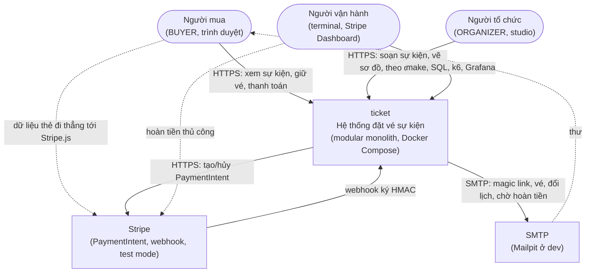
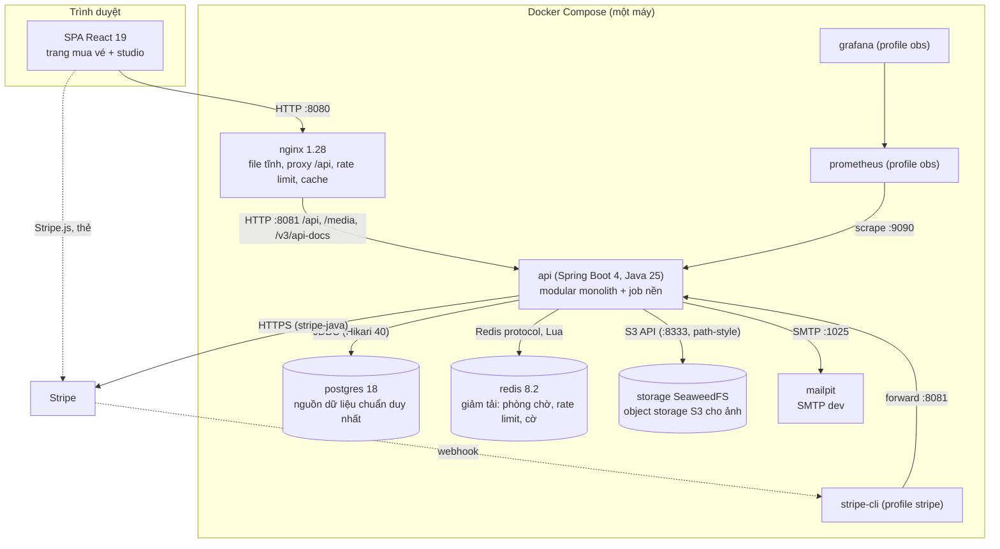
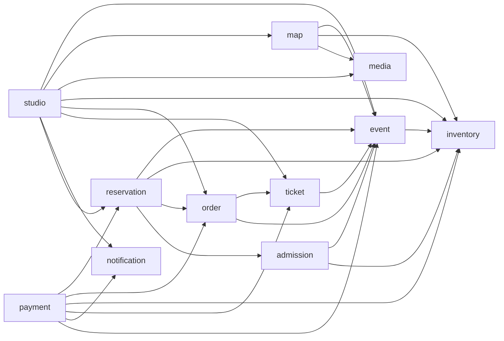
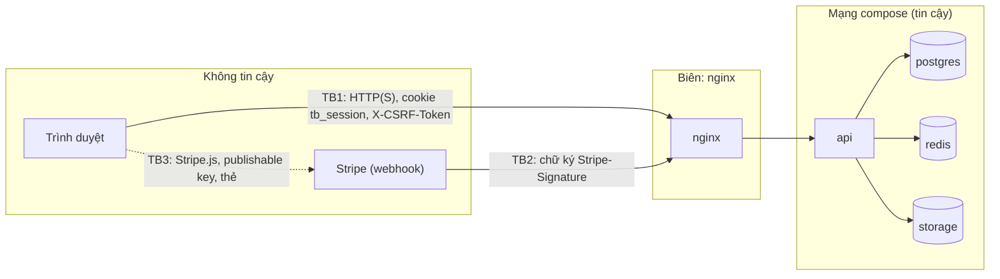

# Bối cảnh hệ thống và container

> Trạng thái: **Approved** · Cập nhật: 2026-10-06 · DOC-07
> Phụ thuộc: SDD gốc §4, §10, §14, [DOC-01](../01-product/vision-and-scope.md), [DOC-06](../02-glossary.md), [Sổ quyết định](../00-decision-register.md) (DR-01, 04, 05, 06, 09, 38, 51, 53, 55, 56, 61, 62, 72, 79), [ADR-0002](../04-adr/0002-modular-monolith-postgres-source-of-truth.md)
> Người dùng chính: P0-12; P1-02 (compose), P1-05 (khung module, test kiến trúc), DOC-12, DOC-14, DOC-15, DOC-17, DOC-62

Tài liệu mô tả hệ thống từ ngoài vào (C4 mức 1), các container bên trong (C4 mức 2), đơn vị triển khai, **bảng sở hữu dữ liệu** (đầu vào cho luật ArchUnit của DR-05) và ranh giới tin cậy. Cấu trúc package và luật layer của một module nằm ở [DOC-12](code-architecture.md); luồng dữ liệu theo từng kịch bản nằm ở DOC-08; DDL nằm ở [DOC-14](../05-data/domain-model.md) và [DOC-15](../05-data/ops-model.md); cấu hình compose chi tiết nằm ở [DOC-62](../09-operations/deploy-compose.md).

## 1. C4 mức 1: ngữ cảnh hệ thống

| Tác nhân ngoài | Tương tác | Giao thức | Ghi chú |
| --- | --- | --- | --- |
| Người mua | Xem sự kiện, phòng chờ, giữ vé, thanh toán, xem vé | HTTP(S) qua nginx; Stripe.js tải từ `js.stripe.com` | Không có session thì chỉ xem được (UC-02) |
| Người tổ chức | Studio: sự kiện, loại vé, sơ đồ, xuất bản, theo dõi bán | HTTP(S) qua nginx | Vai trò `ORGANIZER` do hồ sơ tổ chức (DR-23) |
| Người vận hành | `make exp`, `make invariants`, SQL theo runbook, Grafana, Stripe Dashboard | Terminal, Docker, HTTP | Không có vai trò `ADMIN` trong hệ thống (DOC-02 PS-5) |
| Stripe | Nhận PaymentIntent từ `api`; gửi webhook về `api`; nhận dữ liệu thẻ từ trình duyệt | HTTPS REST; webhook `POST /api/v1/webhooks/stripe` ký `Stripe-Signature` | Test mode, VND (DR-13); khi `PAYMENTS_MODE=fake` thay bằng cổng giả trong `api` (DR-51) |
| SMTP | Nhận thư từ `api` | SMTP (Mailpit cổng 1025 ở dev) | Magic link gửi trực tiếp; email nghiệp vụ qua outbox (DR-21, DR-53) |

## 2. C4 mức 2: container

### 2.1 Bảng container

| Container | Công nghệ | Trách nhiệm | Cổng (host · trong mạng compose) | Giao thức | Healthcheck | Profile |
| --- | --- | --- | --- | --- | --- | --- |
| `nginx` | `nginx:1.28-alpine` + bản build frontend | Phục vụ SPA, proxy `/api/`, `/media/`; rate limit theo IP (DR-55); `proxy_cache` cho `/api/v1/events/{id}/map`, `/api/v1/events/{id}`, `/media/`; header bảo mật; sinh `X-Request-Id`; `client_max_body_size 6m` | 8080 · 80 | HTTP | `GET /healthz` | mặc định |
| `api` | Java 25 (Temurin), Spring Boot 4; build từ `eclipse-temurin:25-jre-alpine` | Mọi logic nghiệp vụ, job nền (`@Scheduled`), Flyway khi khởi động, webhook Stripe, gửi SMTP | — · 8081 (API), 9090 (quản trị) | HTTP/JSON | `/actuator/health/readiness` | mặc định |
| `postgres` | `postgres:18-alpine` | Nguồn dữ liệu chuẩn: kho vé, reservation, đơn, vé, sơ đồ, tài khoản, outbox | 5432 · 5432 | PostgreSQL | `pg_isready` | mặc định |
| `redis` | `redis:8.2-alpine` | Rate limit theo người dùng, phòng chờ, cờ hết vé, cache số liệu bán. **Không bao giờ** là nguồn chuẩn | 6379 · 6379 | RESP, Lua | `redis-cli ping` | mặc định |
| `storage` | SeaweedFS (`chrislusf/seaweedfs`, `weed server -s3`), volume `storage-data` | Byte ảnh sự kiện và ảnh mặt bằng; bucket private `ticket-media` | — · 8333 | S3 | HTTP | mặc định |
| `mailpit` | `axllent/mailpit:v1.27` | Nhận thư dev; E2E đọc magic link qua API | 8025 (UI), 1025 (SMTP) | SMTP, HTTP | HTTP | mặc định |
| `stripe-cli` | `stripe/stripe-cli:v1.30` | Chuyển webhook Stripe test mode về `api` | — | HTTPS → HTTP | — | `stripe` |
| `prometheus` | image khóa ở DOC-62 | Scrape metric của `api` (cổng 9090) | 9091 · 9090 | HTTP | — | `obs` |
| `grafana` | image khóa ở DOC-62 | Dashboard EXP-05 | 3000 · 3000 | HTTP | — | `obs` |

Phiên bản image theo DR-04; `.env.example` mặc định `PAYMENTS_MODE=fake` để `docker compose up` chạy không cần khóa Stripe (DR-72, NFR-08). Cổng nội bộ `api` là 8081 để `make dev` (API chạy bằng `./gradlew bootRun` trên host, frontend `pnpm dev` proxy `/api`) không đụng cổng 8080 của nginx (DR-80).

### 2.2 Đơn vị triển khai

| Đơn vị | Là gì | Số bản sao | Dữ liệu bền | Ghi chú |
| --- | --- | --- | --- | --- |
| `nginx` | Container tĩnh + proxy | 1 | Không | Cache trong container, mất khi dừng |
| `api` | Một ứng dụng Spring Boot chạy cả API và job nền | **1** (SDD gốc 14.1) | Không | Job viết để chạy an toàn trên nhiều bản sao (`FOR UPDATE SKIP LOCKED`, lease); cache Caffeine (session, tình trạng chỗ) trong tiến trình nên chỉ đúng với một bản sao |
| `postgres` | Container database | 1 | Volume `postgres-data` | Tham số cho thực nghiệm ở DOC-62 (DR-61) |
| `redis` | Container Redis | 1 | Không cần (có thể mất) | Mất Redis → chậm hơn, mất phòng chờ, không bán vượt (DR-56) |
| `storage` | Container SeaweedFS | 1 | Volume `storage-data` | `make reset` xóa cả volume |
| `mailpit` | Container SMTP dev | 1 | Bộ nhớ | Mất thư khi dừng; trap: thư cũ còn khi chưa reset |
| `stripe-cli`, `prometheus`, `grafana` | Container tùy chọn | 0 hoặc 1 | Không | Chỉ bật bằng profile |
| Job nền | `@Scheduled` trong `api` | theo `api` | Không | Gồm `OutboxRelay`, job trả vé, `PaymentReconcileJob`, `AdmissionTicker`, `EventLifecycleJob`, `InvariantChecker`, `RetentionJob`; chi tiết ở DOC-82 và DOC-12 |
| Frontend | Bản build tĩnh chép vào image `nginx` | — | Không | Chunk tải lười: `seat-picker`, `studio-map`, `checkout` (DR-67) |

## 3. Module bên trong `api`

Gói gốc `io.ticket`; mỗi module nghiệp vụ `io.ticket.<module>` là một module Spring Modulith (DR-06). Cấu trúc layer bên trong module ở [DOC-12](code-architecture.md) §2. Module bổ sung so với SDD gốc: `media` (DR-38), `studio` (DR-79).

| Module | Trách nhiệm | Bảng sở hữu | Họ key Redis sở hữu | Controller chính |
| --- | --- | --- | --- | --- |
| `auth` | Magic link, session, CSRF, hồ sơ tổ chức, `GET/PATCH /me` | `app_user`, `organizer`, `login_token`, `session` | — | `/auth/*`, `/me`, `/organizer` (POST) |
| `media` | Tải lên và phục vụ ảnh, metadata | `media` | — | `POST /organizer/media`, `GET /media/{id}` |
| `event` | Quy tắc và trạng thái của event, loại vé, `displayStatus`; đọc công khai | `event`, `ticket_type` | — | `GET /events`, `GET /events/{id}`, `GET /events/{id}/availability` |
| `map` | Bản nháp, validate, phiên bản bất biến, nhân bản sơ đồ; xuất bản lại kho vé ghế/zone trước giờ mở bán | `seat_map`, `seat_map_version` | — | `GET /events/{id}/map`, `/organizer/maps/*` |
| `inventory` | Pool, unit, claim, trả vé, snapshot tình trạng chỗ, số liệu bán | `inventory_pool`, `inventory_unit`, `inventory_pool_counter` (profile `experiment`) | `sales:{e}` | (qua `event`, `studio`) |
| `reservation` | Giữ vé, hủy giữ, job trả vé, idempotency | `reservation`, `reservation_item`, `idempotency_key` | — | `POST /events/{id}/reservations`, `GET/DELETE /reservations/{id}` |
| `order` | Đơn hàng và trạng thái đơn; đọc đơn | `orders` | — | `GET /orders/{id}`, `GET /me/orders` |
| `payment` | Cổng thanh toán, PaymentIntent, webhook, giao dịch xác nhận, đối chiếu, đơn 0 đồng | `stripe_event`, `fake_payment_intent` (profile `fake-payments`) | — | `POST /orders/{id}/payment-intent`, `POST /orders/{id}/confirm-free`, `POST /webhooks/stripe` |
| `ticket` | Phát hành vé, mã vé, vé của tôi | `ticket` | — | `GET /me/tickets` |
| `admission` | Rate limit theo người dùng, phòng chờ, lượt vào, cờ hết vé | — | `rl:*`, `prequeue:{e}`, `queue:{e}`, `queue-seq:{e}`, `admitted:{e}`, `seen:{e}`, `queue-state:{e}`, `queue:events`, `admit-lock:{e}`, `admit-hist:{e}`, `soldout:pool:{p}` | `/events/{id}/queue` |
| `notification` | Outbox, relay, email (Thymeleaf), SMTP | `outbox` | — | — |
| `studio` | API của người tổ chức cho event và các thao tác xuyên module (xuất bản, hủy, đổi lịch) | — | — | `/organizer/events/**` |
| `invariant` | `InvariantChecker`, chế độ CLI | — (chỉ đọc) | — | — |
| `common` | Cấu hình, Problem Details, i18n, bảo mật (principal), tiện ích, `RetentionJob` | — | — | — |

### 3.1 Đồ thị phụ thuộc giữa module (DR-79)

Mũi tên A → B nghĩa là service của A gọi `BApi` hoặc dùng event/DTO ở package gốc của B. Đồ thị không có vòng và là cơ sở của test Spring Modulith `verify()`.

`auth`, `media`, `notification`, `inventory` và `common` không gọi module nghiệp vụ nào (`event → inventory` để tính `displayStatus` và snapshot). Hai chỗ đảo chiều phụ thuộc bằng interface đặt ở package gốc của module thấp hơn: `reservation` định nghĩa `PaymentIntentCanceller` (job trả vé cần hủy PaymentIntent mà `payment` đã phụ thuộc `reservation`); `common` định nghĩa `RetentionContributor` (mỗi module dọn bảng của mình khi `RetentionJob` gọi). `invariant` đọc mọi bảng bằng SQL chỉ đọc (ngoại lệ có chủ đích của luật sở hữu bảng, §4.3).

## 4. Bảng sở hữu dữ liệu

Luật (DR-05, DR-06): mỗi bảng PostgreSQL và mỗi họ key Redis có **đúng một module sở hữu**; chỉ repository của module đó được đọc hoặc ghi. Module khác cần dữ liệu thì gọi `…Api` của chủ sở hữu và nhận DTO; **không** truy vấn bảng của nhau, kể cả join hay SQL thuần. Cột "Module khác truy cập qua" liệt kê ai cần dữ liệu và bằng API nào. Test ArchUnit "chuỗi SQL chỉ nhắc bảng mà X sở hữu" lấy danh sách này (P1-05).

### 4.1 Bảng PostgreSQL

| Bảng | Chủ sở hữu (đọc và ghi) | Ghi bởi (class chính) | Module khác truy cập qua |
| --- | --- | --- | --- |
| `app_user` | `auth` | `AuthService`, `MeService` | `AuthApi.findUser/emailOf/localeOf` (notification payload do `payment`, `studio` dựng) |
| `organizer` | `auth` | `OrganizerService` | `AuthApi.organizerOf(userId)`, `organizerContact(organizerId)` (email đổi lịch) |
| `login_token` | `auth` | `MagicLinkService` | — |
| `session` | `auth` | `SessionService` | `AuthApi` không lộ; bộ lọc session nằm trong `auth` |
| `media` | `media` | `MediaService` | `MediaApi.exists(mediaId, organizerId)` (`studio`, `map`) |
| `event` | `event` | `EventService` | `EventApi.get/facts/requireOnSale/lockForUpdate/lockForShare` |
| `ticket_type` | `event` | `TicketTypeService` | `EventApi.ticketTypes(eventId)` (`map`, `studio`, `inventory` qua tham số) |
| `seat_map` | `map` | `MapDraftService`, `MapCloneService` | `MapApi.mapOf(eventId)` |
| `seat_map_version` | `map` | `MapPublishService` (chỉ chèn; trigger `forbid_update`) | `MapApi.latestVersion(eventId)`, `versionDocument(versionId)` (`studio`) |
| `inventory_pool` | `inventory` | `InventoryService` (xuất bản, đổi sức chứa) | `InventoryApi.poolsOf(eventId)`, `snapshot(eventId)` |
| `inventory_unit` | `inventory` | `InventoryService`, `InventoryClaimer` (không phải aggregate có `save()`, DR-05) | `InventoryApi.claim/confirmSold/release(reservationId)`, `snapshot`, `sales` |
| `inventory_pool_counter` | `inventory` (profile `experiment`) | `CounterClaimer` | — |
| `reservation` | `reservation` | `HoldService`, `ReleaseService`, `ReleaseExpiredHoldsJob` | `ReservationApi.get/confirm/beginExpiry/expireAllForEvent` |
| `reservation_item` | `reservation` | `HoldService` (chèn một lần, DR-05) | `ReservationApi.itemsOf(reservationId)` |
| `idempotency_key` | `reservation` | `IdempotencyService` | `IdempotencyApi` (`payment` cho `confirm-free`) |
| `orders` | `order` | `OrderService` | `OrderApi.createPending/markPaid/markRefundPending/close/paymentIntentIdOf` |
| `ticket` | `ticket` | `TicketService` | `TicketApi.issue/voidByEvent/byOrder` |
| `stripe_event` | `payment` | `WebhookService` | — |
| `fake_payment_intent` | `payment` (profile `fake-payments`) | `FakePaymentGateway` | — |
| `outbox` | `notification` | `NotificationService`, `OutboxRelay` | `NotificationApi.enqueue(kind, payload)` (trong transaction của người gọi) |

Khóa ngoại giữa bảng của các module (ví dụ `orders.reservation_id → reservation`) được database ép; chúng không cho phép module này truy vấn bảng kia.

### 4.2 Họ key Redis, cache trong tiến trình và object storage

| Kho | Họ key / tên | Kiểu · TTL | Chủ sở hữu (ghi) | Đọc | Module khác truy cập qua |
| --- | --- | --- | --- | --- | --- |
| Redis | `rl:hold:{userId}`, `rl:pi:{userId}`, `rl:queue:{userId}` | hash (token bucket) · tự hết | `admission` (`token_bucket.lua`) | `admission` | bộ lọc của `admission` áp trên endpoint (`reservation`, `payment`) |
| Redis | `prequeue:{e}` | set | `admission` | `admission` | `AdmissionApi.join/leave/status` |
| Redis | `queue:{e}`, `queue-seq:{e}` | sorted set, counter | `admission` | `admission` | như trên |
| Redis | `admitted:{e}` | sorted set (điểm = hết hạn) | `admission` (`admit.lua`, gia hạn khi giữ vé) | `admission` | `AdmissionApi.checkPass(eventId, userId)`, `extendPass(...)` (`reservation`) |
| Redis | `seen:{e}`, `queue-state:{e}`, `queue:events` | sorted set, string, set | `admission` | `admission` | — |
| Redis | `admit-lock:{e}`, `admit-hist:{e}` | string `PX 900`, list 60 phần tử | `admission` | `admission` | — |
| Redis | `soldout:pool:{p}` | string · 30 giây | `admission` | `admission` | `AdmissionApi.markSoldOut(poolId)`, `clearSoldOut(poolId)`, `isSoldOut(poolId)` (`reservation`) |
| Redis | `sales:{e}` | string JSON · 5 giây | `inventory` | `inventory` | `InventoryApi.sales(eventId)` |
| Caffeine | session cache | TTL 60 giây, ≤ 200.000 mục | `auth` | `auth` | — |
| Caffeine | availability snapshot theo `eventId` | hết hạn 2 giây sau khi ghi | `inventory` | `inventory` | `InventoryApi.snapshot(eventId)` (`event`, `studio`, `admission`) |
| Object storage | bucket `ticket-media`, key `media/<media_id>` | bất biến | `media` | `media` | `MediaApi` |

Mất Redis: mọi họ key trên là gợi ý hoặc trạng thái phòng chờ; hành vi theo DR-56, DR-57 (chi tiết DOC-17, DOC-28).

### 4.3 Giao dịch liên module và ngoại lệ

Một số transaction chạm bảng của nhiều module. Quy tắc (DR-05): transaction mở ở service của **module điều phối**; module khác tham gia qua `…Api` với propagation `MANDATORY` và chạy trong cùng transaction.

| Transaction | Điều phối ở | Module tham gia (qua `…Api`) |
| --- | --- | --- |
| Giữ vé (DR-41) | `reservation.service.HoldService` | `event` (đọc), `reservation` (idempotency, reservation, item), `inventory` (claim), `order` (chèn đơn) |
| Trả vé (job và đường nhanh, DR-42, DR-43) | `reservation.service.ReleaseService` | `order` (đọc `payment_intent_id`, đóng đơn), `inventory` (trả unit), `admission` (xóa cờ hết vé, sau commit); hủy PaymentIntent qua `PaymentIntentCanceller` (ngoài transaction) |
| Xác nhận thanh toán (webhook, đối chiếu, `confirm-free`) | `payment.service.ConfirmationService` | `event` (`FOR SHARE`), `reservation` (`CONFIRMED`), `inventory` (`SOLD`), `order` (`PAID`), `ticket` (phát hành), `notification` (outbox) |
| Xuất bản event, tạo kho vé (DR-27) | `studio.service.PublishService` | `event` (khóa, đổi trạng thái), `map` (đọc tài liệu), `inventory` (tạo pool và unit) |
| Hủy event (DR-28) | `studio.service.CancelEventService` | `event`, `order` (`PAID → REFUND_PENDING`), `ticket` (`VOID`), `reservation` (`ACTIVE → EXPIRING`), `notification` (outbox) |
| Đổi lịch, fan-out email (DR-29) | `studio.service.EventChangeService` | `event` (`PATCH` với `rowVersion`), `order` (đơn `PAID`), `notification` (outbox) |
| Xuất bản phiên bản sơ đồ trước giờ mở bán (DR-37) | `map.service.MapPublishService` | `event` (khóa, kiểm giờ mở bán), `inventory` (xóa và dựng lại unit ghế, zone) |
| Tạo PaymentIntent (DR-47) | `payment.service.PaymentIntentService` | `reservation` (đọc, `FOR SHARE`), `order` (lưu `payment_intent_id`) |

**Tài liệu sơ đồ truyền dưới dạng tham số.** Câu `INSERT … SELECT` dựng unit ghế (DR-27 bước 3, DR-37) cần nội dung `seat_map_version.document`. Bảng đó thuộc `map`, nên `map`/`studio` đọc tài liệu rồi truyền cho `InventoryApi.createSeatUnits(eventId, ticketTypeIds, documentJson)`; câu SQL của `inventory` chạy `jsonb_path_query(:doc::jsonb, …)` và chỉ nhắc bảng của `inventory` (DR-79). Cách này được đo ở S-03.

**Ngoại lệ chỉ đọc của `invariant` (DR-79).** `InvariantChecker` chạy các truy vấn `SELECT` nối nhiều bảng (DOC-30). Luật sở hữu bảng miễn riêng package `io.ticket.invariant` với điều kiện chỉ `SELECT`; ArchUnit kiểm tra không có `INSERT/UPDATE/DELETE` trong package này. Lệnh dùng cùng role database nhưng chỉ chạy truy vấn đọc.

**`RetentionJob`.** Do `common` lên lịch (03:00 theo `PLATFORM_TIMEZONE`, DR-74) và gọi `RetentionContributor` của từng module (`auth`, `reservation`, `payment`, `notification`, `media`); mỗi module tự xóa bảng của mình theo lô 5.000 dòng.

## 5. Ranh giới tin cậy

| Ranh giới | Ai xác thực ở đâu | Secret nào đi qua | Kiểm tra |
| --- | --- | --- | --- |
| **TB1 trình duyệt ↔ nginx ↔ `api`** | Session cookie `tb_session` (`HttpOnly; Secure; SameSite=Lax`) kiểm ở bộ lọc session của `auth`; CSRF `X-CSRF-Token` cho request ghi; quyền theo vai trò và sở hữu (DR-23) | Token đăng nhập (chỉ trong email và URL callback, DB lưu SHA-256); `csrfToken` trả trong body | Rate limit nginx (DR-55); `client_max_body_size 6m`; CSP cho phép `js.stripe.com`; CORS tắt (cùng origin); đầu vào theo JSON Schema và Bean Validation |
| **TB2 Stripe → `api`** (webhook) | Chữ ký `Stripe-Signature` với `STRIPE_WEBHOOK_SECRET`, dung sai 300 giây; endpoint không cần session và miễn CSRF (DR-22) | `STRIPE_WEBHOOK_SECRET` (trong `.env`, không commit) | Body thô, `Webhook.constructEvent`; loại trùng `stripe_event`; chỉ webhook đã xác minh mới đổi order sang `PAID` |
| **TB3 trình duyệt → Stripe** | Publishable key `pk_test_…` (công khai); `clientSecret` do `api` trả cho đúng người dùng | Dữ liệu thẻ **không bao giờ** đi qua `api` (NFR-07) | `api` chỉ giữ `payment_intent_id` |
| `api` → `postgres`, `redis`, `storage` | Mạng nội bộ compose, user/password từ `.env`; chỉ `nginx` và vài cổng dev mở ra host | `POSTGRES_PASSWORD`/`SPRING_DATASOURCE_PASSWORD`, `STORAGE_S3_ACCESS_KEY/SECRET_KEY` (Redis không đặt mật khẩu ở dev, DOC-62 §6) | Redis và storage không mở cổng ra host ngoài dev; storage không dùng presigned URL (DR-38) |
| `api` → Stripe | `STRIPE_SECRET_KEY` (`sk_test_…`) trong `.env`; từ chối khởi động nếu profile `fake-payments` đi cùng `sk_live_…` (DR-51) | `STRIPE_SECRET_KEY` | Client Stripe: connect 2 giây, read 10 giây, `maxNetworkRetries = 2` |
| `api` → SMTP | Không xác thực ở dev (Mailpit); biến `SPRING_MAIL_*` ở DOC-62 | `SPRING_MAIL_USERNAME/PASSWORD` nếu có | Email không bao giờ vào log (DR-22) |
| Cổng quản trị 9090 | Không qua nginx; chỉ mở trong mạng compose và profile `obs` | — | `health`, `prometheus` |

Phân tích STRIDE cho ba ranh giới đầu ở [DOC-32](../06-design/security.md); ma trận endpoint × vai trò cũng ở đó.

## 6. Liên hệ với tài liệu khác

| Cần | Xem |
| --- | --- |
| Layer trong module, luật ArchUnit, cấu trúc package | [DOC-12](code-architecture.md) |
| Luồng dữ liệu mức container (điểm commit, gọi ra ngoài, outbox) | DOC-08 |
| DDL của bảng trong §4.1 | [DOC-14](../05-data/domain-model.md), [DOC-15](../05-data/ops-model.md) |
| Họ key Redis chi tiết và script Lua | DOC-17 |
| Cấu hình compose, nginx, biến môi trường | [DOC-62](../09-operations/deploy-compose.md) |
| Quyết định kiến trúc | [ADR-0002](../04-adr/0002-modular-monolith-postgres-source-of-truth.md), [ADR-0006](../04-adr/0006-transactional-outbox-for-email.md), [ADR-0012](../04-adr/0012-spring-data-jdbc-and-modulith-boundaries.md) |

## Câu hỏi còn mở

Không có. Quyết định phát sinh khi viết tài liệu này: DR-79 (đồ thị phụ thuộc giữa module, module `studio`, ngoại lệ chỉ đọc của `invariant`, truyền tài liệu sơ đồ dạng tham số), DR-80 (cổng nội bộ `api` 8081 và các thông số hạ tầng nhỏ). Cả hai do Claude chốt theo ủy quyền (đưa vào [sổ quyết định](../00-decision-register.md)).
