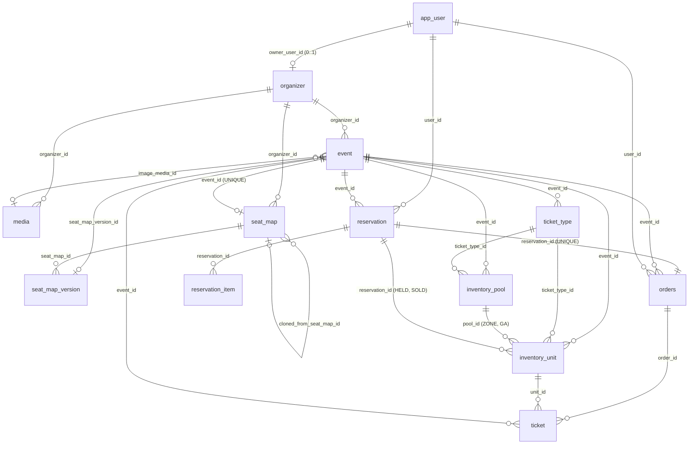
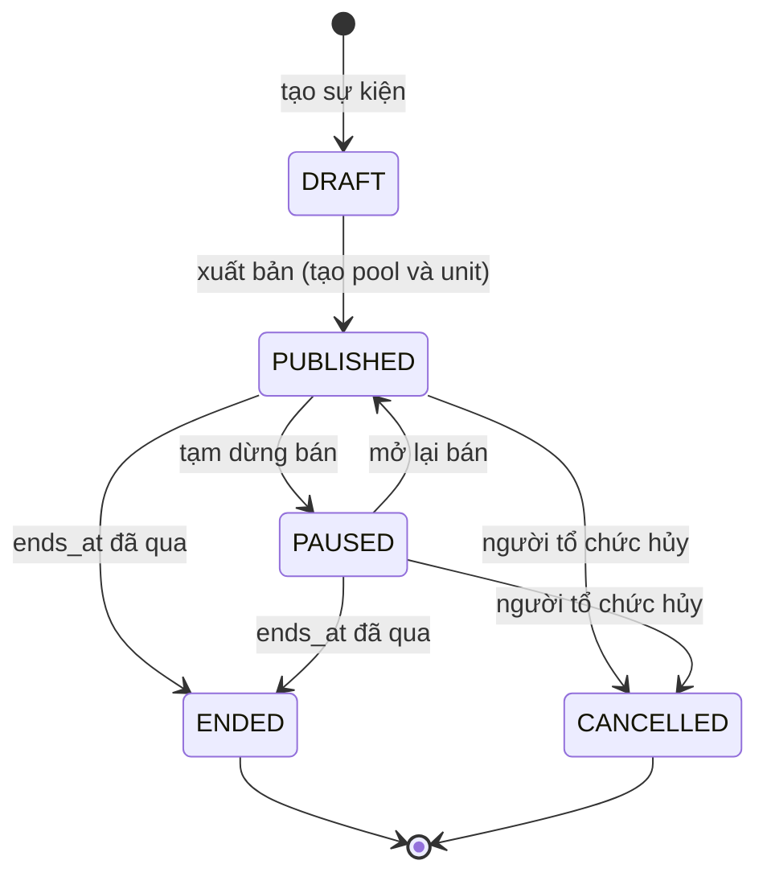
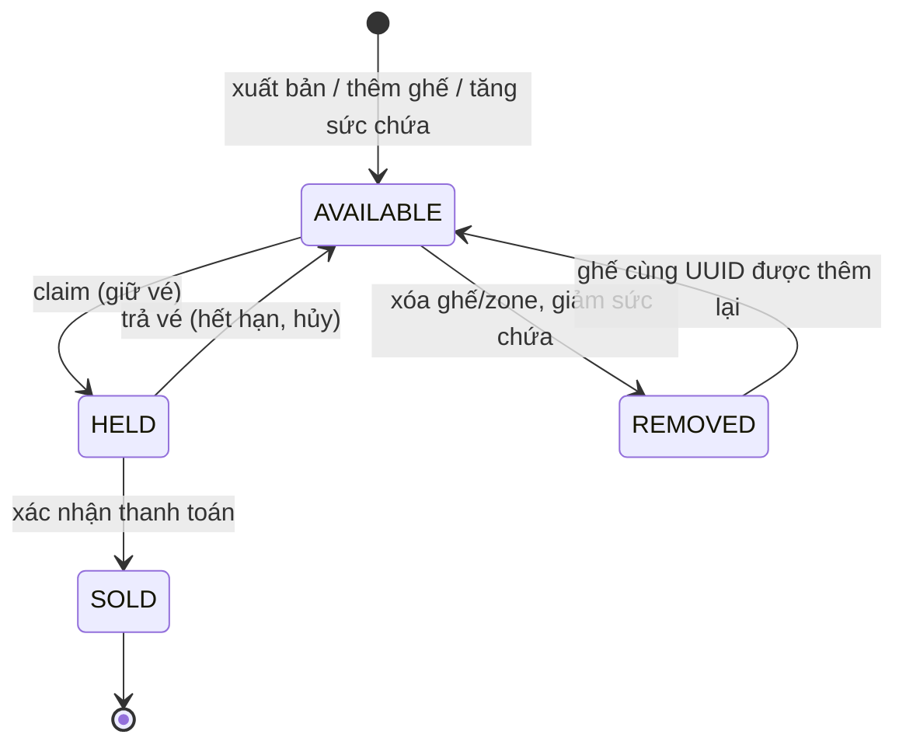
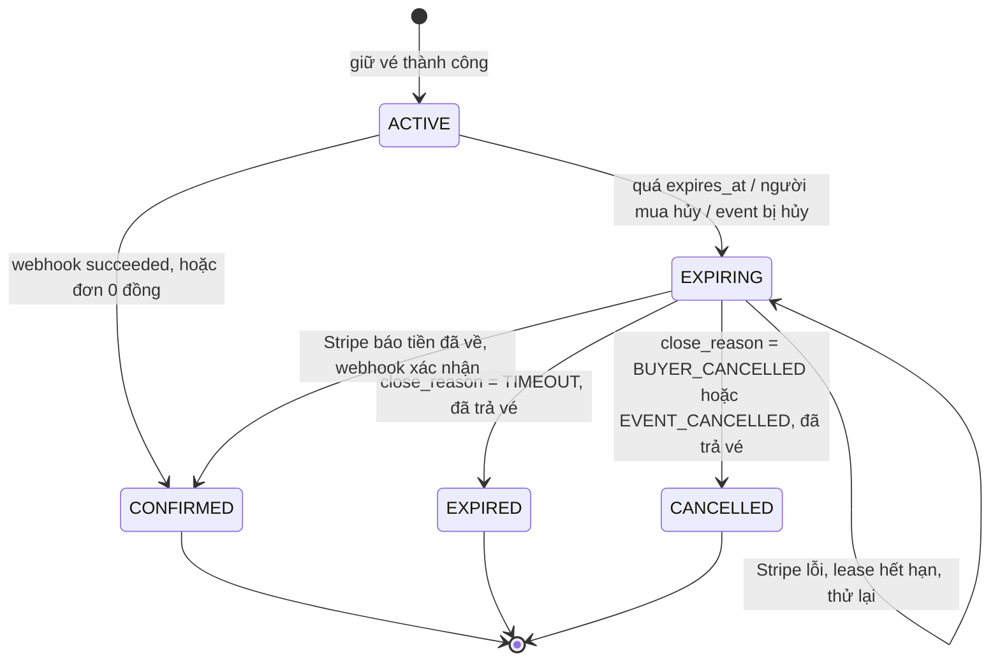
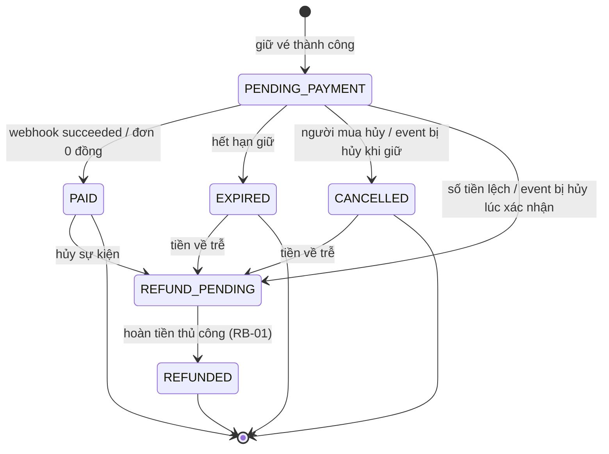
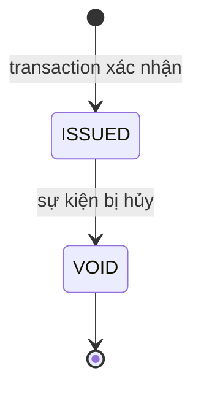

# Mô hình miền

> Trạng thái: **Approved** · Cập nhật: 2026-10-06 · DOC-14
> Phụ thuộc: SDD gốc §6, §7.8, §8, §9, §11, [DOC-06](../02-glossary.md), [DOC-07](../03-architecture/system-context-and-containers.md) §4, [DOC-12](../03-architecture/code-architecture.md), [Sổ quyết định](../00-decision-register.md) (DR-05, 11, 12, 13, 14, 15, 16, 17, 18, 20, 24, 27, 28, 38, 40, 41, 43, 44, 52), [ADR-0002](../04-adr/0002-modular-monolith-postgres-source-of-truth.md), [ADR-0012](../04-adr/0012-spring-data-jdbc-and-modulith-boundaries.md), [ADR-0018](../04-adr/0018-uuidv7-primary-keys.md)
> Người dùng chính: P1-03 (Flyway migration đầu tiên), P1-05 (ArchUnit sở hữu bảng), mọi task của module `event`, `map`, `inventory`, `reservation`, `order`, `ticket`, `media`, `auth`; [DOC-24](../06-design/inventory-and-reservation.md), [DOC-26](../06-design/checkout-and-payment.md), [DOC-30](../06-design/invariant-checker.md)

Tài liệu này là nguồn duy nhất của DDL các bảng nghiệp vụ: tài khoản, sự kiện, sơ đồ, kho vé, reservation, đơn hàng, vé, ảnh. Bảng vận hành (token đăng nhập, session, idempotency, webhook, outbox, bảng của profile `fake-payments` và `experiment`) nằm ở [DOC-15](ops-model.md). Thuật toán claim và trả vé ở mức thiết kế nằm ở DOC-24; luồng xác nhận thanh toán ở DOC-26; cấu trúc JSON của tài liệu sơ đồ ở DOC-16; quy tắc hợp lệ của từng trường (độ dài, khoảng giá) ở DOC-20. Tài liệu này chỉ nói bảng, cột, ràng buộc, index, máy trạng thái và các câu SQL mẫu của mô hình.

Mọi quyết định mới phát sinh khi viết tài liệu này là DR-90…95 và được tóm tắt ở §10.

## 1. Quy ước

| Điểm | Quy ước | Nguồn |
| --- | --- | --- |
| Khóa chính | `uuid`, tên `<bảng>_id`, mặc định `uuidv7()` của PostgreSQL 18. `reservation_id` và `order_id` không có `DEFAULT`: Java sinh UUIDv7 trước khi claim | DR-11, ADR-0018 |
| ID do client sinh | ID ghế, section, row, zone nằm trong JSON của tài liệu sơ đồ, không có cột riêng; `inventory_unit.seat_id` chép lại ID ghế (không có khóa ngoại vì ghế không phải bảng) | DR-32, DR-40 |
| ID Stripe | `text` (`payment_intent_id`) | DR-11 |
| Trạng thái | `text` + `CHECK`, không dùng `ENUM`; đổi tập giá trị bằng migration `ALTER TABLE … DROP/ADD CONSTRAINT` | DR-14 mục C |
| Thời điểm | `timestamptz`; mọi so sánh hạn trong SQL bằng `now()` | DR-12 |
| Tiền | `bigint` tính bằng đồng VND; `currency` chỉ giữ ở `orders` với `CHECK (currency = 'VND')` | DR-13 |
| Khóa ngoại | luôn có index (khóa ngoại không có index riêng thì nằm trong index khác, ghi rõ ở §5) | DR-14 mục C |
| `created_at` | mọi bảng có, `NOT NULL DEFAULT now()` | DR-14 mục C |
| Migration | `V<yyyymmddHHmm>__<snake_case>.sql`; không sửa migration đã merge | DR-07, DOC-15 §8 |
| Cột `row_version` | chỉ `event` (khóa lạc quan của `PATCH`) | DR-70 |

Hai bảng có vòng khóa ngoại: `event.seat_map_version_id → seat_map_version → seat_map → event`. Migration tạo `event` không có khóa ngoại tới `seat_map_version`, rồi `ALTER TABLE event ADD CONSTRAINT …` sau khi hai bảng kia tồn tại (§4.1).

## 2. Chủ sở hữu bảng

Bảng sở hữu đầy đủ nằm ở [DOC-07](../03-architecture/system-context-and-containers.md) §4.1 và là đầu vào của luật ArchUnit; bảng dưới chỉ gom các bảng của tài liệu này theo module để người đọc DDL biết bảng thuộc ai.

| Module | Bảng trong tài liệu này |
| --- | --- |
| `auth` | `app_user`, `organizer` |
| `media` | `media` |
| `event` | `event`, `ticket_type` |
| `map` | `seat_map`, `seat_map_version` |
| `inventory` | `inventory_pool`, `inventory_unit` |
| `reservation` | `reservation`, `reservation_item` |
| `order` | `orders` |
| `ticket` | `ticket` |

Khóa ngoại giữa bảng của các module do database ép; chúng không cho phép module này truy vấn bảng của module kia (DR-05, DOC-07 §4).

## 3. Sơ đồ quan hệ



Điều sơ đồ không vẽ được: `inventory_unit` có đúng một trong hai `seat_id` hoặc `pool_id` (`unit_kind_ck`); `reservation_item` cũng vậy theo `kind`. Hai bảng không có khóa ngoại tới nhau về ghế vì ghế chỉ tồn tại trong JSON của `seat_map_version.document`.

## 4. DDL

### 4.1 Thứ tự chạy và tệp migration

Các khối `sql ddl` dưới đây chạy được theo đúng thứ tự xuất hiện trên PostgreSQL 18 trống. Chúng là nội dung các migration đầu tiên của thư mục `db/migration`; [DOC-15](ops-model.md) §8 nói về cách đặt tên và nối tiếp.

| Thứ tự | Tệp migration (tên mẫu) | Bảng | Ghi chú |
| --- | --- | --- | --- |
| 1 | `V202610060001__account_and_media.sql` | `app_user`, `organizer`, `media` | Không phụ thuộc bảng nào khác |
| 2 | `V202610060002__event_and_seat_map.sql` | `forbid_update()`, `event`, `seat_map`, `seat_map_version`, khóa ngoại `event → seat_map_version`, `ticket_type` | Phá vòng khóa ngoại bằng `ALTER TABLE` |
| 3 | `V202610060003__reservation_order_inventory.sql` | `inventory_pool`, `reservation`, `inventory_unit`, `reservation_item`, `orders`, `ticket` | `reservation` trước `inventory_unit` vì `inventory_unit.reservation_id` |
| 4 | `V202610060004__ops_tables.sql` | bảng của DOC-15 | |

### 4.2 Tài khoản, tổ chức, ảnh

`login_token` và `session` thuộc cùng module `auth` nhưng là dữ liệu vận hành, nằm ở DOC-15 §3 và §4.

```sql ddl
-- ===== V202610060001__account_and_media.sql =====

-- Tài khoản. Có một dòng cho mỗi email đã đăng nhập thành công ít nhất một lần.
-- Không lưu vai trò: có dòng organizer của user là có vai trò ORGANIZER (DR-23).
CREATE TABLE app_user (
  user_id       uuid PRIMARY KEY DEFAULT uuidv7(),
  email         text NOT NULL,                       -- đã chuẩn hóa (trim, chữ thường), DR-21
  locale        text NOT NULL DEFAULT 'vi' CHECK (locale IN ('vi','en')),   -- DR-10
  created_at    timestamptz NOT NULL DEFAULT now(),
  last_login_at timestamptz
);
CREATE UNIQUE INDEX app_user_email_uq ON app_user (email);

-- Hồ sơ tổ chức: tối đa một hồ sơ cho mỗi tài khoản.
CREATE TABLE organizer (
  organizer_id  uuid PRIMARY KEY DEFAULT uuidv7(),
  owner_user_id uuid NOT NULL UNIQUE REFERENCES app_user,   -- 1 tài khoản ↔ tối đa 1 tổ chức
  name          text NOT NULL CHECK (char_length(name) BETWEEN 1 AND 120),
  contact_email text,                                        -- NULL: dùng email đăng nhập
  created_at    timestamptz NOT NULL DEFAULT now()
);

-- Metadata ảnh; byte ảnh nằm ở object storage S3 (DR-38, ADR-0015).
CREATE TABLE media (
  media_id     uuid PRIMARY KEY DEFAULT uuidv7(),
  organizer_id uuid NOT NULL REFERENCES organizer,
  purpose      text NOT NULL CHECK (purpose IN ('EVENT_IMAGE','FLOOR_PLAN')),
  content_type text NOT NULL CHECK (content_type IN ('image/jpeg','image/png','image/webp')),
  object_key   text NOT NULL UNIQUE,                 -- 'media/<media_id>', bất biến
  size_bytes   int  NOT NULL CHECK (size_bytes <= 5242880),
  width        int  NOT NULL,
  height       int  NOT NULL,
  sha256       bytea NOT NULL,                       -- ETag của GET /media/{id}
  created_at   timestamptz NOT NULL DEFAULT now()
);
CREATE INDEX media_organizer_idx ON media (organizer_id, created_at DESC);
```

`media_organizer_idx` phục vụ khóa ngoại `organizer_id` và truy vấn "ảnh của tôi" (không có trong DR-38; thêm theo quy ước "khóa ngoại có index", xem §10 `DR-92`).

### 4.3 Sự kiện, loại vé, sơ đồ

```sql ddl
-- ===== V202610060002__event_and_seat_map.sql =====

-- Hàm trigger dùng chung cho các bảng bất biến (DR-16).
CREATE FUNCTION forbid_update() RETURNS trigger LANGUAGE plpgsql AS
$$ BEGIN RAISE EXCEPTION '% is immutable', TG_TABLE_NAME; END $$;

-- Sự kiện: đúng một show. 'status' là trạng thái lưu; trạng thái hiển thị
-- (UPCOMING, ON_SALE, SOLD_OUT, SALE_CLOSED) suy ra ở server, không lưu (DR-24).
CREATE TABLE event (
  event_id              uuid PRIMARY KEY DEFAULT uuidv7(),
  organizer_id          uuid NOT NULL REFERENCES organizer,
  status                text NOT NULL DEFAULT 'DRAFT'
                        CHECK (status IN ('DRAFT','PUBLISHED','PAUSED','ENDED','CANCELLED')),
  name                  text NOT NULL CHECK (char_length(name) BETWEEN 1 AND 120),
  description           text NOT NULL DEFAULT '' CHECK (char_length(description) <= 5000),
  venue                 text NOT NULL DEFAULT '' CHECK (char_length(venue) <= 200),
  timezone              text NOT NULL DEFAULT 'Asia/Ho_Chi_Minh',   -- tên IANA, khóa sau khi xuất bản, DR-12
  image_media_id        uuid REFERENCES media,                      -- DR-38
  starts_at             timestamptz,
  ends_at               timestamptz,
  sale_starts_at        timestamptz,
  sale_ends_at          timestamptz,
  high_demand           boolean NOT NULL DEFAULT false,             -- bật phòng chờ, DR-57
  ticket_code_prefix    text NOT NULL CHECK (ticket_code_prefix ~ '^[A-Z]{2}$'),  -- DR-52
  seat_map_version_id   uuid,                                       -- FK thêm bên dưới (vòng phụ thuộc)
  row_version           int  NOT NULL DEFAULT 0,                    -- khóa lạc quan cho PATCH, DR-70
  published_at          timestamptz,
  cancelled_at          timestamptz,
  ended_at              timestamptz,
  created_at            timestamptz NOT NULL DEFAULT now(),
  updated_at            timestamptz NOT NULL DEFAULT now(),
  -- Bản nháp được thiếu trường; từ khi xuất bản thì lịch phải đủ và đúng thứ tự (DR-25).
  CONSTRAINT event_schedule_ck CHECK (
    status = 'DRAFT' OR (
      starts_at IS NOT NULL AND ends_at > starts_at
      AND sale_starts_at IS NOT NULL AND sale_ends_at > sale_starts_at
      AND sale_ends_at <= starts_at))
);
CREATE INDEX event_public_idx    ON event (starts_at) WHERE status IN ('PUBLISHED','PAUSED');
CREATE INDEX event_organizer_idx ON event (organizer_id, created_at DESC);
CREATE INDEX event_media_idx     ON event (image_media_id) WHERE image_media_id IS NOT NULL;

-- Sơ đồ: một sơ đồ cho mỗi event (DR-31); dùng lại bằng nhân bản.
CREATE TABLE seat_map (
  seat_map_id       uuid PRIMARY KEY DEFAULT uuidv7(),
  event_id          uuid NOT NULL UNIQUE REFERENCES event,
  organizer_id      uuid NOT NULL REFERENCES organizer,
  name              text NOT NULL CHECK (char_length(name) BETWEEN 1 AND 120),
  draft             jsonb NOT NULL,                  -- tài liệu đang sửa (DOC-16)
  draft_revision    int  NOT NULL DEFAULT 0,         -- khóa lạc quan của PUT draft, DR-36
  draft_updated_at  timestamptz NOT NULL DEFAULT now(),
  latest_version_no int  NOT NULL DEFAULT 0,         -- 0: chưa xuất bản phiên bản nào
  cloned_from_seat_map_id uuid REFERENCES seat_map,  -- chỉ để lưu vết, DR-31
  created_at        timestamptz NOT NULL DEFAULT now()
);
CREATE INDEX seat_map_organizer_idx ON seat_map (organizer_id);
CREATE INDEX seat_map_clone_idx     ON seat_map (cloned_from_seat_map_id) WHERE cloned_from_seat_map_id IS NOT NULL;

-- Phiên bản sơ đồ: bất biến, do trigger ép (DR-16).
CREATE TABLE seat_map_version (
  seat_map_version_id uuid PRIMARY KEY DEFAULT uuidv7(),
  seat_map_id         uuid NOT NULL REFERENCES seat_map,
  version_no          int  NOT NULL,
  document            jsonb NOT NULL,
  checksum            bytea NOT NULL,                -- SHA-256 của JSON chuẩn hóa RFC 8785, DR-32
  seat_count          int  NOT NULL,
  sellable_seat_count int  NOT NULL,                 -- không tính ghế blocked
  zone_count          int  NOT NULL,
  published_at        timestamptz NOT NULL DEFAULT now(),
  UNIQUE (seat_map_id, version_no)
);
CREATE TRIGGER seat_map_version_immutable
  BEFORE UPDATE OR DELETE ON seat_map_version
  FOR EACH ROW EXECUTE FUNCTION forbid_update();

ALTER TABLE event
  ADD CONSTRAINT event_seat_map_version_fk
  FOREIGN KEY (seat_map_version_id) REFERENCES seat_map_version;
CREATE INDEX event_seat_map_version_idx ON event (seat_map_version_id) WHERE seat_map_version_id IS NOT NULL;

-- Loại vé: tối đa 5 mỗi event (DOC-20 ép), màu type-1…5 theo thứ tự tạo (DR-68).
CREATE TABLE ticket_type (
  ticket_type_id uuid PRIMARY KEY DEFAULT uuidv7(),
  event_id       uuid NOT NULL REFERENCES event,
  name           text NOT NULL CHECK (char_length(name) BETWEEN 1 AND 60),
  model          text NOT NULL CHECK (model IN ('SEAT','ZONE','GA')),   -- không đổi sau khi xuất bản, DR-26
  price          bigint NOT NULL CHECK (price >= 0),                     -- VND; khoảng hợp lệ ở DR-13
  ga_capacity    int CHECK (ga_capacity BETWEEN 1 AND 100000),           -- chỉ GA
  color_index    smallint NOT NULL CHECK (color_index BETWEEN 1 AND 5),
  sort_order     smallint NOT NULL,
  deleted_at     timestamptz,                                            -- xóa mềm trước khi xuất bản
  created_at     timestamptz NOT NULL DEFAULT now(),
  updated_at     timestamptz NOT NULL DEFAULT now(),
  CONSTRAINT ticket_type_ga_ck CHECK ((model = 'GA') = (ga_capacity IS NOT NULL))
);
CREATE UNIQUE INDEX ticket_type_name_uq ON ticket_type (event_id, lower(name)) WHERE deleted_at IS NULL;
```

`event_media_idx`, `seat_map_organizer_idx`, `seat_map_clone_idx` và `event_seat_map_version_idx` là index khóa ngoại thêm theo quy ước (§10 `DR-92`); tất cả là index một phần hoặc nhỏ, không ảnh hưởng đường giữ vé.

### 4.4 Kho vé, reservation, đơn hàng, vé

```sql ddl
-- ===== V202610060003__reservation_order_inventory.sql =====

-- Pool: một zone hoặc một loại vé GA; sức chứa là số unit chưa REMOVED (DR-17).
CREATE TABLE inventory_pool (
  pool_id        uuid PRIMARY KEY DEFAULT uuidv7(),
  event_id       uuid NOT NULL REFERENCES event,
  kind           text NOT NULL CHECK (kind IN ('ZONE','GA')),
  zone_key       text,                               -- id của zone trong tài liệu sơ đồ
  ticket_type_id uuid NOT NULL REFERENCES ticket_type,
  name           text NOT NULL,                      -- tên zone, hoặc tên loại vé GA
  capacity       int  NOT NULL CHECK (capacity >= 0),
  removed_at     timestamptz,
  created_at     timestamptz NOT NULL DEFAULT now(),
  CONSTRAINT pool_zone_ck CHECK ((kind = 'ZONE') = (zone_key IS NOT NULL)),
  UNIQUE (event_id, zone_key)
);
CREATE UNIQUE INDEX pool_ga_uq ON inventory_pool (ticket_type_id) WHERE kind = 'GA';
CREATE INDEX pool_ticket_type_idx ON inventory_pool (ticket_type_id);

-- Reservation: một lần giữ vé của một người cho một event (DR-18).
-- reservation_id sinh trước ở Java và chèn TRƯỚC câu claim (§8).
CREATE TABLE reservation (
  reservation_id uuid PRIMARY KEY,                   -- UUIDv7 sinh ở Java, DR-11
  event_id       uuid NOT NULL REFERENCES event,
  user_id        uuid NOT NULL REFERENCES app_user,
  status         text NOT NULL CHECK (status IN ('ACTIVE','EXPIRING','CONFIRMED','EXPIRED','CANCELLED')),
  expires_at     timestamptz NOT NULL,               -- now() + reservation.hold-duration, DR-42
  close_reason   text CHECK (close_reason IN ('TIMEOUT','BUYER_CANCELLED','EVENT_CANCELLED')),
  expiring_since timestamptz,                        -- bắt đầu lease của job trả vé, DR-42
  created_at     timestamptz NOT NULL DEFAULT now(),
  closed_at      timestamptz                         -- lúc sang trạng thái cuối (DR-90)
);
-- Một người chỉ có một reservation mở mỗi event (SDD gốc 8.1, DR-41 bước 3).
CREATE UNIQUE INDEX reservation_open_uq ON reservation (user_id, event_id) WHERE status IN ('ACTIVE','EXPIRING');
CREATE INDEX reservation_due_idx        ON reservation (expires_at) WHERE status = 'ACTIVE';
CREATE INDEX reservation_expiring_idx   ON reservation (expiring_since) WHERE status = 'EXPIRING';
CREATE INDEX reservation_event_idx      ON reservation (event_id) WHERE status IN ('ACTIVE','EXPIRING');

-- Unit: một dòng cho mỗi vé bán được; tâm của NEVER OVERSELL (ADR-0003).
CREATE TABLE inventory_unit (
  unit_id        uuid PRIMARY KEY DEFAULT uuidv7(),
  event_id       uuid NOT NULL REFERENCES event,
  ticket_type_id uuid NOT NULL REFERENCES ticket_type,
  pool_id        uuid REFERENCES inventory_pool,
  seat_id        uuid,                               -- ID ghế trong tài liệu sơ đồ; NULL với unit pool
  seat_index     int,                                -- thứ tự ghế trong phiên bản sơ đồ, DR-62
  section_name   text,
  row_label      text,
  seat_number    text,
  status         text NOT NULL DEFAULT 'AVAILABLE'
                 CHECK (status IN ('AVAILABLE','HELD','SOLD','REMOVED')),
  reservation_id uuid REFERENCES reservation,
  updated_at     timestamptz NOT NULL DEFAULT now(),
  CONSTRAINT unit_kind_ck  CHECK ((seat_id IS NULL) <> (pool_id IS NULL)),
  CONSTRAINT unit_seat_ck  CHECK (seat_id IS NULL OR (seat_index IS NOT NULL AND row_label IS NOT NULL AND seat_number IS NOT NULL)),
  CONSTRAINT unit_owner_ck CHECK ((status IN ('HELD','SOLD')) = (reservation_id IS NOT NULL))
) WITH (fillfactor = 80, autovacuum_vacuum_scale_factor = 0.02);

CREATE UNIQUE INDEX unit_seat_uq       ON inventory_unit (event_id, seat_id) WHERE seat_id IS NOT NULL;
CREATE INDEX unit_pool_available_idx   ON inventory_unit (pool_id) WHERE status = 'AVAILABLE';
CREATE INDEX unit_reservation_idx      ON inventory_unit (reservation_id) WHERE reservation_id IS NOT NULL;
CREATE INDEX unit_seat_taken_idx       ON inventory_unit (event_id, seat_index) WHERE seat_id IS NOT NULL AND status IN ('HELD','SOLD');
CREATE INDEX unit_ticket_type_idx      ON inventory_unit (ticket_type_id);

-- Dòng giữ vé: bản chụp duy nhất của tên loại vé, giá và nhãn (DR-20).
CREATE TABLE reservation_item (
  reservation_item_id uuid PRIMARY KEY DEFAULT uuidv7(),
  reservation_id      uuid NOT NULL REFERENCES reservation,
  kind                text NOT NULL CHECK (kind IN ('SEAT','ZONE','GA')),
  seat_id             uuid,
  pool_id             uuid REFERENCES inventory_pool,
  quantity            int  NOT NULL CHECK (quantity >= 1),
  ticket_type_id      uuid NOT NULL REFERENCES ticket_type,
  ticket_type_name    text NOT NULL,                 -- chụp lúc giữ vé, DR-20
  unit_price          bigint NOT NULL CHECK (unit_price >= 0),
  label               jsonb NOT NULL,                -- {"section":"Khán đài A","row":"C","seat":"9"} hoặc {"zone":"Fanzone"}
  CONSTRAINT item_seat_ck CHECK (kind <> 'SEAT' OR (seat_id IS NOT NULL AND quantity = 1 AND pool_id IS NULL)),
  CONSTRAINT item_pool_ck CHECK (kind = 'SEAT' OR (pool_id IS NOT NULL AND seat_id IS NULL))
);
CREATE INDEX reservation_item_res_idx ON reservation_item (reservation_id);
CREATE INDEX reservation_item_pool_idx ON reservation_item (pool_id) WHERE pool_id IS NOT NULL;
CREATE INDEX reservation_item_type_idx ON reservation_item (ticket_type_id);

-- Đơn: một đơn cho mỗi reservation. Tên 'orders' vì ORDER là từ khóa SQL.
-- amount = Σ quantity × unit_price của các item, tính ở server, không đổi sau đó (DR-20).
CREATE TABLE orders (
  order_id           uuid PRIMARY KEY,               -- UUIDv7 sinh ở Java
  reservation_id     uuid NOT NULL UNIQUE REFERENCES reservation,
  event_id           uuid NOT NULL REFERENCES event,
  user_id            uuid NOT NULL REFERENCES app_user,
  status             text NOT NULL CHECK (status IN ('PENDING_PAYMENT','PAID','EXPIRED','CANCELLED','REFUND_PENDING','REFUNDED')),
  amount             bigint NOT NULL CHECK (amount >= 0),
  currency           text NOT NULL DEFAULT 'VND' CHECK (currency = 'VND'),   -- DR-13
  payment_intent_id  text UNIQUE,
  last_payment_error text,                           -- decline_code gần nhất
  paid_at            timestamptz,
  refund_reason      text CHECK (refund_reason IN ('LATE_PAYMENT','AMOUNT_MISMATCH','EVENT_CANCELLED')),  -- DR-44
  refund_reference   text,                           -- mã hoàn tiền Stripe ghi tay theo RB-01
  refunded_at        timestamptz,
  created_at         timestamptz NOT NULL DEFAULT now(),
  updated_at         timestamptz NOT NULL DEFAULT now(),
  CONSTRAINT orders_paid_ck     CHECK (status <> 'PAID' OR paid_at IS NOT NULL),
  CONSTRAINT orders_refund_ck   CHECK ((status IN ('REFUND_PENDING','REFUNDED')) = (refund_reason IS NOT NULL)),
  CONSTRAINT orders_refunded_ck CHECK (status <> 'REFUNDED' OR (refund_reference IS NOT NULL AND refunded_at IS NOT NULL))
);
CREATE INDEX orders_user_idx       ON orders (user_id, created_at DESC);
CREATE INDEX orders_event_paid_idx ON orders (event_id) WHERE status = 'PAID';
CREATE INDEX orders_pending_idx    ON orders (created_at) WHERE status = 'PENDING_PAYMENT';
CREATE INDEX orders_refund_idx     ON orders (created_at) WHERE status = 'REFUND_PENDING';
CREATE INDEX orders_event_idx      ON orders (event_id);

-- Vé: một dòng cho mỗi unit của đơn PAID; chép tên, giá, nhãn để tự đứng được khi in.
CREATE TABLE ticket (
  ticket_id        uuid PRIMARY KEY DEFAULT uuidv7(),
  order_id         uuid NOT NULL REFERENCES orders,
  unit_id          uuid NOT NULL REFERENCES inventory_unit,
  event_id         uuid NOT NULL REFERENCES event,
  code             text NOT NULL UNIQUE,             -- 'GM-4K7P-92XD', DR-52
  status           text NOT NULL DEFAULT 'ISSUED' CHECK (status IN ('ISSUED','VOID')),
  ticket_type_name text NOT NULL,
  unit_price       bigint NOT NULL,
  label            jsonb NOT NULL,
  issued_at        timestamptz NOT NULL DEFAULT now()
);
CREATE UNIQUE INDEX ticket_unit_issued_uq ON ticket (unit_id) WHERE status = 'ISSUED';
CREATE INDEX ticket_order_idx ON ticket (order_id);
CREATE INDEX ticket_event_idx ON ticket (event_id);
CREATE INDEX ticket_unit_idx  ON ticket (unit_id);

-- Chú thích cho người đọc schema.
COMMENT ON TABLE inventory_unit IS 'Một dòng cho mỗi vé bán được. AVAILABLE→HELD chỉ qua câu claim UPDATE…SKIP LOCKED (DOC-14 §8).';
COMMENT ON TABLE orders IS 'Một đơn cho mỗi reservation. amount cố định từ lúc giữ vé; status=PAID chỉ do webhook đã xác minh hoặc đơn 0 đồng.';
COMMENT ON TABLE seat_map_version IS 'Bất biến: trigger forbid_update chặn UPDATE và DELETE.';
```

## 5. Index và lý do

Cột "Truy vấn" nêu câu hoặc luồng dùng index. Index khóa ngoại thêm theo quy ước không có truy vấn nóng ghi "FK".

| Index | Bảng | Truy vấn dùng | Ghi chú |
| --- | --- | --- | --- |
| `app_user_email_uq` | `app_user` | Tra theo email khi verify magic link (DOC-19) | Email đã chuẩn hóa |
| `event_public_idx` (một phần) | `event` | `GET /events`: `PUBLISHED`/`PAUSED`, sắp `starts_at` (DR-24) | Loại `DRAFT`, `ENDED`, `CANCELLED` khỏi index |
| `event_organizer_idx` | `event` | Danh sách sự kiện của người tổ chức, mới nhất trước | |
| `event_media_idx`, `event_seat_map_version_idx` | `event` | FK | Một phần, nhỏ |
| `seat_map_organizer_idx`, `seat_map_clone_idx` | `seat_map` | FK; "sơ đồ của tôi" khi nhân bản (DR-31) | |
| `ticket_type_name_uq` (một phần) | `ticket_type` | Ép tên duy nhất không phân biệt hoa thường trong một event, bỏ loại đã xóa mềm | |
| `pool_ga_uq` (một phần) | `inventory_pool` | Ép một pool GA cho mỗi loại vé GA | |
| `pool_ticket_type_idx` | `inventory_pool` | FK | |
| `reservation_open_uq` (một phần) | `reservation` | Ép một reservation mở mỗi người mỗi event; câu `INSERT … ON CONFLICT … DO NOTHING` của DR-41 bước 3 | Khóa chặn tranh chấp của người gửi hai lệnh giữ vé cùng lúc |
| `reservation_due_idx` (một phần) | `reservation` | Job trả vé: `status='ACTIVE' AND expires_at < now() ORDER BY expires_at LIMIT 200 FOR UPDATE SKIP LOCKED` (DR-42) | Kích thước ≈ số reservation đang mở |
| `reservation_expiring_idx` (một phần) | `reservation` | Job lấy lại lease: `status='EXPIRING' AND expiring_since < now() - lease`; kiểm tra bất biến "EXPIRING quá 2 phút" (DR-42) | |
| `reservation_event_idx` (một phần) | `reservation` | Hủy sự kiện: `UPDATE reservation … WHERE event_id = :e AND status = 'ACTIVE'` (DR-28 bước 5); FK | |
| `unit_seat_uq` (một phần) | `inventory_unit` | Ép một unit cho mỗi ghế mỗi event; claim ghế `seat_id = ANY(:ids)` (SDD gốc 8.2) | Đường nóng của SEAT |
| `unit_pool_available_idx` (một phần) | `inventory_unit` | Claim pool: `pool_id = :p AND status = 'AVAILABLE' LIMIT :qty FOR UPDATE SKIP LOCKED`; đếm còn lại (DOC-24) | Đường nóng của ZONE/GA; index một phần trên `status` nên claim và trả vé phải cập nhật index (không HOT), S-03 đo tác động (DR-17) |
| `unit_reservation_idx` (một phần) | `inventory_unit` | Xác nhận, trả vé: `WHERE reservation_id = :rid AND status = 'HELD'` | `reservation_id IS NOT NULL` nên chỉ unit HELD/SOLD |
| `unit_seat_taken_idx` (một phần) | `inventory_unit` | Dựng bitmap tình trạng chỗ: `(event_id, seat_index)` của unit HELD/SOLD (DR-62) | |
| `unit_ticket_type_idx` | `inventory_unit` | FK; đổi giá/sức chứa loại vé (DR-30) | Ghi vào bảng 100.000 dòng mỗi event; chấp nhận chi phí chèn khi xuất bản |
| `reservation_item_res_idx` | `reservation_item` | `itemsOf(reservationId)` | |
| `reservation_item_pool_idx`, `reservation_item_type_idx` | `reservation_item` | FK | |
| `orders_user_idx` | `orders` | `GET /me/orders` mới nhất trước | |
| `orders_event_paid_idx` (một phần) | `orders` | Số liệu bán vé (DR-71); hủy sự kiện chuyển đơn `PAID` sang chờ hoàn tiền (DR-28 bước 3) | |
| `orders_pending_idx` (một phần) | `orders` | `PaymentReconcileJob`: đơn `PENDING_PAYMENT` quá 15 phút (DR-49) | |
| `orders_refund_idx` (một phần) | `orders` | RB-01 liệt kê đơn `REFUND_PENDING`; kiểm tra bất biến đếm theo lý do (DR-44) | |
| `orders_event_idx` | `orders` | FK | |
| `ticket_unit_issued_uq` (một phần) | `ticket` | Ép một vé `ISSUED` cho mỗi unit: lưới an toàn chống phát hành đôi | |
| `ticket_order_idx` | `ticket` | Vé của một đơn | |
| `ticket_event_idx` | `ticket` | Hủy sự kiện: `UPDATE ticket … WHERE event_id = :e AND status = 'ISSUED'` (DR-28 bước 4) | |
| `ticket_unit_idx` | `ticket` | FK `unit_id` (index một phần ở trên chỉ phủ `ISSUED`) | |

## 6. Máy trạng thái

Quy tắc chung: mọi chuyển trạng thái là một câu `UPDATE … WHERE <khóa> AND status = <trạng thái đi>` trả số dòng; số dòng 0 nghĩa là người khác đã chuyển trước, code dừng và không báo lỗi hệ thống (ADR-0002, ADR-0012).

### 6.1 `event.status`



| Từ | Sang | Bởi | Khi nào | Tác động |
| --- | --- | --- | --- | --- |
| — | `DRAFT` | Người tổ chức | `POST /organizer/events` | `ticket_code_prefix` mặc định `TK` |
| `DRAFT` | `PUBLISHED` | Người tổ chức | Điều kiện xuất bản đạt (DR-25), một transaction (DR-27) | Chèn `inventory_pool`, `inventory_unit`; đặt `published_at`, `seat_map_version_id` |
| `PUBLISHED` | `PAUSED` | Người tổ chức | Bất cứ lúc nào | Chặn giữ vé mới; reservation `ACTIVE` vẫn thanh toán (DR-24) |
| `PAUSED` | `PUBLISHED` | Người tổ chức | Bất cứ lúc nào | |
| `PUBLISHED`, `PAUSED` | `ENDED` | `EventLifecycleJob` | `ends_at <= now()`, mỗi 60 giây | Đặt `ended_at` |
| `PUBLISHED`, `PAUSED` | `CANCELLED` | Người tổ chức | Kể cả khi đã có đơn `PAID` (DR-28) | Đơn `PAID → REFUND_PENDING`, vé `VOID`, reservation `ACTIVE → EXPIRING` |

"Đóng bán sớm" không đổi `status`, chỉ đặt `sale_ends_at = now()` (DR-24). `DRAFT` không hủy được và không có chuyển trạng thái nào từ `ENDED`, `CANCELLED`.

### 6.2 `inventory_unit.status`



| Từ | Sang | Bởi | Điều kiện trong câu `WHERE` |
| --- | --- | --- | --- |
| — | `AVAILABLE` | `InventoryService` khi xuất bản, thêm ghế, tăng sức chứa | `INSERT` |
| `AVAILABLE` | `HELD` | `InventoryClaimer` | `status = 'AVAILABLE'` dưới `FOR UPDATE SKIP LOCKED`; đặt `reservation_id` |
| `HELD` | `AVAILABLE` | Thủ tục trả vé (job, đường nhanh DR-43) | `reservation_id = :rid AND status = 'HELD'`; xóa `reservation_id` |
| `HELD` | `SOLD` | Transaction xác nhận (DOC-26) | `reservation_id = :rid AND status = 'HELD'` |
| `AVAILABLE` | `REMOVED` | Xuất bản phiên bản sơ đồ mới trước giờ mở bán; giảm sức chứa | `status = 'AVAILABLE'`; unit `HELD`/`SOLD` không bị xóa (DR-30, DOC-24) |
| `REMOVED` | `AVAILABLE` | Phiên bản sau thêm lại ghế cùng UUID | `seat_id = :s AND status = 'REMOVED'` |

`SOLD` là trạng thái cuối, kể cả khi event bị hủy: unit giữ nguyên để lưu vết, vé chuyển `VOID` (DR-28).

### 6.3 `reservation.status`



| Từ | Sang | Bởi | Điều kiện | `close_reason` | Kho vé |
| --- | --- | --- | --- | --- | --- |
| — | `ACTIVE` | `HoldService` | Claim đủ (DR-41) | NULL | Unit `HELD` |
| `ACTIVE` | `CONFIRMED` | Transaction xác nhận | `status IN ('ACTIVE','EXPIRING')` | NULL | Unit `SOLD` |
| `ACTIVE` | `EXPIRING` | Job trả vé | `expires_at < now()` | `TIMEOUT` | Không đổi |
| `ACTIVE` | `EXPIRING` | `DELETE /reservations/{id}` | `user_id = :uid` | `BUYER_CANCELLED` | Không đổi |
| `ACTIVE` | `EXPIRING` | Hủy sự kiện | `event_id = :e` | `EVENT_CANCELLED` | Không đổi |
| `EXPIRING` | `EXPIRED` | Thủ tục trả vé | PaymentIntent đã hủy được hoặc chưa từng có; `close_reason = 'TIMEOUT'` | giữ nguyên | Unit về `AVAILABLE` |
| `EXPIRING` | `CANCELLED` | Thủ tục trả vé | như trên; `close_reason` là `BUYER_CANCELLED` hoặc `EVENT_CANCELLED` | giữ nguyên | Unit về `AVAILABLE` |
| `EXPIRING` | `CONFIRMED` | Transaction xác nhận | Webhook đến trong lúc trả vé | giữ nguyên | Unit `SOLD` |

Ba trạng thái cuối `CONFIRMED`, `EXPIRED`, `CANCELLED` không rời đi; `closed_at` đặt khi vào chúng (`DR-90`). Reservation `CONFIRMED` sau khi từng `EXPIRING` giữ lại `close_reason` và `expiring_since` làm dấu vết cho EXP-06.

### 6.4 `orders.status`



Bảng chuyển trạng thái của DR-44 (đủ năm dòng) kèm hai chuyển đóng đơn:

| Từ | Sang | Kích hoạt | `refund_reason` |
| --- | --- | --- | --- |
| `PENDING_PAYMENT` | `PAID` | Webhook `succeeded` đã xác minh, hoặc `confirm-free` đơn 0 đồng (DR-41) | NULL; `paid_at` bắt buộc (`orders_paid_ck`) |
| `PENDING_PAYMENT` | `EXPIRED` | Thủ tục trả vé với `close_reason = TIMEOUT` | NULL |
| `PENDING_PAYMENT` | `CANCELLED` | Thủ tục trả vé với `BUYER_CANCELLED` hoặc `EVENT_CANCELLED` | NULL |
| `EXPIRED`, `CANCELLED` | `REFUND_PENDING` | Webhook `succeeded` (hoặc job đối chiếu) đến sau khi reservation đã đóng | `LATE_PAYMENT` |
| `PENDING_PAYMENT` | `REFUND_PENDING` | Số tiền hoặc tiền tệ của PaymentIntent khác đơn | `AMOUNT_MISMATCH` |
| `PENDING_PAYMENT` | `REFUND_PENDING` | Xác nhận thấy event `CANCELLED` (DR-28) | `EVENT_CANCELLED` |
| `PAID` | `REFUND_PENDING` | Người tổ chức hủy sự kiện (DR-28) | `EVENT_CANCELLED` |
| `REFUND_PENDING` | `REFUNDED` | Người vận hành ghi kết quả theo RB-01 | giữ nguyên; `refund_reference` và `refunded_at` bắt buộc (`orders_refunded_ck`) |

`orders_refund_ck` bảo đảm `refund_reason` có giá trị khi và chỉ khi đơn ở `REFUND_PENDING` hoặc `REFUNDED`. Đơn `PAID` không bao giờ quay về `PENDING_PAYMENT`.

### 6.5 `ticket.status`



| Từ | Sang | Bởi | Điều kiện |
| --- | --- | --- | --- |
| — | `ISSUED` | `TicketService.issue` trong transaction xác nhận | Một vé cho mỗi unit `SOLD` của đơn |
| `ISSUED` | `VOID` | Hủy sự kiện | `event_id = :e AND status = 'ISSUED'` (DR-28 bước 4) |

## 7. Truy vấn mẫu: giữ vé, xác nhận, trả vé

Các câu dưới đây là câu chuẩn của mô hình; ngữ cảnh, tham số kiểm tra và mã lỗi ở DOC-24 và DOC-26. `:rid`, `:event` là tham số.

**Claim ghế** (một câu cho mọi ghế của lệnh; số dòng phải bằng số ghế yêu cầu, thiếu thì rollback toàn bộ):

```sql
WITH picked AS (
  SELECT unit_id FROM inventory_unit
  WHERE event_id = :event AND seat_id = ANY(:seat_ids) AND status = 'AVAILABLE'
  FOR UPDATE SKIP LOCKED
)
UPDATE inventory_unit u
SET status = 'HELD', reservation_id = :rid, updated_at = now()
FROM picked
WHERE u.unit_id = picked.unit_id;
```

**Claim pool** (zone, GA; chạy một lần cho mỗi dòng `quantity`):

```sql
WITH picked AS (
  SELECT unit_id FROM inventory_unit
  WHERE pool_id = :pool AND status = 'AVAILABLE'
  LIMIT :qty
  FOR UPDATE SKIP LOCKED
)
UPDATE inventory_unit u
SET status = 'HELD', reservation_id = :rid, updated_at = now()
FROM picked
WHERE u.unit_id = picked.unit_id;
```

**Xác nhận** (một transaction, thứ tự cố định; mỗi câu kiểm tra số dòng):

```sql
-- 0. Khóa chia sẻ dòng event để tuần tự hóa với hủy sự kiện (DR-28)
SELECT status FROM event WHERE event_id = :event FOR SHARE;
-- 1. Trọng tài giữa xác nhận và trả vé (ADR-0004)
UPDATE reservation SET status = 'CONFIRMED', closed_at = now()
 WHERE reservation_id = :rid AND status IN ('ACTIVE','EXPIRING');           -- phải 1 dòng
-- 2. Unit sang SOLD, số dòng bằng tổng số vé
UPDATE inventory_unit SET status = 'SOLD', updated_at = now()
 WHERE reservation_id = :rid AND status = 'HELD';
-- 3. Đơn sang PAID
UPDATE orders SET status = 'PAID', paid_at = now(), updated_at = now()
 WHERE order_id = :order AND status = 'PENDING_PAYMENT';                    -- phải 1 dòng
-- 4. Vé: một dòng cho mỗi unit; code sinh ở Java (DR-52); nhãn chép từ reservation_item
INSERT INTO ticket (order_id, unit_id, event_id, code, ticket_type_name, unit_price, label)
SELECT :order, u.unit_id, u.event_id, :code_for_unit, ri.ticket_type_name, ri.unit_price, ri.label
FROM inventory_unit u
JOIN reservation_item ri ON ri.reservation_id = u.reservation_id
 AND (ri.seat_id = u.seat_id OR ri.pool_id = u.pool_id)
WHERE u.reservation_id = :rid;
-- 5. Outbox EMAIL_TICKETS cùng transaction (DOC-15 §7)
```

Ở bước 4, `:code_for_unit` minh họa một mã; code Java chèn theo lô với mã đã sinh. Với item pool có `quantity = 3` thì ba unit cùng ghép với item đó và nhận ba mã khác nhau.

**Trả vé** (sau khi PaymentIntent đã hủy được hoặc chưa từng có):

```sql
UPDATE inventory_unit SET status = 'AVAILABLE', reservation_id = NULL, updated_at = now()
 WHERE reservation_id = :rid AND status = 'HELD';                          -- số dòng = số unit đã giữ
UPDATE reservation SET status = :final, closed_at = now()                  -- 'EXPIRED' nếu TIMEOUT, ngược lại 'CANCELLED'
 WHERE reservation_id = :rid AND status = 'EXPIRING';
UPDATE orders SET status = :order_final, updated_at = now()                -- 'EXPIRED' / 'CANCELLED'
 WHERE reservation_id = :rid AND status = 'PENDING_PAYMENT';
```

**Đếm còn lại của một pool** (không có bộ đếm; DOC-24 §5 nói về cache):

```sql
SELECT count(*) FROM inventory_unit WHERE pool_id = :pool AND status = 'AVAILABLE';
```

## 8. Thứ tự chèn trong transaction giữ vé

Transaction giữ vé (DR-41) chạy theo thứ tự dưới đây; mỗi bước nêu lý do đặt đúng chỗ đó.

| # | Câu | Lý do thứ tự |
| --- | --- | --- |
| 1 | `INSERT INTO idempotency_key … ON CONFLICT DO NOTHING` | Request trùng dừng sớm, không chạm kho vé (DR-45) |
| 2 | `SELECT` event (không khóa), kiểm tra `PUBLISHED` và khung mở bán | Từ chối rẻ trước khi khóa dòng nào |
| 3 | `INSERT INTO reservation … ON CONFLICT (user_id, event_id) WHERE status IN ('ACTIVE','EXPIRING') DO NOTHING` | **Trước claim**: `inventory_unit.reservation_id` có khóa ngoại tới `reservation`, nên dòng này phải tồn tại để câu claim ghi được `reservation_id`; 0 dòng → 409 `ACTIVE_RESERVATION_EXISTS` mà chưa khóa unit nào |
| 4 | Claim ghế, rồi claim từng pool | Giữ lock unit ngắn nhất có thể: sát cuối transaction |
| 5 | `INSERT INTO reservation_item`, `INSERT INTO orders` | Cần kết quả claim để biết nhãn; `orders.reservation_id` cần dòng reservation đã có |
| 6 | `UPDATE idempotency_key SET response_… ; COMMIT` | Response lưu cùng transaction |

Claim thiếu dòng thì rollback cả transaction, gồm dòng `reservation` đã chèn ở bước 3: không có dòng mồ côi. Hệ quả: một request thua tranh chấp vẫn tốn một lần chèn và rollback `reservation`; chấp nhận vì `reservation_open_uq` rẻ và đây là đường thua nhanh (DOC-24 §4 đo).

## 9. Kiểm thử và đã thử trên PostgreSQL 18

DDL ở §4 đã được chạy theo thứ tự trên `postgres:18-alpine` ngày 2026-10-06 (kết quả ở §9.2). Các test dưới đây là test bắt buộc của tài liệu, tiền tố `DM-`; chạy ở `make it` bằng Testcontainers (DOC-69).

### 9.1 Test bắt buộc

| ID | Kịch bản | Kỳ vọng |
| --- | --- | --- |
| DM-01 | Chạy migration `V…0001` đến `V…0003` trên database trống | Không lỗi; 13 bảng nghiệp vụ tồn tại (kể cả `event`, `orders`); chạy lại Flyway `validate` xanh |
| DM-02 | `INSERT INTO event (status, …)` với `status='PUBLISHED'`, `sale_ends_at > starts_at` | Lỗi `event_schedule_ck`; với `sale_ends_at = starts_at` thì thành công |
| DM-03 | `UPDATE seat_map_version SET checksum = …` và `DELETE FROM seat_map_version` | Cả hai lỗi `seat_map_version is immutable` |
| DM-04 | `INSERT inventory_unit` có cả `seat_id` và `pool_id`, hoặc không có cái nào | Lỗi `unit_kind_ck` |
| DM-05 | `UPDATE inventory_unit SET status = 'HELD'` không đặt `reservation_id`; `SET reservation_id` khi `status = 'AVAILABLE'` | Lỗi `unit_owner_ck` |
| DM-06 | Hai unit cùng `(event_id, seat_id)` | Lỗi `unit_seat_uq` |
| DM-07 | Chèn hai reservation `ACTIVE` cùng `(user_id, event_id)`; sau khi cái đầu sang `CANCELLED` thì chèn cái thứ hai | Lần đầu lỗi `reservation_open_uq`; lần sau thành công |
| DM-08 | `UPDATE orders SET status = 'REFUND_PENDING'` không đặt `refund_reason`; `status='REFUNDED'` thiếu `refund_reference` | Lỗi `orders_refund_ck` và `orders_refunded_ck` |
| DM-09 | `INSERT orders` với `currency = 'USD'` | Lỗi `orders_currency_check` |
| DM-10 | Chèn hai `ticket` `ISSUED` cho cùng `unit_id`; một `ISSUED` một `VOID` | Cặp đầu lỗi `ticket_unit_issued_uq`; cặp sau thành công |
| DM-11 | Chèn `reservation_item` `kind = 'SEAT'` với `quantity = 2`, hoặc `kind = 'GA'` không có `pool_id` | Lỗi `item_seat_ck`, `item_pool_ck` |
| DM-12 | 100 transaction song song cùng claim ghế A1 (`seat_id = ANY('{A1}')`) | Tổng số dòng cập nhật đúng 1; 99 transaction nhận 0 dòng |
| DM-13 | 200 transaction song song, mỗi cái claim 2 unit từ pool 100 unit | Đúng 50 transaction nhận đủ 2 dòng; số unit `HELD` = 100; không deadlock |
| DM-14 | Claim thiếu (pool 3 unit, yêu cầu 5) rồi rollback | Unit còn nguyên `AVAILABLE`; không có dòng `reservation` hay `orders` nào còn lại |
| DM-15 | Chuyển `reservation` `ACTIVE → CONFIRMED` và `ACTIVE → EXPIRING` song song | Đúng một câu nhận 1 dòng, câu kia 0 dòng; trạng thái cuối khớp câu thắng |
| DM-16 | Vòng đời đầy đủ: giữ 3 unit → xác nhận → 3 vé | 3 unit `SOLD`, đơn `PAID`, 3 vé `ISSUED` mã khác nhau; `ticket.unit_id` khớp |
| DM-17 | `forbid_update` không áp lên bảng khác: `UPDATE seat_map SET draft = …` | Thành công |

### 9.2 DDL tested

DDL tested on PostgreSQL 18.6 (`postgres:18-alpine`, aarch64) on 2026-10-06: mọi khối `sql ddl` của tài liệu này và của [DOC-15](ops-model.md) chạy theo thứ tự xuất hiện, với `ON_ERROR_STOP=1`, không lỗi. Thêm một lượt thử tay trên database đó: `event_schedule_ck` từ chối `sale_ends_at > starts_at` (DM-02), `seat_map_version` từ chối `UPDATE` (DM-03), `unit_owner_ck` từ chối unit `HELD` thiếu `reservation_id` (DM-05), claim 3 trong 10 unit của pool trả `UPDATE 3`, `reservation_open_uq` từ chối reservation `ACTIVE` thứ hai (DM-07), `outbox_kind_check` từ chối `EMAIL_MAGIC_LINK` (OM-11). Chưa chạy: các test song song DM-12…15 (cần Testcontainers ở P1-03), thời gian chèn 100.000 unit (S-03).

## 10. Quyết định mới khi viết tài liệu này

| ID tạm | Nội dung | Trạng thái |
| --- | --- | --- |
| `DR-90` | `reservation.closed_at` đặt khi vào `CONFIRMED`, `EXPIRED`, `CANCELLED`; `close_reason` luôn NULL ở `ACTIVE`/`CONFIRMED`-trực-tiếp và luôn có giá trị ở `EXPIRING`/`EXPIRED`/`CANCELLED`; `TIMEOUT → EXPIRED`, `BUYER_CANCELLED` và `EVENT_CANCELLED → CANCELLED` | Đề xuất (xem bên dưới) |
| `DR-91` | `orders` đã `EXPIRED`/`CANCELLED` do `EVENT_CANCELLED` không phải `REFUND_PENDING` (chưa thu tiền); chỉ đơn đã có tiền mới chuyển | Đề xuất |
| `DR-92` | Thêm index khóa ngoại còn thiếu (`media_organizer_idx`, `event_media_idx`, `event_seat_map_version_idx`, `seat_map_organizer_idx`, `seat_map_clone_idx`, `pool_ticket_type_idx`, `reservation_event_idx`, `unit_ticket_type_idx`, `reservation_item_pool_idx`, `reservation_item_type_idx`, `orders_event_idx`, `ticket_event_idx`, `ticket_unit_idx`) và cột `inventory_pool.created_at`; tách vòng khóa ngoại `event ↔ seat_map_version` bằng `ALTER TABLE` | Đề xuất |

Nội dung đầy đủ của từng đề xuất (Vấn đề · Quyết định · Hệ quả) được trả về cho agent điều phối để đưa vào sổ quyết định; không sửa sổ quyết định ở bước viết tài liệu này.

## Câu hỏi còn mở

1. `DR-90`, `DR-91`, `DR-92` chờ gán số DR thật. Chúng đều nhỏ và dễ đảo ngược, thuộc phạm vi Claude được tự chốt (master plan §0.1).
2. Có thêm `CHECK` bắt buộc `close_reason` theo `status` của `reservation` không (`DR-90`)? Tài liệu này chưa thêm vào DDL vì DR-18 không có ràng buộc đó; thêm khi gán số DR.
3. Thời gian chèn 100.000 unit (S-03) và các test song song DM-12…15 chưa chạy; S-03 đo ở P0-14.
