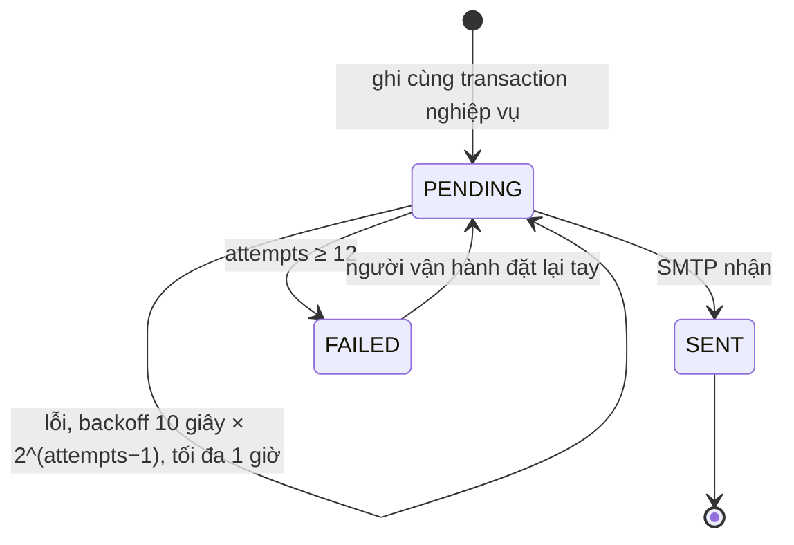

# Mô hình vận hành

> Trạng thái: **Review** · Cập nhật: 2026-10-06 · DOC-15
> Phụ thuộc: SDD gốc §4.2, §5, §8.6, §9.3, §11, [DOC-06](../02-glossary.md), [DOC-07](../03-architecture/system-context-and-containers.md) §4, [DOC-14](domain-model.md), [Sổ quyết định](../00-decision-register.md) (DR-14, 19, 21, 22, 45, 48, 51, 53, 54, 74, 76), [ADR-0006](../04-adr/0006-transactional-outbox-for-email.md), [ADR-0007](../04-adr/0007-magic-link-server-sessions.md)
> Người dùng chính: P1-03 (migration), P1-07 (auth), P2-xx (idempotency, outbox), P3-xx (webhook, cổng giả), [DOC-19](../06-design/auth-and-sessions.md), [DOC-25](../06-design/idempotency.md), [DOC-27](../06-design/tickets-and-notifications.md), [DOC-70](../10-testing/experiments/README.md)

Tài liệu này là nguồn duy nhất của DDL các bảng vận hành: đăng nhập và session, idempotency, webhook đã xử lý, outbox, và hai bảng chỉ có trong một profile (`fake_payment_intent`, `inventory_pool_counter`). Bảng nghiệp vụ (sự kiện, kho vé, đơn, vé) ở [DOC-14](domain-model.md). Thuật toán dùng các bảng này (magic link, relay outbox, xử lý webhook) ở DOC-19, DOC-25, DOC-26, DOC-27; tài liệu này chỉ nói cột, ràng buộc, index, máy trạng thái, payload và quy ước migration.

Quy ước chung (kiểu khóa, `text` + `CHECK`, `timestamptz`) giống [DOC-14](domain-model.md) §1. Quyết định mới khi viết là DR-90…95, tóm tắt ở §10.

## 1. Chủ sở hữu bảng

| Bảng | Module | Profile | Ghi bởi |
| --- | --- | --- | --- |
| `login_token`, `session` | `auth` | mọi profile | `MagicLinkService`, `SessionService` |
| `idempotency_key` | `reservation` | mọi profile | `IdempotencyService` |
| `stripe_event` | `payment` | mọi profile | `WebhookService` |
| `outbox` | `notification` | mọi profile | `NotificationService`, `OutboxRelay` |
| `fake_payment_intent` | `payment` | `fake-payments` | `FakePaymentGateway` |
| `inventory_pool_counter` | `inventory` | `experiment` | `CounterClaimer` |

Nguồn: [DOC-07](../03-architecture/system-context-and-containers.md) §4.1.

## 2. Thứ tự và tệp migration

| Thư mục | Khi nào chạy | Nội dung |
| --- | --- | --- |
| `db/migration` | Luôn | Bảng DOC-14, bảng vận hành §3–§7 |
| `db/migration-fake` | Profile `fake-payments` | `fake_payment_intent` (§8.1) |
| `db/migration-experiment` | Profile `experiment` | `inventory_pool_counter` (§8.2) |

Tệp mẫu của `db/migration`: `V202610060004__ops_tables.sql` chứa mọi khối `sql ddl` của §3–§7. Quy ước đầy đủ ở §9.

## 3. `login_token`

Một dòng cho mỗi lần xin magic link được chấp nhận (lần bị giới hạn không chèn dòng, DR-21). Chỉ lưu SHA-256 của token (NFR-07).

```sql ddl
-- ===== V202610060004__ops_tables.sql =====

CREATE TABLE login_token (
  token_hash    bytea PRIMARY KEY,                -- SHA-256 của token thô 32 byte
  email         text NOT NULL,                    -- đã chuẩn hóa, DR-21
  return_to     text,                             -- đường dẫn tương đối đã kiểm tra, ≤ 512 ký tự
  locale        text NOT NULL,                    -- ngôn ngữ của email và của app_user mới tạo
  requested_ip  inet,
  created_at    timestamptz NOT NULL DEFAULT now(),
  expires_at    timestamptz NOT NULL,             -- created_at + 15 phút
  used_at       timestamptz,                      -- đặt bởi POST /auth/verify
  superseded_at timestamptz                       -- bị thay bởi token mới hơn của cùng email
);
-- Giới hạn gửi theo email: count(*) WHERE email = :e AND created_at > now() - interval '15 minutes'
CREATE INDEX login_token_email_idx   ON login_token (email, created_at DESC);
-- Giới hạn gửi theo IP: count(*) WHERE requested_ip = :ip AND created_at > now() - interval '1 hour'
CREATE INDEX login_token_ip_idx      ON login_token (requested_ip, created_at DESC) WHERE requested_ip IS NOT NULL;
-- RetentionJob: xóa 24 giờ sau expires_at (DR-74)
CREATE INDEX login_token_expires_idx ON login_token (expires_at);
```

Trạng thái suy ra, không lưu:

| Trạng thái | Điều kiện |
| --- | --- |
| Hợp lệ | `used_at IS NULL AND superseded_at IS NULL AND expires_at > now()` |
| Đã dùng | `used_at IS NOT NULL` |
| Bị thay | `superseded_at IS NOT NULL` |
| Hết hạn | `expires_at <= now()` |

Câu chính (DR-21):

```sql
-- Xin link mới, trong cùng transaction với kiểm tra giới hạn
UPDATE login_token SET superseded_at = now()
 WHERE email = :email AND used_at IS NULL AND superseded_at IS NULL;
INSERT INTO login_token (token_hash, email, return_to, locale, requested_ip, expires_at)
VALUES (:h, :email, :ret, :locale, :ip, now() + interval '15 minutes');

-- Tiêu thụ; 0 dòng nghĩa là link đã dùng, hết hạn hoặc bị thay → 401 LOGIN_LINK_INVALID
UPDATE login_token SET used_at = now()
 WHERE token_hash = :h AND used_at IS NULL AND superseded_at IS NULL AND expires_at > now()
RETURNING email, return_to, locale;
```

## 4. `session`

```sql ddl
CREATE TABLE session (
  session_hash  bytea PRIMARY KEY,                -- SHA-256 của session ID thô 32 byte (trong cookie tb_session)
  user_id       uuid NOT NULL REFERENCES app_user,
  csrf_token    text NOT NULL,                    -- 32 byte base64url, DR-22
  created_at    timestamptz NOT NULL DEFAULT now(),
  last_seen_at  timestamptz NOT NULL DEFAULT now(),   -- cập nhật khi cũ hơn 1 giờ
  revoked_at    timestamptz                       -- đăng xuất
);
CREATE INDEX session_user_idx      ON session (user_id);
-- RetentionJob: xóa 7 ngày sau khi hết hạn (last_seen_at + 30 ngày) hoặc bị thu hồi (DR-74)
CREATE INDEX session_last_seen_idx ON session (last_seen_at);
CREATE INDEX session_revoked_idx   ON session (revoked_at) WHERE revoked_at IS NOT NULL;
```

Session hợp lệ: `revoked_at IS NULL AND last_seen_at > now() - interval '30 days'`. Caffeine giữ bản sao 60 giây; đăng xuất xóa mục khỏi bộ đệm (DR-22). Câu cập nhật `last_seen_at`:

```sql
UPDATE session SET last_seen_at = now()
 WHERE session_hash = :h AND last_seen_at < now() - interval '1 hour';
```

## 5. `idempotency_key`

Một dòng cho mỗi lệnh ghi có `Idempotency-Key` (DR-19, DR-45). Dòng key được chèn đầu transaction nghiệp vụ và response được điền trước `COMMIT`, nên một request thứ hai cùng key chờ ở khóa của unique index rồi, sau khi request đầu commit, thấy dòng đã có response và trả lại đúng response đó (`Idempotent-Replayed: true`). Request đầu rollback thì dòng biến mất và request thứ hai chạy như lần đầu.

```sql ddl
CREATE TABLE idempotency_key (
  user_id         uuid NOT NULL,                     -- không có FK: dòng sống ngắn, tránh khóa dòng app_user
  idem_key        uuid NOT NULL,                     -- header Idempotency-Key
  operation       text NOT NULL CHECK (operation IN ('HOLD','CANCEL_HOLD','CONFIRM_FREE')),
  request_hash    bytea NOT NULL,                    -- SHA-256 của body thô, DR-45
  response_status smallint,                          -- điền trước COMMIT; chỉ lưu 2xx
  response_body   jsonb,
  created_at      timestamptz NOT NULL DEFAULT now(),
  PRIMARY KEY (user_id, idem_key)
);
-- RetentionJob: xóa sau 24 giờ (DR-74)
CREATE INDEX idempotency_key_created_idx ON idempotency_key (created_at);
```

```sql
-- Đầu transaction giữ vé
INSERT INTO idempotency_key (user_id, idem_key, operation, request_hash)
VALUES (:u, :k, 'HOLD', :hash)
ON CONFLICT (user_id, idem_key) DO NOTHING;           -- 0 dòng: key đã có
-- Key đã có: đọc dòng; request_hash khác → 422 IDEMPOTENCY_KEY_REUSED (DR-64); trùng → trả response đã lưu
SELECT request_hash, response_status, response_body FROM idempotency_key WHERE user_id = :u AND idem_key = :k;
-- Cuối transaction
UPDATE idempotency_key SET response_status = 200, response_body = :json WHERE user_id = :u AND idem_key = :k;
```

Tạo PaymentIntent không dùng bảng này: idempotent tự nhiên theo `order_id` (khóa Stripe `pi-create:<order_id>`, DR-45, DR-47).

## 6. `stripe_event`

Một dòng cho mỗi event webhook đã xử lý xong. Chèn trong cùng transaction với xử lý (SDD gốc 9.3): chèn trùng nghĩa là đã xử lý, trả 200 ngay; xử lý lỗi thì rollback cả dòng, server trả 5xx và Stripe gửi lại (DR-48).

```sql ddl
CREATE TABLE stripe_event (
  stripe_event_id   text PRIMARY KEY,                -- evt_…
  type              text NOT NULL,                   -- payment_intent.succeeded, payment_intent.payment_failed, …
  payment_intent_id text,
  outcome           text NOT NULL,                   -- CONFIRMED | REFUND_PENDING | FAILURE_RECORDED | IGNORED
  received_at       timestamptz NOT NULL DEFAULT now()
);
CREATE INDEX stripe_event_pi_idx       ON stripe_event (payment_intent_id) WHERE payment_intent_id IS NOT NULL;
-- RetentionJob: xóa sau 30 ngày (DR-74)
CREATE INDEX stripe_event_received_idx ON stripe_event (received_at);
```

| `outcome` | Nghĩa | Từ |
| --- | --- | --- |
| `CONFIRMED` | Transaction xác nhận chạy: đơn `PAID`, vé phát hành | `payment_intent.succeeded`, reservation còn mở |
| `REFUND_PENDING` | Đơn sang chờ hoàn tiền (`LATE_PAYMENT`, `AMOUNT_MISMATCH` hoặc `EVENT_CANCELLED`) | `payment_intent.succeeded` |
| `FAILURE_RECORDED` | Ghi `orders.last_payment_error` | `payment_intent.payment_failed` |
| `IGNORED` | Loại event không quan tâm, hoặc đơn đã ở trạng thái đích | mọi loại khác |

`outcome` là `text` không `CHECK` vì DR-19 để mở tập giá trị cho xử lý webhook (DOC-26); bốn giá trị trên là tập hiện tại. `DR-93` thêm `CHECK` khi DOC-26 chốt.

```sql
INSERT INTO stripe_event (stripe_event_id, type, payment_intent_id, outcome)
VALUES (:evt, :type, :pi, :outcome)
ON CONFLICT (stripe_event_id) DO NOTHING;             -- 0 dòng: đã xử lý, dừng và trả 200
```

(Trong code, `outcome` thật chỉ biết sau khi xử lý nên dòng được chèn bằng `outcome` dự kiến rồi `UPDATE` cuối transaction, hoặc chèn cuối transaction với `ON CONFLICT DO NOTHING` kiểm tra số dòng; DOC-26 chọn cách. Cả hai cùng transaction với phần nghiệp vụ.)

## 7. `outbox`

Chỉ chứa email phát sinh từ nghiệp vụ, ghi cùng transaction với thay đổi tạo ra nó. Magic link gửi trực tiếp (DR-21) và hủy PaymentIntent gọi trực tiếp (DR-53) nên không có dòng outbox (ADR-0006).

```sql ddl
CREATE TABLE outbox (
  outbox_id       uuid PRIMARY KEY DEFAULT uuidv7(),
  kind            text NOT NULL CHECK (kind IN ('EMAIL_TICKETS','EMAIL_EVENT_CHANGED','EMAIL_REFUND_PENDING')),
  payload         jsonb NOT NULL,                    -- đủ dữ liệu dựng email; notification không đọc bảng của module khác
  status          text NOT NULL DEFAULT 'PENDING' CHECK (status IN ('PENDING','SENT','FAILED')),
  attempts        int  NOT NULL DEFAULT 0,
  next_attempt_at timestamptz NOT NULL DEFAULT now(),  -- giờ thử kế tiếp, đồng thời là lease khi đang gửi
  last_error      text,
  created_at      timestamptz NOT NULL DEFAULT now(),
  sent_at         timestamptz
);
-- OutboxRelay: status = 'PENDING' AND next_attempt_at <= now() ORDER BY next_attempt_at LIMIT 50
CREATE INDEX outbox_due_idx  ON outbox (next_attempt_at) WHERE status = 'PENDING';
-- RetentionJob: SENT giữ 7 ngày từ sent_at, FAILED giữ 30 ngày từ created_at (DR-74)
CREATE INDEX outbox_done_idx ON outbox ((COALESCE(sent_at, created_at))) WHERE status <> 'PENDING';
```

### 7.1 Máy trạng thái



| Từ | Sang | Bởi | Câu | Ghi chú |
| --- | --- | --- | --- | --- |
| — | `PENDING` | `NotificationService.enqueue` | `INSERT` | Cùng transaction với thay đổi nghiệp vụ (DR-53) |
| `PENDING` | `PENDING` (claim) | `OutboxRelay`, mỗi 1 giây | `attempts = attempts + 1, next_attempt_at = now() + interval '60 seconds'` | **Lease**: đặt giờ thử kế tiếp 60 giây sau để replica khác không lấy dòng đang gửi |
| `PENDING` | `SENT` | `OutboxRelay` | `status = 'SENT', sent_at = now()` | Gửi xong ngoài transaction |
| `PENDING` | `PENDING` (lỗi) | `OutboxRelay` | `next_attempt_at = now() + least(10 s × 2^(attempts−1), 1 giờ), last_error = :e` | Backoff |
| `PENDING` | `FAILED` | `OutboxRelay` | `attempts >= 12` | Log ERROR; không thử nữa |
| `FAILED` | `PENDING` | Người vận hành | `UPDATE outbox SET status = 'PENDING', attempts = 0, next_attempt_at = now() WHERE outbox_id = :id` | Cho phép sửa tay; không có giao diện (`DR-93`) |

Câu claim (DR-53):

```sql
UPDATE outbox
   SET attempts = attempts + 1, next_attempt_at = now() + interval '60 seconds'
 WHERE outbox_id IN (
   SELECT outbox_id FROM outbox
    WHERE status = 'PENDING' AND next_attempt_at <= now()
    ORDER BY next_attempt_at LIMIT 50
    FOR UPDATE SKIP LOCKED)
RETURNING outbox_id, kind, payload, attempts;
```

Giao ít nhất một lần; `Message-ID` cố định `<outbox_id@APP_DOMAIN>` để hộp thư gộp bản trùng (DR-53).

### 7.2 Payload mẫu

Mọi payload tự đủ để dựng email (DR-54: Thymeleaf, `MessageSource` theo `locale`): `notification` không gọi module khác lúc gửi (DOC-07 §4). Thời điểm là UTC ISO 8601, tiền là số nguyên đồng; relay định dạng theo `locale` và `timezone` của event (DR-12). Địa chỉ email nằm trong payload (DR-74 nêu rõ) và bị xóa cùng dòng khi `RetentionJob` chạy.

**`EMAIL_TICKETS`**, ghi trong transaction xác nhận (DOC-26):

```json
{
  "orderId": "0199f3c2-7a10-7c4e-9b2a-3d6f1e8a5b01",
  "to": "an.nguyen@example.com",
  "locale": "vi",
  "event": {
    "eventId": "0199f3a0-1c22-7d10-8e55-0a9c4b7e2f10",
    "name": "Hòa nhạc Giao Mùa",
    "venue": "Nhà hát Thành phố, 7 Công trường Lam Sơn",
    "startsAt": "2026-11-14T13:00:00Z",
    "timezone": "Asia/Ho_Chi_Minh"
  },
  "amount": 1500000,
  "currency": "VND",
  "tickets": [
    { "code": "GM-4K7P-92XD", "ticketTypeName": "VIP", "unitPrice": 750000,
      "label": { "section": "Khán đài A", "row": "C", "seat": "9" } },
    { "code": "GM-8H3N-Q0TR", "ticketTypeName": "VIP", "unitPrice": 750000,
      "label": { "section": "Khán đài A", "row": "C", "seat": "10" } }
  ],
  "ordersPath": "/me/tickets"
}
```

**`EMAIL_EVENT_CHANGED`**, một dòng cho mỗi đơn `PAID` trong transaction `PATCH` (DR-29):

```json
{
  "orderId": "0199f3c2-7a10-7c4e-9b2a-3d6f1e8a5b01",
  "to": "an.nguyen@example.com",
  "locale": "vi",
  "event": { "eventId": "0199f3a0-1c22-7d10-8e55-0a9c4b7e2f10", "name": "Hòa nhạc Giao Mùa", "timezone": "Asia/Ho_Chi_Minh" },
  "before": { "startsAt": "2026-11-14T13:00:00Z", "endsAt": "2026-11-14T16:00:00Z", "venue": "Nhà hát Thành phố" },
  "after":  { "startsAt": "2026-11-21T13:00:00Z", "endsAt": "2026-11-21T16:00:00Z", "venue": "Nhà hát Thành phố" },
  "changed": ["startsAt", "endsAt"],
  "organizerContactEmail": "lienhe@giaomua.example.com",
  "tickets": [
    { "code": "GM-4K7P-92XD", "ticketTypeName": "VIP", "label": { "section": "Khán đài A", "row": "C", "seat": "9" } }
  ]
}
```

`changed` lấy từ khóa khác nhau giữa `before` và `after` (`startsAt`, `endsAt`, `venue`) để chọn biến thể mẫu "đổi giờ", "đổi địa điểm", "cả hai" (canvas 07c).

**`EMAIL_REFUND_PENDING`**, ghi khi đơn sang `REFUND_PENDING` (DR-44; DR-28 bước 6 một dòng cho mỗi đơn `PAID`):

```json
{
  "orderId": "0199f3d9-0b6e-7f21-a1c4-52e7d9c04a33",
  "to": "binh.tran@example.com",
  "locale": "en",
  "refundReason": "LATE_PAYMENT",
  "amount": 750000,
  "currency": "VND",
  "event": { "eventId": "0199f3a0-1c22-7d10-8e55-0a9c4b7e2f10", "name": "Giao Mua Concert", "startsAt": "2026-11-14T13:00:00Z", "timezone": "Asia/Ho_Chi_Minh" }
}
```

`refundReason` là một trong `LATE_PAYMENT`, `AMOUNT_MISMATCH`, `EVENT_CANCELLED` và chọn đoạn văn của mẫu `refund-pending`. Địa chỉ hỗ trợ và thời hạn hoàn tiền lấy từ cấu hình `support.email`, `support.refund-sla-text` khi dựng (DR-44), không nằm trong payload.

**Email magic link** (`magic-link`) là mẫu thứ tư của DR-54 nhưng **không có dòng outbox**: dữ liệu (`to`, `locale`, token thô, `APP_BASE_URL`) chỉ nằm trong bộ nhớ của request `POST /auth/magic-link` và đi thẳng tới SMTP (DR-21). Master plan §3.2 nêu "4 loại outbox"; DR-21 và DR-19 giảm còn 3 loại và tài liệu này theo DR (ghi ⚠ ở §10).

## 8. Bảng của profile

### 8.1 `fake_payment_intent` (profile `fake-payments`)

Giả lập đối tượng PaymentIntent của Stripe cho test và thực nghiệm (DR-51). Chỉ có khi `db/migration-fake` được nạp; API từ chối khởi động nếu `fake-payments` bật cùng khóa `sk_live_…`.

```sql ddl
-- ===== db/migration-fake/V202610060005__fake_payment_intent.sql =====
CREATE TABLE fake_payment_intent (
  payment_intent_id text PRIMARY KEY,                -- 'pi_fake_' + UUID
  order_id          uuid NOT NULL,                   -- không có FK: bảng ngoài schema chuẩn, bỏ ràng buộc để dọn dễ
  amount            bigint NOT NULL CHECK (amount >= 0),
  currency          text NOT NULL DEFAULT 'vnd',
  status            text NOT NULL DEFAULT 'requires_payment_method'
                    CHECK (status IN ('requires_payment_method','requires_confirmation','requires_action','processing','succeeded','canceled')),
  client_secret     text NOT NULL,                   -- 'pi_fake_…_secret_…'
  metadata          jsonb NOT NULL DEFAULT '{}'::jsonb,   -- { order_id, reservation_id, event_id }
  idempotency_key   text UNIQUE,                     -- 'pi-create:<order_id>', giống khóa gọi Stripe thật
  cancel_failure    text CHECK (cancel_failure IN ('TIMEOUT','ERROR')),  -- bơm lỗi hủy: lần hủy kế tiếp thất bại
  created_at        timestamptz NOT NULL DEFAULT now(),
  updated_at        timestamptz NOT NULL DEFAULT now()
);
CREATE INDEX fake_payment_intent_order_idx ON fake_payment_intent (order_id);
```

| Cột | Dùng để |
| --- | --- |
| `status` | Mô phỏng vòng đời PaymentIntent: `canceled` là cuối; `succeeded` thì hủy trả lỗi như Stripe (`payment_intent_unexpected_state`) |
| `cancel_failure` | Endpoint điều khiển `/fake-payments/intents/{id}/…` bơm lỗi hủy để EXP-06, EXP-08 thử nhánh "hủy lỗi, lease hết hạn" |
| `idempotency_key` | `createIntent` gọi hai lần cùng `order_id` trả cùng một dòng |

### 8.2 `inventory_pool_counter` (profile `experiment`)

Phương án A của SDD gốc 10.3: bộ đếm cho mỗi pool, nơi cố ý tồn tại hot row để EXP-10 so với một dòng mỗi vé (DR-76). Chỉ `CounterClaimer` đọc và ghi.

```sql ddl
-- ===== db/migration-experiment/V202610060006__inventory_pool_counter.sql =====
CREATE TABLE inventory_pool_counter (
  pool_id    uuid PRIMARY KEY REFERENCES inventory_pool,
  available  int NOT NULL CHECK (available >= 0),   -- CHECK ngăn bán vượt ở phương án A
  held       int NOT NULL DEFAULT 0 CHECK (held >= 0),
  sold       int NOT NULL DEFAULT 0 CHECK (sold >= 0),
  updated_at timestamptz NOT NULL DEFAULT now()
);
```

Khởi tạo khi xuất bản trong profile `experiment` (một dòng cho mỗi pool, `available = capacity`):

```sql
INSERT INTO inventory_pool_counter (pool_id, available)
SELECT pool_id, capacity FROM inventory_pool WHERE event_id = :event AND removed_at IS NULL;
```

Claim của `CounterClaimer`: `UPDATE inventory_pool_counter SET available = available - :qty, held = held + :qty WHERE pool_id = :p AND available >= :qty`; số dòng 0 nghĩa là không đủ. Trả vé và xác nhận cộng trừ ngược lại. Invariant checker ở profile này đối chiếu `available + held + sold = capacity` (DOC-30, DOC-80).

## 9. Quy ước migration

| Quy tắc | Nội dung | Nguồn |
| --- | --- | --- |
| Tên tệp | `V<yyyymmddHHmm>__<snake_case>.sql`; một thay đổi đáng kể một tệp; không sửa tệp đã merge | DR-07, DOC-12 |
| Số phiên bản | Duy nhất trên mọi thư mục `db/migration*` vì Flyway gộp chúng thành một dãy | Flyway |
| Thư mục theo profile | `spring.flyway.locations` mặc định `classpath:db/migration`; profile `fake-payments` thêm `classpath:db/migration-fake`; profile `experiment` thêm `classpath:db/migration-experiment` | DR-51, DR-76 |
| Bật profile sau khi các bản kia đã chạy | Phiên bản của tệp profile thấp hơn bản đã áp dụng → cần `spring.flyway.out-of-order=true` | `DR-94` |
| Tắt profile sau khi đã áp dụng | Flyway báo "applied migration not resolved locally" → cần `spring.flyway.ignore-migration-patterns=*:missing` | `DR-94` |
| Nội dung tệp | Chỉ DDL, không dữ liệu nghiệp vụ; dữ liệu mẫu ở `db/seed` (DOC-61, DR-78); không `DROP` cột có dữ liệu nếu chưa có bước chuyển | DOC-12 |
| Kiểm tra | Migration chạy sạch trên `postgres:18-alpine` ở `make it` | DOC-12 §checklist |
| Đảo ngược | Không có migration `down`; sửa lỗi bằng migration mới | DR-07 |
| Dọn profile | `make reset` xóa volume `postgres-data` nên mọi bảng profile biến mất cùng dữ liệu | DR-72 |

Dữ liệu cá nhân trong các bảng này: email nằm ở `login_token.email` và payload outbox (cùng `app_user`, `organizer.contact_email` ở DOC-14); không vào log, chỉ `user_id` (DR-22, DR-74).

## 10. Lưu giữ dữ liệu

`RetentionJob` (03:00 `PLATFORM_TIMEZONE`, lô 5.000 dòng, DR-74) dọn các bảng này; mỗi module cung cấp `RetentionContributor` cho bảng của mình (DOC-07 §3).

| Bảng | Điều kiện xóa | Index dùng |
| --- | --- | --- |
| `login_token` | `expires_at < now() - interval '24 hours'` | `login_token_expires_idx` |
| `session` | `last_seen_at < now() - interval '37 days'` (30 ngày hết hạn + 7) hoặc `revoked_at < now() - interval '7 days'` | `session_last_seen_idx`, `session_revoked_idx` |
| `idempotency_key` | `created_at < now() - interval '24 hours'` | `idempotency_key_created_idx` |
| `stripe_event` | `received_at < now() - interval '30 days'` | `stripe_event_received_idx` |
| `outbox` | `status = 'SENT' AND sent_at < now() - interval '7 days'`; `status = 'FAILED' AND created_at < now() - interval '30 days'` | `outbox_done_idx` |

Mẫu một lô:

```sql
DELETE FROM login_token
 WHERE token_hash IN (SELECT token_hash FROM login_token WHERE expires_at < now() - interval '24 hours' LIMIT 5000);
```

## 11. Kiểm thử

Tiền tố `OM-`; chạy ở `make it` (Testcontainers, DOC-69). Các test của logic dùng bảng (verify song song 50 request, SMTP lỗi) thuộc DOC-19; test idempotency thuộc DOC-25. Dưới đây chỉ test của lược đồ và các câu chuẩn.

| ID | Kịch bản | Kỳ vọng |
| --- | --- | --- |
| OM-01 | Chạy migration `db/migration` rồi thêm lần lượt `migration-fake`, `migration-experiment` trên database trống | Không lỗi; có đủ 6 bảng của §1 |
| OM-02 | 50 transaction song song chạy câu tiêu thụ `UPDATE login_token … RETURNING` cùng một `token_hash` | Đúng 1 transaction nhận 1 dòng; 49 nhận 0 dòng |
| OM-03 | Xin link 2 lần cho cùng email, lần 2 chạy câu `superseded_at`; verify token lần 1 | 0 dòng (token lần 1 bị thay); token lần 2 verify được |
| OM-04 | Chèn 4 `login_token` cùng email trong 15 phút rồi chạy `count(*)` giới hạn | Đếm = 4 ≥ 3 → tầng service từ chối; `EXPLAIN` dùng `login_token_email_idx` |
| OM-05 | Hai transaction chèn `idempotency_key` cùng `(user_id, idem_key)`; transaction đầu commit sau | Transaction 2 chờ rồi `ON CONFLICT DO NOTHING` trả 0 dòng; không có hai dòng |
| OM-06 | Transaction chèn `idempotency_key` rồi rollback; chèn lại cùng key | Lần sau thành công, không còn dấu vết lần trước |
| OM-07 | Chèn `stripe_event` cùng `stripe_event_id` hai lần | Lần hai 0 dòng; không lỗi |
| OM-08 | 100 `OutboxRelay` giả chạy câu claim song song trên 200 dòng `PENDING` đến hạn | Mỗi dòng được claim đúng 1 lần ở vòng đầu; tổng `attempts` = 200 |
| OM-09 | Claim một dòng rồi không cập nhật; chạy claim lại sau 61 giây | Dòng được lấy lại, `attempts = 2` |
| OM-10 | `attempts = 12` rồi lỗi | Dòng sang `FAILED`; `outbox_due_idx` không còn chứa dòng |
| OM-11 | Chèn `outbox` với `kind = 'EMAIL_MAGIC_LINK'` | Lỗi `outbox_kind_check` |
| OM-12 | `fake_payment_intent` hai lần `createIntent` cùng `idempotency_key` | Lần hai lỗi `UNIQUE`; code đọc dòng cũ |
| OM-13 | `inventory_pool_counter` trừ quá: `UPDATE … SET available = available - 5 WHERE available >= 5` khi `available = 3` | 0 dòng; `CHECK (available >= 0)` không bị vi phạm |
| OM-14 | `RetentionJob` trên 12.000 `login_token` hết hạn quá 24 giờ | Xóa hết sau 3 lô (5.000, 5.000, 2.000); `EXPLAIN` dùng `login_token_expires_idx` |
| OM-15 | Bật profile `fake-payments` trên database đã áp dụng `db/migration` mới hơn, `out-of-order=true` | Migration fake chạy; `flyway validate` xanh; tắt profile rồi khởi động lại vẫn xanh nhờ `ignore-migration-patterns` |

## 12. Quyết định mới khi viết tài liệu này

Mọi mục đề xuất bên dưới cần gán số DR thật khi gộp vào sổ quyết định; nội dung đầy đủ nằm trong báo cáo của bước viết.

| ID tạm | Nội dung | Trạng thái |
| --- | --- | --- |
| `DR-93` | DDL của `fake_payment_intent` và `inventory_pool_counter`; `outbox.FAILED → PENDING` cho phép đặt lại tay; thêm `CHECK` cho `stripe_event.outcome` khi DOC-26 chốt | Đề xuất |
| `DR-94` | Quy ước Flyway cho thư mục profile: `out-of-order=true`, `ignore-migration-patterns=*:missing` | Đề xuất |
| `DR-95` | Index dọn dữ liệu (`login_token_expires_idx`, `session_last_seen_idx`, `session_revoked_idx`, `stripe_event_received_idx`, `outbox_done_idx`) và `login_token_ip_idx`, `stripe_event_pi_idx` | Đề xuất |
| ⚠ plan §3.2 | "4 loại outbox" của master plan thành 3 loại, theo DR-19 và DR-21 | Ghi chú, cần sửa master plan |

## Câu hỏi còn mở

1. Gán số cho `DR-93…6` (đều nhỏ, dễ đảo ngược, thuộc quyền Claude tự chốt).
2. DOC-26 chọn chèn `stripe_event` đầu hay cuối transaction (§6) và chốt tập `outcome` để thêm `CHECK`.
3. Các test OM-02…15 chưa chạy (cần Testcontainers ở P1-03). DDL đã chạy trên PostgreSQL 18.6 ngày 2026-10-06 cùng DOC-14 (xem [DOC-14](domain-model.md) §9.2).
