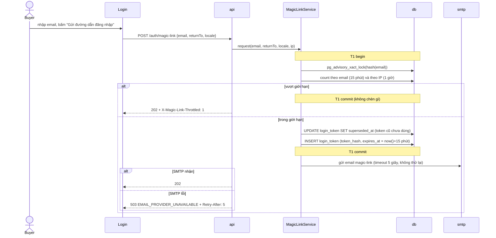
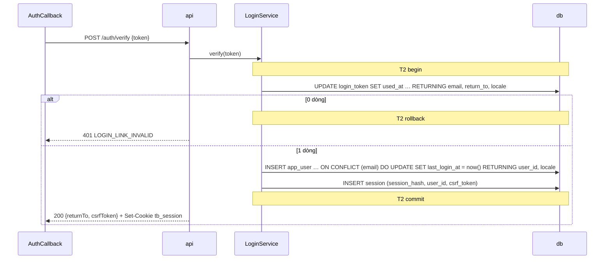

# Xác thực và session

> Trạng thái: **Approved** · Cập nhật: 2026-10-07 · DOC-19
> Phụ thuộc: SDD gốc §5, [Sổ quyết định](../00-decision-register.md) (DR-14, 21, 22, 23, 64, 67), [DOC-06](../02-glossary.md), [DOC-07](../03-architecture/system-context-and-containers.md) §4, [DOC-12](../03-architecture/code-architecture.md) §2–§3, [DOC-14](../05-data/domain-model.md) (`app_user`, `organizer`), [DOC-15](../05-data/ops-model.md) §3–§4 (`login_token`, `session`), [DOC-31](i18n.md), [DOC-35](error-handling.md), [DOC-36](../07-api/api-guidelines.md), [DOC-82](flows/README.md) (FL-01…04), [ADR-0007](../04-adr/0007-magic-link-server-sessions.md)
> Người dùng chính: P1-07 (auth), P1-08 (khung frontend), [DOC-32](security.md), [DOC-37](../07-api/api-endpoints.md), DOC-44 (màn Đăng nhập), DOC-53 (hồ sơ tổ chức), DOC-83 (luồng FL-01…04)

Tài liệu mô tả toàn bộ module `auth`: xin và tiêu thụ magic link, session, CSRF, `return_to`, vai trò và hồ sơ tổ chức. Nó không định nghĩa DDL (DOC-14, DOC-15), bảng endpoint đầy đủ (DOC-37), ma trận endpoint × vai trò và STRIDE (DOC-32), chuỗi giao diện (DOC-40) hay nội dung email (DOC-51). Mọi quyết định mới phát sinh khi viết là DR-96…101 và tóm tắt ở mục 14.

## 1. Tóm tắt thiết kế

| Hạng mục | Quyết định | Nguồn |
| --- | --- | --- |
| Cách đăng nhập duy nhất | Magic link qua email, không mật khẩu | SDD gốc 5, ADR-0007 |
| Token | 32 byte `SecureRandom`, base64url 43 ký tự; DB chỉ lưu SHA-256 | DR-21, NFR-07 |
| Gửi email | Trực tiếp qua SMTP ngay sau commit, không qua outbox; lỗi → 503 | DR-21 |
| Tiêu thụ token | Một câu `UPDATE … RETURNING`; đúng một request thắng | DR-21 |
| Session | Cookie `tb_session` 32 byte; DB lưu SHA-256; cache Caffeine 60 giây | DR-22 |
| CSRF | Synchronizer token trong `session.csrf_token`, header `X-CSRF-Token` | DR-22 |
| Vai trò | `BUYER` mọi tài khoản; `ORGANIZER` khi có dòng `organizer` | DR-23 |
| Sở hữu tài nguyên | Tài nguyên của tổ chức khác trả 404 | DR-23 |

## 2. Thành phần

Module `auth` chỉ phụ thuộc `common` (DOC-12 §2.2). `auth` sở hữu `app_user`, `organizer`, `login_token`, `session` (DOC-07 §4.1).

| Class | Package `io.ticket.auth.…` | Vai trò |
| --- | --- | --- |
| `AuthController` | `controller` | `POST /auth/magic-link`, `POST /auth/verify`, `POST /auth/logout` |
| `MeController` | `controller` | `GET /me`, `PATCH /me` |
| `OrganizerController` | `controller` | `POST /organizer` (các endpoint `/organizer/**` khác thuộc `studio`) |
| `MagicLinkService` | `service` | Xin link: chuẩn hóa, giới hạn, thay token cũ, chèn, gửi email |
| `LoginService` | `service` | Tiêu thụ token, tạo user, tạo session |
| `SessionService` | `service` | Tra session (cache + DB), cập nhật `last_seen_at`, thu hồi |
| `OrganizerService` | `service` | Lập hồ sơ tổ chức |
| `ReturnToSanitizer` | `service` | Kiểm tra `return_to` (mục 6) |
| `LoginTokenRepository`, `SessionRepository` | `repository` | `JdbcClient` / `@Modifying @Query`, không `save()` (DOC-12 §3.1) |
| `AppUserRepository`, `OrganizerRepository` | `repository` | `save()` chỉ để chèn; upsert đăng nhập bằng `@Query` |
| `SessionAuthenticationFilter`, `CsrfFilter` | `security` | Gắn `CurrentUser` vào request, kiểm tra CSRF |
| `AuthApi` | gốc `io.ticket.auth` | Giao diện cho module khác (mục 11) |

Gửi email magic link dùng `common.mail.MailSender` và `common.mail.EmailRenderer` (`DR-96`, mục 14): `auth` không được phụ thuộc `notification` nên phần SMTP và Thymeleaf nằm ở `common` và dùng chung với `OutboxRelay` (DOC-27 §2).

Chuỗi filter (thứ tự): `RequestIdFilter` (đặt `X-Request-Id`, MDC `trace_id`) → `SessionAuthenticationFilter` → `CsrfFilter` → phân quyền. Cấu hình Spring Security tắt `formLogin`, `httpBasic`, CSRF mặc định và `sessionManagement` (stateless); ba filter trên là toàn bộ cơ chế xác thực.

## 3. Xin magic link (FL-01)

### 3.1 Quy tắc

1. **Chuẩn hóa email:** `trim`, chữ thường toàn bộ (`Locale.ROOT`), kiểm tra regex `^[^@\s]+@[^@\s]+\.[^@\s]+$` và độ dài ≤ 254. Không bỏ dấu chấm, không bỏ phần `+tag` (DR-21).
2. **Locale của email:** `locale` trong body nếu là `vi` hoặc `en`; không có thì `Accept-Language` theo thứ tự ở DOC-31 §2; mặc định `vi`.
3. **Địa chỉ IP:** lấy từ header `X-Real-IP` do nginx đặt; `api` không mở cổng ra ngoài ngoài nginx nên header này tin được (`DR-100`). Thiếu header (chạy test, `make dev` không qua nginx) thì dùng `remoteAddr`.
4. **Luôn 202**, trừ email sai định dạng (422) và SMTP lỗi (503). Response không phân biệt email đã có tài khoản hay chưa (FR-01.7).

### 3.2 Trình tự



Nếu tiến trình chết sau T1 commit và trước khi gửi: dòng `login_token` còn đó nhưng không ai có token thô; người dùng không nhận thư, bấm "Gửi lại" và token mới thay token cũ. Không có tác dụng phụ nào khác.

### 3.3 SQL

```sql
-- T1, bước 1: tuần tự hóa các yêu cầu cùng email (DR-97). Khóa tự nhả khi commit.
SELECT pg_advisory_xact_lock(hashtextextended(:email, 0));

-- Bước 2: đếm giới hạn (index login_token_email_idx, login_token_ip_idx, DOC-15 §3)
SELECT count(*) FROM login_token
 WHERE email = :email AND created_at > now() - interval '15 minutes';       -- ≥ 3 → vượt
SELECT count(*) FROM login_token
 WHERE requested_ip = :ip AND created_at > now() - interval '1 hour';       -- ≥ 10 → vượt

-- Bước 3: thay token cũ, chèn token mới
UPDATE login_token SET superseded_at = now()
 WHERE email = :email AND used_at IS NULL AND superseded_at IS NULL;
INSERT INTO login_token (token_hash, email, return_to, locale, requested_ip, expires_at)
VALUES (:hash, :email, :returnTo, :locale, :ip, now() + interval '15 minutes');
```

Lần gửi SMTP lỗi vẫn tính vào giới hạn vì dòng `login_token` đã commit (DR-21).

### 3.4 Request và response

```http
POST /api/v1/auth/magic-link
Content-Type: application/json

{ "email": " Alice@Example.com ", "returnTo": "/checkout/0199f3c2-7a10-7c4e-9b2a-3d6f1e8a5b01", "locale": "vi" }
```

```http
HTTP/1.1 202 Accepted
```

Body rỗng. Biến thể:

| Tình huống | Response |
| --- | --- |
| Vượt giới hạn | `202 Accepted` + `X-Magic-Link-Throttled: 1` |
| Email sai định dạng | `422` `VALIDATION_FAILED`, `errors[0] = {"field":"email","rule":"invalid_email"}` |
| SMTP lỗi hoặc quá 5 giây | `503` `EMAIL_PROVIDER_UNAVAILABLE`, `Retry-After: 5`, `retryAfterSeconds: 5` |
| nginx `auth_ip` (10 r/phút, burst 5) | `429` `RATE_LIMITED` (DOC-62 §nginx; xảy ra trước khi tới `api`) |

### 3.5 Email

Mẫu `magic-link` (DOC-51) nhận model `{ link, expiresInMinutes: 15, appName, locale }`:

```
link = ${APP_BASE_URL}/auth/callback?token=VGhpc0lzQUZha2VUb2tlbkZvckRvY3VtZW50YXRpb25Pbmx5MQ
```

`return_to` **không** nằm trong link: nó lưu ở `login_token.return_to`, nên link không mang dữ liệu nào ngoài token. Token thô chỉ sống trong biến cục bộ của request; không vào log, DB, metric, outbox hay exception message (NFR-07; test AU-01, AU-16). `Message-ID` của magic link là `<random-uuid@APP_DOMAIN>` vì không có `outbox_id`.

## 4. Mở link và nhận session (FL-02)

### 4.1 Callback và verify

Trang `/auth/callback?token=…` là route của SPA (DOC-38 §URL). **Tải trang không gọi gì tiêu thụ token**; bộ quét link của hộp thư chỉ lấy HTML tĩnh (FR-01.9). Component `AuthCallback` chạy ở trình duyệt:

1. Đọc `token` từ `location.search`, xóa nó khỏi URL ngay bằng `history.replaceState` (không để token trong lịch sử trình duyệt).
2. Gọi `POST /auth/verify {"token": "…"}`.
3. 200 → lưu `csrfToken` vào bộ nhớ (không `localStorage`), chuyển tới `returnTo` rồi khôi phục lựa chọn chỗ đã lưu (DR-67).
4. 401 `LOGIN_LINK_INVALID` → màn "Đường dẫn không còn dùng được" với nút "Gửi đường dẫn mới".

Để token không lọt vào log hoặc header `Referer`, nginx phục vụ `/auth/callback` với `Referrer-Policy: no-referrer` và định dạng access log dùng `$uri` thay `$request`/`$request_uri` (`DR-99`; DOC-62 phải khớp).

### 4.2 Transaction verify



```sql
-- Tiêu thụ. 0 dòng = đã dùng, hết hạn hoặc bị thay → 401 (DR-21). Hết hạn thì used_at vẫn NULL (FR-01.3).
UPDATE login_token SET used_at = now()
 WHERE token_hash = :h AND used_at IS NULL AND superseded_at IS NULL AND expires_at > now()
RETURNING email, return_to, locale;

-- Người dùng: tạo ở lần verify đầu (FR-01.7); người đã có giữ nguyên locale của họ (DR-101)
INSERT INTO app_user (email, locale, last_login_at) VALUES (:email, :tokenLocale, now())
ON CONFLICT (email) DO UPDATE SET last_login_at = now()
RETURNING user_id, locale;

INSERT INTO session (session_hash, user_id, csrf_token) VALUES (:sessionHash, :userId, :csrf);
```

Hai bước đầu cùng một transaction nên nếu chèn `session` lỗi thì `used_at` được hoàn lại và link dùng lại được. `token_hash` là khóa chính nên tra bằng index; `used_at IS NULL` trong `WHERE` làm 49 trong 50 request song song nhận 0 dòng (khóa dòng của PostgreSQL buộc request sau chờ commit của request đầu rồi đánh giá lại điều kiện; test AU-02).

Token sai định dạng (không phải 43 ký tự base64url) vẫn được băm và tra như bình thường, kết quả 401 `LOGIN_LINK_INVALID` chứ không phải 422, để một kẻ dò không phân biệt "sai định dạng" với "không tồn tại".

### 4.3 Response

```http
HTTP/1.1 200 OK
Set-Cookie: tb_session=3q2-7wAAAAAAAAAAAAAAAAAAAAAAAAAAAAAAAAAAAAA; Path=/; Max-Age=2592000; HttpOnly; SameSite=Lax; Secure
Content-Type: application/json

{ "returnTo": "/checkout/0199f3c2-7a10-7c4e-9b2a-3d6f1e8a5b01", "csrfToken": "hQmY2cZ0q8wX1sJ4nT6vB9uLrKeD3aGfPoIyUiOpAsM" }
```

Cookie `tb_session` là 32 byte từ `SecureRandom`, base64url (43 ký tự). `Secure` bật theo `auth.cookie-secure` (mặc định `true`; profile `dev` đặt `false` vì Safari không nhận cookie `Secure` trên `http://localhost`, DR-22). `Max-Age` 30 ngày và được cấp lại khi `last_seen_at` được cập nhật (`DR-98`).

## 5. Session

### 5.1 Tra session

`SessionAuthenticationFilter` chạy cho mọi request có cookie `tb_session`:

1. Băm cookie bằng SHA-256 → `sessionHash`.
2. `SessionCache.get(sessionHash)`; trượt thì chạy một truy vấn (index khóa chính):

```sql
SELECT s.user_id, s.csrf_token, s.last_seen_at, u.locale, o.organizer_id
  FROM session s
  JOIN app_user u ON u.user_id = s.user_id
  LEFT JOIN organizer o ON o.owner_user_id = s.user_id
 WHERE s.session_hash = :h
   AND s.revoked_at IS NULL
   AND s.last_seen_at > now() - interval '30 days';
```

3. Có dòng → nạp cache; không có dòng → bỏ qua, request đi tiếp như khách và `401 UNAUTHENTICATED` nếu endpoint cần đăng nhập. Cookie không còn hợp lệ được xóa bằng `Set-Cookie: tb_session=; Max-Age=0`.
4. Gắn `CurrentUser(userId, sessionHash, locale, organizerId | null, csrfToken)` vào request (`io.ticket.common.security.CurrentUser`, DOC-12 §2).
5. **Cập nhật `last_seen_at` theo giờ:** nếu `lastSeenAt` trong mục cache cũ hơn 1 giờ thì chạy

```sql
UPDATE session SET last_seen_at = now()
 WHERE session_hash = :h AND last_seen_at < now() - interval '1 hour';
```

   rồi cập nhật cache và cấp lại cookie với `Max-Age` đủ 30 ngày. Dưới 1 giờ không ghi gì xuống DB (DR-22), nên request thông thường là một lần tra cache không chạm DB.

### 5.2 Cache Caffeine

| Thuộc tính | Giá trị | Key cấu hình |
| --- | --- | --- |
| Khóa | `sessionHash` (32 byte, bọc `ByteBuffer`) | — |
| Giá trị | `SessionEntry(userId, csrfToken, locale, organizerId, lastSeenAt)` | — |
| TTL sau khi ghi | 60 giây | `auth.session.cache-ttl` |
| Kích thước tối đa | 200.000 mục | `auth.session.cache-max-size` |
| Số bản sao | Một, trong tiến trình `api` (SDD gốc 14.1) | — |

Chỉ cache các lần tra thành công; không cache "không tìm thấy" (tránh kẻ gửi cookie ngẫu nhiên làm đầy cache và tránh trễ khi session vừa tạo).

Vô hiệu cache:

| Sự kiện | Hành động trên cache |
| --- | --- |
| Đăng xuất | Xóa mục của session đó ngay, trước khi trả response |
| `POST /organizer` thành công | Làm mới mục của session hiện tại (có `organizerId`) |
| `PATCH /me` đổi `locale` | Làm mới mục của session hiện tại |
| Hết TTL | Mục tự rơi; lần sau tra DB |

Các session khác của cùng người dùng nhìn thấy `organizerId` hoặc `locale` mới trong tối đa 60 giây. Chấp nhận được: mỗi người ít khi dùng hai trình duyệt đồng thời ngay lúc lập hồ sơ, và đường bảo vệ thật (`organizer_id` trong mọi câu SQL) vẫn đọc từ session đã làm mới khi hết TTL.

### 5.3 Hết hạn và đăng xuất (FL-03)

Session hợp lệ khi `revoked_at IS NULL AND last_seen_at > now() - interval '30 days'` (DR-22). Hết hạn chỉ là điều kiện đọc; `RetentionJob` xóa dòng 7 ngày sau (DOC-15 §10).

```sql
-- POST /auth/logout (cần session và X-CSRF-Token)
UPDATE session SET revoked_at = now() WHERE session_hash = :h AND revoked_at IS NULL;
```

Sau câu này service xóa mục cache rồi trả `204` kèm `Set-Cookie: tb_session=; Path=/; Max-Age=0; HttpOnly; SameSite=Lax; Secure`. Vì chỉ có một bản sao `api` và cache bị xóa đồng bộ, request kế tiếp nhận `401 UNAUTHENTICATED` trong ≤ 1 giây (FR-01.12, test AU-12). Đăng xuất chỉ thu hồi session hiện tại; không có "đăng xuất mọi thiết bị" ở giai đoạn này.

Client nhận 401 `UNAUTHENTICATED` ở bất kỳ request nào thì lưu lựa chọn và chuyển tới màn hết phiên (DOC-35 §6).

## 6. `return_to`

`ReturnToSanitizer.sanitize(String)` áp dụng **hai lần**: khi xin link (giá trị lưu vào `login_token.return_to`) và khi trả `returnTo` ở verify (phòng dữ liệu cũ).

Chấp nhận khi: không null, bắt đầu bằng `/`, không bắt đầu bằng `//` hoặc `/\`, dài ≤ 512, không chứa ký tự điều khiển (`< 0x20`, `0x7F`). Ngược lại trả `/` (DR-21).

| Đầu vào | Kết quả |
| --- | --- |
| `/checkout/0199f3c2-7a10-7c4e-9b2a-3d6f1e8a5b01` | giữ nguyên |
| `/events/0199f3a0?tab=map` | giữ nguyên |
| `//evil.example` | `/` |
| `/\evil.example` | `/` |
| `https://evil.example/x` | `/` |
| chuỗi 513 ký tự bắt đầu bằng `/` | `/` |
| `null` hoặc rỗng | `/` |
| `/a%0d%0aSet-Cookie:x` | `/` (sau khi giải mã có ký tự điều khiển) |

Trình duyệt nào mở link thì trình duyệt đó có session; trình duyệt đã xin link không tự đăng nhập (không có đăng nhập chéo thiết bị, DR-21). Lựa chọn chỗ đã lưu ở `localStorage` của trình duyệt xin link nên không xuất hiện ở thiết bị khác; DOC-38 mô tả cách giao diện báo trường hợp này.

## 7. CSRF

- `session.csrf_token` sinh lúc tạo session (32 byte, base64url). Trả trong body `POST /auth/verify` và `GET /me`.
- Client lưu ở bộ nhớ và gửi lại trong header `X-CSRF-Token` cho mọi `POST`, `PUT`, `PATCH`, `DELETE`.
- `CsrfFilter` so sánh bằng `MessageDigest.isEqual` (hằng thời gian) với `csrfToken` của session trong request.
- **Miễn CSRF:** `POST /api/v1/webhooks/stripe` (xác thực bằng chữ ký), `POST /auth/magic-link`, `POST /auth/verify` (chưa có session) (DR-22). Không có miễn trừ nào khác.
- Thiếu hoặc sai token khi đã có session → `403 CSRF_TOKEN_INVALID` (DOC-35; FR-01.11 viết `FORBIDDEN`, cần sửa theo DOC-35, mục 13). Client gọi `GET /me` lấy token mới và thử lại đúng một lần (DOC-35 §6). Request không có session mà cần đăng nhập thì `401 UNAUTHENTICATED` (kiểm tra session đi trước CSRF).
- `SameSite=Lax` là lớp phòng thủ thứ hai; không có CORS (cùng origin, DOC-32).

## 8. Vai trò và hồ sơ tổ chức

### 8.1 Mô hình

| Vai trò | Có khi | Lưu |
| --- | --- | --- |
| `BUYER` | Mọi tài khoản đã đăng nhập | Không lưu |
| `ORGANIZER` | Có dòng `organizer` với `owner_user_id = user_id` | Không lưu cột riêng (DR-23) |

Một tài khoản có tối đa một tổ chức; một tổ chức có đúng một chủ (`organizer.owner_user_id UNIQUE`). Không có `ADMIN` (SDD gốc 5.3). `roles` trong `GET /me` suy ra từ `organizerId != null`.

### 8.2 `GET /me` và `PATCH /me`

```json
{
  "userId": "0199f3b8-5d14-7a30-8c91-6e2b0f4d7a12",
  "email": "alice@example.com",
  "locale": "vi",
  "roles": ["BUYER", "ORGANIZER"],
  "organizer": { "organizerId": "0199f3b9-0c47-7e12-9f03-1a8d5c6b2e44", "name": "Nhà hát Bến Sông" },
  "csrfToken": "hQmY2cZ0q8wX1sJ4nT6vB9uLrKeD3aGfPoIyUiOpAsM",
  "serverTime": "2026-11-14T12:00:00.250Z"
}
```

Người chưa có hồ sơ: `"roles": ["BUYER"]`, `"organizer": null`. Chưa đăng nhập: `401 UNAUTHENTICATED` (SPA dùng nó để biết là khách). `serverTime` phục vụ đồng hồ đếm ngược (DR-66).

`PATCH /me {"locale":"en"}` chạy `UPDATE app_user SET locale = :l WHERE user_id = :u`; giá trị ngoài `vi`/`en` → 422 `VALIDATION_FAILED` `rule = invalid_locale` (DOC-31); trả `GET /me` mới. Email và Problem Details sau đó theo locale mới (FL-04).

### 8.3 `POST /organizer`

```http
POST /api/v1/organizer
X-CSRF-Token: hQmY2cZ0q8wX1sJ4nT6vB9uLrKeD3aGfPoIyUiOpAsM
Content-Type: application/json

{ "name": "Nhà hát Bến Sông", "contactEmail": null }
```

```http
HTTP/1.1 201 Created
Location: /api/v1/organizer

{ "organizerId": "0199f3b9-0c47-7e12-9f03-1a8d5c6b2e44", "name": "Nhà hát Bến Sông", "contactEmail": null }
```

| Trường | Quy tắc | Lỗi |
| --- | --- | --- |
| `name` | `trim`, 1–120 ký tự | 422 `VALIDATION_FAILED` (`rule = required` / `too_long`) |
| `contactEmail` | Không bắt buộc; có thì chuẩn hóa và kiểm tra như email đăng nhập (mục 3.1); `null` hoặc rỗng nghĩa là dùng email đăng nhập | 422 `rule = invalid_email` |
| Đã có hồ sơ | `INSERT` vi phạm `organizer_owner_user_id_key` | 409 `ORGANIZER_EXISTS` |

Sau khi chèn, service làm mới cache session (mục 5.2). Không cần đăng nhập lại.

### 8.4 Kiểm tra sở hữu

- Mọi endpoint `/organizer/**` lấy `organizerId` từ `CurrentUser`, không nhận từ client (DR-23).
- `CurrentUser.requireOrganizer()` ném `OrganizerProfileRequiredException` khi `organizerId == null` → `403 ORGANIZER_PROFILE_REQUIRED` (FR-13.3); giao diện chuyển tới màn Lập hồ sơ.
- Truy vấn tài nguyên luôn có `AND organizer_id = :organizerId` (hoặc join tương đương); không thấy dòng thì `404 NOT_FOUND`, không phân biệt "không tồn tại" với "của tổ chức khác" (BR-12). Màn E3 hiển thị cho cả `403 ORGANIZER_PROFILE_REQUIRED` lẫn trường hợp tài khoản đã có hồ sơ mở sự kiện của tổ chức khác.
- Việc kiểm tra này nằm ở từng repository của module sở hữu tài nguyên; test ma trận ở DOC-32 (`SEC-…`).

## 9. Lỗi của module

Mã và nguồn ở DOC-35 §3; bảng dưới chỉ gom những mã `auth` ném ra.

| Mã | HTTP | Khi nào | Người dùng thấy |
| --- | --- | --- | --- |
| `VALIDATION_FAILED` (`invalid_email`, `invalid_locale`, `required`, `too_long`) | 422 | Email sai định dạng, locale lạ, tên tổ chức sai | Lỗi ngay ô nhập |
| `LOGIN_LINK_INVALID` | 401 | Token đã dùng, hết hạn, bị thay, không tồn tại, sai định dạng | Màn "Đường dẫn không còn dùng được" |
| `UNAUTHENTICATED` | 401 | Không có session hợp lệ | Màn hết phiên hoặc chuyển tới `/login?returnTo=` |
| `CSRF_TOKEN_INVALID` | 403 | Thiếu hoặc sai `X-CSRF-Token` | Không hiện; client tự lấy token mới và thử lại một lần |
| `ORGANIZER_PROFILE_REQUIRED` | 403 | `/organizer/**` khi chưa có hồ sơ | Chuyển tới màn Lập hồ sơ |
| `ORGANIZER_EXISTS` | 409 | `POST /organizer` lần hai | Chuyển tới Studio |
| `EMAIL_PROVIDER_UNAVAILABLE` | 503 | SMTP lỗi khi gửi magic link | "Chưa gửi được email, thử lại" + nút "Gửi lại" |
| `RATE_LIMITED` | 429 | nginx `auth_ip` | "Bạn thao tác quá nhanh…" |

Lớp ngoại lệ: `UnauthenticatedException`, `ForbiddenException` và `ProviderUnavailableException` theo cây ở DOC-35 §2. DOC-35 ghi module của `UnauthenticatedException` là `identity`; tên module thực tế là `auth` theo DOC-12 (cần sửa ở DOC-35, mục 13).

## 10. Đồng thời và sự cố

| Tình huống | Điều xảy ra | Bảo đảm |
| --- | --- | --- |
| 50 `POST /auth/verify` song song cùng token | Một request đánh dấu `used_at`; 49 request chờ khóa dòng rồi thấy `used_at IS NOT NULL`, nhận 0 dòng | Đúng một session được tạo (AU-02) |
| Xin link A rồi link B, mở A | A có `superseded_at` → 0 dòng → 401 | Chỉ link mới nhất hợp lệ (AU-04) |
| 10 yêu cầu song song cùng email, đã có 0 token | `pg_advisory_xact_lock` tuần tự hóa; 3 yêu cầu đầu chèn, 7 sau thấy đã đủ 3 và nhận 202 kèm `X-Magic-Link-Throttled` | Không vượt 3 token mỗi 15 phút (AU-18) |
| Chết sau T1 commit, trước khi gửi SMTP | Token tồn tại, người dùng không nhận thư | Người dùng bấm "Gửi lại"; token cũ bị thay |
| Chết sau T2 commit, trước khi response tới trình duyệt | Session đã tạo nhưng cookie không tới; `used_at` đã đặt | Mở lại link → 401 `LOGIN_LINK_INVALID`; xin link mới |
| Hai trình duyệt mở cùng link gần như đồng thời | Một thắng, một thấy 401 | Giống 50 request song song |
| Hai request đầu tiên của cùng session khi cache trống | Cả hai chạy truy vấn tra; kết quả giống nhau | Vô hại (đọc) |
| Hai request cùng chạy `UPDATE session SET last_seen_at` | Điều kiện `last_seen_at < now() - 1 giờ` làm request sau 0 dòng | Một lần ghi mỗi giờ |
| Khởi động lại `api` | Cache mất; session vẫn ở DB | Không ai bị đăng xuất |
| SMTP chập chờn | 503 cho request đó; không có dữ liệu treo | Người dùng tự bấm "Gửi lại" |

## 11. `AuthApi` cho module khác

Giao diện ở package gốc `io.ticket.auth` (DOC-12 §2.2). `payment` và `studio` cần địa chỉ người nhận để dựng payload outbox mà không đọc bảng của `auth` (DOC-27 §7, `DR-102`).

```java
package io.ticket.auth;

public interface AuthApi {

  /** Email và locale hiện tại của các người dùng; user không tồn tại bị bỏ qua. */
  Map<UUID, Recipient> recipientsOf(Collection<UUID> userIds);

  /** Email liên hệ của tổ chức: contact_email, nếu NULL thì email của chủ tổ chức. */
  String organizerContactEmail(UUID organizerId);

  record Recipient(UUID userId, String email, String locale) {}
}
```

## 12. Cấu hình, metric, log

### 12.1 Khóa cấu hình (nguồn: DOC-34)

| Khóa | Kiểu | Mặc định | Biến môi trường | Profile | Mô tả |
| --- | --- | --- | --- | --- | --- |
| `auth.cookie-secure` | bool | `true` | `AUTH_COOKIE_SECURE` | `dev` đặt `false` | Cờ `Secure` của cookie `tb_session` (DR-22) |
| `auth.session.idle-timeout` | duration | `P30D` | — | mọi profile | Không hoạt động quá mức này thì session hết hạn |
| `auth.session.touch-interval` | duration | `PT1H` | — | mọi profile | Chỉ cập nhật `last_seen_at` khi cũ hơn mức này |
| `auth.session.cache-ttl` | duration | `PT60S` | — | mọi profile | TTL cache Caffeine |
| `auth.session.cache-max-size` | int | `200000` | — | mọi profile | Số mục tối đa của cache |
| `auth.magic-link.ttl` | duration | `PT15M` | — | mọi profile | Thời hạn token |
| `auth.magic-link.email-limit` | int | `3` | — | mọi profile | Số link tối đa mỗi email trong cửa sổ |
| `auth.magic-link.email-window` | duration | `PT15M` | — | mọi profile | Cửa sổ giới hạn theo email |
| `auth.magic-link.ip-limit` | int | `10` | — | mọi profile | Số link tối đa mỗi IP trong cửa sổ |
| `auth.magic-link.ip-window` | duration | `PT1H` | — | mọi profile | Cửa sổ giới hạn theo IP |
| `mail.smtp.timeout` | duration | `PT5S` | `MAIL_SMTP_TIMEOUT` | mọi profile | Timeout kết nối và đọc SMTP; dùng cho magic link và `OutboxRelay` |
| `app.base-url` | string | `http://localhost:8080` | `APP_BASE_URL` | mọi profile | Gốc của link trong email (DR-54) |
| `app.name` | string | `ticket` | `APP_NAME` | mọi profile | Tên sản phẩm trong `From` và tiêu đề email (DR-54) |
| `app.domain` | string | `ticket.localhost` | `APP_DOMAIN` | mọi profile | Phần sau `@` của `Message-ID` |
| `mail.from` | string | `ticket <no-reply@ticket.localhost>` | `MAIL_FROM` | mọi profile | Người gửi (DR-54) |

`auth.cookie-secure` đã có ở DR-22; các khóa còn lại là mới, giá trị mặc định lấy từ DR-21, DR-22.

### 12.2 Metric (nguồn: DOC-33)

| Tên | Kiểu | Label | Nơi phát | Ý nghĩa |
| --- | --- | --- | --- | --- |
| `ticket_auth_magic_link_requests_total` | counter | `result` = `sent`, `throttled`, `smtp_failed`, `invalid` | `MagicLinkService` | Mỗi yêu cầu xin link |
| `ticket_auth_verify_total` | counter | `result` = `ok`, `invalid` | `LoginService` | Mỗi lần verify |
| `ticket_session_lookups_total` | counter | `source` = `cache`, `db`, `miss` | `SessionService` | Tỉ lệ trúng cache và session không hợp lệ |

### 12.3 Log

Không log email, token thô, cookie, `csrf_token`. Log dùng `user_id` (DR-22). Sự kiện log: `magic_link.requested` (INFO, có `result`, không có email), `magic_link.smtp_failed` (WARN, có tên exception, không có địa chỉ), `login.verified` (INFO, `user_id`), `login.invalid` (INFO), `session.revoked` (INFO). Lỗi `LOGIN_LINK_INVALID` lặp lại nhiều từ một IP là tín hiệu dò, mức WARN theo DOC-35 §5.2.

## 13. Test bắt buộc

Tiền tố `AU-`; chạy ở `make it` (Testcontainers PostgreSQL, Mailpit hoặc `GreenMail`; DOC-69). Số `AU-01…15` do DOC-03 ấn định và không đổi.

| ID | Kịch bản | Kỳ vọng |
| --- | --- | --- |
| AU-01 | `POST /auth/magic-link` với email ` Alice@Example.com ` | 202; `login_token.email = 'alice@example.com'`; 1 dòng có `expires_at = now() + 15 phút` và `token_hash` dài 32 byte; Mailpit nhận 1 thư; không cột nào của bảng nào chứa chuỗi token thô lấy từ thư |
| AU-02 | Một token hợp lệ, **50 `POST /auth/verify` song song** | Đúng 1 response 200 kèm `Set-Cookie: tb_session`; 49 response 401 `LOGIN_LINK_INVALID`; đúng 1 dòng `session` mới |
| AU-03 | Token tạo 03:00:00 (giờ giả lập), verify lúc 03:15:01 | 401 `LOGIN_LINK_INVALID`; `used_at` vẫn NULL |
| AU-04 | Xin link A rồi link B cho cùng email; verify A rồi verify B | A: 401 `LOGIN_LINK_INVALID`; B: 200; dòng của A có `superseded_at` |
| AU-05 | Đã có 3 token của một email trong 15 phút; yêu cầu lần 4. Riêng: IP đã có 10 token trong 60 phút, email mới | Cả hai: 202 kèm `X-Magic-Link-Throttled: 1`; không chèn `login_token`; Mailpit không có thư mới |
| AU-06 | SMTP tắt; `POST /auth/magic-link` | 503 `EMAIL_PROVIDER_UNAVAILABLE` sau ≤ 5 giây; `Retry-After: 5`; **bảng `outbox` không có dòng nào**; lần gửi vẫn tính vào giới hạn (dòng `login_token` còn) |
| AU-07 | Email chưa có tài khoản: xin link rồi verify. Song song: email đã có tài khoản | Hai response xin link giống hệt nhau (status, header, body); sau verify có đúng 1 dòng `app_user` cho email mới; email cũ không sinh dòng thứ hai |
| AU-08 | `returnTo` = `/checkout/0199…`, `//evil.example`, `/\evil`, chuỗi 513 ký tự; verify mỗi token | Giá trị đầu giữ nguyên; ba giá trị sau thành `/` |
| AU-09 | `GET /auth/callback?token=…` 5 lần (mô phỏng bộ quét link) | `used_at` vẫn NULL; verify sau đó vẫn 200 |
| AU-10 | Session tạo lúc t; request ở t + 30 ngày + 1 giây; request ở t + 59 phút rồi t + 61 phút | 401 `UNAUTHENTICATED` ở mốc 30 ngày; cookie có `HttpOnly; SameSite=Lax`, có `Secure` khi `auth.cookie-secure=true`; `last_seen_at` không đổi ở t + 59 phút, đổi ở t + 61 phút |
| AU-11 | Session hợp lệ; `POST`, `PUT`, `PATCH`, `DELETE` thiếu rồi sai `X-CSRF-Token` | 403 `CSRF_TOKEN_INVALID` cả hai trường hợp, không có tác dụng phụ; ba endpoint miễn CSRF vẫn chạy khi không có header |
| AU-12 | `POST /auth/logout`; request kế tiếp với cùng cookie | `revoked_at` khác NULL; request kế ≤ 1 giây sau nhận 401 `UNAUTHENTICATED`; response logout có `Max-Age=0` |
| AU-13 | Tài khoản chưa có hồ sơ: `POST /organizer {"name":"Nhà hát Bến Sông"}` rồi `GET /me`; gọi lần hai | 201; `roles = ["BUYER","ORGANIZER"]` và `organizer` có `organizerId`; lần hai 409 `ORGANIZER_EXISTS` |
| AU-14 | `name` rỗng; `name` 121 ký tự; `contactEmail = "abc"`; `contactEmail` trống | Ba trường hợp đầu 422 `VALIDATION_FAILED`; trường hợp cuối 201, `GET /me` trả email liên hệ là email đăng nhập (qua `AuthApi.organizerContactEmail`) |
| AU-15 | Tài khoản chưa có hồ sơ: `GET /organizer/events` | 403 `ORGANIZER_PROFILE_REQUIRED` |
| AU-16 | Chạy toàn bộ luồng xin link và verify, thu log ứng dụng và log nginx | Không dòng log nào chứa email, token thô hay giá trị cookie; log nginx của `/auth/callback` không có query string |
| AU-17 | Đăng nhập, chạy `POST /organizer`, rồi `GET /organizer/events` trong cùng 60 giây | Không 403: cache đã được làm mới sau khi lập hồ sơ |
| AU-18 | 10 `POST /auth/magic-link` song song cùng email chưa có token | Đúng 3 dòng `login_token`; 7 response có `X-Magic-Link-Throttled: 1`; 10 response đều 202 |
| AU-19 | `POST /auth/verify` với token 10 ký tự, token 43 ký tự không tồn tại, body thiếu `token` | Hai trường hợp đầu 401 `LOGIN_LINK_INVALID` (cùng body); trường hợp thứ ba 422 `VALIDATION_FAILED` |
| AU-20 | `GET /me` khi chưa đăng nhập; đăng nhập rồi `GET /me`; `PATCH /me {"locale":"en"}`; `PATCH /me {"locale":"fr"}` | 401; 200 đủ trường như mục 8.2; 200 với `locale = "en"` và email magic link kế tiếp bằng `en`; 422 `rule = invalid_locale` |
| AU-21 | Đăng nhập lần hai với người dùng có `locale = 'en'` bằng link yêu cầu với `locale = 'vi'` | `app_user.locale` vẫn `en`; `last_login_at` cập nhật |
| AU-22 | 10.000 request liên tiếp cùng một session trong 30 giây | Đúng 1 truy vấn tra DB cho session (phần còn lại trúng cache); không có `UPDATE session` nào (session mới tạo) |
| AU-23 | Hai session của cùng người dùng; đăng xuất session thứ nhất | Session thứ hai vẫn hợp lệ |
| AU-24 | `POST /auth/magic-link` qua nginx với `X-Real-IP: 203.0.113.9` và `X-Forwarded-For` giả khác | `login_token.requested_ip = 203.0.113.9` |

## 14. Quyết định mới khi viết tài liệu này

Mọi quyết định dưới đây do Claude chốt theo quyền Owner ủy quyền (master plan §0.1); đều nhỏ và dễ đảo ngược. Các mục là DR-96…101 trong sổ quyết định.

- **DR-96 · Gửi SMTP và dựng mẫu email nằm ở `common.mail`.** *Vấn đề:* DR-21 bắt `auth` gửi email magic link trực tiếp, nhưng DOC-12 §2.2 chỉ cho `auth` phụ thuộc `common`, còn mẫu Thymeleaf và SMTP thuộc `notification`. *Quyết định:* đặt `MailSender` (cài đặt `SmtpMailSender`, Spring Mail) và `EmailRenderer` (Thymeleaf + `MessageSource` theo locale) ở package `io.ticket.common.mail`; `auth` dùng trực tiếp, `notification.OutboxRelay` dùng cùng class. Mẫu email vẫn ở `resources/templates/email/`. *Hệ quả:* không cần nới `allowedDependencies`; `common` không phụ thuộc module nghiệp vụ nên luật 6 của DOC-12 §2.2 giữ nguyên. *Ghi vào:* DOC-12 §2, DOC-27 §2.
- **DR-97 · Khóa advisory theo email khi đếm giới hạn gửi.** *Vấn đề:* DR-21 đếm trong transaction nhưng hai transaction song song cùng đếm 2 rồi cùng chèn sẽ đạt 4 token. *Quyết định:* mở đầu T1 bằng `pg_advisory_xact_lock(hashtextextended(:email, 0))`. Giới hạn theo IP không khóa (giới hạn mềm, vượt tối đa vài đơn vị khi tải song song cao). *Hệ quả:* các yêu cầu cùng email xếp hàng, đúng ý; khác email không chặn nhau. *Ghi vào:* DOC-19.
- **DR-98 · Cookie sliding.** *Vấn đề:* DR-22 chốt hết hạn 30 ngày không hoạt động ở phía server nhưng không nói thuộc tính `Max-Age` của cookie. *Quyết định:* `Max-Age = 2592000` (30 ngày) khi tạo session và cấp lại cùng lúc `last_seen_at` được cập nhật (mỗi giờ nhiều nhất). Cookie không có `Expires` cố định theo ngày tạo. *Hệ quả:* cookie và DB hết hạn gần như cùng lúc; người dùng thường xuyên không bao giờ bị hỏi lại. *Ghi vào:* DOC-19, DOC-32.
- **DR-99 · Giữ token magic link ngoài log và `Referer`.** *Vấn đề:* token nằm trong query string của URL `GET /auth/callback`, dễ vào log truy cập, lịch sử trình duyệt và `Referer` của request tiếp theo. *Quyết định:* SPA xóa token khỏi URL bằng `history.replaceState` trước khi gọi verify; nginx đặt `Referrer-Policy: no-referrer` cho `/auth/callback` và ghi access log bằng `$uri`, không bằng `$request`. *Hệ quả:* token chỉ còn trong URL ở khoảng thời gian trang vừa tải; vẫn một lần dùng và hết hạn 15 phút. *Ghi vào:* DOC-19, DOC-32, DOC-62.
- **DR-100 · IP của người xin link lấy từ `X-Real-IP`.** *Vấn đề:* `login_token.requested_ip` (giới hạn 10 link/IP/giờ) cần IP thật của máy khách phía sau nginx. *Quyết định:* nginx đặt `proxy_set_header X-Real-IP $remote_addr` (ghi đè giá trị client gửi); `api` chỉ nghe trong mạng compose nên không có đường tới `api` mà không qua nginx; thiếu header thì dùng `remoteAddr`. Không tin `X-Forwarded-For`. *Hệ quả:* khi một NAT chung có nhiều người dùng, 10 link/giờ là chung cho cả nhóm (chấp nhận). *Ghi vào:* DOC-19, DOC-32, DOC-62.
- **DR-101 · Tạo hoặc cập nhật người dùng bằng một upsert; locale của người đã có không bị ghi đè.** *Vấn đề:* DR-21 nói "tạo `app_user` nếu chưa có" nhưng không nói đua giữa hai verify của hai email-mới cùng lúc (không thể, vì mỗi email chỉ một token hợp lệ) và locale của người đã có. *Quyết định:* `INSERT … ON CONFLICT (email) DO UPDATE SET last_login_at = now()`; `locale` chỉ lấy từ `login_token.locale` khi tạo mới. Người dùng đổi ngôn ngữ bằng `PATCH /me`. *Hệ quả:* đăng nhập từ trình duyệt đặt ngôn ngữ khác không đổi tùy chọn đã lưu của người dùng. *Ghi vào:* DOC-19.

Đã đồng bộ sang tài liệu khác (2026-10-07, khi duyệt M0): DOC-03 FR-01.11 (`FORBIDDEN` → `CSRF_TOKEN_INVALID`); DOC-35 §2 (module `identity` → `auth`); DOC-12 §2 (thêm `common.mail`); DOC-62 (nginx: `X-Real-IP`, `Referrer-Policy`, log `$uri`).

## Câu hỏi còn mở

Không còn.
