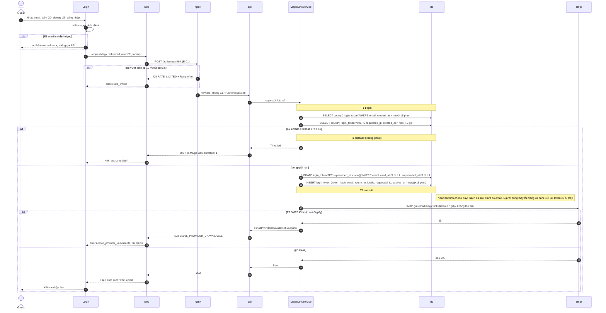
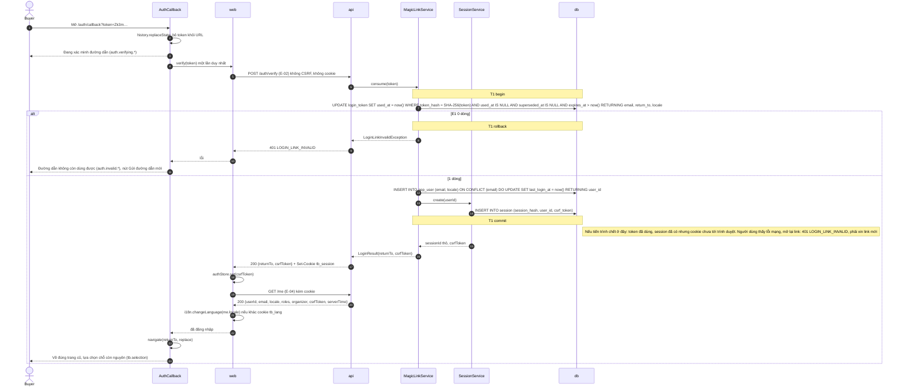
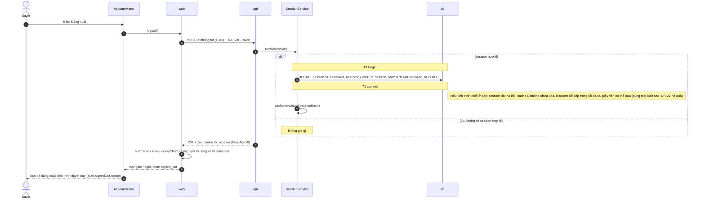
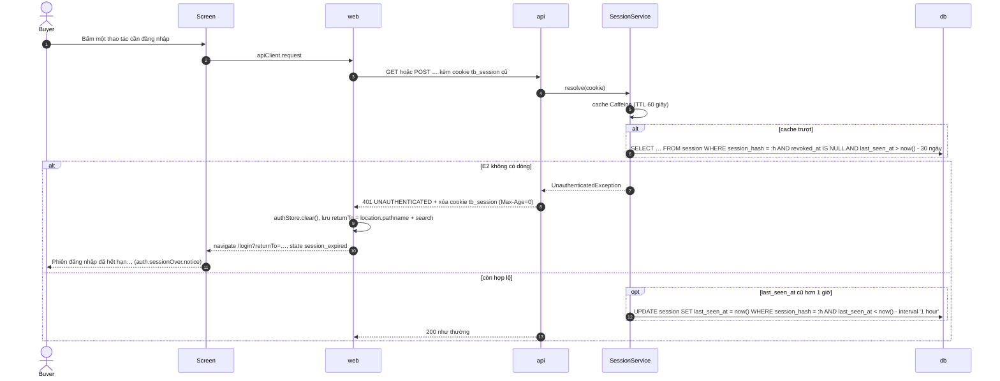
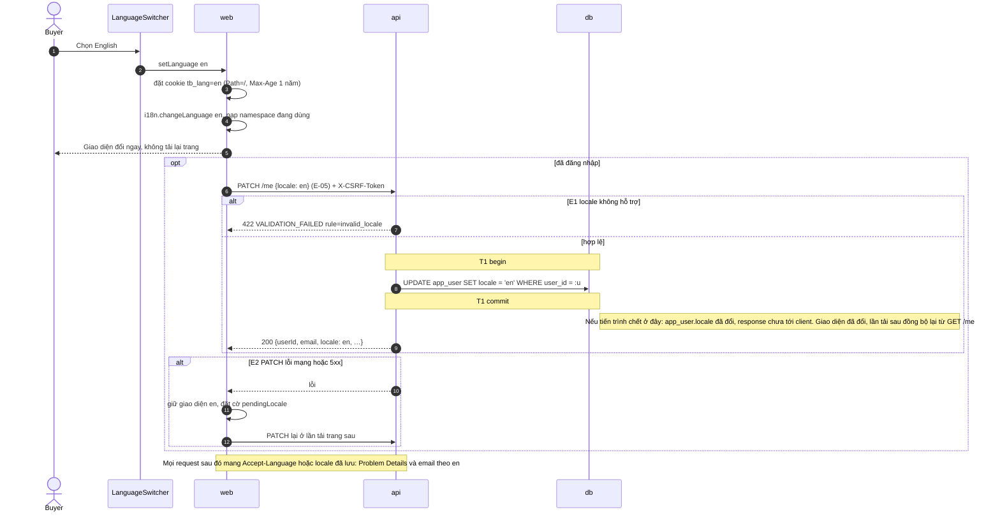

# Luồng: Đăng nhập và tài khoản

> Trạng thái: **Approved** · Cập nhật: 2026-10-07 · DOC-83
> Phụ thuộc: [DOC-82](README.md) (tên thành phần tham gia), [DOC-04](../../01-product/use-cases.md) UC-01, UC-20, [DOC-15](../../05-data/ops-model.md) §3, §4, [DOC-14](../../05-data/domain-model.md) (`app_user`), [DOC-35](../error-handling.md), [DOC-36](../../07-api/api-guidelines.md), [DOC-31](../i18n.md) §2, [DOC-40](../../08-ux-ui/ui-states-and-copy.md) §3.2, [DOC-51](../../08-ux-ui/screens/emails.md) §3, [DOC-38](../../08-ux-ui/ux-principles-and-ia.md), [Sổ quyết định](../../00-decision-register.md) (DR-10, 21, 22, 23, 55, 56, 64, 67), [ADR-0007](../../04-adr/0007-magic-link-server-sessions.md)
> Người dùng chính: P1-07 (auth backend và frontend), P1-10 (i18n), DOC-19 (thuật toán), DOC-44 (màn Đăng nhập), DOC-52 (trang lỗi), mọi màn cần đăng nhập

Tài liệu mô tả bốn luồng chi tiết `FL-01…04`, từng tầng, từng transaction và người dùng thấy gì nếu tiến trình chết sau mỗi commit. Thuật toán và tham số (chuẩn hóa email, giới hạn gửi, Caffeine) ở [DOC-19](../auth-and-sessions.md); DDL ở DOC-15; payload endpoint ở DOC-37; chuỗi giao diện ở DOC-40; email ở DOC-51. Tài liệu này không lặp các phần đó. Mã `E-xx` theo DOC-37 §4 (E-01…05).

Mọi sơ đồ dùng tên thành phần của DOC-82 §1. Thành phần cụ thể của luồng này:

| Tên | Loại | Mã | Ghi chú |
| --- | --- | --- | --- |
| `Login` | Màn hình | `frontend/src/features/auth/Login.tsx` | DOC-44; bảy biến thể (nhập email, đã gửi, gửi quá nhiều, đang xác minh, link hết hạn, đã đăng xuất, hết phiên) |
| `AuthCallback` | Màn hình | `frontend/src/features/auth/AuthCallback.tsx` | DOC-44; trang `/auth/callback?token=` |
| `LanguageSwitcher` | Component | `frontend/src/features/auth/LanguageSwitcher.tsx` | Ở header mọi màn |
| `web` | SPA | `frontend/src/api/` | `apiClient` (CSRF, 401), `authStore`, i18n |
| `api` | API | `io.ticket.auth.AuthController`, `io.ticket.auth.MeController` | |
| `MagicLinkService` | Service | `io.ticket.auth.service.MagicLinkService` | Xin link, tiêu thụ token |
| `SessionService` | Service | `io.ticket.auth.service.SessionService` | Tạo, tra, thu hồi session; Caffeine |
| `MailSender` | Service | `io.ticket.notification.MailApi` | Gửi SMTP trực tiếp cho `magic-link` (DOC-27) |

## FL-01 · Người dùng xin magic link

- **UC / FR:** UC-01, FR-01 · **Màn hình:** `Login` ([DOC-44](../../08-ux-ui/screens/login.md)) · **Endpoint:** `POST /auth/magic-link` (E-01) · **Sự kiện:** không
- **Trigger:** khách bấm "Gửi đường dẫn đăng nhập" hoặc "Gửi lại" ở `Login`; hoặc bị chuyển tới `/login?returnTo=…` khi bấm giữ vé hoặc vào studio mà chưa có session (UC-03 bước 1a).
- **Điều kiện đầu:** có địa chỉ email nhận được thư; chưa cần tài khoản (`app_user` tạo ở FL-02).

### Thành phần

| Tên | Loại | Mã | Định nghĩa ở |
| --- | --- | --- | --- |
| `Login` | Màn hình | `Login.tsx` | DOC-44 |
| `web` | SPA | `apiClient` | DOC-12 §6 |
| `nginx` | Edge | `limit_req auth_ip` | DR-55, DOC-62 §8 |
| `api` | API | `AuthController.requestMagicLink` | DOC-37 E-? |
| `MagicLinkService` | Service | `requestLink(cmd)` | DOC-19 §3 |
| `db` | Cơ sở dữ liệu | `login_token` | DOC-15 §3 |
| `MailSender` | Service | `sendMagicLink(to, locale, url)` | DOC-27 |
| `smtp` | Mail | Mailpit (dev) | DOC-62 |

### Sơ đồ tuần tự

Mũi tên 6 và 7 gộp thành một khối bằng `alt E5`; khi nginx chặn, `api` không thấy request.

### Chi tiết bước

| Bước | Từ → Đến | Lệnh | Dữ liệu | Quy tắc | Lỗi → xử lý |
| --- | --- | --- | --- | --- | --- |
| 1–2 | `Login` | kiểm tra `^[^@\s]+@[^@\s]+\.[^@\s]+$` | `an.nguyen@example.com` | chỉ để chặn nhanh; server kiểm lại (DR-21) | E1 |
| 3–4 | `web` → `nginx` | `POST /auth/magic-link` | `{"email":"An.Nguyen@Example.com","returnTo":"/events/0199f3a0-…/seats","locale":"vi"}` | không `Idempotency-Key`, không CSRF (DR-22) | E5: 429 → "Bạn thao tác quá nhanh" |
| 7 | `api` → `MagicLinkService` | `requestLink` | email chuẩn hóa `an.nguyen@example.com`; `returnTo` hợp lệ (bắt đầu `/`, không `//`, không `/\`, ≤ 512), sai thì `/` | DR-21 | email sai: 422 `VALIDATION_FAILED` (E1) |
| 9–10 | `MagicLinkService` → `db` | `count(*)` hai lần | `login_token_email_idx`, `login_token_ip_idx` | đếm cả token đã bị thay hoặc đã dùng; lần SMTP lỗi vẫn tính | E2 |
| 12 | → `db` | `UPDATE login_token SET superseded_at = now() …` | mọi token còn hiệu lực của email | BR-10: chỉ link mới nhất dùng được | — |
| 13 | → `db` | `INSERT INTO login_token …` | `token_hash = SHA-256(token)`, token 32 byte `SecureRandom` base64url (43 ký tự); `expires_at = now()+15 phút` | NFR-07: token thô không ghi ở đâu | — |
| 15 | `MailSender` → `smtp` | gửi `magic-link` | `{linkUrl: APP_BASE_URL + "/auth/callback?token=" + token, locale}` | DOC-51 §3 | E3 |

### Giao dịch và đồng thời

- **T1** gồm đếm giới hạn, `UPDATE … superseded_at`, `INSERT`. Một transaction ngắn, không có I/O ngoài. Hai request đồng thời của cùng một email đều có thể thấy cùng số đếm (isolation `READ COMMITTED`): chấp nhận vì giới hạn là biện pháp chống lạm dụng, không phải bất biến; tệ nhất là 4 link trong 15 phút (DR-113).
- Gửi SMTP **sau** commit và **ngoài** transaction (SDD gốc 10.4). Hệ quả cần nói rõ: nếu SMTP lỗi (E3), token mới đã thay token cũ. Người dùng đang có một link cũ chưa dùng sẽ thấy link đó không còn dùng được. Chấp nhận vì người dùng đang đứng ở màn hình và sẽ bấm "Gửi lại" (DR-21).
- Không có `Idempotency-Key`: bấm đúp là hai lần xin, link thứ hai thay link thứ nhất, cả hai email đến; chỉ link đến sau cùng dùng được. Nút bị khóa trong lúc chờ để tránh việc này.
- Sau commit của T1 không có dòng outbox nào. Nếu tiến trình chết sau commit và trước SMTP, người dùng thấy lỗi mạng ở bước 3–4 (không có response), bấm "Gửi lại", FL-01 chạy lại từ đầu.
- Log: INFO `auth.magic_link.requested` với `request_id`, không có email, không có token (DR-22, DOC-33).

### Luồng lỗi

| Mã | Tình huống | Bước | HTTP / `code` | Giao diện |
| --- | --- | --- | --- | --- |
| E1 | Email sai định dạng | 2, 7 | client chặn; server 422 `VALIDATION_FAILED` `errors[{field:"email",rule:"invalid_email"}]` | `auth.form.email.error` "Email chưa đúng định dạng." |
| E2 | Quá 3 link/email/15 phút hoặc 10/IP/giờ | 11 | 202 + `X-Magic-Link-Throttled: 1`, không chèn token, không gửi | Biến thể "gửi quá nhiều": `auth.throttled.title/body` |
| E3 | SMTP lỗi hoặc quá 5 giây | 15 | 503 `EMAIL_PROVIDER_UNAVAILABLE` + `Retry-After` | `errors.email_provider_unavailable.*`: "Chưa gửi được email"; giữ biểu mẫu, bật lại nút "Gửi đường dẫn đăng nhập" |
| E4 | Mạng hỏng giữa client và server | 3–4 | không có response | `common.error.network`; giữ biểu mẫu; bấm lại là một lần xin mới |
| E5 | nginx `auth_ip` vượt 10 r/phút (burst 5) | 5 | 429 `RATE_LIMITED` + `Retry-After` | `errors.rate_limited.*` "Bạn thao tác quá nhanh. Hãy thử lại sau ít giây." |

Bản 202 của E2 giống 202 thường ngoại trừ header để không lộ việc email đó có tồn tại hay không. Người dùng bị chặn chỉ biết "đã yêu cầu nhiều lần".

### Test bắt buộc

| ID | Kịch bản | Kỳ vọng |
| --- | --- | --- |
| FLA-01 | `POST /auth/magic-link` với email hợp lệ | 202; một dòng `login_token` mới; một email trong Mailpit với đúng một link; không dòng `outbox` |
| FLA-02 | Xin link hai lần liên tiếp cho cùng email | Token đầu có `superseded_at`; chỉ token sau còn hợp lệ |
| FLA-03 | Xin 4 lần trong 15 phút | Ba lần đầu 202 thường; lần 4: 202 + `X-Magic-Link-Throttled: 1`; vẫn 3 dòng `login_token`; 3 email |
| FLA-04 | 11 email khác nhau từ cùng một IP trong 1 giờ | Lần 11: 202 + header; không gửi |
| FLA-05 | Email `abc` | 422 `VALIDATION_FAILED`, `rule=invalid_email`; không dòng `login_token` |
| FLA-06 | SMTP dừng (Mailpit tắt) | 503 `EMAIL_PROVIDER_UNAVAILABLE`; **không** dòng `outbox`; dòng `login_token` vẫn có và vẫn tính vào giới hạn |
| FLA-07 | `returnTo=//evil.example` | `login_token.return_to` NULL hoặc `/` (DR-21) |
| FLA-08 | Email `  An.Nguyen@Example.COM ` | `login_token.email = an.nguyen@example.com` |

## FL-02 · Mở link và nhận session

- **UC / FR:** UC-01, FR-01 · **Màn hình:** `AuthCallback`, `Login` (DOC-44) · **Endpoint:** `POST /auth/verify` (E-02), `GET /me` (E-04) · **Sự kiện:** không
- **Trigger:** người dùng mở `/auth/callback?token=…` từ email, có thể ở tab hoặc thiết bị khác.
- **Điều kiện đầu:** có một `login_token` hợp lệ (`used_at IS NULL AND superseded_at IS NULL AND expires_at > now()`).

### Thành phần

| Tên | Loại | Mã | Định nghĩa ở |
| --- | --- | --- | --- |
| `AuthCallback` | Màn hình | `AuthCallback.tsx` | DOC-44 |
| `web` | SPA | `authStore`, `apiClient` | DOC-12 §6 |
| `api` | API | `AuthController.verify`, `MeController.get` | DOC-37 |
| `MagicLinkService` | Service | `consume(token)` | DOC-19 §3 |
| `SessionService` | Service | `create(userId)` | DOC-19 §4 |
| `db` | Cơ sở dữ liệu | `login_token`, `app_user`, `session` | DOC-15 §3–4, DOC-14 |

### Sơ đồ tuần tự

### Chi tiết bước

| Bước | Từ → Đến | Lệnh | Dữ liệu | Quy tắc | Lỗi → xử lý |
| --- | --- | --- | --- | --- | --- |
| 2 | `AuthCallback` | `history.replaceState` | URL thành `/auth/callback` | token không nằm lại trong lịch sử trình duyệt và không lọt qua `Referer` (DR-114) | — |
| 4–5 | `AuthCallback` → `api` | `POST /auth/verify` | `{"token":"Zk3m…"}` | gọi **đúng một lần** dù component render hai lần (React StrictMode); GET trang không tiêu thụ token (DR-21) | — |
| 7 | `MagicLinkService` → `db` | `UPDATE login_token … RETURNING` | SHA-256 của token trong request | arbiter duy nhất: hai request cùng token chỉ một thấy 1 dòng (DOC-19 test) | E1 |
| 11 | → `db` | `INSERT app_user … ON CONFLICT (email)` | `locale` từ `login_token.locale` chỉ dùng cho người mới | DR-10; người đã có tài khoản giữ `locale` cũ | — |
| 13 | `SessionService` → `db` | `INSERT session` | `session_hash = SHA-256(id thô 32 byte)`, `csrf_token` 32 byte base64url | DR-22 | — |
| 16 | `api` → `web` | `Set-Cookie: tb_session=<id thô>; Path=/; HttpOnly; SameSite=Lax; Secure` | `Secure` tắt ở profile `dev` (`auth.cookie-secure=false`) | DR-22 | — |
| 18 | `web` → `api` | `GET /me` | body ở DR-23 | lấy `locale`, `roles`, `organizer` cho menu tài khoản | 401 sau `verify` thành công → coi như lỗi nghiêm trọng (log), hiện trang lỗi 500 |
| 21 | `AuthCallback` | `navigate(returnTo, { replace: true })` | `returnTo` từ response, kiểm lại ở client (chỉ `/…`) | DR-67; trang đích đọc `tb.selection.<eventId>` (< 30 phút) | — |

### Giao dịch và đồng thời

- **T1** là một transaction: tiêu thụ token, tìm hoặc tạo `app_user`, tạo `session`. Hoặc cả ba xảy ra hoặc không; không có trạng thái "token đã dùng mà không có session" trong cơ sở dữ liệu. Phần còn lại (gửi cookie) không nằm trong transaction.
- **Arbiter:** câu `UPDATE login_token … WHERE used_at IS NULL …`. Hai request đồng thời cùng token: Postgres khóa dòng, request sau thấy `used_at` đã đặt và trả 0 dòng (E1). Kết quả: đúng một session.
- Trình duyệt nào gọi `POST /auth/verify` thì trình duyệt đó nhận cookie. Trình duyệt đã yêu cầu link không tự đăng nhập (DR-21): người dùng mở link trên điện thoại thì điện thoại có session, máy tính vẫn ở trang "Đã gửi".
- Bộ quét link của hộp thư chỉ tải `/auth/callback` (HTML tĩnh) và không chạy JavaScript, nên token chưa bị tiêu thụ. Nếu bộ quét chạy JavaScript và gọi `verify`, người dùng thật sẽ thấy E1; hiếm, người dùng xin link mới.
- Tạo `app_user` mới: `ON CONFLICT (email) DO UPDATE` chạy dưới T1 để hai tab của người dùng mới không tạo hai tài khoản (`app_user.email` unique, DOC-14).
- Sau commit: nếu tiến trình chết trước khi trả response, token đã dùng; người dùng thấy lỗi mạng ở màn xác minh; mở lại link nhận E1 và xin link mới. Không có cách "dùng lại" token đã tiêu thụ: ưu tiên an toàn hơn thuận tiện.
- `session` mới chưa vào Caffeine; request đầu tiên tra DB rồi vào cache (60 giây, DR-22).
- Log INFO `auth.login.succeeded` với `user_id`, không email (DR-22).

### Luồng lỗi

| Mã | Tình huống | Bước | HTTP / `code` | Giao diện |
| --- | --- | --- | --- | --- |
| E1 | Link đã dùng, hết hạn hoặc bị thay | 7 | 401 `LOGIN_LINK_INVALID` | Biến thể "link hết hạn": `auth.invalid.title/body`, nút `auth.invalid.cta` quay về biểu mẫu email, giữ `returnTo` |
| E2 | `token` thiếu hoặc sai độ dài (không 43 ký tự base64url) | 4 | 422 `VALIDATION_FAILED` `rule=invalid_token` | Cùng giao diện E1 (không phân biệt với người dùng) |
| E3 | Mạng hỏng giữa `verify` và response | 4–5 | không có response | `common.error.network` + "Thử lại"; bấm lại gửi cùng token, thường nhận E1 vì token đã dùng ở lần trước: màn hiện E1 và hướng dẫn xin link mới |
| E4 | `returnTo` hỏng (không bắt đầu bằng một `/`) | 21 | không có | Về `/` |
| E5 | Cookie bị trình duyệt từ chối (Safari trên `http://localhost`) | 17 | `GET /me` trả 401 ngay sau `verify` | Chỉ xảy ra ở dev; DOC-61 "Lỗi thường gặp": đặt `auth.cookie-secure=false` |

### Test bắt buộc

| ID | Kịch bản | Kỳ vọng |
| --- | --- | --- |
| FLA-10 | Xin link, lấy token từ Mailpit, `POST /auth/verify` | 200 `{returnTo, csrfToken}` + cookie `tb_session` có `HttpOnly; SameSite=Lax`; một dòng `session`, `login_token.used_at` đặt |
| FLA-11 | 50 request `POST /auth/verify` song song cùng token | Đúng 1 request 200, 49 request 401 `LOGIN_LINK_INVALID`; đúng 1 dòng `session` |
| FLA-12 | Xin link A, rồi xin link B cùng email, verify A | 401 `LOGIN_LINK_INVALID`; verify B thành công |
| FLA-13 | Verify sau 15 phút 1 giây (giờ giả) | 401 `LOGIN_LINK_INVALID` |
| FLA-14 | Người dùng mới (chưa có `app_user`) | Có một dòng `app_user` với `locale` của `login_token`; người dùng cũ giữ `locale` cũ |
| FLA-15 | Mở `/auth/callback?token=…` bằng GET (HTML) | Không dòng nào của `login_token` đổi |
| FLA-16 | E2E: callback có `returnTo` là trang Chọn chỗ kèm lựa chọn trong `localStorage` | Sau đăng nhập về đúng URL, lựa chọn còn nguyên; URL không còn `token` trong lịch sử |
| FLA-17 | `POST /auth/verify` với `token` 10 ký tự | 422 `VALIDATION_FAILED`, `rule=invalid_token`; không chạm DB |

## FL-03 · Đăng xuất và hết phiên

- **UC / FR:** UC-01, FR-01 · **Màn hình:** mọi màn (menu tài khoản), `Login` biến thể "Đã đăng xuất" và "Hết phiên" · **Endpoint:** `POST /auth/logout` (E-03), mọi endpoint có thể trả 401 `UNAUTHENTICATED` · **Sự kiện:** không
- **Trigger:** (a) người dùng bấm "Đăng xuất" trong menu tài khoản; (b) bất kỳ lời gọi API nào nhận 401 `UNAUTHENTICATED` vì session hết hạn (30 ngày không hoạt động) hoặc đã bị thu hồi.
- **Điều kiện đầu:** (a) có session hợp lệ; (b) cookie `tb_session` còn nhưng session không còn hợp lệ.

### Thành phần

| Tên | Loại | Mã | Định nghĩa ở |
| --- | --- | --- | --- |
| Menu tài khoản | Component | `AccountMenu.tsx` | DOC-39 |
| `web` | SPA | `apiClient` interceptor 401, `authStore` | DOC-12 §6 |
| `api` | API | `AuthController.logout`, bộ lọc xác thực | DOC-37 |
| `SessionService` | Service | `revoke(sessionHash)`, `resolve(sessionId)` | DOC-19 §4 |
| `db` | Cơ sở dữ liệu | `session` | DOC-15 §4 |

### Sơ đồ tuần tự (a): đăng xuất

### Sơ đồ tuần tự (b): hết phiên

### Chi tiết bước

| Bước | Từ → Đến | Lệnh | Dữ liệu | Quy tắc | Lỗi → xử lý |
| --- | --- | --- | --- | --- | --- |
| a2–a3 | `web` → `api` | `POST /auth/logout` | không body; header `X-CSRF-Token` | CSRF bắt buộc khi session hợp lệ (DR-22); xem DR-115 | E3 |
| a5 | `SessionService` → `db` | `UPDATE session SET revoked_at = now()` | `session_hash` | một câu; idempotent nhờ `revoked_at IS NULL` | — |
| a7 | `SessionService` | `invalidate` Caffeine | | một bản sao trong tiến trình (SDD gốc 14.1) | — |
| a9 | `api` → `web` | `Set-Cookie: tb_session=; Max-Age=0; Path=/` | | luôn xóa cookie, kể cả khi session đã mất | — |
| a10 | `web` | xóa store và cache dữ liệu người dùng | giữ `tb_lang`, `localStorage["tb.selection.*"]` | lựa chọn chỗ không chứa dữ liệu nhạy cảm; tự hết hạn sau 30 phút (DR-67) | — |
| b7 | `api` → `web` | 401 `UNAUTHENTICATED` | Problem Details | không có `returnTo` trong body; client tự tính | — |
| b8–b9 | `web` | điều hướng | `returnTo` kiểm chỉ `/…` | UXP-10; state điều hướng chứ không phải tham số URL (DR-115) | — |

### Giao dịch và đồng thời

- (a) T1 là một câu `UPDATE`. Đăng xuất hai lần liên tiếp: lần hai không có dòng khớp, vẫn 204.
- Đăng xuất ở một tab, tab khác vẫn mở: request tiếp theo của tab đó nhận 401 và vào luồng (b). Không có kênh đẩy.
- Cache Caffeine là **một bản sao** (SDD gốc 14.1): triển khai nhiều replica (ngoài phạm vi dự án này, DR-72) thì đăng xuất chỉ xóa mục ở replica nhận request. Dự án chạy một `api`, nên không có độ trễ 60 giây giữa các replica; khoảng 60 giây chỉ có nghĩa là TTL của bản sao trong cùng tiến trình khi cơ sở dữ liệu bị sửa tay.
- (b) `last_seen_at` chỉ ghi khi cũ hơn 1 giờ để không ghi DB ở mọi request (DR-22).
- Sau 401, mọi request đang chờ của trang đều nhận 401; interceptor chỉ điều hướng một lần (cờ `redirecting`).
- Hết phiên trong lúc đang giữ vé: reservation vẫn chạy (không phụ thuộc session sau khi tạo; `GET /reservations/{id}` cần session). Người dùng đăng nhập lại cùng tài khoản trong thời hạn giữ vé quay về `/checkout/:reservationId` và tiếp tục (UC-04); sau thời hạn thì vé đã được trả (FL-16).
- Log INFO `auth.logout` với `user_id`; 401 do hết phiên không log ở mức WARN (DOC-35: lỗi nghiệp vụ lớp B).

### Luồng lỗi

| Mã | Tình huống | Bước | HTTP / `code` | Giao diện |
| --- | --- | --- | --- | --- |
| E1 | Đăng xuất khi session đã mất | a4 | 204, cookie xóa | Vẫn hiện "Bạn đã đăng xuất khỏi trình duyệt này." |
| E2 | Hết phiên khi đang dùng | b6 | 401 `UNAUTHENTICATED` | Biến thể "Hết phiên đăng nhập": `auth.sessionOver.notice`; sau đăng nhập về `returnTo` |
| E3 | `X-CSRF-Token` sai khi đăng xuất | a3 | 403 `CSRF_TOKEN_INVALID` | Client gọi `GET /me` lấy token mới rồi thử lại một lần (DR-85); vẫn lỗi thì xóa cục bộ như đã đăng xuất |
| E4 | Mạng hỏng khi đăng xuất | a3 | không có response | Xóa trạng thái cục bộ và hiện đã đăng xuất; session phía server hết hạn tự nhiên; cookie vẫn còn trong trình duyệt tới lần gọi API kế tiếp |

### Test bắt buộc

| ID | Kịch bản | Kỳ vọng |
| --- | --- | --- |
| FLA-20 | Đăng nhập, `POST /auth/logout` đúng CSRF | 204; `session.revoked_at` đặt; cookie `Max-Age=0`; `GET /me` kế tiếp 401 |
| FLA-21 | Đăng xuất rồi dùng lại cookie cũ cho `GET /me` ngay (trong 60 giây) | 401 (cache đã `invalidate`) |
| FLA-22 | `POST /auth/logout` hai lần | Cả hai 204 |
| FLA-23 | `POST /auth/logout` không có `X-CSRF-Token` khi session hợp lệ | 403 `CSRF_TOKEN_INVALID`, session không bị thu hồi |
| FLA-24 | `POST /auth/logout` không cookie | 204, cookie xóa, không lỗi |
| FLA-25 | Sửa `last_seen_at` lùi 31 ngày rồi `GET /me` | 401 `UNAUTHENTICATED` |
| FLA-26 | `last_seen_at` cách 30 phút, `GET /me` | 200 và `last_seen_at` không đổi; cách 61 phút: 200 và `last_seen_at` đổi |
| FLA-27 | E2E: hết phiên khi đang xem `/events/…/seats` | `/login?returnTo=%2Fevents%2F…%2Fseats` hiện "Hết phiên đăng nhập"; sau đăng nhập về đúng trang |

## FL-04 · Đổi ngôn ngữ giao diện

- **UC / FR:** UC-20, FR-17 · **Màn hình:** mọi màn (`LanguageSwitcher` ở header) · **Endpoint:** `PATCH /me` (E-05), `GET /me` (E-04) · **Sự kiện:** không
- **Trigger:** người dùng chọn `vi` hoặc `en` ở bộ chọn ngôn ngữ.
- **Điều kiện đầu:** không có (khách cũng đổi được).

### Thành phần

| Tên | Loại | Mã | Định nghĩa ở |
| --- | --- | --- | --- |
| `LanguageSwitcher` | Component | `LanguageSwitcher.tsx` | DOC-39 |
| `web` | SPA | i18next, `document.cookie`, `apiClient` | DOC-31 §3 |
| `api` | API | `MeController.patch` | DOC-37 |
| `db` | Cơ sở dữ liệu | `app_user.locale` | DOC-14 |

### Sơ đồ tuần tự

### Chi tiết bước

| Bước | Từ → Đến | Lệnh | Dữ liệu | Quy tắc | Lỗi → xử lý |
| --- | --- | --- | --- | --- | --- |
| 2 | `web` | `document.cookie = "tb_lang=en; Path=/; SameSite=Lax; Max-Age=31536000"` | | không `HttpOnly` vì i18next đọc; DOC-31 §2 | — |
| 3 | `web` | `i18n.changeLanguage("en")` | | chỉ nạp namespace của route hiện tại (chunk lười, DR-67) | namespace tải lỗi: E3 |
| 5 | `web` → `api` | `PATCH /me` | `{"locale":"en"}` | CSRF bắt buộc (có session); xem `GET /me` ở DR-23 | E1, E2 |
| 7 | `api` → `db` | `UPDATE app_user SET locale = :l WHERE user_id = :u` | `u` từ session, không từ body | `CHECK (locale IN ('vi','en'))` (DOC-14) | E1 |

### Giao dịch và đồng thời

- T1 là một câu `UPDATE`. Thứ tự "đổi giao diện trước, gọi API sau" là có chủ ý: giao diện không bao giờ chờ mạng (UXP, UC-20 E1).
- **Email chốt locale lúc ghi**, không lúc gửi (DR-10): email đã nằm trong `outbox` giữ locale cũ; email `magic-link` xin sau khi đổi dùng locale mới vì `requestLink` đọc `locale` từ body request (cookie hoặc `Accept-Language`, DOC-31 §2). Hai thiết bị cùng tài khoản: thiết bị chưa tải lại giữ giao diện cũ cho tới lần `GET /me` kế tiếp (không có kênh đẩy).
- `PATCH /me` hai lần liên tiếp `vi` rồi `en`: request đến sau thắng (`UPDATE` không phụ thuộc giá trị cũ); client chỉ gửi sau khi người dùng ngừng chọn (debounce 300 ms) nên hiếm khi đảo thứ tự.
- Trường hợp khách (chưa đăng nhập) không gọi API; locale chỉ ở cookie. Khi đăng nhập (FL-02) `GET /me` trả `locale` của tài khoản: nếu khác cookie thì giao diện đổi theo tài khoản (DOC-31 §2 bảng ưu tiên).
- Không có log INFO cho luồng này (`ticket_http_requests_total` đã đếm).

### Luồng lỗi

| Mã | Tình huống | Bước | HTTP / `code` | Giao diện |
| --- | --- | --- | --- | --- |
| E1 | `locale` ngoài `vi`/`en` (client bị sửa) | 6 | 422 `VALIDATION_FAILED`, `errors[{field:"locale",rule:"invalid_locale"}]` | Giao diện quay về locale cũ, thông báo chung `errors.generic` |
| E2 | `PATCH /me` thất bại (mạng, 5xx) | 5–8 | không có hoặc 5xx | Giao diện vẫn là ngôn ngữ mới; thử lại ở lần tải sau (UC-20 E1); không thông báo lỗi |
| E3 | Nạp file ngôn ngữ lỗi | 3 | — | Giữ ngôn ngữ cũ, hiện `common.error.network`; cookie không đổi nếu `changeLanguage` lỗi |
| E4 | Phiên hết khi `PATCH /me` | 5 | 401 `UNAUTHENTICATED` | FL-03 (b); cookie `tb_lang` đã đổi nên sau đăng nhập giao diện vẫn là ngôn ngữ mới, và `GET /me` trả locale cũ của tài khoản: **ghi đè** bằng cookie bằng một `PATCH /me` sau đăng nhập (DR-115) |

### Test bắt buộc

| ID | Kịch bản | Kỳ vọng |
| --- | --- | --- |
| FLA-30 | Khách đổi sang `en` | Cookie `tb_lang=en`; không request `PATCH /me`; trang hiện tiếng Anh không tải lại |
| FLA-31 | Đã đăng nhập, đổi sang `en` | `PATCH /me` 200; `app_user.locale = en` |
| FLA-32 | `PATCH /me {"locale":"fr"}` | 422 `VALIDATION_FAILED`, `rule=invalid_locale` |
| FLA-33 | Đổi `en`, rồi xin magic link | Email `magic-link` tiếng Anh (EML-02) |
| FLA-34 | Đơn đã có dòng outbox `locale=vi`, đổi sang `en`, relay gửi | Email vẫn tiếng Việt |
| FLA-35 | Đổi `en`, lỗi `409 EVENT_NOT_ON_SALE` | `title` tiếng Anh, `Content-Language: en` (I18N-04) |
| FLA-36 | Mock `PATCH /me` trả 500 | Giao diện vẫn `en`; không toast lỗi; lần tải kế tiếp gửi lại `PATCH` |
| FLA-37 | Cookie `tb_lang=en`, tài khoản `locale=vi`, đăng nhập | Giao diện `en`; sau đăng nhập có một `PATCH /me {"locale":"en"}` |

## Quyết định mới khi viết tài liệu này

Mọi quyết định mới là DR-113…115 (cùng dãy DR-109…115 với DOC-51). Mỗi quyết định dễ đảo ngược.

**DR-113 · Giới hạn gửi magic link không phải bất biến chính xác.** *Vấn đề:* hai request đồng thời của cùng email đều đếm trước khi chèn. *Quyết định:* không khóa (không `pg_advisory_xact_lock`); chấp nhận tối đa vài link thừa trong cửa sổ 15 phút vì giới hạn là chống lạm dụng, không phải bất biến NEVER OVERSELL. *Hệ quả:* test `FLA-03` chạy tuần tự; không có test đồng thời cho giới hạn. *Ghi vào:* DOC-19.

**DR-114 · `AuthCallback` bỏ token khỏi URL và gọi `verify` đúng một lần.** *Vấn đề:* token nằm trong URL của lịch sử trình duyệt và `Referer`; React StrictMode chạy effect hai lần ở dev nên gọi `verify` hai lần, lần hai nhận 401. *Quyết định:* gọi `history.replaceState(null, "", "/auth/callback")` trước khi gọi API, giữ token trong biến cục bộ; bảo đảm một lời gọi bằng một `Promise` mức module theo token. Thêm `<meta name="referrer" content="no-referrer">` cho trang callback. *Hệ quả:* làm mới trang sau khi mất token trong URL cho màn "link không còn dùng được"; người dùng xin link mới. *Ghi vào:* DOC-44, DOC-19.

**DR-115 · Đăng xuất idempotent; lý do vào `Login` đi qua state điều hướng; ghi đè locale sau đăng nhập.** *Vấn đề:* (1) `POST /auth/logout` với cookie đã mất không nên 401 vì người dùng chỉ muốn thoát; (2) màn `Login` cần biết biến thể "Đã đăng xuất"/"Hết phiên" mà không thêm tham số URL có thể bị dán; (3) khách đổi sang `en` rồi đăng nhập vào tài khoản `vi` thì không rõ ai thắng. *Quyết định:* (1) `/auth/logout` luôn 204 và xóa cookie; chỉ kiểm CSRF khi session hợp lệ; (2) router `navigate("/login?returnTo=…", { state: { reason: "signed_out" | "session_expired" } })`; mở `/login` trực tiếp luôn hiện biểu mẫu thường; (3) sau `FL-02`, nếu cookie `tb_lang` khác `me.locale` thì cookie thắng và client gửi một `PATCH /me` (lựa chọn gần nhất của người dùng). *Hệ quả:* làm mới trang `/login` mất biến thể (chấp nhận); locale tài khoản có thể đổi vì người dùng đã chọn ở trình duyệt này. *Ghi vào:* DOC-19, DOC-44, DOC-31, DOC-37.

## Câu hỏi còn mở

Không còn.
