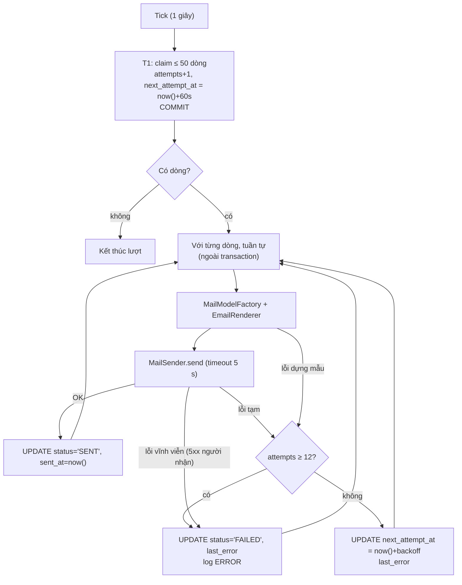

# Vé và thông báo

> Trạng thái: **Review** · Cập nhật: 2026-10-06 · DOC-27
> Phụ thuộc: SDD gốc §4.2, §9.4, [Sổ quyết định](../00-decision-register.md) (DR-10, 12, 19, 21, 28, 29, 44, 52, 53, 54, 74), [DOC-06](../02-glossary.md), [DOC-07](../03-architecture/system-context-and-containers.md) §4, [DOC-12](../03-architecture/code-architecture.md) §2–§3, [DOC-14](../05-data/domain-model.md) (`ticket`, `orders`, `event.ticket_code_prefix`, §7 truy vấn xác nhận), [DOC-15](../05-data/ops-model.md) §7 (`outbox`), [DOC-19](auth-and-sessions.md) §3 và §14 (`common.mail`), [DOC-31](i18n.md) §5, [DOC-35](error-handling.md), [DOC-51](../08-ux-ui/screens/emails.md)
> Người dùng chính: P1-07 (`common.mail`, `OutboxRelay`), P2-xx (phát hành vé, email `tickets`), P3-xx (email `refund-pending`, đổi lịch), [DOC-26](checkout-and-payment.md) (transaction xác nhận), [DOC-20](events-and-ticket-types.md), [DOC-37](../07-api/api-endpoints.md), [DOC-69](../10-testing/test-strategy.md)

Tài liệu mô tả hai việc nối tiếp nhau sau khi một đơn được xác nhận: **phát hành vé** (mã vé, dòng `ticket`, `VOID`) và **gửi thông báo** (hàng đợi outbox, `OutboxRelay`, dựng email, fan-out đổi lịch và chờ hoàn tiền). Nó không định nghĩa DDL (DOC-14 §4, DOC-15 §7), nội dung từng mẫu email (DOC-51), transaction xác nhận thanh toán (DOC-26, DOC-14 §7 có câu mẫu), magic link (DOC-19: gửi trực tiếp, không qua outbox) hay cách hiển thị "Vé của tôi" (DOC-50).

## 1. Tóm tắt thiết kế

| Hạng mục | Quyết định | Nguồn |
| --- | --- | --- |
| Mã vé | `PP-XXXX-XXXX`; `PP` = `event.ticket_code_prefix` (mặc định `TK`), 8 ký tự Crockford Base32 từ `SecureRandom` (40 bit); sinh ở Java, `ticket.code` có `UNIQUE` | DR-52 |
| Phát hành vé | Trong transaction xác nhận, sau khi đơn sang `PAID`; một `ticket` cho mỗi unit `SOLD`; `ticket_unit_issued_uq` là lưới an toàn | DR-14, DR-18, DOC-14 §7 |
| Hủy sự kiện | `ticket.status = 'VOID'` cho mọi vé `ISSUED` của event; unit `SOLD` giữ nguyên | DR-28 |
| Email nghiệp vụ | Một dòng `outbox` cùng transaction với thay đổi sinh ra nó; ba loại `EMAIL_TICKETS`, `EMAIL_EVENT_CHANGED`, `EMAIL_REFUND_PENDING` | DR-19, DR-53 |
| Magic link | Không qua outbox; gửi trực tiếp sau commit (DOC-19 §3) | DR-21 |
| Relay | `OutboxRelay` mỗi 1 giây; claim 50 dòng bằng `FOR UPDATE SKIP LOCKED` kèm lease 60 giây; gửi ngoài transaction; backoff `least(10 s × 2^(attempts−1), 1 giờ)`; `attempts ≥ 12` → `FAILED` | DR-53 |
| Bảo đảm giao | Ít nhất một lần; `Message-ID = <outbox_id@APP_DOMAIN>` cố định để hộp thư gộp bản trùng | DR-53 |
| Dựng email | Thymeleaf + `MessageSource` theo `payload.locale`; HTML và text; mã nguồn ở `io.ticket.common.mail` dùng chung với `auth` | DR-54, DR-10, DOC-19 §14 |
| Đổi lịch | Một dòng `EMAIL_EVENT_CHANGED` cho mỗi đơn `PAID`, không gom | DR-29 |
| Chờ hoàn tiền | Một dòng `EMAIL_REFUND_PENDING` mỗi lần đơn sang `REFUND_PENDING`; nội dung theo `refundReason` | DR-44, DR-28 |
| Vé không phụ thuộc email | `GET /me/tickets` đọc bảng `ticket`; outbox `FAILED` không làm mất vé | FR-10.4 |

## 2. Phân chia trách nhiệm trong code

Ranh giới module theo DOC-07 §4 và DOC-12 §2: `notification` không đọc bảng của module khác, nên **bên gọi dựng payload đủ dữ liệu** rồi gọi `NotificationApi.enqueue` trong transaction của mình.

| Thành phần | Package | Việc | Bảng đụng tới |
| --- | --- | --- | --- |
| `TicketService` | `io.ticket.ticket.service` | Phát hành (`issue`), `VOID`, đọc vé của người dùng | `ticket` (ghi), `inventory_unit` (đọc qua `InventoryApi`) |
| `TicketCodeGenerator` | `io.ticket.ticket.service` | Sinh mã, kiểm tra trùng theo lô | `ticket` (đọc `code`) |
| `ConfirmationService` | `io.ticket.payment.service` | Gọi `TicketService.issue`, dựng payload `EMAIL_TICKETS`, gọi `enqueue` (DOC-26) | — |
| `CancelEventService`, `EventChangeService` | `io.ticket.studio.service` | Dựng payload `EMAIL_REFUND_PENDING` (hủy) và `EMAIL_EVENT_CHANGED` (đổi lịch), gọi `enqueueAll` | — |
| `NotificationApi` (`enqueue`, `enqueueAll`) | gốc `io.ticket.notification` | Chèn dòng `outbox` bằng đúng `Connection` của transaction hiện tại (`@Transactional(propagation = MANDATORY)`) | `outbox` (ghi) |
| `OutboxRelay` (`@Scheduled`) | `io.ticket.notification.job` | Claim, gửi, ghi kết quả | `outbox` |
| `OutboxMetrics` | `io.ticket.notification.job` | Lấy mẫu gauge | `outbox` (đọc) |
| `MailModelFactory` | `io.ticket.notification.service` | Đổi payload JSON thành biến Thymeleaf đã định dạng (DOC-51 §8) | — |
| `MailSender`, `SmtpMailSender`, `EmailRenderer` | `io.ticket.common.mail` | Gửi SMTP, dựng HTML và text (DOC-19 §14, `DR-96`) | — |

`enqueue` dùng `Propagation.MANDATORY`: gọi ngoài transaction là lỗi lập trình (ném `IllegalTransactionStateException`), để không ai vô tình chèn một dòng outbox mà không có thay đổi nghiệp vụ đi cùng (ADR-0006).

## 3. Mã vé

### 3.1 Định dạng

`PP-XXXX-XXXX`, ví dụ `GM-4K7P-92XD`.

| Phần | Quy tắc |
| --- | --- |
| `PP` | `event.ticket_code_prefix`: đúng 2 chữ cái in hoa `[A-Z]` (ràng buộc `CHECK` ở DOC-14). Mặc định `TK`. Người tổ chức đổi ở Studio khi event còn `DRAFT`; sau đó khóa (DR-52, DOC-20) |
| `XXXX-XXXX` | 8 ký tự lấy từ bảng chữ Crockford Base32 `0123456789ABCDEFGHJKMNPQRSTVWXYZ` (32 ký tự, bỏ `I`, `L`, `O`, `U`), nhóm 4+4, ngăn bằng dấu gạch nối. 8 × 5 = 40 bit từ `SecureRandom` |
| Tính duy nhất | `ticket.code UNIQUE` trên **toàn bảng**, không chỉ trong một event: hai event cùng tiền tố (hai người tổ chức cùng chọn `GM`) vẫn phải có mã khác nhau |
| Phân biệt hoa thường | Mã chỉ chứa chữ hoa và số; không có chức năng nhập mã ở hệ thống này (không có kiểm vé), nên không cần chuẩn hóa `O→0`, `I→1` khi nhập |

### 3.2 Sinh mã

```java
final class TicketCodeGenerator {
    private static final char[] ALPHABET = "0123456789ABCDEFGHJKMNPQRSTVWXYZ".toCharArray();
    private final SecureRandom random;            // một instance dùng chung, thread-safe

    String next(String prefix) {
        long bits = random.nextLong() & 0xFF_FFFF_FFFFL;   // 40 bit thấp
        char[] c = new char[8];
        for (int i = 7; i >= 0; i--) { c[i] = ALPHABET[(int) (bits & 31)]; bits >>>= 5; }
        return prefix + "-" + new String(c, 0, 4) + "-" + new String(c, 4, 4);
    }
}
```

Mã không mang thông tin (không mã hóa `ticket_id`, không có checksum): chỉ là định danh ngẫu nhiên để người mua đọc ra khi cần và để người tổ chức đối chiếu. Không dùng `Random` hay UUID cắt ngắn vì mã vé đoán được là rủi ro giả mạo, dù hệ thống chưa kiểm vé.

### 3.3 Trùng mã

Với `N` vé đã có, xác suất một mã mới trùng là `N / 2^40`: 100.000 vé (cỡ dữ liệu của thực nghiệm lớn nhất, DR-75) cho `9 × 10^-8`; một triệu vé cho `9 × 10^-7`. Một lỗi trùng trong transaction `INSERT` làm Postgres hủy cả transaction xác nhận, nên không thể "thử lại ở câu insert". Quy trình (`DR-103`):

1. `TicketService.issue` sinh đủ `n` mã cho `n` unit; loại trùng trong chính lô (so sánh trong bộ nhớ).
2. `SELECT code FROM ticket WHERE code = ANY(:codes)` (index của `UNIQUE`). Mã nào đã tồn tại thì sinh lại mã thay thế, lặp tối đa **3 vòng** (DR-52).
3. `INSERT` theo lô. Nếu vẫn dính `unique violation` (hai transaction cùng sinh một mã giữa bước 2 và 3, xác suất `~N × 2^-40` nhân cửa sổ vài mili giây) thì transaction xác nhận thất bại với lỗi hạ tầng tạm thời; webhook Stripe được gửi lại hoặc `PaymentReconcileJob` chạy lại, và lượt mới sinh mã mới (DOC-26).
4. Hết 3 vòng mà vẫn trùng (không xảy ra ngoài lỗi sinh số ngẫu nhiên): ném `IllegalStateException`, log ERROR, metric `ticket_ticket_code_collisions_total` tăng.

## 4. Phát hành vé trong transaction xác nhận

Câu SQL cố định nằm ở DOC-14 §7 (bước 0–5 của "Xác nhận"); DOC-26 sở hữu thứ tự và xử lý lỗi. Phần của tài liệu này là bước 4 (vé) và bước 5 (outbox).

```mermaid
sequenceDiagram
    autonumber
    participant stripe as "stripe (webhook) / web (confirm-free)"
    participant svc as "ConfirmationService"
    participant tkt as "TicketService"
    participant ntf as "NotificationApi"
    participant db as "db"
    participant relay as "OutboxRelay"
    participant smtp as "smtp"

    stripe->>svc: payment_intent.succeeded / POST /orders/{id}/confirm-free
    svc->>db: BEGIN; FOR SHARE event; UPDATE reservation→CONFIRMED; unit→SOLD; orders→PAID
    svc->>tkt: issue(orderId, units)
    tkt->>db: SELECT code WHERE code = ANY(:codes)
    tkt->>db: INSERT ticket (n dòng, code, ticket_type_name, unit_price, label)
    svc->>ntf: enqueue(EMAIL_TICKETS, payload)
    ntf->>db: INSERT outbox (cùng transaction)
    svc->>db: COMMIT
    Note over relay,smtp: Sau commit, bất đồng bộ
    relay->>db: claim (SKIP LOCKED, lease 60 s)
    relay->>smtp: gửi (Message-ID cố định)
    relay->>db: status = SENT
```

### 4.1 Nguồn dữ liệu của mỗi vé

| Cột `ticket` | Lấy từ | Ghi chú |
| --- | --- | --- |
| `order_id`, `unit_id`, `event_id` | Đơn và unit `SOLD` của reservation | Một vé cho mỗi unit (`FR-10.1`) |
| `code` | `TicketCodeGenerator` (mục 3) | |
| `ticket_type_name`, `unit_price` | `reservation_item.ticket_type_name`, `.unit_price` (giá chụp lúc giữ vé, DR-20) | Chép giá trị, không tham chiếu: tên loại vé và giá có thể đổi sau |
| `label` | `reservation_item.label` | Xem mục 4.2 |
| `status` | `ISSUED` mặc định | |

Ghép unit với `reservation_item` theo `seat_id` (item ghế) hoặc `pool_id` (item khu vực và GA). Item pool `quantity = 3` ghép với ba unit và cho ba vé cùng `label`, ba mã khác nhau (DOC-14 §7).

### 4.2 Hình dạng `ticket.label`

`label` có ba dạng; email (DOC-51 §4, `DR-110`) và màn "Vé của tôi" chọn khối hiển thị theo khóa có mặt (`DR-108`):

| Loại vé | `label` | Ví dụ |
| --- | --- | --- |
| Ghế | `{"section": …, "row": …, "seat": …}` | `{"section":"Khán đài A","row":"C","seat":"9"}` |
| Khu vực | `{"zone": …}` | `{"zone":"Fanzone"}` |
| GA | `{}` (đối tượng rỗng, **không** `null`) | `{}` |

`ticket.label` là `NOT NULL`, nên GA luôn ghi `{}`. Không có khóa `ticketType` trong `label` vì loại vé đã có ở `ticket_type_name`.

### 4.3 Đơn 0 đồng

`POST /orders/{id}/confirm-free` (FL-14) đi cùng transaction xác nhận, không có PaymentIntent. Vé phát hành như trên; payload `EMAIL_TICKETS` có `amount: 0`, mẫu `tickets` hiện dòng "miễn phí" (DOC-51 §4). Reservation không `ACTIVE` → 409 `RESERVATION_NOT_ACTIVE`, không có vé, không có dòng outbox (`FR-10.5`).

### 4.4 Hủy sự kiện

Bước 4 của DR-28 chạy trong transaction hủy:

```sql
UPDATE ticket SET status = 'VOID' WHERE event_id = :e AND status = 'ISSUED';
```

Index `ticket_event_idx` phục vụ câu này (DOC-14 §5). `VOID` không giải phóng unit (unit `SOLD` giữ nguyên để lưu vết); `ticket_unit_issued_uq` là index một phần chỉ trên `ISSUED`, nên một vé `VOID` không chặn việc phát hành lại cho cùng unit nếu một ngày có chức năng bán lại. Không có email riêng cho `VOID`: người mua nhận `EMAIL_REFUND_PENDING` lý do `EVENT_CANCELLED` (mục 8).

### 4.5 Đọc vé

`GET /me/tickets` và `GET /orders/{id}` đọc bảng `ticket` kèm `orders` (DOC-37); không phụ thuộc outbox, nên email lỗi hay `FAILED` không làm người mua mất vé (`FR-10.4`). Vé `VOID` vẫn trả về với `status: "VOID"` để màn hiển thị "Sự kiện đã bị hủy".

## 5. Outbox

DDL, máy trạng thái và payload mẫu nằm ở DOC-15 §7; phần này nói **ai ghi, ai đọc, nhịp và lỗi**.

### 5.1 Ghi (enqueue)

```java
public interface NotificationApi {
    /** Chèn một dòng outbox PENDING; phải gọi trong transaction đang mở. */
    UUID enqueue(OutboxKind kind, Map<String, Object> payload);

    /** Chèn nhiều dòng bằng một batch JDBC (đổi lịch, hủy sự kiện). */
    void enqueueAll(OutboxKind kind, List<Map<String, Object>> payloads);
}
```

```sql
INSERT INTO outbox (kind, payload) VALUES (:kind, :payload::jsonb);   -- status, attempts, next_attempt_at lấy mặc định
```

`next_attempt_at DEFAULT now()` làm dòng mới đến hạn ngay: `OutboxRelay` lấy nó ở nhịp kế tiếp, độ trễ gửi mục tiêu ≤ 2 giây từ lúc commit (nhịp 1 giây cộng thời gian SMTP) (planned, đo ở EXP-04/EXP-08).

Người gọi dựng payload đủ để render, gồm `to` và `locale` lấy từ `AuthApi.emailOf/localeOf` (DOC-07 §4) **tại thời điểm ghi dòng**: người dùng đổi ngôn ngữ sau đó không đổi ngôn ngữ của email đã xếp hàng (`DR-10`, DOC-31 §2). Payload mẫu đầy đủ cho ba loại ở DOC-15 §7.2; không lặp ở đây.

### 5.2 Đọc (`OutboxRelay`)

`@Scheduled(fixedDelayString = "${outbox.relay.interval}")`, một lượt không chạy chồng chính nó (`fixedDelay`, không `fixedRate`).



Câu claim là câu của DR-53 (DOC-15 §7.1). Các câu kết quả đều có điều kiện `WHERE outbox_id = :id AND status = 'PENDING'` để một lượt chạy muộn không đè kết quả của lượt khác:

```sql
-- Thành công
UPDATE outbox SET status = 'SENT', sent_at = now(), last_error = NULL
 WHERE outbox_id = :id AND status = 'PENDING';

-- Lỗi tạm, chưa hết lượt (attempts đã được tăng ở bước claim)
UPDATE outbox
   SET next_attempt_at = now() + LEAST(interval '10 seconds' * power(2, attempts - 1), interval '1 hour'),
       last_error = :error
 WHERE outbox_id = :id AND status = 'PENDING' AND attempts < 12;

-- Hết lượt hoặc lỗi vĩnh viễn
UPDATE outbox SET status = 'FAILED', last_error = :error
 WHERE outbox_id = :id AND status = 'PENDING';
```

`:error` cắt còn 500 ký tự, không chứa địa chỉ email người nhận (`DR-22`: email không vào log; cột `last_error` cũng không giữ nó).

### 5.3 Backoff và lease

`attempts` được tăng ở bước claim, nên khi một lượt gửi thất bại lần thứ `k`, `attempts = k`.

| Sau lần thử thất bại | `attempts` | Chờ đến lần sau | Cộng dồn từ lần đầu |
| --- | --- | --- | --- |
| 1 | 1 | 10 giây | 10 giây |
| 2 | 2 | 20 giây | 30 giây |
| 3 | 3 | 40 giây | 1 phút 10 |
| 4 | 4 | 80 giây | 2 phút 30 |
| 5 | 5 | 160 giây | 5 phút 10 |
| 6 | 6 | 320 giây | 10 phút 30 |
| 7 | 7 | 640 giây | 21 phút 10 |
| 8 | 8 | 1.280 giây | 42 phút 30 |
| 9 | 9 | 2.560 giây | 1 giờ 25 |
| 10 | 10 | 1 giờ (trần; `10 × 2^9 = 5.120 s` bị cắt) | 2 giờ 25 |
| 11 | 11 | 1 giờ | 3 giờ 25 |
| 12 | 12 | không còn: `FAILED` | — |

Một email gặp sự cố SMTP kéo dài được thử trong khoảng 3 giờ 25 phút (12.310 giây tính theo công thức) trước khi `FAILED` (planned). Hết khoảng này người vận hành đặt lại tay (mục 9.2).

**Lease** là chính `next_attempt_at = now() + 60 s` được đặt ngay lúc claim: trong 60 giây đó không lượt nào khác (cùng tiến trình ở lượt sau hay replica khác) lấy lại dòng. Nếu tiến trình chết giữa lúc gửi, lease hết hạn và dòng được lấy lại; lần gửi lại này tính vào `attempts` (một tiến trình chết lặp lại cũng tiến dần tới `FAILED`, không kẹt vô hạn).

### 5.4 Ngân sách thời gian của một lượt

Một lượt tối đa 50 dòng, SMTP timeout 5 giây mỗi lần gửi (`mail.smtp.timeout`, DOC-19 §12): trường hợp xấu nhất 250 giây, dài hơn lease 60 giây. Dòng cuối lô sẽ hết lease trước khi được gửi và bị lượt sau lấy lại, dẫn tới gửi trùng. Quyết định (`DR-104`): relay có **ngân sách thời gian** `outbox.relay.batch-budget` (mặc định 40 giây). Sau mỗi lần gửi, nếu đã quá ngân sách, các dòng chưa xử lý được trả lại ngay:

```sql
UPDATE outbox SET attempts = attempts - 1, next_attempt_at = now()
 WHERE outbox_id = ANY(:unprocessed) AND status = 'PENDING';
```

Nhờ đó mọi dòng đã gửi được hoặc đã được trả lại trong vòng 40 giây + một lần gửi (5 giây) < lease 60 giây.

### 5.5 Giao ít nhất một lần

Trùng lặp xảy ra khi SMTP đã nhận thư nhưng bước `UPDATE … SENT` thất bại (mất kết nối DB, tiến trình chết đúng lúc). Lượt sau gửi lại cùng nội dung với cùng `Message-ID = <outbox_id@APP_DOMAIN>`; hộp thư (Gmail, Outlook) gộp các thư trùng `Message-ID` trong một cuộc hội thoại; Mailpit ở dev hiển thị hai thư (hành vi của công cụ, không phải lỗi). Hệ thống không cố loại trùng ở phía gửi: loại trùng chính xác một lần với SMTP không làm được mà không có khóa của nhà cung cấp.

### 5.6 Lưu giữ

`RetentionJob` (03:00 theo `PLATFORM_TIMEZONE`, DR-74) xóa `SENT` sau 7 ngày kể từ `sent_at` và `FAILED` sau 30 ngày kể từ `created_at`, theo lô 5.000 dòng; payload chứa email người nhận nên bị xóa cùng dòng (DOC-15 §10).

## 6. Bốn mẫu email và ai ghi dòng

Nội dung HTML, text, biến và key i18n từng mẫu ở DOC-51. Bảng dưới là bản đồ "sự kiện nghiệp vụ → dòng outbox".

| Mẫu | `outbox.kind` | Ai ghi | Khi nào | Số dòng |
| --- | --- | --- | --- | --- |
| `magic-link` | — (không có dòng) | `MagicLinkService` gọi `MailSender` trực tiếp sau commit | `POST /auth/magic-link` (FL-01, DOC-19 §3) | 0 |
| `tickets` | `EMAIL_TICKETS` | `ConfirmationService` | Cùng transaction xác nhận: webhook `succeeded`, job đối chiếu, `confirm-free` | 1 mỗi đơn |
| `event-changed` | `EMAIL_EVENT_CHANGED` | `EventChangeService` | `PATCH /organizer/events/{id}` khi event không phải `DRAFT` và `starts_at`, `ends_at` hoặc `venue` đổi (DR-29) | 1 mỗi đơn `PAID` |
| `refund-pending` | `EMAIL_REFUND_PENDING` | `ConfirmationService` (lý do `LATE_PAYMENT`, `AMOUNT_MISMATCH`, `EVENT_CANCELLED` khi xác nhận thấy event hủy); `CancelEventService` (`EVENT_CANCELLED`) | Mỗi lần đơn sang `REFUND_PENDING` (DR-44, DR-28) | 1 mỗi lần chuyển |

Master plan §3.2 nêu "4 loại email và payload"; DR-19 và DR-21 chỉ cho **ba** loại đi qua outbox vì magic link gửi trực tiếp. Tài liệu này theo DR (DOC-15 §7.2 cùng ghi nhận).

`EMAIL_REFUND_PENDING` theo `refund_reason` (DR-44, bảng chuyển trạng thái ở DOC-14 §6.4):

| `refundReason` | Chuyển trạng thái sinh ra nó | Người ghi dòng |
| --- | --- | --- |
| `LATE_PAYMENT` | `EXPIRED`/`CANCELLED → REFUND_PENDING` khi thanh toán đến sau khi reservation đã đóng | `ConfirmationService` |
| `AMOUNT_MISMATCH` | `PENDING_PAYMENT → REFUND_PENDING` khi số tiền hoặc tiền tệ của PaymentIntent khác đơn | `ConfirmationService` |
| `EVENT_CANCELLED` | `PENDING_PAYMENT → REFUND_PENDING` khi xác nhận thấy event `CANCELLED`; `PAID → REFUND_PENDING` khi người tổ chức hủy | `ConfirmationService` / `CancelEventService` |

Đơn bị đóng vì sự kiện hủy khi chưa có tiền chuyển thẳng `CANCELLED` và **không** có email (`DR-91`).

Điều email cố ý không làm (xác nhận giữ vé, nhắc hết hạn, nhắc trước giờ diễn, email cho người tổ chức, QR, đính kèm): DOC-51 §7.

## 7. Dựng email và gửi

### 7.1 Khối chung `common.mail`

`MailSender` và `EmailRenderer` nằm ở `io.ticket.common.mail` vì `auth` phải gửi magic link mà không được phụ thuộc `notification` (`DR-96`, DOC-19 §14). `OutboxRelay` dùng đúng hai lớp đó.

| Lớp | Việc |
| --- | --- |
| `EmailRenderer.render(template, locale, model)` | Trả `RenderedEmail(subject, html, text)`. Hai template `templates/email/<mẫu>.html` và `<mẫu>.txt` (đường dẫn theo DOC-19 §14, DOC-51 §2.2 đã thống nhất) |
| `MailSender.send(RenderedEmail, to, messageId)` | `multipart/alternative` (text rồi html, UTF-8), `From = "${app.name} <${mail.from}>"`, `Message-ID`, `Content-Language`, không `Reply-To`; timeout `mail.smtp.timeout` |
| Chuỗi | `#{email.<mẫu>.<phần>}` trong `messages_vi.properties` và `messages_en.properties` (DOC-31 §5); số, tiền, ngày **định dạng trước bằng Java** rồi truyền vào làm tham số `{0}`, không để `MessageFormat` tự định dạng |

Chọn mẫu theo `kind`: `EMAIL_TICKETS → tickets`, `EMAIL_EVENT_CHANGED → event-changed`, `EMAIL_REFUND_PENDING → refund-pending`.

### 7.2 Locale

`payload.locale` ∈ {`vi`, `en`} (DOC-31 §1). Thiếu hoặc lạ → dùng `vi` (ngôn ngữ mặc định, DR-10) và log WARN; không ném lỗi, vì mất email vì locale là thiệt hại lớn hơn email sai ngôn ngữ. (Khác với `refundReason` lạ ở `DR-112`: ở đó sai nghĩa về tiền.)

### 7.3 Múi giờ và định dạng

Thời điểm trong payload là UTC; relay đổi sang múi giờ của event (`payload.event.timezone`), thêm hậu tố offset khi khác `PLATFORM_TIMEZONE` (DR-12, DOC-51 §2.3). Số tiền là số nguyên đồng; định dạng theo locale người nhận (`1.500.000 ₫` / `₫1,500,000`).

### 7.4 `Message-ID` và header

| Header | Giá trị |
| --- | --- |
| `Message-ID` | `<{outbox_id}@{app.domain}>` cho mọi mẫu qua outbox (DR-53). `app.domain` mặc định `ticket.localhost` |
| `From` | `${app.name} <${mail.from}>` (DR-54) |
| `To` | `payload.to` |
| `Content-Language` | `payload.locale` |
| `Subject` | `email.<mẫu>.subject` theo locale |

## 8. Fan-out: đổi lịch và chờ hoàn tiền

### 8.1 Đổi lịch (DR-29, FL-11)

Trong transaction `PATCH /organizer/events/{id}`, `EventChangeService`:

1. Cập nhật event (khóa lạc quan `rowVersion`).
2. Nếu event không phải `DRAFT` và `starts_at`, `ends_at` hoặc `venue` khác trước đó, đọc danh sách đơn `PAID` của event qua `OrderApi` (id đơn, user, số vé) và vé của từng đơn qua `TicketApi`.
3. Dựng payload `EMAIL_EVENT_CHANGED` mỗi đơn (`before`, `after`, `changed`, `tickets`, `organizerContactEmail`: DOC-15 §7.2) và gọi `NotificationApi.enqueueAll`, theo lô 500 payload mỗi batch JDBC (`DR-106`).
4. Trả `notifiedOrders: n` trong response (Studio 02 hiện "Đã gửi thông báo tới n người mua").

Không gom: mỗi lần lưu là một đợt, nên người tổ chức sửa hai lần liền gửi hai đợt email (DR-29). Hệ quả đã biết: một event 5.000 đơn `PAID` ghi 5.000 dòng trong transaction PATCH (planned ≈ vài trăm mili giây; đo ở P3), và relay xả 5.000 email ở tốc độ tối đa 50 dòng/giây (≈ 100 giây khi SMTP nhanh). Không bật cơ chế giới hạn tốc độ riêng (Mailpit và SMTP cục bộ không cần).

Khi chỉ đổi một trường không thuộc ba trường trên (tên, mô tả, ảnh, loại vé), không có dòng nào được ghi.

### 8.2 Hủy sự kiện (DR-28 bước 6)

`CancelEventService` chèn một `EMAIL_REFUND_PENDING` (`refundReason = EVENT_CANCELLED`) cho mỗi đơn ở bước 3 của DR-28 (`RETURNING order_id`), trong cùng transaction hủy và qua `enqueueAll` theo lô 500. Mỗi đơn đã trả tiền có đúng một email: bảo đảm bởi chính câu `UPDATE … WHERE status = 'PAID' RETURNING` chỉ trả một lần cho mỗi đơn, và bởi test song song hủy × webhook của DR-28 (`TN-12`).

### 8.3 Kích thước payload

Payload `EMAIL_TICKETS` của đơn 50 vé (giới hạn một lệnh giữ vé, DR-41) khoảng 8 KB `jsonb`; đơn 1 vé khoảng 1 KB. Không có giới hạn riêng; `jsonb` chịu được cỡ này và relay đọc tối đa 50 dòng mỗi lượt.

## 9. Lỗi và vận hành

### 9.1 Bảng lỗi

| Tình huống | Hành vi | Kết quả quan sát được |
| --- | --- | --- |
| SMTP không với tới (kết nối, timeout 5 s) | Lỗi tạm: backoff, thử lại | `ticket_outbox_attempts_total{result="retry"}` tăng; vé vẫn xem được trong "Vé của tôi" |
| SMTP từ chối người nhận (mã 5xx: 550, 553) | Lỗi vĩnh viễn: `FAILED` ngay, không thử 12 lần (`DR-105`) | `result="failed"`, log ERROR kèm `outbox_id` (không kèm email) |
| SMTP trả 4xx tạm (greylisting, 421, 451) | Lỗi tạm | Như dòng đầu |
| Lỗi dựng mẫu (thiếu biến, lỗi Thymeleaf, `refundReason` lạ) | Coi như lỗi tạm: tính vào `attempts` rồi `FAILED` (`DR-112`) | Log ERROR; sửa mã, đặt lại tay (mục 9.2) |
| Tiến trình chết giữa lúc gửi | Hết lease 60 giây, lấy lại | Có thể gửi trùng cùng `Message-ID` (mục 5.5) |
| Postgres tắt | Relay không claim được; lượt sau thử lại; không mất dòng (đã commit) | `ticket_job_runs_total{job="outbox_relay",result="error"}` |
| Outbox đầy dòng `PENDING` vì SMTP hỏng lâu | Hàng đợi tăng, không ảnh hưởng đường giữ vé và thanh toán (outbox ghi cùng transaction nhưng gửi tách rời) | `ticket_outbox_pending`, `ticket_outbox_oldest_pending_age_seconds` tăng (EXP-08) |

Email **không bao giờ** là điều kiện của một transaction nghiệp vụ: thanh toán thành công, vé phát hành và đơn `PAID` không đợi SMTP (ADR-0006, DOC-12 §2). Ngoại lệ duy nhất là magic link (DOC-19), nơi email chính là kết quả người dùng chờ.

### 9.2 Đặt lại dòng `FAILED`

Chưa có giao diện admin (`DR-93`). Người vận hành chạy tay sau khi sửa nguyên nhân:

```sql
-- Xem các dòng FAILED
SELECT outbox_id, kind, attempts, last_error, created_at FROM outbox WHERE status = 'FAILED' ORDER BY created_at;

-- Đặt lại một dòng
UPDATE outbox SET status = 'PENDING', attempts = 0, next_attempt_at = now()
 WHERE outbox_id = :id AND status = 'FAILED';
```

`FAILED` giữ 30 ngày (mục 5.6); quá hạn thì dòng bị xóa và email không gửi lại được. Vé và đơn không bị ảnh hưởng.

## 10. Cấu hình

Nguồn chuẩn là DOC-34; dưới đây là các khóa tài liệu này dùng (kiểu, mặc định, biến môi trường, profile).

| Khóa | Kiểu | Mặc định | Biến môi trường | Profile | Mô tả |
| --- | --- | --- | --- | --- | --- |
| `outbox.relay.enabled` | bool | `true` | `OUTBOX_RELAY_ENABLED` | mọi profile | Tắt relay (thực nghiệm EXP-08 tắt để tích hàng đợi) |
| `outbox.relay.interval` | duration | `PT1S` | — | mọi profile | Nhịp `OutboxRelay` (DR-53) |
| `outbox.relay.batch-size` | int | `50` | — | mọi profile | Số dòng claim mỗi lượt (DR-53) |
| `outbox.relay.lease` | duration | `PT60S` | — | mọi profile | Lease ghi vào `next_attempt_at` lúc claim (DR-53) |
| `outbox.relay.backoff-base` | duration | `PT10S` | — | mọi profile | Cơ số backoff: `base × 2^(attempts−1)` |
| `outbox.relay.backoff-max` | duration | `PT1H` | — | mọi profile | Trần backoff |
| `outbox.relay.max-attempts` | int | `12` | — | mọi profile | Từ ngưỡng này `FAILED` |
| `outbox.relay.batch-budget` | duration | `PT40S` | — | mọi profile | Ngân sách thời gian một lượt; phải nhỏ hơn `lease` trừ `mail.smtp.timeout` (`DR-104`) |
| `outbox.enqueue-batch-size` | int | `500` | — | mọi profile | Kích thước lô JDBC của `enqueueAll` (`DR-106`) |
| `mail.smtp.timeout` | duration | `PT5S` | `MAIL_SMTP_TIMEOUT` | mọi profile | Đã có ở DOC-19 §12 |
| `mail.from`, `app.name`, `app.base-url`, `app.domain` | string | theo DOC-19 §12 | `MAIL_FROM`, `APP_NAME`, `APP_BASE_URL`, `APP_DOMAIN` | mọi profile | Đã có (DR-54) |
| `support.email` | string | `` | `SUPPORT_EMAIL` | mọi profile | Email hỗ trợ trong `refund-pending` (DR-44) |
| `support.refund-sla-text` | key i18n | `email.refund-pending.sla` ("5–10 ngày làm việc" / "5–10 business days") | — | mọi profile | Thời hạn hoàn tiền (DR-44) |

Ràng buộc khi khởi động: `batch-budget + mail.smtp.timeout < lease`; nếu không, `api` từ chối chạy (`ConfigurationException`, tránh gửi trùng do cấu hình).

## 11. Metric

Nguồn chuẩn là DOC-33; các metric dưới do tài liệu này dùng hoặc đề xuất.

| Tên | Kiểu | Label | Nơi phát | Ý nghĩa |
| --- | --- | --- | --- | --- |
| `ticket_outbox_pending` | gauge | — | `OutboxMetrics` (mẫu 15 giây) | Số dòng `PENDING` (đã có, DR-09) |
| `ticket_outbox_oldest_pending_age_seconds` | gauge | — | `OutboxMetrics` | Tuổi dòng `PENDING` cũ nhất |
| `ticket_outbox_attempts_total` | counter | `kind`, `result` ∈ {`sent`, `retry`, `failed`} | `OutboxRelay` | Lượt gửi theo kết quả. `kind` ∈ {`EMAIL_TICKETS`, `EMAIL_EVENT_CHANGED`, `EMAIL_REFUND_PENDING`} |
| `ticket_outbox_enqueued_total` | counter | `kind` | `NotificationApi` | Dòng đã ghi (`DR-107`) |
| `ticket_mail_send_seconds` | histogram | `kind`, `result` | `OutboxRelay` | Thời gian một lần gọi SMTP (`DR-107`) |
| `ticket_tickets_issued_total` | counter | — | `TicketService` | Vé đã phát hành (`DR-107`) |
| `ticket_ticket_code_collisions_total` | counter | — | `TicketCodeGenerator` | Số lần phải sinh lại mã vì trùng; kỳ vọng 0 (`DR-107`) |

Gauge lấy mẫu bằng `@Scheduled` riêng, không truy vấn khi Prometheus scrape (DOC-33).

## 12. Test bắt buộc

Tiền tố `TN-` (đã dành cho DOC-27; `TN-01…06` là test kiểm chứng của FR-10.1…6). Mức: **U** đơn vị, **I** tích hợp (Testcontainers PostgreSQL, Mailpit hoặc GreenMail), **C** đồng thời.

| ID | Mức | Kịch bản | Kỳ vọng |
| --- | --- | --- | --- |
| TN-01 | I | Đơn 3 vé, tiền tố `GM`, xác nhận | 3 dòng `ticket` `ISSUED`, `code` khớp `^GM-[0-9A-HJKMNP-TV-Z]{4}-[0-9A-HJKMNP-TV-Z]{4}$`, ba mã khác nhau; chèn vé thứ hai cho cùng unit → `ticket_unit_issued_uq` (FR-10.1) |
| TN-02 | I | Đơn `PAID`, chạy relay, đọc Mailpit | 1 email `tickets` có tên sự kiện, giờ theo múi giờ event, "Khán đài A · Hàng C · Ghế 09", mã vé, link `/me/tickets`; không đính kèm (FR-10.2) |
| TN-03 | I | SMTP lỗi 3 lần rồi nhận | `attempts = 3`, `next_attempt_at` tăng 10 s, 20 s, 40 s; lần 4 → `SENT`; Mailpit đúng 1 thư với `Message-ID = <outbox_id@APP_DOMAIN>`; ép `attempts = 12` → `FAILED` (FR-10.3) |
| TN-04 | I | Outbox `FAILED`; `GET /me/tickets` | Trả đủ vé, nhóm theo sự kiện (FR-10.4) |
| TN-05 | I | `confirm-free` đơn 0 đồng; lặp với reservation không `ACTIVE` | Vé đủ số, 1 dòng `EMAIL_TICKETS` `amount: 0`; ca sau → 409 `RESERVATION_NOT_ACTIVE`, không vé, không outbox (FR-10.5) |
| TN-06 | I | Đơn `REFUND_PENDING` ba lý do | Email `refund-pending` theo `refundReason`, có `support.email`, `support.refund-sla-text` (FR-10.6) |
| TN-07 | U | `TicketCodeGenerator.next("TK")` 100.000 lần | Mọi mã khớp biểu thức, không ký tự `I L O U`; 0 trùng; phân bố 8 ký tự gần đều (mỗi ký tự trong 32 xuất hiện 3,125 % ± 0,3 %) |
| TN-08 | U | Mock `SecureRandom` trả cùng giá trị 2 lần rồi giá trị khác | Lô loại trùng trong bộ nhớ, sinh lại; sau 3 vòng vẫn trùng → `IllegalStateException`, `ticket_ticket_code_collisions_total` tăng |
| TN-09 | I | Chèn trước một `ticket` với mã X; ép generator trả X | Vòng 2 sinh mã khác; transaction xác nhận không lỗi |
| TN-10 | C | 2 transaction xác nhận song song cùng ép một mã | Đúng một thành công; cái kia lỗi tạm; lượt chạy lại thành công với mã mới |
| TN-11 | I | `enqueue` ngoài transaction | `IllegalTransactionStateException`, không có dòng outbox |
| TN-12 | C | Hủy sự kiện × 1.000 webhook song song (DR-28) | Mỗi đơn đã trả tiền đúng một dòng `EMAIL_REFUND_PENDING`; không vé `ISSUED` nào trên event `CANCELLED` |
| TN-13 | I | 3 relay (3 luồng) chạy song song trên 200 dòng `PENDING` | Mỗi dòng claim bởi đúng một luồng; tổng thư gửi 200; 0 dòng bị bỏ qua |
| TN-14 | I | Tiến trình dừng giữa lúc gửi (giả lập: không ghi `SENT`) rồi đợi lease | Dòng được lấy lại sau 60 giây; thư thứ hai có cùng `Message-ID`; `attempts` tăng 1 |
| TN-15 | I | 50 dòng, SMTP chậm 3 giây mỗi thư, `batch-budget = PT10S` | Chỉ ~4 dòng gửi trong lượt; các dòng còn lại `next_attempt_at ≈ now()` và `attempts` không đổi so với trước claim |
| TN-16 | I | SMTP trả 550 | `FAILED` ngay ở `attempts = 1`; `last_error` không chứa email người nhận |
| TN-17 | I | PATCH event có 5 đơn `PAID`, đổi `starts_at` | 5 dòng `EMAIL_EVENT_CHANGED` mỗi đơn đúng `orderId`, `changed = ["startsAt"]`; response `notifiedOrders = 5`; sửa `name` → 0 dòng; PATCH hai lần → 10 dòng (DR-29) |
| TN-18 | I | Event `DRAFT`, đổi `starts_at` | 0 dòng outbox |
| TN-19 | I | Payload `locale = "fr"` hoặc thiếu | Gửi bằng `vi`, log WARN, không `FAILED` |
| TN-20 | I | Hủy event có đơn `PENDING_PAYMENT` (chưa trả tiền) | Đơn `CANCELLED`, không có dòng `EMAIL_REFUND_PENDING` cho nó (`DR-91`) |
| TN-21 | I | Khởi động với `batch-budget = PT58S` | `api` không khởi động (ràng buộc `batch-budget + smtp.timeout < lease`) |
| TN-22 | I | `ticket.label` GA | `{}` (không `null`); email `tickets` chỉ có cột Loại vé và Mã vé (DOC-51 EML-04) |
| TN-23 | I | `RetentionJob` | `SENT` 8 ngày tuổi và `FAILED` 31 ngày tuổi bị xóa; `SENT` 6 ngày và `PENDING` cũ giữ nguyên |

## 13. Quyết định mới khi viết tài liệu này

Mọi quyết định là DR-103…108 trong sổ quyết định, Claude chốt (Owner ủy quyền).

- **DR-103 · Trùng mã vé không được thử lại ở câu `INSERT`.** *Vấn đề:* DR-52 nói "sinh lại trong cùng transaction tối đa 3 lần" nhưng một `unique violation` làm hỏng cả transaction PostgreSQL, nên không thể bắt lỗi rồi thử tiếp trong chính transaction xác nhận. *Quyết định:* kiểm tra trước bằng `SELECT code … WHERE code = ANY(:codes)` và loại trùng trong lô, lặp tối đa 3 vòng; trùng sót lại sau kiểm tra thì transaction thất bại như lỗi tạm và lượt chạy lại sinh mã mới (webhook gửi lại hoặc `PaymentReconcileJob`). *Hệ quả:* thêm một câu `SELECT` theo index `UNIQUE` mỗi lần phát hành; xác suất thất bại tạm thời ~ `N × 2^-40` nhân cửa sổ đua vài mili giây. *Ghi vào:* DOC-26 (xử lý lỗi tạm của bước vé), DOC-14 §7.
- **DR-104 · Ngân sách thời gian của một lượt `OutboxRelay`.** *Vấn đề:* 50 dòng × SMTP timeout 5 giây vượt lease 60 giây, gây gửi trùng khi SMTP chậm (DR-53 không nói). *Quyết định:* khóa `outbox.relay.batch-budget` (40 giây); dòng chưa xử lý khi hết ngân sách được trả lại bằng `attempts - 1`, `next_attempt_at = now()`; kiểm tra khi khởi động `batch-budget + mail.smtp.timeout < lease`. *Hệ quả:* khi SMTP rất chậm, thông lượng giảm thay vì gửi trùng. *Ghi vào:* DOC-15 §7.1, DOC-34.
- **DR-105 · Lỗi vĩnh viễn của SMTP không đi hết 12 lần thử.** *Vấn đề:* DR-53 backoff áp dụng cho mọi lỗi; thư tới địa chỉ bị từ chối (550) sẽ chiếm hàng đợi 3 giờ 25 phút vô ích. *Quyết định:* phản hồi SMTP loại 5xx từ chối người nhận (550, 551, 553, 554) → `FAILED` ngay; 4xx và lỗi kết nối vẫn theo backoff. *Hệ quả:* địa chỉ sai lộ ra sớm trong log ERROR; thư có địa chỉ đúng nhưng bị lọc spam cũng `FAILED` ngay (đặt lại tay được). *Ghi vào:* DOC-15 §7.1, ADR-0006 không đổi (chi tiết triển khai).
- **DR-106 · Fan-out theo lô JDBC 500.** *Vấn đề:* đổi lịch và hủy sự kiện ghi một dòng cho mỗi đơn `PAID` trong một transaction; một event 5.000 đơn không nên gọi `enqueue` 5.000 lần qua 5.000 round-trip. *Quyết định:* `NotificationApi.enqueueAll` dùng `JdbcClient.batchUpdate` theo lô `outbox.enqueue-batch-size` = 500, vẫn trong transaction của người gọi. *Hệ quả:* transaction `PATCH` và hủy sự kiện giữ lâu hơn một chút với event lớn (`statement_timeout` 60 giây của DR-28 đủ). *Ghi vào:* DOC-20, DOC-59.
- **DR-107 · Metric của vé và thông báo.** *Vấn đề:* DR-09 chỉ có `ticket_outbox_pending` cho mảng này; thiếu số đo gửi, phát hành, va chạm mã. *Quyết định:* thêm `ticket_outbox_enqueued_total{kind}`, `ticket_mail_send_seconds{kind,result}`, `ticket_tickets_issued_total`, `ticket_ticket_code_collisions_total` (mục 11). *Hệ quả:* DOC-33 thêm bốn dòng; không alert (không alerting ở giai đoạn này). *Ghi vào:* DOC-33.
- **DR-108 · `ticket.label` của vé GA là `{}`.** *Vấn đề:* DOC-14 chỉ mô tả `label` của ghế và khu vực, và DOC-51 (`DR-110`) cần biết GA ghi gì. *Quyết định:* GA ghi `{}`, không `null`, không khóa `ticketType`; loại vé nằm ở `ticket_type_name`. *Hệ quả:* mọi nơi đọc `label` kiểm tra bằng khóa có mặt, không bằng `label IS NULL`. *Ghi vào:* DOC-14 §4 (chú thích cột), DOC-51, DOC-50, DOC-85.

## Câu hỏi còn mở

Không. Hai điểm cần đồng bộ ở tài liệu khác (không phải câu hỏi của DOC-27):

- Thư mục template: DOC-19 §14 ghi `resources/templates/email/`, DOC-51 §2.2 ghi `resources/templates/mail/`. Tài liệu này theo DOC-19 vì `EmailRenderer` ở `common.mail`; DOC-51 đã đổi theo khi hợp nhất.
- DOC-33 từng liệt kê `kind` sai; đã sửa theo DR-19 và DOC-15: `EMAIL_TICKETS`, `EMAIL_EVENT_CHANGED`, `EMAIL_REFUND_PENDING`.
