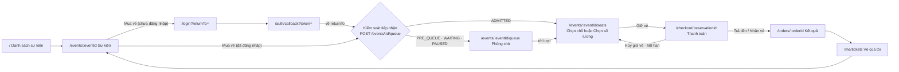
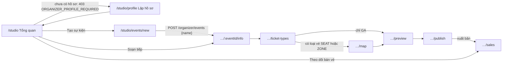

# Nguyên tắc UX và kiến trúc thông tin

> Trạng thái: **Approved** · Cập nhật: 2026-10-06 · DOC-38
> Phụ thuộc: SDD gốc §13, [Sổ quyết định](../00-decision-register.md) (DR-10, 12, 24, 36, 41, 44, 57, 66, 67, 68, 69, 70), [DOC-02](../01-product/personas-and-journeys.md), [DOC-04](../01-product/use-cases.md), [DOC-06](../02-glossary.md), [DOC-12](../03-architecture/code-architecture.md) §6, [DOC-39](design-system.md), [DOC-40](ui-states-and-copy.md)
> Người dùng chính: P1-01 (khung frontend), mọi task màn hình P1–P5, DOC-41…60 (đặc tả từng màn hình), người review PR frontend

Tài liệu này chốt các nguyên tắc chung của giao diện, sơ đồ trang, bản đồ URL, điều hướng theo vai trò, quy tắc responsive và ngân sách hiệu năng. Token và component nằm ở [DOC-39](design-system.md); trạng thái và chuỗi giao diện nằm ở [DOC-40](ui-states-and-copy.md); từng màn hình nằm ở DOC-42…60 (danh mục ở DOC-41). Nguồn của bố cục là canvas "Ticket — Design system & luồng mua vé" (https://claude.ai/artifact/2WEpFawM4q1J9g6zr7vSdU, gọi là **canvas thiết kế**; tên artboard viết như `05`, `M05`, `Studio 04`).

Mọi quyết định mới khi viết tài liệu này ghi DR-131…137 và tóm tắt ở mục 11.

## 1. Nguyên tắc

Mỗi nguyên tắc có số `UXP-xx` để màn hình và PR dẫn lại. Nguyên tắc nào có hệ quả kiểm thử được ghi cột "Kiểm bằng".

| ID | Nguyên tắc | Vì sao | Kiểm bằng |
| --- | --- | --- | --- |
| UXP-01 | Mỗi màn có **một nút chính** (nền `--ink`, cao 52 px, chữ `font-weight 600`). Việc phụ là nút viền hoặc liên kết. Nút đỏ (`--stamp`) chỉ xuất hiện khi thời gian giữ vé còn dưới 2 phút hoặc cho việc không hoàn tác được | Người đang gấp trong giờ mở bán không phải chọn giữa nhiều nút; canvas `Components` mục A | UX-01 |
| UXP-02 | **Trạng thái chỉ là gợi ý, kết quả thật là kết quả của lệnh giữ vé.** Ghế hiện "còn trống" vẫn có thể bị người khác lấy; giao diện không bao giờ hứa chỗ trước khi `POST /events/{id}/reservations` thành công. Thông báo cố định ở màn Chọn chỗ: "Chỗ chỉ được giữ sau khi bạn bấm nút này" | NEVER OVERSELL do database quyết định, không phải client (SDD gốc 4.2, DR-46, DR-62) | UX-02 |
| UXP-03 | **Không trạng thái nào chỉ ở client.** Hạn giữ vé, vị trí hàng đợi, trạng thái đơn, tình trạng chỗ lấy từ server; client chỉ đếm ngược trên mốc của server (DR-66). Ngoại lệ duy nhất: lựa chọn chưa giữ lưu `localStorage` (mục 5) và "mất kết nối" của phòng chờ | Tránh đồng hồ máy người dùng, tab thứ hai, thiết bị thứ hai làm lệch sự thật | UX-03 |
| UXP-04 | **Đồng hồ về 0 thì hỏi lại server, không tự kết luận** (DR-66). Hết giờ → gọi `GET /reservations/{id}`; trả `EXPIRED` mới hiện màn hết hạn | Job trả vé có thể chậm tới 30 giây (NFR-03); thanh toán có thể đã thành công | UX-04 |
| UXP-05 | **Tự thử lại khi quá tải, người dùng không bấm lại.** 503 `OVERLOADED` và 429 `RATE_LIMITED` hiện thanh tiến trình "Tự thử lại sau N giây", dùng `Retry-After` (mục 8.2). Vé đã giữ không bị ảnh hưởng và được nói rõ | Bấm lại liên tục làm tải tăng đúng lúc hệ thống yếu nhất | UX-05 |
| UXP-06 | **Mọi thông báo lỗi nói điều đã xảy ra và việc làm tiếp** (canvas `ComponentsStudio` mục L). Không "Có lỗi xảy ra" trơ trọi. Mã `code` không bao giờ hiện cho người dùng, trừ `requestId` ở lỗi 500 | Người mua mất ghế cần biết làm gì ngay | UX-06 |
| UXP-07 | **Trạng thái rỗng luôn mời một bước kế tiếp** ("Tạo sự kiện đầu tiên", "Xem sự kiện"). Trạng thái đang tải dùng khung giữ đúng hình nội dung sắp hiện, không spinner toàn trang | Giữ bố cục ổn định, tránh nhảy layout | UX-07 |
| UXP-08 | **Không dựa vào màu một mình.** Trạng thái ghế, trạng thái sự kiện, lỗi đều có chữ, hình khối hoặc biểu tượng đi kèm; phân biệt được khi in đen trắng (DOC-39 §5) | Tiếp cận; màu `type-3` chỉ đạt tỉ lệ 2,21 trên nền trắng | UX-08 |
| UXP-09 | **Vùng chạm tối thiểu 44 px, tương phản chữ tối thiểu 4,5:1** (3:1 từ 24 px trở lên). Ghế trên sơ đồ là ngoại lệ có điều kiện (mục 7.3) | WCAG 2.2 AA; PS-1 dùng điện thoại | UX-09 |
| UXP-10 | **Giữ lựa chọn qua đăng nhập** (mục 5) và **quay lại đúng trang** sau đăng nhập hoặc hết phiên | Người mua thường mở magic link ở tab khác (SDD gốc 5.3) | UX-10 |
| UXP-11 | **Thao tác không hoàn tác được dùng hộp thoại xác nhận có nút gọi đúng tên việc**; tiêu điểm đặt ở nút giữ lại; nút phá hủy dùng màu dấu đỏ (canvas `ComponentsStudio` mục N) | Xuất bản, hủy sự kiện, hủy giữ vé | UX-11 |
| UXP-12 | **Hai thao tác đẩy dữ liệu khác nhau không dùng chung một nút.** "Lưu bản nháp" và "Lưu và sang <bước>" là hai nút (DR-70); "Giữ vé" và "Thanh toán" là hai bước, không gộp | Lỗi giữa chừng phải biết dừng ở đâu | UX-12 |
| UXP-13 | **Thời gian luôn theo múi giờ của sự kiện, không theo máy người xem**, kèm hậu tố offset khi khác múi giờ mặc định (DR-12). Số tiền luôn VND, không phần lẻ (DR-10, DR-13) | Người xem ở nước ngoài vẫn thấy đúng giờ diễn | UX-13 |
| UXP-14 | **Chuỗi giao diện luôn qua key i18n**; dữ liệu do người tổ chức nhập (tên sự kiện, loại vé, khu vực, mô tả) không dịch (DR-10) | `pnpm i18n:check` | UX-14 |
| UXP-15 | **Tên sản phẩm lấy từ `APP_NAME`** (DR-54, DR-68); canvas ghi "ticket" là tên tạm | Đổi tên không sửa code giao diện | UX-15 |

## 2. Sơ đồ trang

### 2.1 Phía người mua



Hai điểm cần nhớ:

- Với sự kiện còn chỗ và hàng trống, `POST /events/{id}/queue` trả `ADMITTED` ngay và người mua **không thấy phòng chờ** (DR-57): từ `/events/:eventId` đi thẳng tới `/events/:eventId/seats`.
- `/events/:eventId/seats` hiện **Chọn chỗ** (DOC-46) khi sự kiện có loại vé `SEAT`/`ZONE`, hiện **Chọn số lượng** (DOC-47) khi chỉ có loại vé `GA` (DR-67). Quyết định này dựa vào trường `hasSeatMap` của `GET /events/{id}` (E-xx ở DOC-37).

### 2.2 Phía người tổ chức (Studio)



Thanh bước hiển thị: `Thông tin → Loại vé → Sơ đồ → Xem trước → Xuất bản`, thêm `Bán vé` sau khi xuất bản (canvas `ComponentsStudio` mục H). Bước **Sơ đồ ẩn** khi không có loại vé `SEAT`/`ZONE` (DR-70). Thanh bước cho nhảy tới bước đã xong hoặc đang ở; bước chưa tới không bấm được.

## 3. Bản đồ URL

Nguồn: DR-67. Mọi đường dẫn là route của SPA (React Router 7, `createBrowserRouter`, DR-03); nginx trả `index.html` cho mọi đường dẫn không bắt đầu bằng `/api/` hoặc `/media/` (DOC-62).

| URL | Màn | DOC | Quyền vào | Chunk |
| --- | --- | --- | --- | --- |
| `/` | Danh sách sự kiện | DOC-42 | Khách | `main` |
| `/events/:eventId` | Sự kiện | DOC-43 | Khách | `main` |
| `/login?returnTo=` | Đăng nhập (7 biến thể) | DOC-44 | Khách | `main` |
| `/auth/callback?token=` | Xác minh đường dẫn đăng nhập (gọi `POST /auth/verify`) | DOC-44 | Khách | `main` |
| `/events/:eventId/queue` | Phòng chờ | DOC-45 | Đã đăng nhập | `queue` |
| `/events/:eventId/seats` | Chọn chỗ hoặc Chọn số lượng | DOC-46, DOC-47 | Đã đăng nhập | `seat-picker` (Konva); `quantity-picker` cho GA |
| `/checkout/:reservationId` | Thanh toán | DOC-48 | Đã đăng nhập, chủ reservation | `checkout` (Stripe.js) |
| `/orders/:orderId` | Kết quả | DOC-49 | Đã đăng nhập, chủ đơn | `main` |
| `/me/tickets` | Vé của tôi | DOC-50 | Đã đăng nhập | `main` |
| `/studio` | Tổng quan | DOC-54 | `ORGANIZER` | `studio` |
| `/studio/profile` | Lập hồ sơ tổ chức | DOC-53 | Đã đăng nhập | `studio` |
| `/studio/events/new` | Tạo sự kiện | DOC-55 | `ORGANIZER` | `studio` |
| `/studio/events/:eventId/info` | Thông tin sự kiện | DOC-55 | `ORGANIZER`, chủ sự kiện | `studio` |
| `/studio/events/:eventId/ticket-types` | Loại vé và giá | DOC-56 | như trên | `studio` |
| `/studio/events/:eventId/map` | Seat map editor | DOC-57 | như trên | `studio-map` (Konva + editor) |
| `/studio/events/:eventId/preview` | Xem trước | DOC-58 | như trên | `studio` |
| `/studio/events/:eventId/publish` | Xuất bản và mở bán | DOC-59 | như trên | `studio` |
| `/studio/events/:eventId/sales` | Theo dõi bán vé | DOC-60 | như trên | `studio` |
| `*` | Không tìm thấy (E1) | DOC-52 | Ai cũng vào | `main` |

Quy ước:

- `:eventId`, `:reservationId`, `:orderId` là UUIDv7 (DR-11). Tham số sai định dạng hoặc không tồn tại → trang E1 (404), không phân biệt hai trường hợp.
- `returnTo` chỉ nhận đường dẫn nội bộ bắt đầu bằng một dấu `/` (không `//`, không có scheme). Giá trị khác bị bỏ và về `/`. Server cũng kiểm lại ở `POST /auth/verify` (DOC-19).
- Tài nguyên không thuộc người xem (reservation, đơn, sự kiện của tổ chức khác) trả 404, hiện E1 (DR-23). Riêng người đã có session nhưng chưa có vai trò `ORGANIZER` vào `/studio/**` hiện E3 (403) với nội dung ở DOC-52; vào `/studio` khi chưa có hồ sơ thì chuyển tới `/studio/profile`.
- Sự kiện `ENDED` hoặc `CANCELLED` vẫn mở được bằng URL trực tiếp và hiện trạng thái (DR-24); không có trong danh sách `/`.
- Bước Sơ đồ khi vào bằng URL mà sự kiện không có loại vé `SEAT`/`ZONE` → chuyển về `…/preview`.

### 3.1 Chunk tải lười và nguồn gói

Chunk là đơn vị `React.lazy`/`lazy` route (DOC-12 §6). Các chunk nặng chỉ tải khi vào route cần nó:

| Chunk | Chứa | Tải khi |
| --- | --- | --- |
| `main` | router, providers, i18n (chỉ locale đang dùng), TanStack Query, các màn nhẹ (danh sách, sự kiện, đăng nhập, kết quả, vé của tôi, trang lỗi) | Mọi trang |
| `queue` | Phòng chờ, hook hỏi vị trí | `/events/:eventId/queue` |
| `seat-picker` | Konva, react-konva, `map-core/render`, rbush | `/events/:eventId/seats` khi sự kiện có sơ đồ |
| `checkout` | `@stripe/stripe-js`, `@stripe/react-stripe-js` | `/checkout/:reservationId` |
| `studio` | các màn Studio trừ editor, react-hook-form, zod | `/studio/**` |
| `studio-map` | Konva, editor, Zustand store, `map-core` đầy đủ | `…/map` |

`seat-picker` được **tải trước** (`<link rel="modulepreload">` hoặc `import()` khi rê chuột/chạm vào nút Mua vé) để chọn chỗ không trễ vào đúng giây mở bán. `checkout` tải trước khi lệnh giữ vé đang chạy (DR-50). Locale `en` chỉ tải khi người dùng chọn `en`.

## 4. Điều hướng theo vai trò

Header chung gồm: logo (`APP_NAME` + dấu chấm đỏ), bộ chọn ngôn ngữ `vi | en` (DR-10), và menu tài khoản. Header Studio thêm nhãn `Studio` bên cạnh logo và hiện tên tổ chức trong menu (canvas `ComponentsStudio` mục O).

| Trạng thái người xem | Phần bên phải header | Mục trong menu tài khoản |
| --- | --- | --- |
| Khách (chưa đăng nhập) | Liên kết "Đăng nhập" | — |
| Người mua đã đăng nhập, chưa có hồ sơ tổ chức | Nút "Tài khoản" ▾ (avatar chữ cái đầu của email) | `Đang đăng nhập: <email>` · Vé của tôi · Đăng xuất · "Tạo hồ sơ tổ chức" (dẫn tới `/studio/profile`) |
| Người tổ chức (có hồ sơ) trên trang mua vé | Như trên | `Đang đăng nhập: <email>` · Vé của tôi · Studio của bạn · Đăng xuất |
| Người tổ chức trong Studio | Nút hiện tên tổ chức ▾ | `Đang đăng nhập: <email>` · Trang mua vé · Vé của tôi · Đăng xuất |
| Quy trình mua vé (`/events/:eventId/seats`, `/checkout/*`, `/orders/*`) | Thanh bước "Chọn chỗ → Thanh toán → Nhận vé" ở giữa header (với sự kiện GA bước 1 tên "Chọn vé"); menu tài khoản giữ nguyên | như trên |

Quy tắc:

- Mục "Tạo hồ sơ tổ chức" cho người mua chưa có hồ sơ là bổ sung so với canvas (canvas Studio 00 chỉ có đường vào từ `/studio`); ghi ở DR-131.
- Menu tài khoản là `<details>` (canvas) hoặc button `aria-expanded` có thể thao tác bằng bàn phím: `Enter`/`Space` mở, `Esc` đóng và trả tiêu điểm về nút mở, mũi tên di chuyển giữa mục.
- Đăng xuất gọi `POST /auth/logout`, xóa cache TanStack Query, và hiện màn Đăng nhập biến thể "Đã đăng xuất" (UC-01). Mọi tab khác nhận 401 ở request kế tiếp và hiện biến thể "Hết phiên đăng nhập".
- Bộ chọn ngôn ngữ: khi đã đăng nhập gọi `PATCH /me { locale }`, khi chưa thì chỉ đặt cookie `tb_lang` (DR-10, UC-20). Đổi ngôn ngữ không tải lại trang.
- Không có chế độ quản trị nền tảng: người vận hành dùng terminal (PS-5, DOC-01).

## 5. Giữ lựa chọn qua đăng nhập

Nguồn: DR-67. Người mua chọn ghế trước khi đăng nhập; link magic link thường mở ở tab mới.

```json
// localStorage["tb.selection.0198f3b2-6c1e-7a40-9d2e-3f5a7b8c9d01"]
{
  "seatIds": ["0198f3b2-7001-7000-8000-000000000a09", "0198f3b2-7001-7000-8000-000000000a0a"],
  "zones": { "standing": 1 },
  "ga": {},
  "savedAt": 1792049400000
}
```

- Ghi mỗi lần lựa chọn đổi (debounce 300 ms). Khóa theo `eventId`. `zones` khóa theo `zoneKey` của tài liệu sơ đồ; `ga` khóa theo `ticketTypeId`.
- Khôi phục khi vào `/events/:eventId/seats` nếu `Date.now() - savedAt < 30 phút` (dùng đồng hồ máy chỉ cho mốc này; mốc 30 phút không ảnh hưởng tính đúng đắn). Sau khi khôi phục xóa khóa. Ghế đã không còn trống ở lần tải tình trạng chỗ kế tiếp bị bỏ khỏi đơn kèm thông báo "Ghế … vừa có người giữ" (DOC-40 §4).
- Mọi đọc/ghi bọc `try/catch`; lỗi (chế độ riêng tư, bị chặn) thì bỏ qua và mất tính năng khôi phục, không báo lỗi.
- Dùng `localStorage`, không dùng `sessionStorage`, vì tab mở từ email không thừa hưởng `sessionStorage`.
- Không lưu `reservationId` ở client: người mua đã có reservation mở được dẫn về `/checkout/:reservationId` nhờ 409 `ACTIVE_RESERVATION_EXISTS` (DR-41).

Luồng sau đăng nhập: `/login?returnTo=%2Fevents%2F0198…%2Fseats` → gửi link → người dùng mở link ở tab mới `/auth/callback?token=…` → `POST /auth/verify` trả `{ returnTo }` → `navigate(returnTo, { replace: true })` → trang Chọn chỗ khôi phục lựa chọn. Ghi chú "Sau khi đăng nhập" trên màn Đăng nhập nói đúng đích đến (canvas `02`, DOC-44).

## 6. Quy tắc theo ngữ cảnh

### 6.1 Điện thoại trước (PS-1)

Quy trình mua vé thiết kế ở **390 px** trước, mở rộng lên máy tính. Canvas có bản `M00…M08`.

| Quy tắc | Giá trị |
| --- | --- |
| Điểm gãy | `≥ 1024 px` bố cục hai cột (sơ đồ + đơn hàng); `< 1024 px` một cột |
| Gutter trang | `clamp(16px, 4vw, 32px)` |
| Thẻ đơn hàng ở màn Chọn chỗ | Thanh dưới cố định (số vé, tạm tính, nút Giữ vé) → mở thành bottom sheet (DR-69) |
| Thanh bước ở header | Xuống hàng thứ hai, chia đều chiều rộng (canvas `ComponentsStudio` mục H) |
| Sơ đồ | Dưới 40% zoom không chọn được ghế (chỉ thấy khối section) và hiện thông báo; chạm hai ngón để zoom, một ngón để chọn (DR-69) |
| Chế độ Danh sách | Có ở mọi cỡ màn hình; là đường chính cho bàn phím và trình đọc màn hình (DR-69) |
| Bàn phím ảo | Ô nhập email dùng `inputmode="email"`, `autocomplete="email"`; ô thẻ do Stripe quản lý |

### 6.2 Máy tính trong giờ mở bán (PS-2)

- Phòng chờ và Chọn chỗ chạy được khi tab nền: bộ hỏi vị trí vẫn chạy (`setTimeout` bị trình duyệt làm chậm tối đa 1 lần/giây; vẫn trong `idle_timeout` 2 phút của DR-57). Khi tab quay lại, hỏi ngay một lần.
- Mỗi tài khoản một chỗ trong hàng; mở thêm tab không lên trước (nói rõ trên màn Phòng chờ).

### 6.3 Studio (PS-3, PS-4)

- Studio dùng được từ **1024 px**. Dưới 1024 px các bước Thông tin, Loại vé, Xem trước, Xuất bản, Bán vé vẫn dùng được (một cột); bước **Sơ đồ** hiện màn `04m` "Màn hình hẹp hơn 1024 px" với nội dung nói cần màn hình rộng hơn để vẽ sơ đồ và đường quay lại bước Xem trước (DR-70).
- Editor cần chuột hoặc bàn phím; không hỗ trợ cảm ứng ở giai đoạn này (DOC-01 ngoài phạm vi).
- Studio 02/03 lưu **thủ công** (`PATCH` kèm `rowVersion`); bước Sơ đồ **tự lưu** (DR-36, DR-70).

### 6.4 Người vận hành (PS-5)

Không có giao diện. Số liệu nhìn bằng Grafana (profile `obs`, DOC-33), kiểm tra bằng `make invariants`.

## 7. Giao diện theo trạng thái dữ liệu

### 7.1 Trạng thái hiển thị của sự kiện chi phối nút chính

Nút chính của trang Sự kiện (DOC-43) lấy từ `displayStatus` do server tính (DR-24), không tự suy từ giờ máy:

| `displayStatus` | Nhãn | Nút chính |
| --- | --- | --- |
| `ON_SALE` | Đang mở bán | "Mua vé" |
| `UPCOMING` | Sắp mở bán | Vô hiệu "Mở bán sau" kèm đồng hồ đếm ngược tới `saleStartsAt` (giờ server, DR-66); liên kết "Đăng nhập trước" nếu chưa đăng nhập |
| `SOLD_OUT` | Hết vé | Vô hiệu "Hết vé"; liên kết "Xem sự kiện khác" |
| `SALE_CLOSED` | Đã đóng bán | Vô hiệu; không mở lại |
| `PAUSED` | Tạm dừng bán | Vô hiệu; nói "Vé đã mua vẫn hợp lệ" |
| `ENDED` | Đã kết thúc | Không có |
| `CANCELLED` | Đã hủy | Không có; nói "Chưa có vé nào được bán nên không ai bị trừ tiền" **chỉ khi** sự kiện chưa có đơn `PAID`; có đơn `PAID` thì dùng chuỗi `events.status.cancelled.refund` (DOC-40 §2.3, DR-28) |
| `DRAFT` | Bản nháp | Chỉ người tổ chức xem được qua Xem trước; khách vào URL → E1 |

`displayStatus` chỉ là gợi ý (UXP-02): người mua bấm "Mua vé" lúc `ON_SALE` vẫn có thể nhận 409 `EVENT_NOT_ON_SALE` hoặc `SEATS_UNAVAILABLE`; giao diện xử lý như lỗi bình thường (DOC-40 §4).

### 7.2 Chọn chỗ

- Ba lớp: tình trạng chỗ (cache, gợi ý) → lựa chọn của người mua (client) → kết quả lệnh giữ vé (sự thật). Khi lệnh giữ vé thất bại 409 `SEATS_UNAVAILABLE` với `unavailableSeatIds`, giao diện **tự bỏ** các ghế đó khỏi đơn, đánh dấu "Có người giữ", giữ nguyên ghế còn lại và hiện thông báo (canvas `05` biến thể "Ghế bị trùng"). Không thử giữ lại tự động.
- 429 `QUEUE_REQUIRED` → về `/events/:eventId/queue` (DR-58). 409 `ACTIVE_RESERVATION_EXISTS` → thông báo có nút "Tiếp tục thanh toán" tới `/checkout/:reservationId` và "Hủy giữ vé" (DR-41).
- Giới hạn kỹ thuật 50 vé mỗi lần giữ (`reservation.max-units-per-hold`, DR-41): bộ tăng giảm và giỏ ghế dừng ở mức đó, thông báo `checkout.limit.tooManyUnits`. **Không hiện** "Mỗi đơn tối đa 8 vé" như canvas (xem mục 9).

### 7.3 Vùng chạm của ghế

Ghế vẽ 26 px (canvas) và cách nhau 6 px; DR-69 yêu cầu vùng chạm ≥ 24 px **trên màn hình**. Hai biện pháp: (1) dưới 40% zoom không chọn được ghế; (2) trên điện thoại, chạm vào một section ở zoom thấp thì tự phóng tới mức ghế ≥ 24 px. Chế độ Danh sách là đường thay thế đạt 44 px. Đây là ngoại lệ có chủ ý của UXP-09 cho ghế trên sơ đồ.

## 8. Mẫu hành vi dùng chung

### 8.1 Đồng hồ giữ vé

- Hiển thị `mm:ss` (mono), tính `expiresAt − (Date.now() + offset)` với `offset` theo DR-66, cập nhật mỗi 250 ms bằng `requestAnimationFrame` hoặc `setInterval`, tạm dừng cập nhật DOM khi tab ẩn nhưng tính lại khi hiện.
- Dưới 2 phút: thẻ đồng hồ chuyển nền `--stamp-tint`, viền `--stamp`, nhãn "Sắp hết giờ", nút "Thanh toán ngay" dùng màu dấu đỏ (canvas `ThanhToan` biến thể "Sắp hết giờ"). Thay đổi này được thông báo cho trình đọc màn hình một lần (`aria-live="polite"`), không đọc mỗi giây.
- Về 0: gọi lại `GET /reservations/{id}` (UXP-04).
- Còn dưới 30 giây mà người mua mới vào Thanh toán: server từ chối 409 `PAYMENT_WINDOW_TOO_SHORT` (DR-64); giao diện nói "Còn quá ít thời gian để thanh toán" và đưa về Chọn chỗ.

### 8.2 Tự thử lại khi quá tải

Áp dụng cho 503 `OVERLOADED`, 503 `PAYMENT_PROVIDER_UNAVAILABLE` ở bước tạo PaymentIntent, 429 `RATE_LIMITED` và lỗi mạng khi **đọc**. Không áp dụng cho `POST` thay đổi dữ liệu trừ lệnh giữ vé và hủy giữ vé, vốn có `Idempotency-Key` (DR-45) nên thử lại an toàn với cùng key.

| Điều kiện | Chờ trước lần thử kế tiếp |
| --- | --- |
| Response có `Retry-After` (giây) | `clamp(Retry-After, 1, 32)` |
| Không có `Retry-After` (lỗi 500 liên tiếp, mạng) | 8 giây, rồi 16, rồi 32, giữ 32 (như canvas E4) |
| Trang lỗi 503 toàn trang (E4) | Như bảng trên; thanh tiến trình theo `(chờ − còn lại)/chờ` |

Giới hạn: tối đa 10 lần liên tiếp cho một thao tác, sau đó hiện lỗi với nút "Thử lại" bằng tay và dừng tự thử. Mọi thanh tiến trình có `role="status"` và nút "Thử lại ngay". Ghi ở DR-132.

### 8.3 Hộp thoại xác nhận

Cấu trúc cố định: nhãn loại (mono, chữ hoa) · tiêu đề (Barlow Condensed) · một đoạn hệ quả · hai nút. Nút trái là việc giữ lại ("Chưa xuất bản", "Giữ sự kiện"); nút phải gọi đúng tên việc ("Xuất bản và mở bán", "Hủy sự kiện"). `Esc` = nút trái. Tiêu điểm vào nút trái khi mở nếu việc không hoàn tác được, vào nút phải trong các trường hợp còn lại. Bẫy tiêu điểm trong hộp thoại; trả tiêu điểm về nút mở khi đóng.

### 8.4 Thay đổi chưa lưu (Studio 02, 03)

Thanh trạng thái bước hiện một trong `Bản nháp` / `Đã lưu` / `Có thay đổi chưa lưu`. Rời trang khi có thay đổi chưa lưu → hộp thoại "Rời trang mà chưa lưu?" với "Ở lại" và "Rời đi" (DR-70). 409 `STALE_EVENT_VERSION` → hộp thoại "Sự kiện đã được sửa ở nơi khác" với nút "Tải lại" (bỏ thay đổi của tab này) (DR-70). 409 `REVISION_CONFLICT` ở editor dùng màn `04j` (DR-36).

### 8.5 Lỗi 401 giữa chừng

Mọi 401 `UNAUTHENTICATED` từ API (không phải từ `POST /auth/verify`): lưu `returnTo = location.pathname + search`, xóa cache người dùng, điều hướng tới `/login?returnTo=…` ở biến thể "Hết phiên đăng nhập" (E2). Lựa chọn chưa giữ đã nằm sẵn trong `localStorage` (mục 5).

## 9. Khác biệt có chủ ý so với canvas

Canvas là nguồn bố cục nhưng được vẽ trước một số quyết định. Khi khác nhau, tài liệu và DR thắng (master plan §0.2). Danh sách này để người làm màn hình không "sửa cho giống canvas".

| Canvas | Tài liệu | Căn cứ |
| --- | --- | --- |
| "Mỗi đơn tối đa 8 vé." ở trang Sự kiện, Chọn chỗ, Chọn số lượng, Xem trước, Xuất bản | Không có giới hạn số vé mỗi đơn; chỉ có trần kỹ thuật 50 vé mỗi lần giữ, hiện khi chạm trần | DR-41 |
| Studio 02: ô "Số vé tối đa mỗi đơn" và dòng "Mỗi đơn" ở khung "Người mua sẽ thấy" | Bỏ ô và dòng này | DR-41 |
| Studio 02: công tắc "Bật phòng chờ khi mở bán" (nhãn "Bật" / "Tự bật khi đông") | Kiểm soát tiếp nhận luôn chạy; công tắc là `high_demand` (thêm nhóm chờ trước và xáo ngẫu nhiên). Nhãn khung xem trước đổi thành "Phòng chờ trước giờ mở bán: Bật / Tắt" (chuỗi ở DOC-40 §3.4) | DR-57 |
| Font nạp từ Google Fonts | Tự host bằng `@fontsource`, không gọi mạng ngoài lúc chạy | DR-68 |
| Giá hiển thị `1.800.000đ` | `1.800.000 ₫` ở `vi`, `₫1,800,000` ở `en` (định dạng `Intl`) | DR-10 |
| Giờ không kèm múi giờ | Thêm hậu tố offset (`20:00 GMT+9`) khi múi giờ sự kiện khác `PLATFORM_TIMEZONE` | DR-12 |
| Thời gian chờ hoàn tiền `[THỜI GIAN HOÀN TIỀN]`, `[EMAIL HỖ TRỢ]` ở màn Kết quả "Tiền về trễ" | Điền từ cấu hình `support.email` và `support.refund-sla-text` (DR-44, DOC-34); không để chỗ giữ chỗ | DR-44, DR-54 |
| Màn Kết quả chỉ có "Đã thanh toán", "Đang xác nhận", "Tiền về trễ, hết vé" | Thêm biến thể cho lý do `AMOUNT_MISMATCH` và `EVENT_CANCELLED` và trạng thái `EXPIRED`/`CANCELLED` (DOC-49) | DR-44, DR-28 |

## 10. Test bắt buộc

Tiền tố `UX-` (đã kiểm tra chưa dùng ở `docs/`; đăng ký ở DOC-69). Các test này là Playwright hoặc Vitest + Testing Library; ID dùng làm tên test.

| ID | Kịch bản | Kết quả mong đợi |
| --- | --- | --- |
| UX-01 | Quét mọi route ở 1360 px và 390 px, đếm phần tử `.btn-primary` | Mỗi route có tối đa 1 nút chính nhìn thấy |
| UX-02 | Mở `/events/:id/seats` với mock server trả `SEATS_UNAVAILABLE` cho 1 trong 3 ghế đã chọn | Ghế bị trùng bị bỏ khỏi đơn và đánh dấu "Có người giữ"; 2 ghế còn lại giữ nguyên; không gọi lại `POST …/reservations` |
| UX-03 | Đổi đồng hồ máy lệch +10 phút, mock `X-Server-Time` đúng | Đồng hồ giữ vé hiện đúng theo server (± 1 giây) |
| UX-04 | Đồng hồ về 00:00 khi mock `GET /reservations/{id}` trả `ACTIVE` | Giao diện không hiện "Đã hết thời gian giữ vé"; hiện sau lần gọi trả `EXPIRED` |
| UX-05 | Mock 503 `OVERLOADED` với `Retry-After: 3` khi giữ vé | Thanh "Tự thử lại sau 3 giây", gọi lại đúng 1 lần ở giây 3 với **cùng** `Idempotency-Key`; sau 10 lần dừng và hiện nút "Thử lại" |
| UX-06 | Với mỗi `code` trong DOC-40 §4.1, mock response lỗi | Hiện đúng chuỗi key tương ứng; không chuỗi nào chứa `code` viết hoa |
| UX-07 | Mock độ trễ 2 giây cho `GET /events` | Khung chờ cùng chiều cao với 3 thẻ sự kiện; CLS < 0,05 |
| UX-08 | Chụp màn Chọn chỗ ở thang xám | Bốn trạng thái ghế phân biệt được bằng hình khối (đặc màu, đặc ink + dấu tích + viền kép, rỗng viền xám, đặc xám nhạt) |
| UX-09 | axe-core trên mọi route và biến thể trạng thái | 0 vi phạm `color-contrast`, `target-size` (trừ ghế trên sơ đồ), `label`, `button-name` |
| UX-10 | Chọn 2 ghế khi chưa đăng nhập → đăng nhập qua Mailpit ở tab mới | Tab mới mở `/events/:id/seats` với 2 ghế đã chọn; khóa `localStorage` bị xóa sau khi khôi phục; sau 31 phút thì không khôi phục |
| UX-11 | Bấm "Hủy sự kiện" ở Xuất bản | Hộp thoại mở với tiêu điểm ở "Giữ sự kiện"; `Esc` đóng không hủy |
| UX-12 | Studio 02 sửa tên rồi bấm "Lưu bản nháp" | Ở lại bước Thông tin, trạng thái "Đã lưu"; "Lưu và sang Loại vé" chuyển bước |
| UX-13 | Sự kiện `timezone = Asia/Tokyo`, trình duyệt `Asia/Ho_Chi_Minh`, `starts_at = 2026-11-14T11:00:00Z` | Hiện `20:00 GMT+9` (không phải 18:00) |
| UX-14 | `pnpm i18n:check` với một key chỉ có ở `vi` | Thất bại, in tên key |
| UX-15 | Đặt `APP_NAME=Demo` | Logo, tiêu đề tab, email dùng "Demo"; không còn chuỗi "ticket" cứng trong bundle (trừ tên package) |
| UX-16 | Vào `/studio/events/:id/map` ở cửa sổ 900 px | Hiện màn `04m`; các bước khác vẫn truy cập được |
| UX-17 | Vào `/login?returnTo=https://evil.example/` | Đăng nhập xong về `/`; không điều hướng ra ngoài |
| UX-18 | Sự kiện chỉ có GA, vào `/events/:id/seats` | Hiện Chọn số lượng; thanh bước ghi "Chọn vé" |
| UX-19 | Người dùng chưa có hồ sơ vào `/studio` | Chuyển tới `/studio/profile`; người có hồ sơ của tổ chức khác vào `…/events/:id/info` của sự kiện không thuộc mình thấy E1 (404) |

## 11. Tóm tắt quyết định phát sinh khi viết tài liệu này

Các quyết định mới là DR-131…137 trong sổ quyết định.

| ID tạm | Quyết định | Quyết bởi | Ghi vào |
| --- | --- | --- | --- |
| DR-131 | Thêm mục "Tạo hồ sơ tổ chức" vào menu tài khoản của người chưa có hồ sơ; `returnTo` chỉ nhận đường dẫn nội bộ một dấu `/` | Claude (Owner ủy quyền) | DOC-38, DOC-44, DOC-53, DOC-19 |
| DR-132 | Quy tắc tự thử lại: `clamp(Retry-After,1,32)` hoặc 8→16→32 giây; tối đa 10 lần liên tiếp rồi dừng và hiện nút thử lại | Claude (Owner ủy quyền) | DOC-38, DOC-40, DOC-36 |
| DR-133 | Tên và giá trị token mở rộng của canvas (xem DOC-39 §2.4) | Claude (Owner ủy quyền) | DOC-39 |

## Câu hỏi còn mở

Không có. Quyết định phát sinh khi viết tài liệu này: DR-131…133 (mục 11), đã vào sổ quyết định.
