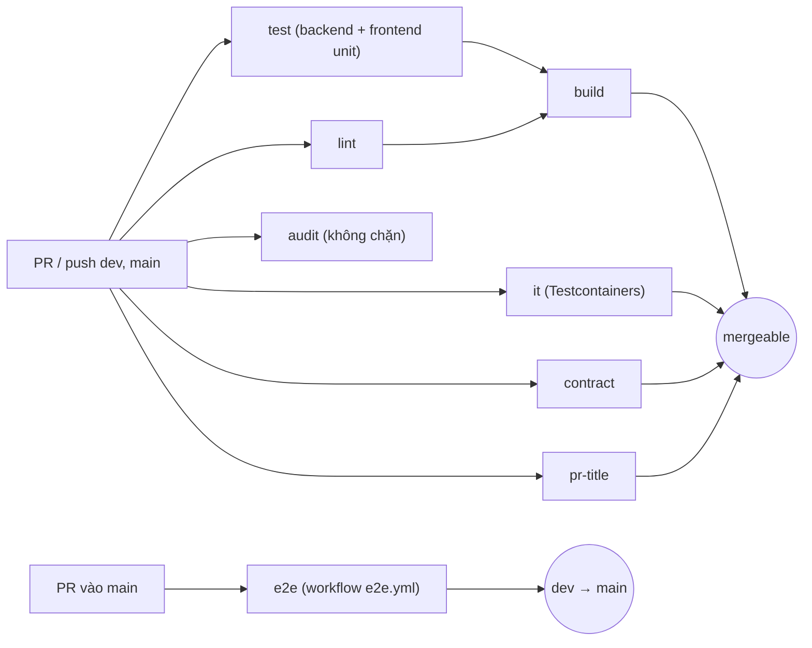

# CI

> Trạng thái: **Approved** · Cập nhật: 2026-10-06 · DOC-63 (khung ở P1)
> Phụ thuộc: SDD gốc §14, §15, [DOC-11](../03-architecture/tech-stack-and-versions.md) §2, §4, [DOC-12](../03-architecture/code-architecture.md) §8, [DOC-61](local-dev.md) §3, [DOC-62](deploy-compose.md), [Sổ quyết định](../00-decision-register.md) (DR-01, 07, 08, 77, 81), master plan §7
> Người dùng chính: P1-01 (khởi tạo `ci.yml`), mọi PR; P1-08 (`make contract`); P1-09 (kích thước bundle); DOC-69, DOC-32 (quét phụ thuộc)

Tài liệu đặc tả workflow GitHub Actions của dự án: từng job, điều kiện chặn merge, cache, các kiểm tra `schema.d.ts`, `oasdiff`, `i18n:check`, tên migration và quét phụ thuộc. CI **chỉ gọi các target `make`** của [DOC-61](local-dev.md) §3 (DR-01, DR-08), nên mọi lỗi CI tái hiện được ở máy dev bằng đúng lệnh đó. Chiến lược test (loại test, ngưỡng coverage, tiền tố test) nằm ở DOC-69; ở đây chỉ nói bước CI nào chạy test nào. **Khung ở P1**: các job E2E, thực nghiệm, scan chuyên sâu được bổ sung ở phase dùng chúng; mỗi bổ sung đi cùng PR của task.

> **Chưa chạy thử.** Chưa có `.github/workflows/` tại thời điểm viết. YAML dưới đây là đặc tả cho P1-01; version của action cần khóa (theo SHA) và kiểm tra lúc đó. Thời gian chạy là **dự kiến** (planned).

## 1. Nguyên tắc

- **Một workflow chính `ci.yml`** chạy trên `pull_request` (nhánh đích `dev` hoặc `main`) và `push` vào `dev`, `main` (DR-08). Không có CD: không tự triển khai (DR-08).
- **Chặn merge khi đỏ.** Nhánh `dev` và `main` bật branch protection: bắt buộc PR, bắt buộc các check ở §3 xanh, nhánh phải cập nhật so với đích. Chỉ một người nên cũng áp dụng: quy trình giống nhau để CI là nguồn sự thật.
- **CI = máy dev.** Mỗi bước là một target `make`; không có logic ẩn trong YAML ngoài cài đặt công cụ, cache và tải artifact.
- **Nhanh trước, chậm sau.** Job rẻ (`lint`, `pr-title`) chạy song song với job chậm; job chậm (`it`) không chờ `lint` để tổng thời gian ngắn (dự kiến ≤ 15 phút).
- **Không có secret.** CI không dùng khóa Stripe (DR-77: `PAYMENTS_MODE=fake`); không bước nào cần `secrets.*` ngoài `GITHUB_TOKEN`.
- **Không E2E và tải trong luồng chặn thường xuyên** (DR-08); E2E chạy theo §5.

## 2. Sơ đồ job



## 3. Các job của `ci.yml`

Cột "Chặn merge" là tên check bắt buộc trong branch protection.

| Job | Chạy | Lệnh | Điều kiện đạt | Chặn merge | Hết giờ | Dự kiến |
| --- | --- | --- | --- | --- | --- | --- |
| `lint` | mọi PR, push | `make lint` | Spotless, ESLint, Prettier, `tsc --noEmit`, `pnpm i18n:check`, `scripts/check-migrations.sh`, `scripts/check-secrets.sh` đều đạt | Có | 10 phút | 3 phút |
| `test` | mọi PR, push | `make test` | Unit backend và frontend xanh (gồm Spring Modulith `verify()` và ArchUnit); JaCoCo và Vitest đạt ngưỡng §6 | Có | 15 phút | 6 phút |
| `it` | mọi PR, push | `make it` | Tích hợp và đồng thời xanh (64 luồng × 20 lần, DR-77); `make invariants` sạch sau test chạm kho vé | Có | 25 phút | 10 phút |
| `contract` | mọi PR, push | `make contract` rồi `oasdiff breaking` (§4.4) | OpenAPI do springdoc sinh khớp `api/openapi.yaml`; `schema.d.ts` khớp; không thay đổi phá vỡ | Có | 10 phút | 4 phút |
| `build` | sau `lint`, `test` | `make build` | Dựng được image `api` và bundle frontend; trang `/` ≤ 200 KB gzip (DR-81); tệp tải về là artifact | Có | 15 phút | 6 phút |
| `pr-title` | chỉ `pull_request` | script (§8) | Tiêu đề PR theo Conventional Commits (DR-07) | Có | 2 phút | < 1 phút |
| `audit` | PR, push, lịch hằng tuần | OSV-Scanner (§9) | Không lỗ hổng High/Critical đã có bản vá | **Không** (tham khảo; xem §9) | 10 phút | 2 phút |

Branch protection dùng đúng tên các check chặn ở bảng này (trừ `audit`, thêm `e2e` cho `main`, §10); đổi tên job phải đổi cả cài đặt branch protection trong cùng PR.

### 3.1 Khung `ci.yml`

```yaml
name: ci
on:
  pull_request:
    branches: [dev, main]
  push:
    branches: [dev, main]
  schedule:
    - cron: "17 3 * * 1"          # audit hằng tuần, thứ Hai 03:17 UTC
concurrency:
  group: ci-${{ github.ref }}
  cancel-in-progress: true         # PR mới đẩy lên hủy lần chạy cũ
permissions:
  contents: read
env:
  GRADLE_OPTS: "-Dorg.gradle.daemon=false"
  TESTCONTAINERS_RYUK_DISABLED: "false"

jobs:
  lint:
    runs-on: ubuntu-latest
    timeout-minutes: 10
    steps:
      - uses: actions/checkout@v5
        with: { fetch-depth: 0 }                 # check-migrations so với nhánh đích
      - uses: actions/setup-java@v5
        with: { distribution: temurin, java-version: "25" }
      - uses: gradle/actions/setup-gradle@v5
      - uses: pnpm/action-setup@v4                # đọc packageManager trong frontend/package.json
        with: { package_json_file: frontend/package.json }
      - uses: actions/setup-node@v5
        with: { node-version-file: .nvmrc, cache: pnpm, cache-dependency-path: frontend/pnpm-lock.yaml }
      - run: pnpm --dir frontend install --frozen-lockfile
      - run: make lint
        env: { BASE_REF: "${{ github.base_ref || 'dev' }}" }

  test:
    runs-on: ubuntu-latest
    timeout-minutes: 15
    steps:
      - uses: actions/checkout@v5
      - uses: actions/setup-java@v5
        with: { distribution: temurin, java-version: "25" }
      - uses: gradle/actions/setup-gradle@v5
      - uses: pnpm/action-setup@v4
        with: { package_json_file: frontend/package.json }
      - uses: actions/setup-node@v5
        with: { node-version-file: .nvmrc, cache: pnpm, cache-dependency-path: frontend/pnpm-lock.yaml }
      - run: pnpm --dir frontend install --frozen-lockfile
      - run: make test
      - uses: actions/upload-artifact@v4
        if: always()
        with:
          name: test-reports
          path: |
            backend/build/reports/tests
            backend/build/reports/jacoco
            frontend/coverage
          retention-days: 7

  it:
    runs-on: ubuntu-latest                       # có sẵn Docker cho Testcontainers
    timeout-minutes: 25
    steps:
      - uses: actions/checkout@v5
      - uses: actions/setup-java@v5
        with: { distribution: temurin, java-version: "25" }
      - uses: gradle/actions/setup-gradle@v5
      - run: docker pull postgres:18-alpine && docker pull redis:8.2-alpine && docker pull chrislusf/seaweedfs:${SEAWEEDFS_TAG}
        env: { SEAWEEDFS_TAG: "<tag minor, khớp .env.example>" }
      - run: make it
      - uses: actions/upload-artifact@v4
        if: failure()
        with: { name: it-reports, path: backend/build/reports/tests, retention-days: 7 }

  contract:
    runs-on: ubuntu-latest
    timeout-minutes: 10
    steps:
      - uses: actions/checkout@v5
        with: { fetch-depth: 0 }
      - uses: actions/setup-java@v5
        with: { distribution: temurin, java-version: "25" }
      - uses: gradle/actions/setup-gradle@v5
      - uses: pnpm/action-setup@v4
        with: { package_json_file: frontend/package.json }
      - uses: actions/setup-node@v5
        with: { node-version-file: .nvmrc, cache: pnpm, cache-dependency-path: frontend/pnpm-lock.yaml }
      - run: pnpm --dir frontend install --frozen-lockfile
      - run: make contract
      - name: oasdiff breaking
        if: github.event_name == 'pull_request' && !contains(github.event.pull_request.labels.*.name, 'breaking-ok')
        uses: oasdiff/oasdiff-action/breaking@v0.0.21     # khóa version lúc P1-01
        with:
          base: "origin/${{ github.base_ref }}:api/openapi.yaml"
          revision: api/openapi.yaml
          fail-on: ERR

  build:
    needs: [lint, test]
    runs-on: ubuntu-latest
    timeout-minutes: 15
    steps:
      - uses: actions/checkout@v5
      - uses: actions/setup-java@v5
        with: { distribution: temurin, java-version: "25" }
      - uses: docker/setup-buildx-action@v3
      - uses: pnpm/action-setup@v4
        with: { package_json_file: frontend/package.json }
      - uses: actions/setup-node@v5
        with: { node-version-file: .nvmrc, cache: pnpm, cache-dependency-path: frontend/pnpm-lock.yaml }
      - run: pnpm --dir frontend install --frozen-lockfile
      - run: make build                           # docker build api (cache gha) + pnpm build + check-bundle-size.sh
      - uses: actions/upload-artifact@v4
        with: { name: frontend-dist, path: frontend/dist, retention-days: 7 }

  pr-title:
    if: github.event_name == 'pull_request'
    runs-on: ubuntu-latest
    timeout-minutes: 2
    steps:
      - run: scripts/check-pr-title.sh
        env: { PR_TITLE: "${{ github.event.pull_request.title }}" }
```

Ba khối `setup-java`/`setup-node`/`pnpm` lặp lại có chủ ý để từng job đọc được độc lập; nếu P1-01 gom thành composite action `.github/actions/setup` thì cập nhật tài liệu này.

## 4. Chi tiết các kiểm tra

### 4.1 `make lint`

| Kiểm tra | Công cụ | Lệnh | Lỗi khi |
| --- | --- | --- | --- |
| Định dạng Java | Spotless + google-java-format (DR-81) | `./gradlew -p backend spotlessCheck` | Tệp chưa định dạng; sửa bằng `make fmt` |
| Lint và định dạng TypeScript | ESLint (flat config), Prettier | `pnpm --dir frontend lint && pnpm --dir frontend format:check` | Vi phạm luật |
| Kiểu | `tsc` | `pnpm --dir frontend typecheck` (`tsc --noEmit`) | Lỗi kiểu |
| **i18n** | `pnpm i18n:check` | `pnpm --dir frontend i18n:check` | Thiếu key ở `vi` hoặc `en`; key thừa; chuỗi cứng trong JSX; placeholder lệch giữa hai locale (DOC-31) |
| **Migration** | `scripts/check-migrations.sh` | chạy trong `make lint` | (a) tên không khớp `V<yyyymmddHHmm>__<snake_case>.sql`; (b) tệp migration đã có ở nhánh đích bị sửa hoặc xóa (`git diff --name-status origin/$BASE_REF -- backend/src/main/resources/db/migration*` có `M` hoặc `D`); (c) hai migration trùng timestamp; (d) timestamp cũ hơn migration mới nhất ở nhánh đích |
| **Secret** | `scripts/check-secrets.sh` | chạy trong `make lint` | `git grep -nE "sk_(test\|live)_[A-Za-z0-9]{10,}\|whsec_[A-Za-z0-9]{10,}" -- . ':!*.md' ':!**/*.example'` có kết quả |
| Hợp đồng test kiến trúc tồn tại | `scripts/check-arch-tests.sh` (từ P1-05) | — | Thiếu `ModulithTest`, `LayerRulesTest`… (DOC-12 §8) |

`check-migrations.sh` mẫu (P1-01 viết và thử, không lệ thuộc môi trường ngoài `git`):

```bash
#!/usr/bin/env bash
set -euo pipefail
BASE="origin/${BASE_REF:-dev}"
DIRS="backend/src/main/resources/db/migration backend/src/main/resources/db/migration-fake backend/src/main/resources/db/migration-experiment"
bad=0
for f in $(git ls-files $DIRS); do
  [[ $(basename "$f") =~ ^V[0-9]{12}__[a-z0-9_]+\.sql$ ]] || { echo "bad name: $f"; bad=1; }
done
if git rev-parse --verify -q "$BASE" >/dev/null; then
  git diff --name-status "$BASE"...HEAD -- $DIRS | awk '$1 ~ /^[MDR]/ {print "immutable migration changed: " $0; bad=1} END {exit bad}' || bad=1
fi
dups=$(git ls-files $DIRS | xargs -n1 basename | cut -c1-13 | sort | uniq -d)
[ -z "$dups" ] || { echo "duplicate version prefix: $dups"; bad=1; }
exit $bad
```

### 4.2 `make test`

Chạy `./gradlew -p backend test` (unit + kiến trúc ARC-01…, DOC-12) và `pnpm --dir frontend test --run` (Vitest, fast-check, `map-core`). Báo cáo JaCoCo và Vitest coverage được đẩy lên artifact; ngưỡng ở §6.

### 4.3 `make it`

`./gradlew -p backend integrationTest`: Testcontainers dựng `postgres:18-alpine`, `redis:8.2-alpine`, SeaweedFS (đúng image chạy thật, DR-04, DR-77). Gồm test đồng thời (64 luồng, `CountDownLatch`, lặp 20 lần). Test chạm kho vé, reservation, order gọi `InvariantChecker` sau khi chạy và fail nếu có sai lệch (DoD, master plan §7.2). Runner `ubuntu-latest` đủ RAM (7 GB) cho ba container; nếu không đủ ở P2, hạ tham số test thay vì đổi runner.

### 4.4 `make contract` và `oasdiff`

Nguồn hợp đồng là `api/openapi.yaml` viết theo `E-xx` ở DOC-37 (master plan §7.4).

1. Backend: test `OpenApiExportTest` khởi động ứng dụng, ghi `backend/build/openapi.json` từ `/v3/api-docs` (DR-87), rồi `oasdiff` so với `api/openapi.yaml` **cho các endpoint đã làm** (endpoint chưa cài đặt không bắt buộc có mặt ở springdoc). Lệch (đường dẫn, tham số, schema, mã phản hồi) → đỏ.
2. Frontend: `pnpm --dir frontend gen:api` sinh lại `frontend/src/api/schema.d.ts` từ `api/openapi.yaml`, rồi `git diff --exit-code frontend/src/api/schema.d.ts`. Có khác biệt nghĩa là người sửa hợp đồng quên chạy `gen:api` và commit tệp đã sinh.
3. `oasdiff breaking` so `api/openapi.yaml` của PR với nhánh đích, `fail-on: ERR`. Thay đổi phá vỡ cố ý (ví dụ ở P1 khi hợp đồng chưa có người dùng) gắn nhãn PR `breaking-ok` và nêu lý do trong mô tả PR; nhãn chỉ bỏ qua `oasdiff`, không bỏ qua bước 1 và 2.
4. Payload webhook Stripe mẫu (`backend/src/test/resources/stripe/*.json`) được kiểm bởi test `contract` ở `make it` (DOC-69); thêm mẫu mới đi cùng PR.

### 4.5 `make build`

`docker buildx build -f backend/Dockerfile -t ticket-api:ci --cache-from type=gha --cache-to type=gha,mode=max .`, `pnpm --dir frontend build`, `scripts/check-bundle-size.sh`. Script gzip các chunk JS tải ở trang `/` (đọc từ `dist/.vite/manifest.json`, mục entry và import tĩnh), tổng phải ≤ 200 KB (200 × 1024 byte) và in bảng từng chunk. Frontend build với `VITE_PAYMENTS=fake`; chunk `checkout` (Stripe) tải lười nên không tính vào trang sự kiện (DR-67, DOC-38).

## 5. E2E và thực nghiệm

DR-08 loại E2E và tải khỏi luồng chặn thường xuyên; DR-77 muốn E2E chạy trong CI với `PAYMENTS_MODE=fake`. Hai điều hòa hợp như sau (DR-128):

| Workflow | Khi nào chạy | Nội dung | Chặn merge |
| --- | --- | --- | --- |
| `e2e.yml` | `pull_request` vào `main`; `workflow_dispatch`; nhãn PR `e2e` | `make up seed` (compose, `PAYMENTS_MODE=fake`), `make e2e` (Playwright Chromium + WebKit, đọc magic link qua API Mailpit `GET /api/v1/message/latest`), tải ảnh chụp và trace khi lỗi | **Có, với PR `dev → main`** (mỗi milestone, master plan §7.3); không chặn PR vào `dev` |
| (không có) | — | `make exp`, k6, `make e2e-stripe` | Chạy tay (cần máy thực nghiệm hoặc khóa Stripe) |

`e2e.yml` thêm từ P1-10 (E2E đăng nhập đầu tiên) và mở rộng theo từng phase. Job dùng runner `ubuntu-latest`, 20 phút hết giờ, cài trình duyệt bằng `pnpm --dir frontend exec playwright install --with-deps chromium webkit` có cache `~/.cache/ms-playwright`.

## 6. Ngưỡng coverage

Theo DR-77 và [DOC-11](../03-architecture/tech-stack-and-versions.md) §4; ngưỡng đầy đủ theo module ở DOC-69.

| Phạm vi | Công cụ | Ngưỡng dòng | Cách ép |
| --- | --- | --- | --- |
| `inventory`, `reservation`, `order`, `payment`, `admission` | JaCoCo | ≥ 85% | `jacocoTestCoverageVerification` với `violationRules` theo package; gắn vào `make test` (đo từ unit) và `make it` (gộp báo cáo) |
| Module backend khác | JaCoCo | ≥ 70% | như trên |
| `frontend/src/map-core` | Vitest (`@vitest/coverage-v8`) | ≥ 90% | `coverage.thresholds` trong `vitest.config.ts` |

Ngưỡng bắt đầu tính khi module có mã nghiệp vụ (module khung ở P1-05 chưa bị ép); P1-01 đặt ngưỡng ở mức cấu hình nhưng chỉ bật khi task đầu tiên của module đó merge. Số liệu coverage đã **đo** (không phải kế hoạch) chỉ ghi vào DOC-69 sau lần chạy CI đầu tiên.

## 7. Cache

| Cache | Công cụ | Khóa | Ghi chú |
| --- | --- | --- | --- |
| Gradle (wrapper, dependency, build cache) | `gradle/actions/setup-gradle` | tự quản (hash `*.gradle.kts`, `libs.versions.toml`, `gradle-wrapper.properties`) | Chỉ ghi cache từ nhánh `dev`/`main`, PR chỉ đọc |
| pnpm store | `actions/setup-node` với `cache: pnpm` | hash `frontend/pnpm-lock.yaml` | `pnpm install --frozen-lockfile`: lệch lockfile thì đỏ |
| Docker layer | `docker/build-push-action`/`buildx` với `type=gha` | tự quản | Chỉ cho image `api` và `nginx` ở job `build` |
| Playwright browsers | `actions/cache` | `playwright-${{ hashFiles('frontend/pnpm-lock.yaml') }}` | Chỉ ở `e2e.yml` |
| Image Testcontainers | không cache (kéo mỗi lần từ registry) | — | Chấp nhận ≈ 1 phút; có thể chuyển sang cache `docker save` nếu thời gian `it` vượt 12 phút |

## 8. Tiêu đề PR và commit

`scripts/check-pr-title.sh` kiểm biến `PR_TITLE` theo Conventional Commits tiếng Anh với scope là module hoặc vùng (DR-07):

```bash
#!/usr/bin/env bash
set -euo pipefail
re='^(feat|fix|docs|refactor|test|chore|perf|build|ci)(\((auth|event|map|inventory|reservation|order|payment|ticket|admission|notification|studio|invariant|media|common|web|editor|ops|docs)\))?: [a-z0-9].{3,}$'
[[ "$PR_TITLE" =~ $re ]] || { echo "PR title must match: <type>(<scope>): <summary>   e.g. feat(inventory): claim pool units with skip locked"; exit 1; }
```

Mô tả PR dùng template của master plan §7.3 (mục đích, task ID, DOC/DR, cách kiểm thử, ảnh chụp, checklist DoD). CI không đọc nội dung template; người review kiểm. Commit trong nhánh không bị kiểm riêng; squash merge dùng tiêu đề PR làm commit, thêm footer `Refs: Pn-xx`.

## 9. Quét phụ thuộc

DOC-32 yêu cầu quét phụ thuộc trong CI. Job `audit`:

- Công cụ: OSV-Scanner (`google/osv-scanner-action`) trên `frontend/pnpm-lock.yaml` và `backend/gradle.lockfile`. P1-01 bật Gradle dependency locking (`dependencyLocking { lockAllConfigurations() }`) để có lockfile; cập nhật khóa bằng `./gradlew -p backend dependencies --write-locks` trong PR nâng version riêng ([DOC-11](../03-architecture/tech-stack-and-versions.md) §1).
- Lịch: mỗi PR, mỗi push và **hằng tuần** (cron ở §3.1) để bắt lỗ hổng mới công bố khi không có PR.
- Điều kiện đỏ: lỗ hổng mức High hoặc Critical **đã có bản vá**.
- **Không nằm trong check bắt buộc.** Lý do: một CVE mới công bố ở thư viện không liên quan không được chặn PR đang sửa việc khác. Thay vào đó, kết quả đỏ của lịch hằng tuần tạo công việc nâng version (một PR, `make lint test it`) trước milestone kế tiếp; M7 yêu cầu `audit` xanh trên `main`.
- Không quét image Docker ở giai đoạn này (không triển khai thật, DR-08); có thể thêm Trivy cho image `api` nếu có CD.

## 10. Cài đặt GitHub cần có (P1-01)

| Cài đặt | Giá trị |
| --- | --- |
| Branch protection `main` | PR bắt buộc; check bắt buộc: `lint`, `test`, `it`, `contract`, `build`, `pr-title`, `e2e`; nhánh cập nhật; không cho push thẳng; cho squash merge |
| Branch protection `dev` | PR bắt buộc; check bắt buộc: `lint`, `test`, `it`, `contract`, `build`, `pr-title`; không cho push thẳng |
| Quyền mặc định của workflow | `contents: read` (đã khai báo ở `permissions`) |
| Nhãn | `breaking-ok`, `e2e` |
| Secret, variable | Không có |
| Chính sách xóa artifact | 7 ngày |

## 11. Kiểm tra chấp nhận

Tiền tố `OPS-` (đăng ký ở DOC-69), tiếp nối [DOC-62](deploy-compose.md) §12. Chạy ở P1-01 trên PR thử.

| ID | Kịch bản | Kỳ vọng |
| --- | --- | --- |
| OPS-20 | PR đầu tiên trên repo rỗng (P1-01) | Cả sáu job chặn (`lint`, `test`, `it`, `contract`, `build`, `pr-title`) xanh; `make lint test` chạy được cục bộ |
| OPS-21 | Cố ý để một tệp Java chưa định dạng | `lint` đỏ ở bước Spotless; `make fmt` sửa; xanh lại |
| OPS-22 | Thêm một chuỗi cứng trong JSX hoặc thiếu key `en` | `lint` đỏ ở `pnpm i18n:check` |
| OPS-23 | Sửa nội dung một migration đã có ở `dev` | `lint` đỏ với `immutable migration changed`; đổi tên sai mẫu cũng đỏ |
| OPS-24 | Sửa `api/openapi.yaml` mà không chạy `pnpm gen:api` | `contract` đỏ ở `git diff --exit-code frontend/src/api/schema.d.ts` |
| OPS-25 | Xóa một trường bắt buộc khỏi response trong `api/openapi.yaml` | `contract` đỏ ở `oasdiff breaking`; thêm nhãn `breaking-ok` thì bước `oasdiff` bỏ qua nhưng `make contract` vẫn phải khớp springdoc |
| OPS-26 | Cố ý cho một controller gọi repository (test kiến trúc, P1-05) | `test` đỏ ở ArchUnit `LayerRulesTest` |
| OPS-27 | Bundle trang `/` vượt 200 KB gzip (thêm thư viện lớn) | `build` đỏ ở `check-bundle-size.sh`, in bảng chunk |
| OPS-28 | Tiêu đề PR `Update stuff` | `pr-title` đỏ; `feat(auth): supersede previous login tokens` xanh |
| OPS-29 | Commit chuỗi `sk_test_abcdefghijklmnop` vào tệp `.java` | `lint` đỏ ở `check-secrets.sh` |
| OPS-30 | Hai lần đẩy liên tiếp vào cùng một PR | Lần chạy cũ bị hủy (`cancel-in-progress`); chỉ lần mới ghi kết quả |
| OPS-31 | PR `dev → main` | `e2e` chạy và là check bắt buộc; E2E đăng nhập xanh ở `en` và `vi` |

## Quyết định phát sinh khi viết tài liệu này

Owner chốt các quyết định dưới đây theo đề xuất ngày 2026-10-07; đã vào sổ quyết định là DR-128…130.

| DR | Nội dung | Lý do |
| --- | --- | --- |
| DR-128 | E2E ở workflow `e2e.yml` riêng, bắt buộc với PR `dev → main`, không bắt buộc với PR vào `dev` | Hòa hợp DR-08 (E2E chạy tay) và DR-77 (E2E trong CI với `PAYMENTS_MODE=fake`) |
| DR-129 | Job `audit` (OSV-Scanner, chạy hằng tuần) **không** bắt buộc; bật Gradle dependency locking; `oasdiff` có nhãn `breaking-ok`; tiêu đề PR kiểm bằng script | DOC-32 yêu cầu quét phụ thuộc; DR-08 chưa chọn công cụ; tránh chặn PR vì CVE ngoài phạm vi PR |
| DR-130 | Branch protection cho cả `dev` và `main` với danh sách check ở §10 | DR-08 nói "chặn merge khi đỏ" nhưng chưa nêu tên check |

## Câu hỏi còn mở

- Version cụ thể và SHA của các action (`actions/*`, `gradle/actions`, `pnpm/action-setup`, `oasdiff-action`, `osv-scanner-action`): khóa ở P1-01 (YAML ở §3.1 là khung).
- Thời gian `it` thật và việc `ubuntu-latest` có đủ cho ba container Testcontainers cùng test đồng thời 64 luồng: đo ở P2; nếu quá 12 phút thì áp dụng hướng cache image ở §7.
- Cách `make contract` so khớp "chỉ endpoint đã làm" (danh sách endpoint đã cài đặt lấy từ đâu): chốt ở P1-08 cùng `make contract`; cập nhật §4.4.
