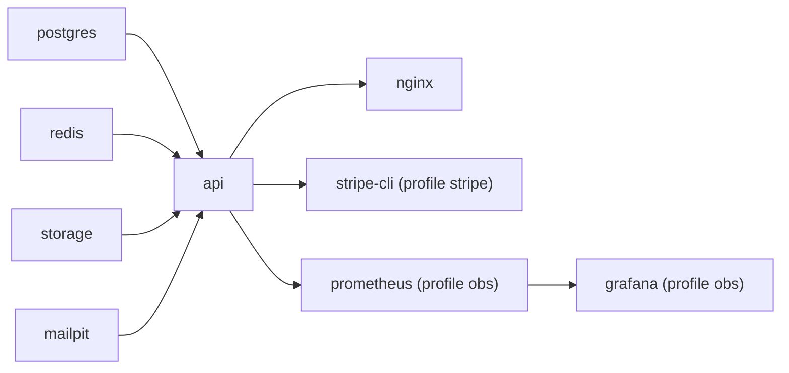

# Triển khai compose

> Trạng thái: **Approved** · Cập nhật: 2026-10-06 · DOC-62
> Phụ thuộc: SDD gốc §10, §14, [DOC-07](../03-architecture/system-context-and-containers.md) §2, [DOC-11](../03-architecture/tech-stack-and-versions.md) §6, [DOC-61](local-dev.md), [DOC-06](../02-glossary.md), [Sổ quyết định](../00-decision-register.md) (DR-01, 04, 09, 22, 38, 51, 55, 56, 61, 72, 73, 74, 75, 76, 80)
> Người dùng chính: P1-02 (compose), P1-01, P6-08 (profile `obs`), P0-14, DOC-70 (giới hạn tài nguyên thực nghiệm), DOC-33, DOC-34, người vận hành

Tài liệu đặc tả toàn bộ cách chạy hệ thống bằng Docker Compose: profile, thứ tự khởi động, healthcheck, giới hạn tài nguyên, biến môi trường và `.env.example`, cấu hình nginx, service `storage`, tham số PostgreSQL cho thực nghiệm, migration khi khởi động và dọn dẹp. Sơ đồ container và trách nhiệm ở [DOC-07](../03-architecture/system-context-and-containers.md) §2; lệnh `make` và hướng dẫn dev ở [DOC-61](local-dev.md); danh sách key cấu hình đầy đủ ở DOC-34 (bảng biến ở §6 chỉ liệt kê các biến compose cần và phải khớp DOC-34); metric và dashboard ở DOC-33. Giới hạn tài nguyên **chính thức** của thực nghiệm do DOC-70 chốt sau S-06; ở đây là cơ chế và giá trị khởi điểm.

> **Chưa chạy thử.** Chưa có Docker trong phiên viết tài liệu P0 và chưa có `deploy/compose/`. Mọi file YAML, script và cấu hình nginx dưới đây là đặc tả cho P1-02; chạy `docker compose config` và `nginx -t` là bước đầu tiên của task đó. Con số tài nguyên là **dự kiến** (planned).

## 1. Cấu trúc thư mục

```text
deploy/compose/
  docker-compose.yml              # stack mặc định + profile stripe, obs
  docker-compose.dev.yml          # ghi đè cho `make dev`: mở cổng 8333, 9090
  docker-compose.experiment.yml   # ghi đè cho `make exp`: giới hạn tài nguyên, tham số PostgreSQL
  .env.example                    # mẫu đầy đủ; `.env` được .gitignore
  nginx/
    Dockerfile                    # build frontend (node:22-alpine) rồi chép vào nginx:1.28-alpine
    nginx.conf.template           # envsubst lúc khởi động
    allowlist.sh                  # sinh allowlist.conf từ RATE_LIMIT_ALLOWLIST
  prometheus/prometheus.yml
  grafana/provisioning/…          # datasource + dashboard EXP-05 (DOC-33)
  scratch/ddl-check.sql           # chạy thử DDL (P0-13)
backend/Dockerfile                # image api
```

## 2. Profile

Có hai loại profile, không nhầm: **profile compose** quyết định container nào chạy; **profile Spring** quyết định bean nào của `api` bật (đặt bằng `SPRING_PROFILES_ACTIVE`).

| Tên | Loại | Bật bằng | Tác dụng |
| --- | --- | --- | --- |
| (mặc định) | compose | `make up` | `nginx`, `api`, `postgres`, `redis`, `storage`, `mailpit` |
| `stripe` | compose | `make up-stripe` | Thêm `stripe-cli` |
| `obs` | compose | `make up-obs` | Thêm `prometheus`, `grafana` |
| `dev` | Spring | `SPRING_PROFILES_ACTIVE` | `auth.cookie-secure=false` (Safari, DR-22), log dễ đọc, bật `/v3/api-docs` |
| `fake-payments` | Spring | mặc định cùng `PAYMENTS_MODE=fake` | `FakePaymentGateway`, migration `db/migration-fake`, endpoint `/fake-payments/**` (DR-51) |
| `stripe` | Spring | `PAYMENTS_MODE=stripe` | `StripePaymentGateway` |
| `experiment` | Spring | `make exp` | `inventory.strategy` khác `skip-locked` được phép, migration `db/migration-experiment`, seed 100.000 người dùng (DR-75, DR-76) |
| `invariants` | Spring | `make invariants` | Chạy `InvariantChecker` một lần rồi thoát (DR-73) |
| `seed` | Spring | `make seed` | Nạp dữ liệu demo rồi thoát (DOC-61 §5) |
| `obs` | Spring | cùng compose `obs` | Mở endpoint `prometheus` trên cổng 9090 cho Prometheus; `health` luôn mở |

Tổ hợp mặc định của `.env.example`: `SPRING_PROFILES_ACTIVE=dev,fake-payments`, `PAYMENTS_MODE=fake`. Hai biến phải khớp: `api` từ chối khởi động khi `PAYMENTS_MODE=fake` mà thiếu profile `fake-payments` (hoặc ngược lại với `stripe`), và khi `fake-payments` đi cùng `STRIPE_SECRET_KEY` bắt đầu bằng `sk_live_` (DR-51, DR-125).

## 3. Thứ tự khởi động và healthcheck



Thứ tự được ép bằng `depends_on: { <svc>: { condition: service_healthy } }`, không bằng sleep. `docker compose up --wait` thoát khi mọi service có healthcheck đạt `healthy`.

| Service | Healthcheck | Chu kỳ / timeout / thử lại / chờ ban đầu | Thời gian healthy dự kiến |
| --- | --- | --- | --- |
| `postgres` | `pg_isready -U $POSTGRES_USER -d $POSTGRES_DB` | 5 s / 3 s / 10 / 5 s | ≤ 10 s |
| `redis` | `redis-cli ping` trả `PONG` | 5 s / 3 s / 10 / 2 s | ≤ 5 s |
| `storage` | `wget -q --spider http://localhost:9333/cluster/status` (master của SeaweedFS) | 5 s / 3 s / 20 / 10 s | ≤ 20 s |
| `mailpit` | `wget -q --spider http://localhost:8025/livez` | 5 s / 3 s / 10 / 2 s | ≤ 5 s |
| `api` | `wget -qO- http://localhost:9090/actuator/health/readiness` chứa `"status":"UP"` | 5 s / 3 s / 30 / 30 s | ≤ 90 s (Flyway + khởi động JVM + tạo bucket) |
| `nginx` | `wget -q --spider http://localhost/healthz` | 5 s / 3 s / 10 / 2 s | ≤ 5 s sau `api` |
| `stripe-cli` | không | — | — |
| `prometheus`, `grafana` | `wget -q --spider http://localhost:9090/-/ready`, `http://localhost:3000/api/health` | 10 s / 3 s / 10 / 10 s | ≤ 30 s |

Readiness của `api` (nhóm `readiness` của Actuator) chỉ `UP` khi: pool Hikari lấy được connection, migration xong, Redis `PING` trả lời, bucket `STORAGE_S3_BUCKET` tồn tại. Redis mất giữa chừng **không** kéo `readiness` xuống (hệ thống vẫn bán được, DR-56); SMTP không nằm trong readiness. Mục tiêu NFR-08 và M1: mọi service healthy ≤ 3 phút từ máy sạch (image đã tải).

## 4. Giới hạn tài nguyên

Đặt bằng `deploy.resources.limits` (Compose v2 áp dụng ngoài Swarm). Giá trị khởi điểm cho máy dev 16 GB (planned):

| Service | CPU | RAM | Ghi chú |
| --- | --- | --- | --- |
| `nginx` | 0,5 | 128 MB | |
| `api` | 4 | 2 GB | `JAVA_TOOL_OPTIONS=-XX:MaxRAMPercentage=75 -XX:+ExitOnOutOfMemoryError` |
| `postgres` | 4 | 4 GB | Tham số ở §9 |
| `redis` | 1 | 512 MB | `--maxmemory 384mb --maxmemory-policy noeviction`: dữ liệu phòng chờ không được bị loại ngầm |
| `storage` | 1 | 512 MB | |
| `mailpit` | 0,5 | 128 MB | `MP_MAX_MESSAGES=5000` |
| `stripe-cli` | 0,25 | 64 MB | |
| `prometheus`, `grafana` | 1, 1 | 512 MB, 512 MB | `--storage.tsdb.retention.time=2d` |

Tổng khi chạy mặc định ≈ 6,5 CPU và 7,3 GB giới hạn trần (thực dùng thấp hơn). Thực nghiệm dùng `docker-compose.experiment.yml` (§9) để đặt giới hạn **cố định và ghi vào báo cáo** (DR-75); không dùng giới hạn của máy dev.

## 5. Service `storage` (SeaweedFS)

Theo DR-38: image `chrislusf/seaweedfs`, tag khóa theo minor tại P1-02 (ghi vào DOC-11 §6), chạy `weed server -s3`, volume `storage-data`, S3 ở cổng 8333 trong mạng compose, **không** publish ra host (trừ `docker-compose.dev.yml`). Không dùng MinIO (đã ngừng phát hành image).

```yaml
  storage:
    image: chrislusf/seaweedfs:${SEAWEEDFS_TAG}        # khóa minor lúc P1-02
    command: ["server", "-dir=/data", "-s3", "-s3.port=8333", "-volume.max=20"]
    environment:
      AWS_ACCESS_KEY_ID: ${STORAGE_S3_ACCESS_KEY}      # tạo identity quản trị cho S3 gateway
      AWS_SECRET_ACCESS_KEY: ${STORAGE_S3_SECRET_KEY}
    volumes: ["storage-data:/data"]
    healthcheck:
      test: ["CMD-SHELL", "wget -q --spider http://localhost:9333/cluster/status || exit 1"]
      interval: 5s
      timeout: 3s
      retries: 20
      start_period: 10s
    deploy: { resources: { limits: { cpus: "1", memory: 512M } } }
```

| Biến (nhóm `api`) | Mặc định trong `.env.example` | Ghi chú |
| --- | --- | --- |
| `STORAGE_S3_ENDPOINT` | `http://storage:8333` (compose); `http://localhost:8333` (`make dev`) | Đổi sang endpoint AWS S3, Cloudflare R2, Garage thì không sửa code (DR-38) |
| `STORAGE_S3_REGION` | `us-east-1` | SeaweedFS không quan tâm, SDK bắt buộc có |
| `STORAGE_S3_BUCKET` | `ticket-media` | API tạo lúc khởi động nếu chưa có; bucket private |
| `STORAGE_S3_ACCESS_KEY`, `STORAGE_S3_SECRET_KEY` | `ticketdev` / `ticketdev-secret` | Chỉ cho dev; giá trị thật không commit |

Việc SeaweedFS nhận khóa qua `AWS_ACCESS_KEY_ID`/`AWS_SECRET_ACCESS_KEY` cần xác nhận ở P1-02; nếu bản được chọn không hỗ trợ thì thay bằng file `-s3.config` sinh từ biến lúc khởi động (Câu hỏi còn mở). `make reset` xóa cả volume `storage-data` (DR-38). Không có job quét bucket (DR-74): object sót do lỗi hiếm chỉ tốn dung lượng và bị xóa khi reset.

## 6. Biến môi trường và `.env.example`

Compose nạp `deploy/compose/.env`; `make up` sao chép `.env.example` thành `.env` nếu thiếu. Tên Spring dạng quan hệ lỏng lẻo: `SPRING_DATASOURCE_URL` ↔ `spring.datasource.url`; biến tự định nghĩa dùng tên trong cột "Key". DOC-34 là nguồn chuẩn của key; bảng này phải khớp.

```dotenv
# ───── Ứng dụng ─────
APP_NAME=ticket
APP_BASE_URL=http://localhost:8080          # link trong email, return_url Stripe; ở `make dev` là http://localhost:5173
PLATFORM_TIMEZONE=Asia/Ho_Chi_Minh          # múi giờ mặc định, RetentionJob 03:00 (DR-12, DR-74)
SPRING_PROFILES_ACTIVE=dev,fake-payments
PAYMENTS_MODE=fake                          # fake | stripe — đi cùng profile ở trên (DR-125)
AUTH_COOKIE_SECURE=false                    # Safari không nhận cookie Secure trên http (DR-22)

# ───── Cổng host (đổi khi bị chiếm) ─────
NGINX_PORT=8080
POSTGRES_PORT=5432
REDIS_PORT=6379
MAILPIT_UI_PORT=8025
MAILPIT_SMTP_PORT=1025

# ───── PostgreSQL ─────
POSTGRES_DB=ticket
POSTGRES_USER=ticket
POSTGRES_PASSWORD=ticket-dev-password       # chỉ dev
SPRING_DATASOURCE_URL=jdbc:postgresql://postgres:5432/ticket
SPRING_DATASOURCE_USERNAME=ticket
SPRING_DATASOURCE_PASSWORD=ticket-dev-password

# ───── Redis ─────
SPRING_DATA_REDIS_HOST=redis
SPRING_DATA_REDIS_PORT=6379

# ───── SMTP (Mailpit) ─────
SPRING_MAIL_HOST=mailpit
SPRING_MAIL_PORT=1025
MAIL_FROM=ticket <no-reply@ticket.localhost>   # DR-54

# ───── Object storage (SeaweedFS) ─────
SEAWEEDFS_TAG=                              # điền tag minor lúc P1-02
STORAGE_S3_ENDPOINT=http://storage:8333
STORAGE_S3_REGION=us-east-1
STORAGE_S3_BUCKET=ticket-media
STORAGE_S3_ACCESS_KEY=ticketdev
STORAGE_S3_SECRET_KEY=ticketdev-secret

# ───── Stripe (chỉ khi PAYMENTS_MODE=stripe; `make up-stripe`) ─────
STRIPE_SECRET_KEY=                          # sk_test_… ; sk_live_ bị từ chối khi fake
STRIPE_PUBLISHABLE_KEY=                     # pk_test_… ; build vào frontend (VITE_STRIPE_PUBLISHABLE_KEY)
# STRIPE_WEBHOOK_SECRET do stripe-cli cấp; điền tay chỉ khi không dùng stripe-cli

# ───── Rate limit và thực nghiệm ─────
RATE_LIMIT_ALLOWLIST=                       # IP/CIDR cách nhau bằng dấu phẩy; máy sinh tải (DR-55, DR-75)
INVENTORY_STRATEGY=skip-locked              # counter | naive chỉ với profile experiment (DR-76)

# ───── Pool và bulkhead (DR-61; mặc định đã đặt trong application.yml, bỏ comment để ghi đè) ─────
# SPRING_DATASOURCE_HIKARI_MAXIMUM_POOL_SIZE=40
# SPRING_DATASOURCE_HIKARI_CONNECTION_TIMEOUT=1000
# HOLD_BULKHEAD_PERMITS=24
```

| Key / biến | Kiểu | Mặc định | Dùng bởi | Mô tả |
| --- | --- | --- | --- | --- |
| `APP_BASE_URL` | URL | `http://localhost:8080` | `api` | Gốc của link tuyệt đối trong email và `return_url` |
| `PAYMENTS_MODE` | `fake`\|`stripe` | `fake` | `api` (khớp profile), build `nginx` (`VITE_PAYMENTS`) | Cổng thanh toán đang dùng |
| `STRIPE_PUBLISHABLE_KEY` | chuỗi | rỗng | build frontend | Khóa công khai cho Payment Element (DR-126) |
| `RATE_LIMIT_ALLOWLIST` | danh sách IP/CIDR | rỗng | `nginx` | IP được miễn `limit_req` (DR-55) |
| `NGINX_PORT`, `POSTGRES_PORT`, `REDIS_PORT`, `MAILPIT_UI_PORT`, `MAILPIT_SMTP_PORT` | số | như bảng cổng DOC-61 §4 | compose | Cổng host |
| `SEAWEEDFS_TAG` | chuỗi | rỗng (bắt buộc điền) | compose | Tag image `storage` |
| `INVENTORY_STRATEGY` | `skip-locked`\|`counter`\|`naive` | `skip-locked` | `api` | Ánh xạ `inventory.strategy` (DR-76) |

**Secret theo môi trường.** `.env` không bao giờ commit (`.gitignore`); `.env.example` chỉ chứa giá trị dev vô hại và khóa rỗng. Khóa Stripe test đặt trong `.env` của máy, không đặt trong Compose file hay image. Image `api` không chứa secret (đọc từ môi trường lúc chạy). CI không dùng khóa Stripe (DR-77: `PAYMENTS_MODE=fake`). Kiểm tra: `git grep -nE "sk_(test|live)_[A-Za-z0-9]{10,}" ':!*.md'` không có kết quả (chạy trong CI, [DOC-63](ci-cd.md)).

## 7. `docker-compose.yml` (khung)

```yaml
name: ticket
services:
  postgres:
    image: postgres:18-alpine
    environment: { POSTGRES_DB: "${POSTGRES_DB}", POSTGRES_USER: "${POSTGRES_USER}", POSTGRES_PASSWORD: "${POSTGRES_PASSWORD}" }
    command: ["postgres", "-c", "max_connections=100", "-c", "shared_buffers=512MB", "-c", "synchronous_commit=on"]
    ports: ["${POSTGRES_PORT}:5432"]
    volumes: ["postgres-data:/var/lib/postgresql/data"]
    healthcheck: { test: ["CMD-SHELL", "pg_isready -U $${POSTGRES_USER} -d $${POSTGRES_DB}"], interval: 5s, timeout: 3s, retries: 10, start_period: 5s }
  redis:
    image: redis:8.2-alpine
    command: ["redis-server", "--maxmemory", "384mb", "--maxmemory-policy", "noeviction"]
    ports: ["${REDIS_PORT}:6379"]
    healthcheck: { test: ["CMD", "redis-cli", "ping"], interval: 5s, timeout: 3s, retries: 10, start_period: 2s }
  mailpit:
    image: axllent/mailpit:v1.27
    environment: { MP_MAX_MESSAGES: "5000" }
    ports: ["${MAILPIT_UI_PORT}:8025", "${MAILPIT_SMTP_PORT}:1025"]
    healthcheck: { test: ["CMD-SHELL", "wget -q --spider http://localhost:8025/livez || exit 1"], interval: 5s, timeout: 3s, retries: 10, start_period: 2s }
  storage: { }          # xem §5
  api:
    build: { context: ../.., dockerfile: backend/Dockerfile }
    env_file: .env
    environment:
      SERVER_PORT: "8081"
      MANAGEMENT_SERVER_PORT: "9090"
      JAVA_TOOL_OPTIONS: "-XX:MaxRAMPercentage=75 -XX:+ExitOnOutOfMemoryError"
    depends_on:
      postgres: { condition: service_healthy }
      redis:    { condition: service_healthy }
      storage:  { condition: service_healthy }
      mailpit:  { condition: service_healthy }
    healthcheck: { test: ["CMD-SHELL", "wget -qO- http://localhost:9090/actuator/health/readiness | grep -q UP"], interval: 5s, timeout: 3s, retries: 30, start_period: 30s }
    stop_grace_period: 30s
  nginx:
    build:
      context: ../..
      dockerfile: deploy/compose/nginx/Dockerfile
      args: { VITE_PAYMENTS: "${PAYMENTS_MODE}", VITE_STRIPE_PUBLISHABLE_KEY: "${STRIPE_PUBLISHABLE_KEY}" }
    environment: { RATE_LIMIT_ALLOWLIST: "${RATE_LIMIT_ALLOWLIST}" }
    ports: ["${NGINX_PORT}:80"]
    depends_on: { api: { condition: service_healthy } }
    healthcheck: { test: ["CMD-SHELL", "wget -q --spider http://localhost/healthz || exit 1"], interval: 5s, timeout: 3s, retries: 10, start_period: 2s }
  stripe-cli:
    profiles: ["stripe"]
    image: stripe/stripe-cli:v1.30
    command: ["listen", "--api-key", "${STRIPE_SECRET_KEY}", "--forward-to", "http://api:8081/api/v1/webhooks/stripe", "--print-secret"]
    depends_on: { api: { condition: service_healthy } }
  prometheus:
    profiles: ["obs"]
    image: prom/prometheus:${PROMETHEUS_TAG}        # khóa lúc P6-08
    volumes: ["./prometheus/prometheus.yml:/etc/prometheus/prometheus.yml:ro"]
    ports: ["9091:9090"]
  grafana:
    profiles: ["obs"]
    image: grafana/grafana:${GRAFANA_TAG}           # khóa lúc P6-08
    volumes: ["./grafana/provisioning:/etc/grafana/provisioning:ro"]
    ports: ["3000:3000"]
    depends_on: [prometheus]
volumes: { postgres-data: {}, storage-data: {} }
```

Ghi chú: `api` không publish cổng; nginx gọi `api:8081` qua mạng compose. Cơ chế `stripe-cli` ghi `whsec_…` vào volume dùng chung để `api` đọc lúc khởi động cần xác nhận ở P1-02 (Câu hỏi còn mở); nếu không khả thi, `make up-stripe` chạy `stripe listen --print-secret` trước, lấy secret rồi truyền vào `STRIPE_WEBHOOK_SECRET`. Prometheus scrape `api:9090` (profile Spring `obs`, DR-09).

`backend/Dockerfile` (hai tầng; build image `api` không cần Gradle trên máy chạy):

```dockerfile
FROM eclipse-temurin:25-jdk-alpine AS build
WORKDIR /src
COPY backend/ backend/
RUN --mount=type=cache,target=/root/.gradle ./backend/gradlew -p backend bootJar -x test

FROM eclipse-temurin:25-jre-alpine
RUN addgroup -S app && adduser -S app -G app
USER app
COPY --from=build /src/backend/build/libs/api.jar /app/api.jar
EXPOSE 8081 9090
ENTRYPOINT ["java", "-jar", "/app/api.jar"]
```

`ENTRYPOINT` ở dạng mảng để `docker compose run --rm api --spring.profiles.active=invariants` (DR-73) truyền đối số thẳng vào ứng dụng.

## 8. nginx

`deploy/compose/nginx/Dockerfile` build frontend rồi chép vào `nginx:1.28-alpine`; `nginx.conf.template` đi qua `envsubst` của image (thư mục `/etc/nginx/templates`). `allowlist.sh` đặt ở `/docker-entrypoint.d/10-allowlist.sh`, sinh `/etc/nginx/allowlist.conf` từ `RATE_LIMIT_ALLOWLIST`:

```sh
#!/bin/sh
# "10.0.0.5,192.168.1.0/24" → các dòng "10.0.0.5 0;" "192.168.1.0/24 0;"
: > /etc/nginx/allowlist.conf
for ip in $(echo "${RATE_LIMIT_ALLOWLIST:-}" | tr ',' ' '); do echo "$ip 0;" >> /etc/nginx/allowlist.conf; done
```

```nginx
# /etc/nginx/templates/default.conf.template — rút gọn, chạy được sau khi chép vào server/http
geo $limited { default 1; include /etc/nginx/allowlist.conf; }        # DR-55: IP trong allowlist được miễn
map $limited $limit_key { 1 $binary_remote_addr; 0 ""; }               # khóa rỗng = không giới hạn
map "$request_method:$limited" $hold_key { "POST:1" $binary_remote_addr; default ""; }

limit_req_zone $limit_key zone=api_ip:10m  rate=20r/s;
limit_req_zone $limit_key zone=auth_ip:1m  rate=10r/m;
limit_req_zone $hold_key  zone=hold_ip:10m rate=5r/s;
limit_req_status 429;

proxy_cache_path /var/cache/nginx/api   levels=1:2 keys_zone=api_cache:10m   max_size=200m inactive=1d use_temp_path=off;
proxy_cache_path /var/cache/nginx/media levels=1:2 keys_zone=media_cache:10m max_size=1g   inactive=1d use_temp_path=off;

upstream api { server api:8081; keepalive 64; }

server {
  listen 80;
  server_name _;
  client_max_body_size 6m;                                              # ảnh mặt bằng ≤ 5 MB (DR-38)

  # Header bảo mật (chi tiết và lý do ở DOC-32)
  add_header Content-Security-Policy "default-src 'self'; script-src 'self' https://js.stripe.com; frame-src https://js.stripe.com https://hooks.stripe.com; connect-src 'self' https://api.stripe.com; img-src 'self' data: https://*.stripe.com; style-src 'self' 'unsafe-inline'; font-src 'self'; frame-ancestors 'none'; base-uri 'self'; form-action 'self'" always;
  add_header X-Content-Type-Options "nosniff" always;
  add_header Referrer-Policy "strict-origin-when-cross-origin" always;
  add_header Permissions-Policy "camera=(), microphone=(), geolocation=()" always;
  # Strict-Transport-Security chỉ thêm khi có TLS (không có ở dev)

  proxy_http_version 1.1;
  proxy_set_header Connection "";
  proxy_set_header Host $host;
  proxy_set_header X-Real-IP $remote_addr;
  proxy_set_header X-Forwarded-For $proxy_add_x_forwarded_for;
  proxy_set_header X-Forwarded-Proto $scheme;
  proxy_set_header X-Request-Id $request_id;                            # api ghi vào MDC thành trace_id (DR-09)
  add_header X-Request-Id $request_id always;

  location = /healthz { access_log off; add_header Content-Type text/plain; return 200 "ok\n"; }

  # Giới hạn riêng, đặt trước location /api/ chung (regex ưu tiên theo thứ tự)
  location = /api/v1/auth/magic-link {
    limit_req zone=auth_ip burst=5;
    limit_req zone=api_ip burst=40 nodelay;
    error_page 429 = @rate_limited;
    proxy_pass http://api;
  }
  location ~ ^/api/v1/events/[^/]+/reservations$ {
    limit_req zone=hold_ip burst=10;
    limit_req zone=api_ip burst=40 nodelay;
    error_page 429 = @rate_limited;
    proxy_pass http://api;
  }
  # Tài liệu sơ đồ theo version: bất biến, cache 1 ngày (DR-55). Không gửi cookie lên upstream để không lẫn nội dung theo người dùng
  location ~ ^/api/v1/events/[^/]+/map$ {
    limit_req zone=api_ip burst=40 nodelay;
    error_page 429 = @rate_limited;
    proxy_cache api_cache; proxy_cache_key "$scheme$request_uri";       # $request_uri gồm ?version=n
    proxy_cache_valid 200 1d; proxy_cache_lock on;
    proxy_set_header Cookie "";
    add_header X-Cache-Status $upstream_cache_status always;
    proxy_pass http://api;
  }
  location ~ ^/api/v1/events/[^/]+$ {                                   # chi tiết sự kiện công khai, cache 5 giây
    limit_req zone=api_ip burst=40 nodelay;
    error_page 429 = @rate_limited;
    proxy_cache api_cache; proxy_cache_key "$scheme$request_uri$http_accept_language";
    proxy_cache_valid 200 5s; proxy_cache_lock on;
    proxy_set_header Cookie "";
    add_header X-Cache-Status $upstream_cache_status always;
    proxy_pass http://api;
  }
  location /api/ {
    limit_req zone=api_ip burst=40 nodelay;
    error_page 429 = @rate_limited;
    proxy_pass http://api;
  }
  location /media/ {                                                    # ảnh, cache 1 ngày; storage không bị gọi khi cache trúng (DR-38)
    proxy_cache media_cache; proxy_cache_key "$scheme$request_uri";
    proxy_cache_valid 200 1d; proxy_cache_lock on;
    proxy_set_header Cookie "";
    add_header X-Cache-Status $upstream_cache_status always;
    proxy_pass http://api;
  }
  location /v3/api-docs { proxy_pass http://api; }                      # chỉ có khi profile dev

  location /assets/ { root /usr/share/nginx/html; add_header Cache-Control "public, max-age=31536000, immutable" always; }
  location / { root /usr/share/nginx/html; try_files $uri /index.html; add_header Cache-Control "no-cache" always; }

  location @rate_limited {
    default_type application/problem+json;
    add_header Retry-After 1 always;
    return 429 '{"type":"https://ticket.localhost/problems/rate-limited","title":"Too many requests","status":429,"code":"RATE_LIMITED","detail":"Rate limit exceeded at the edge.","retryAfterSeconds":1}';
  }
}
```

Ghi chú vận hành của cấu hình:

- **Thứ tự `location`**: `=` trước, rồi regex theo thứ tự xuất hiện, rồi tiền tố. Vì vậy `.../reservations` và `.../map` đứng trước regex `events/[^/]+$` (regex này chỉ khớp đúng một đoạn sau `events/`, không nuốt hai đường dẫn kia, nhưng giữ thứ tự cho an toàn).
- **Hai `limit_req` trong cùng location** cùng áp dụng: yêu cầu bị từ chối nếu vượt **một** trong hai zone. `auth_ip` 10 r/phút burst 5, `hold_ip` 5 r/s burst 10 (DR-55).
- **Khóa rỗng không giới hạn**: máy trong `RATE_LIMIT_ALLOWLIST` có `$limit_key` rỗng nên nginx bỏ qua zone (hành vi chuẩn của `limit_req_zone`). `hold_ip` chỉ đếm `POST`, nên `GET /reservations/{id}` không tính vào zone giữ vé.
- **Body 429 do nginx sinh** có các trường cố định của Problem Details (DOC-36 quy định đầy đủ; `requestId` không có vì request chưa vào `api`). Giá trị `Retry-After` lấy 1 giây; client tự thử lại theo SDD gốc 10.5.
- **Cache `GET /api/v1/events/{id}`** khóa theo `Accept-Language` vì `api` có thể trả chuỗi theo locale cho lỗi; bản thân dữ liệu sự kiện không dịch (DR-10). Cookie bị bỏ ở các location cache để không lưu phản hồi theo người dùng; endpoint cache phải là công khai (DOC-37 ghi cache của từng `E-xx`).
- **`X-Request-Id`**: nginx sinh bằng `$request_id` (32 ký tự hex), `api` nhận và ghi vào MDC (`trace_id`), trả lại trong header phản hồi (DR-09, SDD gốc 12.3).
- **Giờ máy chủ**: `X-Server-Time` do `api` thêm, nginx không đụng (DR-66).
- **`proxy_read_timeout`** giữ mặc định 60 s; `api` không giữ request dài (phòng chờ dùng polling, DR-59).

## 9. Tham số PostgreSQL cho thực nghiệm

DR-61 chốt `max_connections=100` và `synchronous_commit=on`; các tham số còn lại hiệu chỉnh ở S-03 và S-06 rồi ghi vào DOC-70. Giá trị khởi điểm cho máy thực nghiệm 16 GB, `postgres` 4 CPU / 6 GB (planned), nằm trong `docker-compose.experiment.yml`:

```yaml
services:
  postgres:
    command:
      - postgres
      - -c
      - max_connections=100              # DR-61: pool 40 + dự phòng
      - -c
      - shared_buffers=2GB               # ≈ 1/3 RAM của container
      - -c
      - effective_cache_size=4GB
      - -c
      - work_mem=16MB                    # truy vấn kho vé không sắp xếp lớn; đủ cho INSERT … SELECT xuất bản
      - -c
      - maintenance_work_mem=256MB
      - -c
      - synchronous_commit=on            # không nới lỏng: kết quả EXP phải chịu được crash (DR-61)
      - -c
      - wal_compression=on
      - -c
      - max_wal_size=4GB
      - -c
      - checkpoint_timeout=15min
      - -c
      - random_page_cost=1.1             # SSD
      - -c
      - jit=off                          # câu ngắn, JIT chỉ thêm độ trễ
      - -c
      - track_io_timing=on
      - -c
      - shared_preload_libraries=pg_stat_statements
    deploy: { resources: { limits: { cpus: "4", memory: 6G } } }
  api:
    environment:
      SPRING_PROFILES_ACTIVE: "dev,fake-payments,experiment,obs"
      PAYMENTS_MODE: "fake"
    deploy: { resources: { limits: { cpus: "4", memory: 3G } } }
```

`make exp EXP=02` chạy `docker compose -f docker-compose.yml -f docker-compose.experiment.yml --profile obs up -d --wait`, chạy `experiments/seed/users.sql` (100.000 người dùng và session, chỉ trong profile `experiment`, DR-75), rồi script thực nghiệm; mỗi thực nghiệm kết thúc bằng `make invariants` sạch. Báo cáo ghi giá trị `SHOW ALL` đã dùng, git SHA, cấu hình máy; giới hạn tài nguyên chính thức do DOC-70 chốt (DR-75). `track_io_timing` và `pg_stat_statements` chỉ bật ở file thực nghiệm; compose mặc định không bật để giữ chạy nhẹ.

## 10. Migration khi khởi động

- `api` chạy Flyway ngay lúc khởi động, **trước** khi readiness `UP` (`spring.flyway.enabled=true`). Một bản sao `api` duy nhất (DOC-07 §2.2) nên không có tranh chấp; Flyway vẫn khóa bằng bảng `flyway_schema_history` nếu về sau có nhiều bản sao.
- Thư mục migration: `classpath:db/migration` luôn chạy; `db/migration-fake` chỉ khi có profile `fake-payments`; `db/migration-experiment` chỉ khi có profile `experiment` (cấu hình `spring.flyway.locations` theo profile; DR-51, DR-76). Đổi profile giữa các lần chạy trên cùng volume: Flyway ghi nhận migration đã chạy nên bỏ profile không xóa bảng; dùng `make reset` để về trạng thái sạch (DOC-14, DOC-15 mô tả quy ước tên và nội dung).
- Tên file `V<yyyymmddHHmm>__<snake_case>.sql`; **không sửa** migration đã merge (CI chặn, [DOC-63](ci-cd.md) §4). `spring.flyway.validate-on-migrate=true`: sai checksum làm `api` thoát với mã lỗi khác 0.
- Chạy thử DDL tách khỏi ứng dụng (P0-13): `docker run --rm -e POSTGRES_PASSWORD=x postgres:18-alpine` rồi `psql -f deploy/compose/scratch/ddl-check.sql`.

## 11. Dọn dẹp và vận hành

| Việc | Lệnh | Tác dụng |
| --- | --- | --- |
| Dừng, giữ dữ liệu | `make down` | Gỡ container và mạng; giữ `postgres-data`, `storage-data` |
| Xóa dữ liệu, dựng lại | `make reset` | `down -v` rồi `up -d --wait`; mất database, ảnh, thư Mailpit |
| Xóa cache nginx | `docker compose … exec nginx sh -c 'rm -rf /var/cache/nginx/*' && docker compose … exec nginx nginx -s reload` | Dùng khi thử lại hành vi cache |
| Xem trạng thái | `docker compose … ps` | Cột `STATUS` có `(healthy)` |
| Dọn image treo | `docker image prune -f` | An toàn; `docker system prune --volumes` **không** khuyến nghị vì xóa cả volume của dự án khác |
| Backup nhanh DB demo | `docker compose … exec -T postgres pg_dump -U ticket ticket > backup.sql` | Chỉ dev; không có backup tự động ở giai đoạn này (SDD gốc §2.3) |
| Khôi phục | `make reset` rồi `docker compose … exec -T postgres psql -U ticket ticket < backup.sql` | Ảnh không nằm trong dump (DR-38) |

Dừng `api` an toàn: `stop_grace_period: 30s`, Spring `server.shutdown=graceful` hoàn tất request đang chạy; job nền được viết để chịu ngắt giữa chừng (lease, `SKIP LOCKED`; DOC-07 §2.2). Không có triển khai lên máy chủ thật trong phạm vi hiện tại (CD ngoài phạm vi, DR-08); các lựa chọn TLS và domain thật để sau.

## 12. Kiểm tra chấp nhận

Tiền tố `OPS-` (đăng ký ở DOC-69), tiếp nối [DOC-61](local-dev.md) §10.

| ID | Kịch bản | Kỳ vọng |
| --- | --- | --- |
| OPS-09 | `docker compose config -q` với `.env.example` | Thoát 0; không biến nào còn trống ngoài `SEAWEEDFS_TAG` (điền trước khi chạy), `STRIPE_*`, `RATE_LIMIT_ALLOWLIST` |
| OPS-10 | `make up` rồi `docker compose ps --format json \| jq -r '.Health'` | Mọi dòng `healthy`, ≤ 3 phút |
| OPS-11 | Dừng `redis` (`docker compose stop redis`) | `api` readiness vẫn `UP`; `GET /api/v1/events` trả 200 (DR-56); phòng chờ trả lỗi hạ tầng có `Retry-After` |
| OPS-12 | `PAYMENTS_MODE=fake` và `STRIPE_SECRET_KEY=sk_live_abc…` | `api` thoát khi khởi động với thông báo từ chối (DR-51) |
| OPS-13 | 60 request `GET /api/v1/events` trong 1 giây từ IP không có trong allowlist | Phần dư vượt 20 r/s + burst 40 nhận 429 `RATE_LIMITED`, thân JSON Problem Details, header `Retry-After: 1` |
| OPS-14 | Cùng bài trên nhưng IP có trong `RATE_LIMIT_ALLOWLIST` | Không có 429 |
| OPS-15 | 6 lần `POST /api/v1/auth/magic-link` trong 1 phút | Lần thứ 6 nhận 429 từ nginx (10 r/phút, burst 5). Với IP trong allowlist, lần thứ 4 trong 15 phút cùng email nhận 202 kèm `X-Magic-Link-Throttled: 1` từ API (DR-21): hai lớp giới hạn độc lập |
| OPS-16 | `GET /api/v1/events/{id}/map?version=1` hai lần liên tiếp | Lần hai có `X-Cache-Status: HIT`; `GET /media/{id}` tương tự |
| OPS-17 | `POST /api/v1/organizer/media` với tệp 6,5 MB | nginx trả 413 trước khi tới `api`; tệp 4 MB ảnh mặt bằng hợp lệ thì tới `api` |
| OPS-18 | `curl -sI localhost:8080/` | Có `Content-Security-Policy` chứa `https://js.stripe.com`, `X-Content-Type-Options: nosniff` |
| OPS-19 | `make reset` rồi `make up` | `storage-data` rỗng; API tạo lại bucket `ticket-media` lúc khởi động; ảnh cũ không còn |

## Quyết định phát sinh khi viết tài liệu này

Owner chốt các quyết định dưới đây theo đề xuất ngày 2026-10-07; đã vào sổ quyết định là DR-124, DR-126, DR-127. DR-123…125 xem [DOC-61](local-dev.md).

| DR | Nội dung | Lý do |
| --- | --- | --- |
| DR-124 | Ba file compose (gốc, `.dev`, `.experiment`); giới hạn tài nguyên khởi điểm ở §4; `redis` `noeviction` | Cho phép mở cổng khi `make dev`, cố định tài nguyên thực nghiệm mà không sửa file gốc |
| DR-126 | Khóa công khai Stripe vào frontend bằng build arg `VITE_STRIPE_PUBLISHABLE_KEY` (biến `STRIPE_PUBLISHABLE_KEY`) | DR-50 dùng Payment Element nhưng chưa nói khóa công khai tới trình duyệt bằng cách nào; build arg khớp `VITE_PAYMENTS` của DR-51 |
| DR-127 | Body 429 do nginx sinh đủ trường Problem Details; `nginx` bỏ `Cookie` ở location cache; CSP có `style-src 'unsafe-inline'` cho Stripe Elements | DR-55 chỉ nêu "Problem Details `RATE_LIMITED`"; cần chốt nội dung; CSP cần xác nhận với Payment Element ở P3-08 |

## Câu hỏi còn mở

- SeaweedFS có nhận khóa truy cập qua `AWS_ACCESS_KEY_ID`/`AWS_SECRET_ACCESS_KEY` không (§5), và cách `stripe-cli` chuyển `whsec_…` cho `api` (§7): xác nhận ở P1-02; kết quả ghi lại tại đây và [DOC-61](local-dev.md) §7.
- CSP `style-src 'unsafe-inline'` có thể siết (hash/nonce) không với Stripe Payment Element: kiểm ở P3-08, cập nhật DOC-32.
- Tag cụ thể của `chrislusf/seaweedfs`, `prom/prometheus`, `grafana/grafana`: khóa ở P1-02 và P6-08, ghi vào DOC-11 §6.
