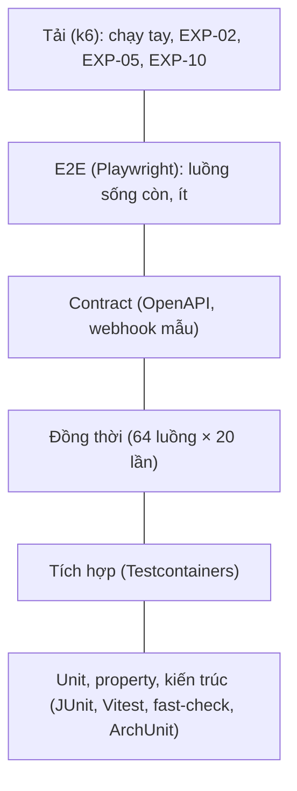

# Chiến lược kiểm thử

> Trạng thái: **Review** · Cập nhật: 2026-10-06 · DOC-69
> Phụ thuộc: SDD gốc §15.1, §15.2, [Sổ quyết định](../00-decision-register.md) (DR-08, 51, 73, 75, 76, 77, 78, 81), [Master plan](../00-master-plan.md) §0.4, §7.2, §7.4, [DOC-06](../02-glossary.md), [DOC-11](../03-architecture/tech-stack-and-versions.md) §4, [DOC-12](../03-architecture/code-architecture.md) §5, §8, [DOC-61](../09-operations/local-dev.md), [DOC-62](../09-operations/deploy-compose.md), [DOC-63](../09-operations/ci-cd.md), [DOC-36](../07-api/api-guidelines.md), [DOC-37](../07-api/api-endpoints.md)
> Người dùng chính: P1-01 (khung test, JaCoCo, Vitest), P1-05 (test kiến trúc), P1-08 (CI), P1-10 (E2E đầu tiên); mọi task `Pn-xx` khi viết test; người review PR

Tài liệu nói test nào viết ở mức nào, bằng công cụ gì, đặt tên ra sao, chạy ở bước CI nào, và là **danh mục duy nhất của mọi tiền tố test** (§12). Không lặp lại kịch bản test của từng tài liệu: mỗi tài liệu giữ mục "Test bắt buộc" của riêng nó. Thực nghiệm `EXP-xx` (đo số, không phải đúng/sai) thuộc `10-testing/experiments/` (DOC-70…80). Workflow CI chi tiết ở [DOC-63](../09-operations/ci-cd.md); lệnh `make` ở [DOC-61](../09-operations/local-dev.md).

## 1. Nguyên tắc

1. **Bất biến trước, chức năng sau.** Test bằng chứng cho NEVER OVERSELL (không bán vượt, không trùng chủ, tiền khớp vé) có ưu tiên cao nhất và không bao giờ bị `@Disabled` để qua CI (DR-77, DR-73).
2. **Database thật.** Mọi test chạm `inventory`, `reservation`, `order`, `payment`, `notification` chạy trên PostgreSQL 18 và Redis 8.2 thật bằng Testcontainers; không H2, không mock repository cho logic có điều kiện ghi (ADR-0002, ADR-0012). Mock chỉ dùng cho SMTP và cổng thanh toán ngoài (§9, §10).
3. **Kim tự tháp hẹp ở đỉnh.** Nhiều unit, ít tích hợp, rất ít E2E; E2E chỉ đi các luồng sống còn (§2).
4. **Mỗi test có ID.** Test của một tài liệu thiết kế mang tiền tố tài liệu đó (`AU-03`) và ID xuất hiện trong tên test (§5). Mỗi bug fix có test tái hiện (master plan §7.2).
5. **Số đo ghi rõ planned hay measured.** Ngưỡng coverage ở §7 là chỉ tiêu; con số đã đo chỉ ghi vào mục "Kết quả đo" của tài liệu sau lần chạy CI đầu tiên (conventions §6).
6. **CI = máy dev.** Mỗi mức test là một target `make` (DOC-61 §3); CI gọi đúng các target đó (DOC-63 §1).

## 2. Kim tự tháp và mức test



Mã mức dùng ở cột "Mức" của mọi bảng test (một chữ, không phân biệt hoa thường khi đọc):

| Mã | Mức | Phạm vi | Công cụ | Target `make` | Job CI |
| --- | --- | --- | --- | --- | --- |
| **U** | Unit | Thuật toán, máy trạng thái, validate, hàm thuần, component React | JUnit 5, AssertJ; Vitest, Testing Library | `make test` | `test` |
| **P** | Property-based | Rải N ghế ra đúng N điểm cách đều trên mọi kiểu đường và mọi N; validate sơ đồ bất biến với đầu vào ngẫu nhiên | fast-check (frontend `map-core`) | `make test` | `test` |
| **A** | Kiến trúc | Ranh giới module, layer, sở hữu bảng (ARC-01…09, DOC-12 §5) | Spring Modulith `verify()`, ArchUnit | `make test` | `test` |
| **I** | Tích hợp | Giữ vé, hết hạn, idempotency, webhook, outbox, migration, truy vấn thật | Testcontainers, Spring Boot Test, Awaitility | `make it` | `it` |
| **C** | Đồng thời | N luồng cùng giành một ghế, một pool, một token, một webhook | JUnit 5 + `ExecutorService` + `CountDownLatch` | `make it` | `it` |
| **K** | Contract | OpenAPI sinh ra khớp `api/openapi.yaml`; `schema.d.ts` khớp; payload webhook Stripe mẫu; không thay đổi phá vỡ | springdoc, `oasdiff`, fixture từ Stripe CLI | `make contract` (+ `make it` cho webhook mẫu) | `contract`, `it` |
| **E** | E2E | Đăng nhập, soạn và xuất bản, mua vé, nhận vé; `en` và `vi`; 390 px | Playwright (Chromium + WebKit), Mailpit, cổng giả | `make e2e` | `e2e.yml` (PR `dev → main`) |
| **L** | Tải | Kịch bản mở bán đông người | k6 | `make exp EXP=xx` | không có (chạy tay) |

Quyết định về mã mức: DR-149.

## 3. Ma trận module × mức test

● bắt buộc; ○ khi module có logic thuộc mức đó; — không áp dụng. Module theo [DOC-12](../03-architecture/code-architecture.md) §2.2.

| Module | U | P | A | I | C | K | E | Ghi chú |
| --- | --- | --- | --- | --- | --- | --- | --- | --- |
| `inventory` | ● | — | ● | ● | ● | — | — | Câu claim, trả vé, `REMOVED`; INVT-xx |
| `reservation` | ● | — | ● | ● | ● | — | ● | Giữ vé, `EXPIRING`, job trả vé, hủy nhanh |
| `order` | ● | — | ● | ● | ● | — | ● | Bảng chuyển trạng thái DR-44 |
| `payment` | ● | — | ● | ● | ● | ● | ● | Webhook trùng và sai thứ tự; `FakePaymentGateway` |
| `admission` | ● | — | ● | ● | ● | — | ○ | Lua script trên Redis thật; phòng chờ |
| `ticket` | ● | — | ● | ● | ○ | — | ● | Mã vé, phát hành trong transaction xác nhận |
| `notification` | ● | — | ● | ● | ○ | — | ● | Outbox lease, backoff; Mailpit |
| `auth` | ● | — | ● | ● | ● | ● | ● | Verify 50 luồng cùng token (AU-xx) |
| `event` | ● | — | ● | ● | ○ | ● | ● | Máy trạng thái `event.status`, `displayStatus` |
| `map` | ● | ○ | ● | ● | ○ | ● | ● | Phiên bản bất biến, checksum, nhân bản |
| `media` | ● | — | ● | ● | — | ● | ○ | S3 thật (SeaweedFS); kiểm tra tệp |
| `studio` | ○ | — | ● | ● | ● | ● | ● | Transaction xuyên module: xuất bản, hủy, đổi lịch |
| `invariant` | ● | — | ● | ● | — | — | — | Mỗi `INV-xx` có ca sạch và ca cố ý hỏng (DOC-30) |
| `common` | ● | — | ● | ○ | — | ● | — | Problem Details, i18n, `RetentionJob` |
| Frontend `map-core` | ● | ● | — | — | — | — | — | Hình học, validate dùng chung (DR-35); ≥ 90% |
| Frontend editor (store, command) | ● | ○ | — | — | — | — | ● | Command bất biến, undo/redo (DR-39) |
| Frontend màn mua vé và Studio | ● | — | — | — | — | — | ● | Component test với MSW; E2E ở luồng sống còn |
| Frontend i18n | ● | — | — | — | — | — | ○ | `pnpm i18n:check` ở `make lint`; I18N-xx |

## 4. Công cụ

Phiên bản ở [DOC-11](../03-architecture/tech-stack-and-versions.md) §4–§5; không lặp ở đây. Cách dùng trong dự án:

| Công cụ | Dùng để | Quy ước |
| --- | --- | --- |
| JUnit Jupiter, AssertJ | Mọi test backend | Không dùng Hamcrest; một `assertThat` chuỗi cho mỗi hành vi |
| Spring Boot Test | Test tích hợp lát cắt hoặc toàn ứng dụng | `@SpringBootTest` chỉ ở `integrationTest`; test unit không dựng context |
| Testcontainers | `postgres:18-alpine`, `redis:8.2-alpine`, SeaweedFS | Container **singleton** dùng chung cả JVM (`static`), bật `reuse` ở máy dev; image đúng như chạy thật (DR-04, DR-77) |
| Awaitility | Chờ job nền, outbox, hết hạn | Không `Thread.sleep` trong test; hết giờ mặc định 10 giây, ghi lý do khi dài hơn |
| JaCoCo | Coverage dòng backend | Ngưỡng ở §7 |
| Vitest, Testing Library, fast-check | Unit, component, property frontend | `map-core` ≥ 90% |
| MSW | Mock API khi backend chưa xong (master plan §7.4) | Handler trả đúng JSON ví dụ của `E-xx` ở DOC-37 |
| Playwright | E2E | Chromium + WebKit (WebKit bắt lỗi cookie `Secure` của Safari) |
| Mailpit | Hộp thư E2E và test tích hợp SMTP | API HTTP `localhost:8025` (cổng ở DOC-61 §4) |
| `oasdiff` | Phát hiện thay đổi phá vỡ hợp đồng | DOC-63 §4.4 |
| k6 | Tải (chạy tay) | DOC-75, DOC-80 |

## 5. Đặt tên và gắn ID

**Backend** (`backend/src/…`)

| Loại | Thư mục (source set) | Tên lớp | Ví dụ |
| --- | --- | --- | --- |
| Unit, kiến trúc | `src/test/java` (`test`) | `<Subject>Test` | `TicketCodeGeneratorTest`, `ModularityTests` |
| Tích hợp, đồng thời, hợp đồng | `src/integrationTest/java` (`integrationTest`) | `<Subject>IT` | `ReservationClaimIT`, `VerifyMagicLinkConcurrencyIT` |

- Package của test trùng package của lớp được test (`io.ticket.reservation.service`), để kiểm tra được thành viên package-private.
- Tên method là mệnh đề hành vi tiếng Anh: `claimsExactlyRequestedUnits`, `rejectsSecondOpenReservation`. Không `test1`.
- **ID của tài liệu đặt ở `@DisplayName` bắt đầu bằng ID và dấu hai chấm:** `@DisplayName("AU-05: 50 verify song song cùng token, đúng 1 thành công")`. Test nhiều ID liệt kê cách nhau dấu phẩy. Script `scripts/check-test-ids.sh` (DR-150) kiểm tra hai chiều: ID trong tài liệu có test, test có ID thuộc tài liệu.
- Test đồng thời tên kết thúc `ConcurrencyIT`; chạy lặp 20 lần bằng `@RepeatedTest(20)` (§8).

**Frontend** (`frontend/src/…`)

- Unit và component: cùng thư mục với mã, `<name>.test.ts(x)`. `describe("COPY-03: …")` hoặc tên `it` bắt đầu bằng ID.
- Property: `<name>.property.test.ts`.
- E2E: `frontend/e2e/<nhóm>/<kịch-bản>.spec.ts`, tên `test("login-happy-path", …)` theo bảng E2E của tài liệu màn hình (ví dụ DOC-44 §10); thêm ID khi tài liệu có.

**ID trong tài liệu:** ô đầu bảng test là `PREFIX-NN` (hai chữ số, liên tục từ 01); số đã gán không đổi và không dùng lại, test bị bỏ gạch ngang kèm lý do (conventions §1).

## 6. Fixture và dữ liệu test

| Nhu cầu | Cách làm |
| --- | --- |
| Container | Singleton Testcontainers; Flyway chạy một lần khi khởi động (cả `db/migration`, thêm `db/migration-fake` khi test cổng giả, `db/migration-experiment` khi test bản kho vé thay thế, DOC-15 §9) |
| Cô lập giữa test | Mỗi lớp IT kế thừa `AbstractIT`: `@BeforeEach` chạy `TRUNCATE` mọi bảng nghiệp vụ `RESTART IDENTITY CASCADE` trừ `flyway_schema_history`; không dùng `@DirtiesContext` (chậm), không rollback cuối test (vì test đồng thời cần commit thật) |
| Dữ liệu dựng sẵn | Lớp `Fixtures` (builder): `Fixtures.organizer()`, `.event().ga("Phổ thông", 100)`, `.event().withSeats(rows, perRow)`, `.reservation(userId, eventId).items(…)`. Builder gọi các `…Api`/service thật (kể cả publish) để unit sinh qua đường thật (DR-27), không `INSERT` tay trừ ca cố ý hỏng dữ liệu cho `INV-xx` |
| UUID và thời gian | ID do `Uuid7` sinh (ADR-0018). Thời gian hết hạn do **database** quyết định (`now()`): để "tua" thời gian, test chạy `UPDATE reservation SET expires_at = now() - interval '1 second' WHERE id = :id` thay vì đổi đồng hồ Java |
| Người dùng | `Fixtures.buyer()` tạo `app_user` và `session` hợp lệ, trả cookie và `X-CSRF-Token` cho `TestRestClient`; test magic link dùng đường thật qua Mailpit hoặc `SmtpCapture` |
| SMTP | Test tích hợp dùng Mailpit container; test unit của relay dùng `FakeMailSender` ghi lại thư và cho cấu hình lỗi 4xx/5xx |
| Cổng thanh toán | `FakePaymentGateway` (DR-51) ở profile `fake-payments`; test `payment` cấu hình `succeed?delayMs=&duplicates=&shuffle=` bằng gọi trực tiếp lớp giả, không qua HTTP |
| Redis | Container thật; mỗi test `FLUSHDB`; test mất Redis dừng container giữa test (`admission`, DR-56) |
| Dữ liệu demo | Không dùng dữ liệu `make seed` trong test backend (độc lập, nhanh). E2E dùng seed (DR-78): `organizer@demo.test`, `buyer1…3@demo.test`, ba sự kiện mẫu (DOC-61 §5) |
| Sơ đồ mẫu | `backend/src/test/resources/seatmaps/*.json` (hợp lệ, từng loại lỗi `MAP-xx`) dùng chung với `frontend/src/map-core/__fixtures__/` qua script sao chép trong `make lint` (một nguồn, DOC-21) |
| Webhook Stripe mẫu | `backend/src/test/resources/stripe/*.json` (§9) |

Quy tắc dữ liệu: test không phụ thuộc thứ tự chạy; không dùng múi giờ máy (đặt `-Duser.timezone=UTC` và truyền `timezone` tường minh); không dùng `Random` không seed (seed in ra khi lỗi).

## 7. Ngưỡng coverage

Ngưỡng theo DR-77, ép trong `make test` và `make it` (DOC-63 §6). Đo **dòng** (line); bắt đầu tính khi module có mã nghiệp vụ.

| Phạm vi | Ngưỡng dòng | Ngưỡng nhánh (DR-151) | Công cụ |
| --- | --- | --- | --- |
| `inventory`, `reservation`, `order`, `payment`, `admission` | ≥ 85% | ≥ 75% | JaCoCo, `jacocoTestCoverageVerification` theo package |
| `auth`, `event`, `ticket`, `notification`, `map`, `media`, `studio`, `invariant`, `common` | ≥ 70% | không ép | JaCoCo |
| `frontend/src/map-core` | ≥ 90% | không ép | Vitest `coverage.thresholds` |
| Frontend khác | không ép | không ép | báo cáo tham khảo |

Loại khỏi coverage: lớp cấu hình thuần (`..config..`), DTO record không logic, `Application`, mã sinh. Danh sách loại trừ nằm trong `build.gradle.kts` và PR đổi nó cần lý do. Coverage không thay thế test bất biến: một module đạt 85% mà thiếu ca đồng thời vẫn bị chặn ở review (checklist DOC-12 §7).

Kết quả đo (measured): chưa có; điền sau lần chạy CI đầu tiên (ngày, commit, bảng module).

## 8. Test đồng thời

Theo DR-77: **64 luồng**, xuất phát cùng lúc bằng `CountDownLatch`, **lặp 20 lần** mỗi test. Mỗi lần lặp bắt đầu từ dữ liệu sạch.

```java
@RepeatedTest(20)
@DisplayName("INVT-01: 64 luồng cùng giữ ghế A1, đúng 1 thành công")
void exactlyOneWinnerOnSingleSeat() throws Exception {
    var event = fixtures.event().withSeats(1, 1).published();
    var buyers = fixtures.buyers(64);
    var start = new CountDownLatch(1);
    var pool = Executors.newFixedThreadPool(64);
    List<Future<HttpStatus>> results = buyers.stream()
        .map(b -> pool.submit(() -> {
            start.await();
            return api.as(b).reserve(event.id(), seat("A1"), UUID.randomUUID()).getStatusCode();
        })).toList();
    start.countDown();
    var codes = results.stream().map(Futures::get).toList();
    assertThat(codes).filteredOn(c -> c == CREATED).hasSize(1);
    assertThat(codes).filteredOn(c -> c == CONFLICT).hasSize(63);   // 409 SEATS_UNAVAILABLE
    invariants.assertClean();                                      // §8.1
}
```

Quy tắc:

- Mỗi luồng dùng người dùng và `Idempotency-Key` riêng, trừ ca kiểm tra idempotency (cùng key, IDEM-xx).
- Kỳ vọng là **số lượng** (đúng 1, đúng N), không phải "không lỗi". Không `assertThat(...).isNotEmpty()` kiểu lỏng.
- Không deadlock: mọi luồng kết thúc trong 30 giây (`Future.get(30, SECONDS)`), nếu không thì test đỏ (FR-06.1).
- Ca bắt buộc theo tài liệu: một ghế (INVT-xx, EXP-01), một pool GA (EXP-02), 50 verify cùng token (AU-xx), cùng `Idempotency-Key` 20 request (IDEM-xx, EXP-03), confirm đua expire (PAY-xx, EXP-06), webhook trùng và sai thứ tự (PAY-xx, EXP-07).
- Mỗi test đồng thời cũng chạy được trên **bản ngây thơ** (đọc rồi ghi không điều kiện) để chứng minh lỗi xuất hiện khi thiếu cơ chế (SDD gốc 15.2): profile `experiment` với `inventory.strategy=naive` (DR-76); test này gắn `@Tag("naive")`, chạy trong thực nghiệm chứ không trong `make it`.

### 8.1 Kiểm tra bất biến sau test

Mọi test tích hợp chạm kho vé, reservation, order gắn `@ExtendWith(InvariantsExtension.class)`: sau mỗi test gọi `InvariantChecker.runAll()` và **fail test** nếu có `INV-xx` vi phạm (DoD master plan §7.2, DOC-30). Ca cố ý hỏng dữ liệu (để chứng minh checker bắt được) gắn `@ExpectViolation("INV-03")`.

## 9. Test hợp đồng

| Kiểm tra | Công cụ | Chạy ở | Kỳ vọng |
| --- | --- | --- | --- |
| OpenAPI sinh ra khớp `api/openapi.yaml` cho endpoint đã cài đặt | test hợp đồng OpenAPI (DOC-63 §4.4; DOC-36 mô tả xuất `build/openapi.json`) | `make contract` | Đường dẫn, tham số, schema, mã phản hồi không lệch |
| `schema.d.ts` khớp | `pnpm gen:api` rồi `git diff --exit-code` | `make contract` | Không khác biệt |
| Không thay đổi phá vỡ | `oasdiff breaking`, `fail-on: ERR`; nhãn `breaking-ok` chỉ bỏ qua bước này | `contract` | Không lỗi |
| Webhook Stripe mẫu | `WebhookContractIT` đọc `backend/src/test/resources/stripe/*.json` | `make it` | Mỗi mẫu parse được, ký đúng, ra đúng `outcome` |

**Payload webhook mẫu** lấy bằng Stripe CLI (`stripe trigger payment_intent.succeeded --api-key …` rồi lưu JSON đã loại khóa) và đặt tên theo sự kiện và tình huống:

| Tệp | Tình huống | Kỳ vọng ở `payment` |
| --- | --- | --- |
| `payment_intent.succeeded.json` | Thành công đúng hạn, số tiền khớp | Đơn `PAID`, phát vé (DR-48) |
| `payment_intent.succeeded.late.json` | Đến sau `EXPIRED` | Đơn `REFUND_PENDING`, `refund_reason = LATE_PAYMENT` (DR-44) |
| `payment_intent.succeeded.amount_mismatch.json` | Số tiền lệch | `REFUND_PENDING`, lý do số tiền lệch |
| `payment_intent.payment_failed.json` | Thanh toán lỗi | Đơn giữ `PENDING_PAYMENT`, không phát vé |
| `payment_intent.canceled.json` | Hủy | Không đổi trạng thái đơn (đã hủy bởi job) |
| `unknown.event.json` | Loại sự kiện chưa hỗ trợ | 200, ghi `stripe_event`, không tác dụng |

Chữ ký: helper `StripeSignature.sign(payload, secret, timestamp)` tạo header `Stripe-Signature` đúng định dạng (cùng thuật toán `FakePaymentGateway` dùng, DR-51). Test chữ ký sai trả 400 `INVALID_SIGNATURE` (DOC-35). Thêm mẫu mới đi cùng PR của task thêm xử lý.

## 10. E2E

**Môi trường.** `make up seed` với `PAYMENTS_MODE=fake` (profile `fake-payments`, `VITE_PAYMENTS=fake`), không mạng ngoài. `make e2e-stripe` chạy cùng bộ spec với thẻ test thật, chỉ khi có khóa (DOC-61 §7); không chạy ở CI (DR-77).

**Lấy magic link.** Helper `e2e/support/mailpit.ts`:

1. `GET http://localhost:8025/api/v1/search?query=to:<email>` lấy thư mới nhất gửi tới email của kịch bản (tránh lẫn thư của người dùng song song);
2. `GET /api/v1/message/<id>` đọc phần `Text`, rút đường dẫn `…/auth/callback?token=…` bằng biểu thức chính quy;
3. `DELETE /api/v1/messages` ở `beforeEach` của spec dùng Mailpit riêng.

DR-77 nêu `GET /api/v1/message/latest`; dùng khi chỉ có một người dùng; kiểm lại hình dạng API ở P1-10. Đường tắt không qua giao diện: `make login EMAIL=…` (DOC-61 §5).

**Cổng giả.** Nút "Pay (fake)" gọi endpoint điều khiển `/fake-payments/intents/{id}/succeed` để tạo webhook ký thật; ca "trễ" dùng `?delayMs=` vượt `expires_at`.

**Bộ spec và pha:**

| Pha | Spec (E2E) | Nguồn kịch bản |
| --- | --- | --- |
| P1 | `login-happy-path`, `login-link-single-use`, `login-smtp-down`, `login-mobile`, `logout-and-expired`; đổi ngôn ngữ; trang lỗi E1…E5 | DOC-44 §10, DOC-52, DOC-83 |
| P2 | Soạn sự kiện GA, xuất bản; mua vé GA 0 đồng nhận vé; hủy giữ vé; hết hạn trả vé | DOC-84, DOC-85 |
| P3 | Mua vé bằng cổng giả; thanh toán trễ → `REFUND_PENDING` và email | DOC-87 |
| P4–P5 | Vẽ sơ đồ, xuất bản, chọn ghế, hai trình duyệt tranh một ghế | DOC-88, DOC-89 |
| P6 | Phòng chờ: vào, nhận lượt, rời hàng | DOC-90 |
| P7 | Kịch bản demo nguyên văn (DOC-81) | DOC-81 |

Quy tắc: mỗi spec độc lập (tự tạo người dùng bằng email duy nhất `e2e-<uuid>@demo.test`, không dựa dữ liệu spec khác); chạy trên Chromium **và** WebKit; bản `en` và `vi` cho spec có chuỗi giao diện; viewport 390 × 844 cho luồng mua vé; khi lỗi lưu ảnh chụp và trace làm artifact. Spec lỗi hai lần liên tiếp bị chặn merge `dev → main`; không dùng `retries` che test chập chờn quá một lần (ghi lý do trong PR nếu bật).

## 11. Test nào chạy ở bước CI nào

Khớp [DOC-63](../09-operations/ci-cd.md) §3 và §5; đổi tên job phải sửa cả hai nơi.

| Job / workflow | Lệnh | Mức test | Chặn merge | Ghi chú |
| --- | --- | --- | --- | --- |
| `lint` | `make lint` | `pnpm i18n:check` (I18N-xx), `scripts/check-migrations.sh`, `scripts/check-secrets.sh`, `scripts/check-test-ids.sh` (DR-150) | Có | Không chạy test hành vi |
| `test` | `make test` | U, P, A (ARC-xx) và ngưỡng coverage unit | Có | Không cần Docker |
| `it` | `make it` | I, C, K (webhook mẫu), `InvariantsExtension` | Có | 64 luồng × 20 lần; cần Docker |
| `contract` | `make contract` | K (OpenAPI, `schema.d.ts`, `oasdiff`) | Có | |
| `build` | `make build` | Kích thước bundle ≤ 200 KB gzip | Có | Không phải test hành vi |
| `e2e.yml` | `make up seed`, `make e2e` | E | Có, với PR `dev → main` | Chromium + WebKit, `PAYMENTS_MODE=fake` |
| (chạy tay) | `make exp EXP=xx`, `make e2e-stripe` | L, thực nghiệm, E với Stripe thật | Không | Máy thực nghiệm (DR-75); khóa Stripe |
| (chạy tay) | `make invariants` | Kiểm tra bất biến một lần (DR-73) | Không | Sau thực nghiệm và trước demo |

Test của một task chạy ở job tương ứng mức của nó; test không rơi vào bước nào ở bảng trên là test mồ côi và phải sửa.

## 12. Danh mục tiền tố test

Nguồn: quét `docs/` ngày 2026-10-06 (`grep` các ô đầu bảng `| PREFIX-NN |` và các mục "Test bắt buộc") đối chiếu danh sách đã dành ở master plan §0.4. Một tiền tố chỉ thuộc một tài liệu (trừ ngoại lệ ghi rõ). Khi thêm tài liệu có test, thêm một dòng ở đây trong cùng PR (conventions §1).

### 12.1 Tiền tố đã có test (tài liệu đã viết)

| Tiền tố | Tài liệu | Dải ID | Mức chủ yếu | Dành trước ở §0.4 |
| --- | --- | --- | --- | --- |
| `ARC-` | [DOC-12](../03-architecture/code-architecture.md) §5, §8 | 01…15 | A, U | Không (đăng ký ở đây) |
| `DM-` | [DOC-14](../05-data/domain-model.md) | 01…17 | I, C | Không (đăng ký ở đây) |
| `OM-` | [DOC-15](../05-data/ops-model.md) | 01…15 | I, C | Không (đăng ký ở đây) |
| `AU-` | [DOC-19](../06-design/auth-and-sessions.md) | 01…24 | I, C, K | Có |
| `TN-` | [DOC-27](../06-design/tickets-and-notifications.md) | 01…23 | U, I | Có |
| `I18N-` | [DOC-31](../06-design/i18n.md) | 01…13 | U, I | Không (đăng ký ở đây) |
| `SEC-` | [DOC-32](../06-design/security.md) | 01…26 | I, K | Có |
| `OBS-` | [DOC-33](../06-design/observability.md) | 01…14 | I | Không (đăng ký ở đây) |
| `ERR-` | [DOC-35](../06-design/error-handling.md) | 01…16 | U, I | Không (đăng ký ở đây) |
| `APIG-` | [DOC-36](../07-api/api-guidelines.md) | 01…15 | I, K | Không (đăng ký ở đây) |
| `ENDP-` | [DOC-37](../07-api/api-endpoints.md) | 01…17 | I, K | Không (đăng ký ở đây) |
| `UX-` | [DOC-38](../08-ux-ui/ux-principles-and-ia.md) | 01…19 | U, E | Không (đăng ký ở đây) |
| `DS-` | [DOC-39](../08-ux-ui/design-system.md) | 01…11 | U | Không (đăng ký ở đây) |
| `COPY-` | [DOC-40](../08-ux-ui/ui-states-and-copy.md) | 01…15 | U | Không (đăng ký ở đây) |
| `SCR-` | [DOC-41](../08-ux-ui/screens/README.md) | 01…07 | U | Không (đăng ký ở đây) |
| `LGN-` | [DOC-44](../08-ux-ui/screens/login.md) | 01…22 | U, E | Không (đăng ký ở đây) |
| `EML-` | [DOC-51](../08-ux-ui/screens/emails.md) | 01…16 | U, I | Không (đăng ký ở đây) |
| `ERP-` | [DOC-52](../08-ux-ui/screens/error-pages.md) | 01…24 | U, E | Không (đăng ký ở đây) |
| `OPS-` | [DOC-61](../09-operations/local-dev.md) (01…08), [DOC-62](../09-operations/deploy-compose.md) (09…19), [DOC-63](../09-operations/ci-cd.md) (20…31) | 01…31 | I, thủ công | Không (đăng ký ở đây; ngoại lệ ba tài liệu chung một tiền tố, dải rời nhau, DR-149) |
| `FLA-` | [DOC-83](../06-design/flows/auth-and-account.md) | 01…37 | I, E | Có |
| `TST-` | DOC-69 (tài liệu này) | 01…12 | I | Không (đăng ký ở đây) |

### 12.2 Tiền tố đã dành, tài liệu chưa viết

| Tiền tố | Tài liệu | Cam kết sẵn trong tài liệu khác |
| --- | --- | --- |
| `EV-` | DOC-20 (P2) | `requirements.md` dẫn EV-01…27 |
| `GEO-` | DOC-21 (P4) | — |
| `ED-` | DOC-22 (P4) | — |
| `MV-` | DOC-23 (P4) | — |
| `INVT-` | DOC-24 (P2) | `requirements.md` dẫn INVT-01…15 |
| `IDEM-` | DOC-25 (P2) | `requirements.md` dẫn IDEM-01…06 |
| `PAY-` | DOC-26 (P3) | `requirements.md` dẫn PAY-01…14 |
| `ADM-` | DOC-28 (P6) | `requirements.md` dẫn ADM-01…13 |
| `AV-` | DOC-29 (P5) | — |
| `IC-` | DOC-30 (P2) | — |
| `FLS-`, `FLG-`, `FLO-`, `FLP-`, `FLM-`, `FLV-`, `FLW-` | DOC-84…90 | `FLG-01` đã xuất hiện trong bảng của master plan |

Khi viết DOC-20, 24, 25, 26, 28, các dải đã dẫn ở cột phải là **cam kết**: tài liệu đó phải có đúng các ID này (hoặc sửa `requirements.md` cùng PR).

### 12.3 Mã trông giống tiền tố test nhưng không phải

| Mã | Nghĩa | Nơi định nghĩa | Phân biệt |
| --- | --- | --- | --- |
| `INV-xx` | Mục kiểm tra bất biến | DOC-30 | Khác `INVT-` (test của DOC-24) |
| `MAP-xx` | Mã vấn đề validate sơ đồ | DOC-21 | Test của DOC-21 dùng `GEO-` |
| `UXP-xx` | Nguyên tắc UX | DOC-38 | Khác `UX-` (test của DOC-38) |
| `F-<NHÓM>-xx` (`F-AUTH`, `F-EVT`, `F-INV`, `F-PAY`, `F-ADM`, `F-MAP`, `F-STU`, `F-TKT`) | Tính năng | DOC-05 | Luôn có `F-` đứng trước |
| `EXP-xx`, `RB-xx`, `BR-xx`, `DQ-xx`, `E-xx`, `FL-xx`, `DOC-xx`, `DR-xx`, `UC-xx`, `FR-xx`, `NFR-xx`, `PS-x`, `J-x`, `S-xx`, `Pn-xx`, `Mn` | Định danh khác (master plan §0.4) | — | Không dùng làm tiền tố test |

### 12.4 Kết quả đối chiếu (ngày quét 2026-10-06)

- **Không có tiền tố trùng giữa hai tài liệu.** Mọi tiền tố ở §12.1 chỉ có dòng trong đúng tài liệu của nó; `OPS-` là ngoại lệ có chủ ý ba tài liệu, dải rời nhau.
- **Cặp dễ nhầm đã tách:** `UX-`/`UXP-`, `INV-`/`INVT-`, `ERR-`/`ERP-`, `EV-`/`F-EVT-`.
- **Chưa có trong danh sách §0.4 của master plan:** `ARC-`, `DM-`, `OM-`, `I18N-`, `OBS-`, `ERR-`, `APIG-`, `ENDP-`, `UX-`, `DS-`, `COPY-`, `SCR-`, `LGN-`, `EML-`, `ERP-`, `OPS-`, `TST-`. Đã đăng ký ở §12.1; master plan §0.4 cần thêm dòng "đã dành" tương ứng (việc của lượt hợp nhất, không sửa ở tài liệu này).
- **Có test ID nhưng chưa có tài liệu định nghĩa:** `EV-`, `INVT-`, `IDEM-`, `PAY-`, `ADM-` (§12.2).

## 13. Test bắt buộc (tiền tố `TST-`)

Tài liệu này cũng có test: các kiểm tra bảo vệ chính chiến lược.

| ID | Mức | Kịch bản | Kỳ vọng |
| --- | --- | --- | --- |
| TST-01 | I | `scripts/check-test-ids.sh` trên repo ở trạng thái P1 | Mọi ID đã cài đặt có trong một tài liệu ở §12.1; không ID trùng giữa hai tài liệu; thoát 0 |
| TST-02 | I | Thêm test với `@DisplayName("ZZZ-01: …")` tiền tố chưa đăng ký | `check-test-ids.sh` thoát 1, nêu tiền tố `ZZZ-` |
| TST-03 | I | Test tích hợp tạo `inventory_unit` trùng chủ rồi chạy với `InvariantsExtension` mà **không** `@ExpectViolation` | Test đỏ nêu `INV-xx` vi phạm |
| TST-04 | I | Cùng test với `@ExpectViolation("INV-xx")` | Xanh |
| TST-05 | C | Test mẫu `exactlyOneWinnerOnSingleSeat` (§8) chạy 20 lần | Mỗi lần đúng 1 `201` và 63 `409`; không deadlock; tổng thời gian ≤ 60 giây (planned) |
| TST-06 | C | Cùng test trên profile `experiment` với `inventory.strategy=naive` | Ít nhất một lần lặp có ≥ 2 thành công (chứng minh bản ngây thơ sai) |
| TST-07 | K | Gửi mỗi tệp trong `src/test/resources/stripe/` tới `/webhooks/stripe` có chữ ký đúng | Ra đúng `outcome` ở bảng §9 |
| TST-08 | K | Cùng tệp với chữ ký sai | 400 `INVALID_SIGNATURE`, không ghi `stripe_event` |
| TST-09 | I | Hai lớp IT chạy liên tiếp, lớp trước để lại dữ liệu | Lớp sau thấy mọi bảng nghiệp vụ rỗng (§6) |
| TST-10 | I | Hạ ngưỡng giả `inventory` xuống dưới 85% trong nhánh thử | `jacocoTestCoverageVerification` đỏ, nêu package |
| TST-11 | E | Spec `login-happy-path` chạy hai lần song song với hai email | Mỗi spec đọc đúng thư của mình (§10); cả hai xanh |
| TST-12 | I | Đối chiếu bảng §11 với `.github/workflows/ci.yml` và `e2e.yml` | Mỗi job ở bảng tồn tại và gọi đúng target `make` |

## Quyết định phát sinh khi viết tài liệu này

Mọi quyết định dưới đây là "Claude (Owner ủy quyền)", nhỏ và đảo ngược được; đã vào sổ quyết định là DR-149…151.

**DR-149 · Mã mức test và ngoại lệ tiền tố dùng chung** (**Chốt**)
- **Vấn đề:** Các bảng test dùng cột "Mức" khác nhau (DOC-27 dùng U, I; nhiều tài liệu không có cột); `OPS-` bị ba tài liệu (DOC-61, 62, 63) dùng chung, trái với "mỗi tài liệu một tiền tố" của master plan §0.4.
- **Quyết định:** Chuẩn hóa tám mã mức U, P, A, I, C, K, E, L (§2). Tài liệu chưa có cột "Mức" thì mức mặc định ghi ở §12.1 và được bổ sung khi tài liệu được sửa lần sau. Cho phép **một nhóm tài liệu cùng chủ đề dùng chung tiền tố** nếu dải ID rời nhau và được ghi rõ ở §12.1 (hiện chỉ `OPS-`).
- **Hệ quả:** Không phải đánh số lại ba tài liệu vận hành; script ID (DR-150) hiểu dải theo từng tài liệu.
- **Ghi vào:** DOC-69, master plan §0.4.

**DR-150 · ID test nằm trong `@DisplayName`, có script kiểm tra hai chiều** (**Chốt**)
- **Vấn đề:** DR-77 yêu cầu mỗi tài liệu có tiền tố riêng nhưng không nói ID gắn vào code thế nào, nên tài liệu và test dễ lệch.
- **Quyết định:** ID đứng đầu `@DisplayName` / `describe` / tên `test` (§5). `scripts/check-test-ids.sh` (chạy trong `make lint`, thêm ở P1-01 hoặc P1-08): (1) mọi ID trong code thuộc một tiền tố đã đăng ký ở §12.1; (2) không ID nào ở hai tài liệu; (3) ID của tài liệu mà phase hiện tại đã cài đặt phải có test (danh sách phase → tiền tố ở đầu script). Chiều "tài liệu có ID chưa có test" chỉ cảnh báo trước khi task của test hoàn thành.
- **Hệ quả:** Thêm một script nhỏ; DOC-63 §3 thêm `scripts/check-test-ids.sh` vào cột Điều kiện đạt của `lint`.
- **Ghi vào:** DOC-69, DOC-63.

**DR-151 · Ngưỡng nhánh 75% cho năm module lõi** (**Chốt**)
- **Vấn đề:** Coverage dòng ≥ 85% (DR-77) có thể đạt mà bỏ sót nhánh lỗi (`ELSE` của câu ghi có điều kiện, nhánh `0 row updated`).
- **Quyết định:** Thêm ngưỡng nhánh ≥ 75% cho `inventory`, `reservation`, `order`, `payment`, `admission` (JaCoCo `BRANCH`); chỉ ép khi module có test đồng thời đầu tiên. Module khác không ép nhánh.
- **Hệ quả:** Có thể phải thêm vài ca lỗi; nếu ngưỡng cản việc phi lý (nhánh không tới được), loại bằng ghi chú trong `build.gradle.kts`.
- **Ghi vào:** DOC-69, DOC-63 §6.

## Câu hỏi còn mở

Không có câu hỏi chặn `Approved`. Các điểm cần kiểm lại khi cài đặt, ghi để khỏi mất:

- **Hợp đồng OpenAPI:** đã thống nhất `OpenApiExportTest` ghi `backend/build/openapi.json` qua `make contract` (DR-87) ở DOC-36, DOC-61, DOC-63. Còn lại: cách giới hạn so khớp ở endpoint đã làm, chốt ở P1-08.
- **API Mailpit:** hình dạng chính xác của `/api/v1/search` và `/api/v1/message/{id}` kiểm ở P1-10 (§10).
- **Hiệu năng `TRUNCATE` mỗi test:** nếu `make it` vượt 10 phút ở P2 thì chuyển sang xóa theo danh sách bảng chạm tới hoặc template database của PostgreSQL.
