# Hệ thống đặt vé sự kiện — Thiết kế hệ thống

Oct 5, 2026 · @KhanhHa

Nền tảng cho phép người tạo sự kiện tự vẽ sơ đồ chỗ ngồi và bán vé qua Stripe, với một bất biến không được vi phạm ở bất kỳ mức tải nào: không bao giờ bán vượt số vé. Giai đoạn này chỉ gồm đăng nhập, sơ đồ, giữ vé và thanh toán; tài chính, soát vé, hoàn tiền và admin để sau (mục 2.3).

## 1. Giới thiệu

### 1.1 Bối cảnh

Bán vé sự kiện là bài toán phân phối một lượng hàng hữu hạn, không thể bổ sung, cho một lượng người mua có thể lớn hơn hàng chục lần trong vài phút đầu mở bán. Mỗi sự kiện lại có cách bố trí khác nhau: nhà hát bán từng ghế, sân vận động bán theo khu đứng, hội thảo bán vé vào cửa tự do. Người tổ chức cần tự dựng sơ đồ, tự mở bán và nhận lại doanh thu mà không phải nhờ đội kỹ thuật.

### 1.2 Vấn đề thực tế

- **Bán vượt và đặt trùng ghế.** Khi hàng nghìn request cùng tranh một ghế hoặc một kho vé, kiểm tra rồi mới ghi (check-then-act) sẽ cho hai người cùng một chỗ. Đây là lỗi không sửa được sau khi đã thu tiền.
- **Vé bị giữ mà không ai mua.** Người dùng chọn ghế rồi bỏ đi; nếu không có thời hạn giữ và cơ chế trả vé đáng tin, kho vé cạn giả trong khi ghế vẫn trống.
- **Tiền và vé lệch nhau.** Thanh toán thành công nhưng vé đã hết hạn giữ, webhook đến hai lần, hoặc client retry sau timeout: mỗi trường hợp đều có thể tạo ra vé không có tiền hoặc tiền không có vé.
- **Sơ đồ chỗ ngồi khó dựng.** Nhập ghế bằng bảng tính không thể hiện được hàng cong, khán đài hình quạt hay khu đứng hình đa giác; sửa sơ đồ khi đã bán vé dễ làm hỏng kho vé.

### 1.3 Tầm nhìn

Giai đoạn này đem lại hai lớp giá trị:

1. **Dựng sự kiện không cần kỹ thuật** — trình tạo sơ đồ trên canvas: vẽ một đường, nhập số ghế, hệ thống tự rải ghế; vẽ một shape để tạo khu vực.
2. **Bán vé đúng tuyệt đối** — mỗi ghế có tối đa một chủ, mỗi kho vé không bao giờ âm, mỗi đơn hàng thu tiền đúng một lần, kể cả khi 100.000 người cùng tranh 5.000 vé.

Lớp thứ ba, dòng tiền minh bạch cho người tạo sự kiện (phí, số dư, rút tiền), thuộc giai đoạn sau.

## 2. Mục tiêu, phạm vi và trọng tâm

### 2.1 Bài toán cốt lõi

> Làm thế nào để quản lý một kho vé hữu hạn dưới lượng request đồng thời rất lớn mà không bao giờ bán vượt, không đặt trùng ghế, và tiền thu được luôn khớp với vé đã phát hành — kể cả khi request bị gửi lại, tiến trình dừng đột ngột hoặc dịch vụ thanh toán phản hồi trễ?

Kịch bản mục tiêu để thiết kế và kiểm chứng: **100.000 người dùng đồng thời tranh 5.000 vé** của một sự kiện, hoặc cùng tranh một ghế A1.

Yêu cầu đúng đắn quan trọng nhất, đứng trên mọi yêu cầu khác:

```
NEVER OVERSELL
```

### 2.2 Mức độ đầu tư theo module

| Module | Vai trò | Mức độ đầu tư |
| --- | --- | --- |
| Inventory và reservation | Trọng tâm kỹ thuật: claim nguyên tử, giữ vé có thời hạn, idempotency, chống bán vượt dưới tải cao | Đào sâu, có thực nghiệm đo đạc |
| Seat map editor | Trọng tâm sản phẩm: vẽ hàng ghế theo đường, zone theo shape, validate, phiên bản | Đào sâu |
| Checkout và thanh toán Stripe | Nối giữ vé với tiền thật: PaymentIntent, webhook, tranh chấp giữa thanh toán và hết hạn | Triển khai chắc chắn |
| Chịu tải | Rate limit, cờ hết vé, phòng chờ | Làm sau khi lõi đã đúng |
| Phát hành vé | Vé điện tử có mã duy nhất, gửi qua email | Mức cơ bản |
| Xác thực | Chỉ magic link qua email | Mức cơ bản |

### 2.3 Phạm vi

**Trong phạm vi**

- Mỗi Event là đúng một show (một địa điểm, một khung giờ).
- Ba mô hình kho vé: theo ghế (SEAT), theo khu vực (ZONE), vé vào cửa tự do (GA). Một sơ đồ có thể chứa cả ghế lẫn khu vực.
- Trình tạo sơ đồ trên canvas cho người tạo sự kiện; trình xem sơ đồ và chọn ghế cho người mua.
- Đăng nhập bằng magic link; hai vai trò: người mua và người tạo sự kiện.
- Giữ vé có thời hạn, idempotency, kiểm soát tiếp nhận khi tải cao.
- Thanh toán thẻ qua Stripe; toàn bộ tiền vào tài khoản Stripe của nền tảng.
- Vé điện tử gửi qua email sau khi thanh toán.
- Triển khai đơn giản: một ứng dụng API, PostgreSQL, Redis, chạy bằng Docker Compose.

**Để sau** (thuộc sản phẩm, chưa làm ở giai đoạn này)

| Hạng mục | Nội dung | Giai đoạn này xử lý thế nào |
| --- | --- | --- |
| Tài chính | Phí nền tảng cố định (dự kiến 5% giá vé), sổ cái, số dư của người tạo sự kiện | Order `PAID` lưu đủ số tiền để tính lại về sau; chưa tính phí |
| Rút tiền | Người tạo sự kiện yêu cầu rút; nền tảng xác nhận sau khi chuyển khoản | Chưa có |
| Soát vé | QR trên vé, quét vào cửa | Vé đã có mã duy nhất; chưa có QR và màn hình quét |
| Hoàn tiền | Hoàn khi hủy sự kiện đã bán vé; hoàn tự động khi thanh toán đến trễ | Chỉ hủy được sự kiện chưa có đơn đã thanh toán; trường hợp hiếm được đánh dấu để hoàn thủ công trên Stripe Dashboard |
| Admin | Console giám sát, đình chỉ sự kiện, xử lý rút tiền | Chưa có vai trò admin |
| Vận hành | Observability, alerting, backup, chạy nhiều bản sao | Log ứng dụng và một lệnh kiểm tra bất biến (mục 14) |
| Schema chi tiết | DDL đầy đủ của mọi bảng | Mục 11 chỉ nêu mô hình khái niệm và các ràng buộc bắt buộc |

**Ngoài phạm vi**

- Sự kiện nhiều suất diễn hoặc nhiều ngày trong một Event.
- Định giá động, mã giảm giá, khuyến mãi.
- Đổi vé, bán lại, chuyển nhượng vé.
- Đăng nhập bằng mật khẩu, mạng xã hội, xác thực hai lớp.
- Đa tiền tệ, thuế và hóa đơn điện tử.
- Ứng dụng di động riêng.

## 3. Người dùng, use case và yêu cầu

### 3.1 Nhóm người dùng

- **Người mua** — tìm sự kiện, chọn chỗ trên sơ đồ hoặc chọn số lượng vé, trả tiền trong thời hạn giữ vé và nhận vé qua email.
- **Người tạo sự kiện** — tạo sự kiện, vẽ sơ đồ, đặt giá, mở bán và theo dõi số vé đã bán.

Một tài khoản mặc định là người mua và trở thành người tạo sự kiện khi lập hồ sơ tổ chức. Vai trò admin nền tảng để sau.

### 3.2 Use case

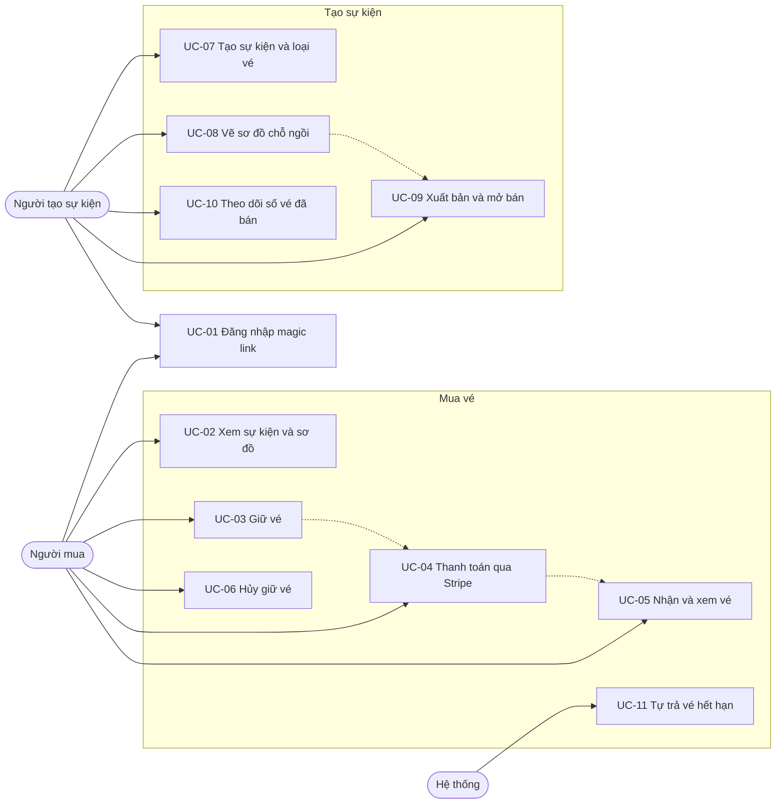
```mermaid
flowchart LR
    B(["Người mua"])
    O(["Người tạo sự kiện"])
    S(["Hệ thống"])
    UC01["UC-01 Đăng nhập magic link"]
    subgraph MUA["Mua vé"]
        UC02["UC-02 Xem sự kiện và sơ đồ"]
        UC03["UC-03 Giữ vé"]
        UC04["UC-04 Thanh toán qua Stripe"]
        UC05["UC-05 Nhận và xem vé"]
        UC06["UC-06 Hủy giữ vé"]
        UC11["UC-11 Tự trả vé hết hạn"]
    end
    subgraph STUDIO["Tạo sự kiện"]
        UC07["UC-07 Tạo sự kiện và loại vé"]
        UC08["UC-08 Vẽ sơ đồ chỗ ngồi"]
        UC09["UC-09 Xuất bản và mở bán"]
        UC10["UC-10 Theo dõi số vé đã bán"]
    end
    B --> UC01
    O --> UC01
    B --> UC02
    B --> UC03
    B --> UC04
    B --> UC05
    B --> UC06
    O --> UC07
    O --> UC08
    O --> UC09
    O --> UC10
    S --> UC11
    UC03 -.-> UC04
    UC04 -.-> UC05
    UC08 -.-> UC09
```

| Mã | Vai trò | Use case |
| --- | --- | --- |
| UC-01 | Mọi vai trò | Đăng nhập bằng magic link gửi qua email, đăng xuất |
| UC-02 | Người mua | Xem danh sách và chi tiết sự kiện, xem sơ đồ kèm tình trạng còn chỗ |
| UC-03 | Người mua | Giữ vé: chọn ghế cụ thể, hoặc chọn khu vực và số lượng, hoặc chọn loại vé GA và số lượng |
| UC-04 | Người mua | Thanh toán bằng thẻ qua Stripe trong thời hạn giữ vé |
| UC-05 | Người mua | Nhận vé qua email; xem lại đơn hàng và vé của mình |
| UC-06 | Người mua | Hủy giữ vé trước khi thanh toán |
| UC-07 | Người tạo sự kiện | Lập hồ sơ tổ chức; tạo và sửa sự kiện; cấu hình loại vé, giá, giới hạn vé mỗi đơn |
| UC-08 | Người tạo sự kiện | Vẽ sơ đồ: hàng ghế theo kiểu đường rồi nhập số ghế, khu vực theo shape, gán loại vé |
| UC-09 | Người tạo sự kiện | Xuất bản sơ đồ, mở bán, tạm dừng bán |
| UC-10 | Người tạo sự kiện | Theo dõi số vé đã bán theo loại vé |
| UC-11 | Hệ thống | Tự trả vé về kho khi hết hạn giữ |

### 3.3 Yêu cầu chức năng

| Mã | Yêu cầu |
| --- | --- |
| FR-01 | Đăng nhập không mật khẩu bằng magic link dùng một lần, có thời hạn. |
| FR-02 | Quản lý sự kiện: thông tin, trạng thái phát hành, loại vé với giá và mô hình kho vé. |
| FR-03 | Seat map editor trên canvas: vẽ hàng ghế theo đường thẳng, cung tròn, gấp khúc, đường cong; nhập số ghế để tự rải ghế. |
| FR-04 | Vẽ khu vực bằng hình chữ nhật, ellipse, đa giác; nhập sức chứa và gán loại vé. |
| FR-05 | Validate sơ đồ trước khi xuất bản; mỗi lần xuất bản tạo một phiên bản bất biến. |
| FR-06 | Giữ vé nguyên tử cho cả ba mô hình; một request giữ được nhiều ghế hoặc nhiều vé theo kiểu tất cả hoặc không. |
| FR-07 | Giữ vé có thời hạn (mặc định 10 phút); hết hạn thì tự trả về kho. |
| FR-08 | Mọi thao tác ghi quan trọng nhận `Idempotency-Key`; gửi lại cùng key trả lại cùng kết quả. |
| FR-09 | Thanh toán qua Stripe PaymentIntent; trạng thái đơn hàng chỉ đổi theo webhook đã xác minh chữ ký. |
| FR-10 | Phát hành vé điện tử có mã duy nhất sau khi thanh toán thành công; gửi qua email. |
| FR-11 | Kiểm soát tiếp nhận khi tải cao: rate limit, phòng chờ, từ chối sớm khi hết vé. |
| FR-12 | Lệnh kiểm tra bất biến của kho vé và đơn hàng, chạy định kỳ và sau mỗi thực nghiệm. |

### 3.4 Yêu cầu phi chức năng

| Mã | Yêu cầu | Chỉ tiêu |
| --- | --- | --- |
| NFR-01 | Không bán vượt | 0 vé vượt sức chứa, 0 ghế có hai chủ trong mọi thực nghiệm |
| NFR-02 | Chịu tải | 100.000 người dùng đồng thời tranh 5.000 vé; hệ thống không sập, request được tiếp nhận có p95 dưới 500 ms |
| NFR-03 | Thời hạn giữ vé | Vé hết hạn được trả về kho trong vòng 30 giây sau `expires_at` |
| NFR-04 | Idempotency | Gửi lại cùng key N lần chỉ tạo đúng một reservation và một lần thu tiền |
| NFR-05 | Tiền khớp vé | Mỗi đơn `PAID` có đúng một giao dịch Stripe thành công; không có vé nào thiếu đơn `PAID` |
| NFR-06 | Hiệu năng editor | Sơ đồ 10.000 ghế vẫn kéo, zoom mượt (từ 30 fps trở lên trên laptop phổ thông) |
| NFR-07 | Bảo mật | Không lưu dữ liệu thẻ; token đăng nhập chỉ lưu dạng hash; không hard-code secret |
| NFR-08 | Tái lập môi trường | Toàn bộ hệ thống khởi chạy bằng một lệnh `docker compose up` |

Các con số tải là mục tiêu thiết kế, sẽ được hiệu chỉnh theo tài nguyên máy chạy thực nghiệm (mục 15).

## 4. Kiến trúc tổng thể và công nghệ

Hệ thống là một modular monolith: một ứng dụng API duy nhất, job nền chạy ngay trong tiến trình đó, PostgreSQL là nguồn dữ liệu chuẩn duy nhất. Lý do: tính đúng đắn của giữ vé và đơn hàng dựa trên transaction cục bộ của database; tách thành nhiều service sẽ buộc phải dùng transaction phân tán mà không đem lại lợi ích ở quy mô này.

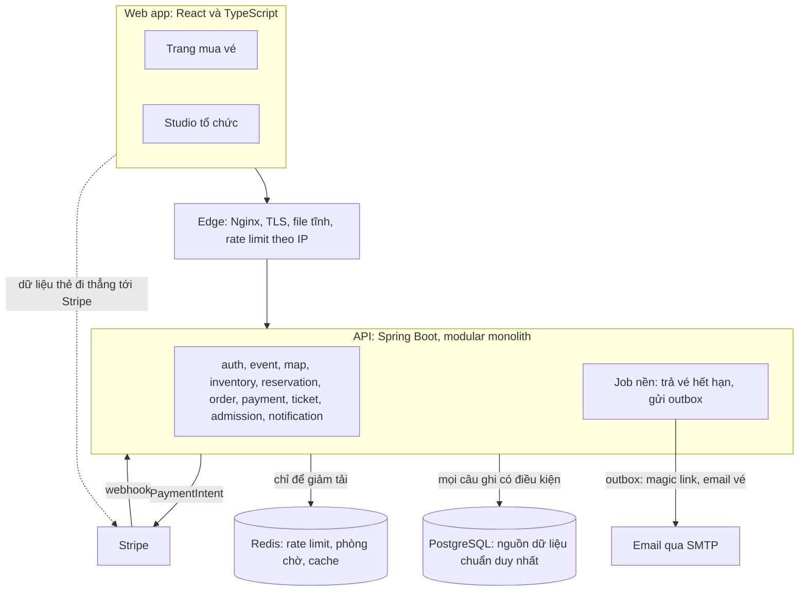
```mermaid
flowchart TD
    subgraph WEB["Web app: React và TypeScript"]
        BUY["Trang mua vé"]
        STU["Studio tổ chức"]
    end
    EDGE["Edge: Nginx, TLS, file tĩnh, rate limit theo IP"]
    subgraph API["API: Spring Boot, modular monolith"]
        MOD["auth, event, map, inventory, reservation, order, payment, ticket, admission, notification"]
        JOB["Job nền: trả vé hết hạn, gửi outbox"]
    end
    PG[("PostgreSQL: nguồn dữ liệu chuẩn duy nhất")]
    REDIS[("Redis: rate limit, phòng chờ, cache")]
    STRIPE["Stripe"]
    MAIL["Email qua SMTP"]
    WEB --> EDGE
    EDGE --> API
    API -- "mọi câu ghi có điều kiện" --> PG
    API -- "chỉ để giảm tải" --> REDIS
    API -- "PaymentIntent" --> STRIPE
    STRIPE -- "webhook" --> API
    WEB -. "dữ liệu thẻ đi thẳng tới Stripe" .-> STRIPE
    JOB -- "outbox: magic link, email vé" --> MAIL
```

Mọi request ghi đi qua API tới PostgreSQL; dữ liệu thẻ đi thẳng từ trình duyệt tới Stripe, và kết quả thanh toán quay về API qua webhook.

### 4.1 Các thành phần

1. **Web app** — React/TypeScript, gồm hai khu vực: trang mua vé và studio của người tạo sự kiện (có seat map editor).
2. **Edge** — Nginx: TLS, phục vụ file tĩnh, rate limit thô theo IP.
3. **API** — Spring Boot, chia module theo miền nghiệp vụ: `auth`, `event`, `map`, `inventory`, `reservation`, `order`, `payment`, `ticket`, `admission`, `notification`. Module chỉ gọi nhau qua interface công khai, không truy vấn bảng của nhau.
4. **Job nền** — chạy trong tiến trình API bằng `@Scheduled`: trả vé hết hạn, gửi outbox (email, lệnh hủy PaymentIntent), kiểm tra bất biến. Các job được viết để chạy an toàn trên nhiều bản sao, nên tách thành tiến trình worker riêng về sau không đổi code.
5. **PostgreSQL** — nguồn dữ liệu chuẩn cho kho vé, reservation, đơn hàng, vé.
6. **Redis** — rate limit, phòng chờ, cache tình trạng còn chỗ, cờ hết vé. Không bao giờ là nguồn dữ liệu chuẩn.
7. **Stripe** — PaymentIntent và webhook.
8. **Email (SMTP)** — magic link và vé điện tử.

### 4.2 Nguyên tắc xuyên suốt

- **Mọi bất biến được ép tại database.** Mỗi lần đổi trạng thái là một câu ghi có điều kiện (`UPDATE … WHERE trạng thái cũ`) hoặc một ràng buộc; code không bao giờ đọc rồi mới quyết định ghi.
- **Redis chỉ giảm tải, không quyết định.** Mất Redis thì hệ thống chậm hơn và mất phòng chờ, nhưng vẫn không bán vượt.
- **Tác dụng phụ ra ngoài đi qua outbox.** Email, lệnh hủy PaymentIntent được ghi vào bảng `outbox` trong cùng transaction với thay đổi nghiệp vụ, rồi job nền mới thực thi và thử lại đến khi xong.
- **Hướng lỗi an toàn.** Khi có sự cố, hệ thống nghiêng về phía giữ vé lâu hơn hoặc từ chối bán, không bao giờ nghiêng về phía bán trùng.

### 4.3 Công nghệ

| Lớp | Công nghệ |
| --- | --- |
| Frontend | React, TypeScript, Vite, TanStack Query, React Router |
| Canvas | Konva (react-konva) cho editor và trình xem sơ đồ; rbush làm chỉ mục không gian |
| Thanh toán phía client | Stripe.js và Payment Element (dữ liệu thẻ không đi qua server của nền tảng) |
| Backend | Java 21, Spring Boot 3 (Spring Web, Spring Security, Spring JDBC), springdoc-openapi |
| Database | PostgreSQL, Flyway |
| Cache và điều tiết | Redis (Lua script cho token bucket và phòng chờ) |
| Thanh toán phía server | Stripe API (PaymentIntent, Webhook) qua stripe-java |
| Email | Spring Mail qua SMTP; Mailpit ở môi trường dev |
| Job nền | Spring `@Scheduled`; hàng đợi bằng `SELECT … FOR UPDATE SKIP LOCKED` |
| Kiểm thử | JUnit 5, Testcontainers, Vitest, Playwright, k6 (tải), Stripe CLI (webhook cục bộ) |
| Triển khai | Docker Compose |

## 5. Xác thực bằng magic link

Hệ thống chỉ có một cách đăng nhập: nhập email, bấm link trong thư. Không có mật khẩu để lưu, để quên hay để lộ; email được xác minh ngay trong lần đăng nhập đầu tiên.

### 5.1 Luồng đăng nhập

1. Người dùng nhập email, client gọi `POST /auth/magic-link` kèm `return_to` (đường dẫn nội bộ cần quay lại, ví dụ trang checkout).
2. Server sinh token ngẫu nhiên 32 byte, chỉ lưu SHA-256 của token cùng email và `expires_at`. Response luôn là 202, không tiết lộ email đã có tài khoản hay chưa.
3. Email chứa link `/auth/callback?token=…`. Trang callback không tiêu thụ token khi được tải: nó gọi `POST /auth/verify` bằng JavaScript. Nhờ vậy bộ quét link của các hộp thư (mở link trước người dùng) không làm token mất hiệu lực.
4. Server tiêu thụ token bằng một câu ghi có điều kiện; đúng một request thắng:

   ```sql
   UPDATE login_token SET used_at = now()
   WHERE token_hash = :hash AND used_at IS NULL AND expires_at > now();
   ```
5. Nếu email chưa có tài khoản thì tạo mới. Server tạo session và đặt cookie, rồi chuyển về `return_to`.

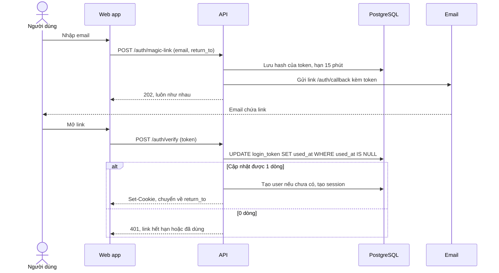
```mermaid
sequenceDiagram
    actor U as Người dùng
    participant W as Web app
    participant A as API
    participant DB as PostgreSQL
    participant M as Email
    U->>W: Nhập email
    W->>A: POST /auth/magic-link (email, return_to)
    A->>DB: Lưu hash của token, hạn 15 phút
    A->>M: Gửi link /auth/callback kèm token
    A-->>W: 202, luôn như nhau
    M-->>U: Email chứa link
    U->>W: Mở link
    W->>A: POST /auth/verify (token)
    A->>DB: UPDATE login_token SET used_at WHERE used_at IS NULL
    alt Cập nhật được 1 dòng
        A->>DB: Tạo user nếu chưa có, tạo session
        A-->>W: Set-Cookie, chuyển về return_to
    else 0 dòng
        A-->>W: 401, link hết hạn hoặc đã dùng
    end
```

### 5.2 Quy tắc

| Hạng mục | Quy tắc |
| --- | --- |
| Thời hạn token | 15 phút, dùng một lần |
| Token hợp lệ | Chỉ token mới nhất của mỗi email; yêu cầu link mới làm link cũ mất hiệu lực |
| Giới hạn gửi | 3 link mỗi email trong 15 phút, 10 link mỗi IP trong một giờ |
| Session | ID ngẫu nhiên, lưu dạng hash trong bảng `session`; cookie `HttpOnly; Secure; SameSite=Lax`; hết hạn sau 30 ngày không hoạt động |
| CSRF | `SameSite=Lax` cùng header `X-CSRF-Token` cho mọi request ghi |
| `return_to` | Chỉ chấp nhận đường dẫn tương đối trong cùng origin |
| Đăng xuất | Xóa session phía server, xóa cookie |

### 5.3 Phân quyền

| Vai trò | Cách có được | Quyền |
| --- | --- | --- |
| `BUYER` | Mọi tài khoản | Giữ vé, thanh toán, xem đơn và vé của mình |
| `ORGANIZER` | Lập hồ sơ tổ chức | Quản lý sự kiện và sơ đồ của chính tổ chức mình |

- Mọi endpoint của người tạo sự kiện kiểm tra quyền sở hữu (`event.organizer_id` khớp tổ chức của session), không chỉ kiểm tra vai trò.
- **Phải đăng nhập mới giữ được vé.** Reservation gắn với `user_id` để áp giới hạn vé mỗi người. Lựa chọn ghế được giữ ở client và khôi phục sau khi đăng nhập. Với sự kiện mở bán theo giờ, trang sự kiện nhắc người dùng đăng nhập trước giờ mở bán vì email có thể đến chậm.
- Vai trò `ADMIN` và xác thực lại cho thao tác nhạy cảm được thêm cùng phần tài chính ở giai đoạn sau.

## 6. Sự kiện và loại vé

### 6.1 Event

Mỗi Event đại diện cho đúng một show và thuộc về một tổ chức. Thông tin chính: tên, mô tả, địa điểm, `starts_at`, `ends_at`, khung mở bán (`sale_starts_at`, `sale_ends_at`), giới hạn vé mỗi đơn (mặc định 8), và phiên bản sơ đồ đang dùng nếu có.

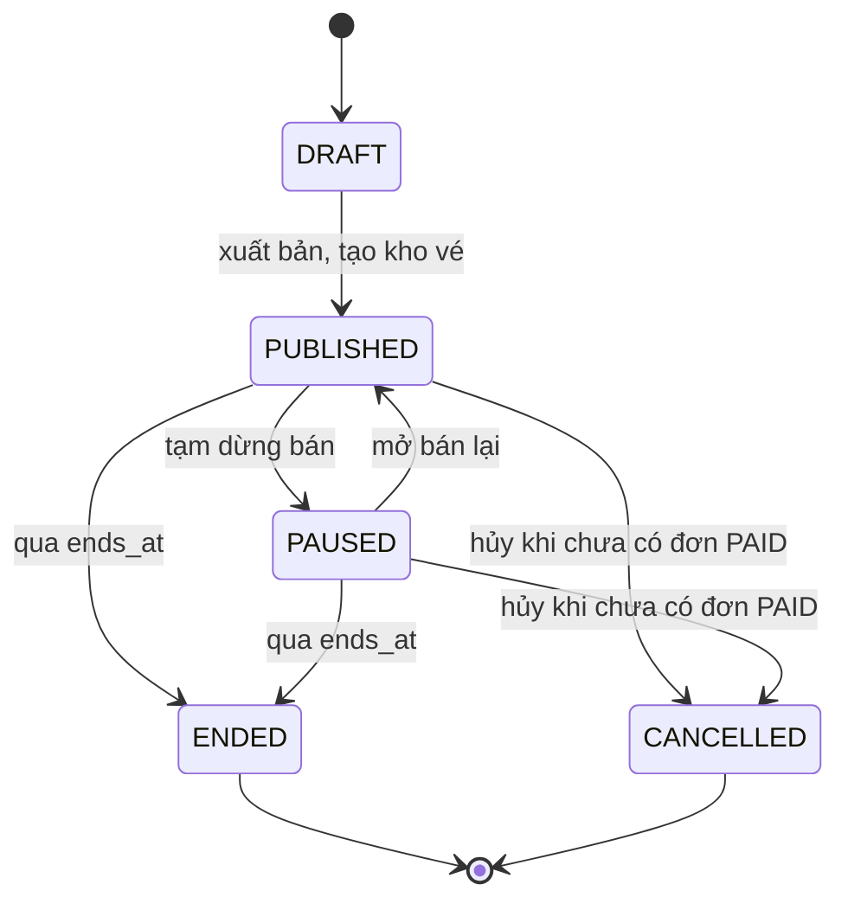
```mermaid
stateDiagram-v2
    [*] --> DRAFT
    DRAFT --> PUBLISHED: xuất bản, tạo kho vé
    PUBLISHED --> PAUSED: tạm dừng bán
    PAUSED --> PUBLISHED: mở bán lại
    PUBLISHED --> ENDED: qua ends_at
    PAUSED --> ENDED: qua ends_at
    PUBLISHED --> CANCELLED: hủy khi chưa có đơn PAID
    PAUSED --> CANCELLED: hủy khi chưa có đơn PAID
    ENDED --> [*]
    CANCELLED --> [*]
```

| Trạng thái | Ý nghĩa | Chuyển sang |
| --- | --- | --- |
| `DRAFT` | Đang soạn, chỉ người tạo thấy | `PUBLISHED` |
| `PUBLISHED` | Hiển thị công khai; bán vé trong khung mở bán | `PAUSED`, `ENDED`, `CANCELLED` |
| `PAUSED` | Người tạo tạm dừng bán; vé đã bán vẫn hợp lệ | `PUBLISHED`, `ENDED`, `CANCELLED` |
| `ENDED` | Đã qua `ends_at` | — |
| `CANCELLED` | Bị hủy; giai đoạn này chỉ cho hủy khi chưa có đơn đã thanh toán, vì chưa có hoàn tiền | — |

Điều kiện để xuất bản: có ít nhất một loại vé với sức chứa lớn hơn 0; nếu có loại vé SEAT hoặc ZONE thì sơ đồ đã qua validate; `starts_at` ở tương lai; khung mở bán hợp lệ. Khi xuất bản, hệ thống tạo kho vé từ sơ đồ và loại vé trong cùng một transaction (mục 8).

### 6.2 Loại vé và ba mô hình kho vé

Mỗi loại vé (ví dụ VIP, Thường, Sinh viên) có một giá cố định và thuộc đúng một mô hình kho vé. Một sự kiện có thể trộn các mô hình: khán đài bán theo ghế, sân bán theo khu đứng, kèm một loại vé GA.

| Mô hình | Người mua chọn | Đơn vị kho vé | Sức chứa đến từ | Cần sơ đồ |
| --- | --- | --- | --- | --- |
| `SEAT` | Một hoặc nhiều ghế cụ thể | Một dòng `inventory_unit` gắn với ghế đó | Số ghế được gán loại vé đó trên sơ đồ | Có |
| `ZONE` | Một khu vực và số lượng | N dòng `inventory_unit` vô danh, N là sức chứa của khu vực | Sức chứa nhập khi vẽ zone | Có |
| `GA` | Một loại vé và số lượng | N dòng `inventory_unit` vô danh, N là sức chứa của loại vé | Sức chứa nhập ở loại vé | Không |

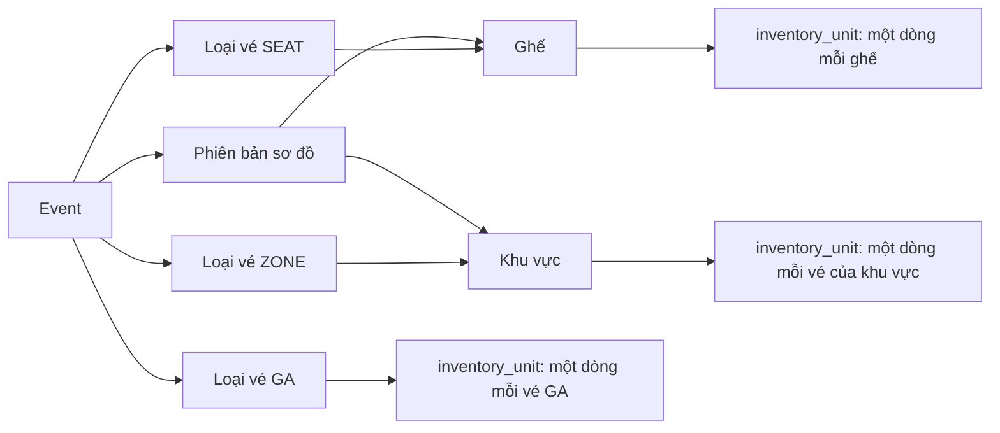
```mermaid
flowchart LR
    E["Event"] --> T1["Loại vé SEAT"]
    E --> T2["Loại vé ZONE"]
    E --> T3["Loại vé GA"]
    E --> M["Phiên bản sơ đồ"]
    M --> SEAT["Ghế"]
    M --> ZONE["Khu vực"]
    T1 --> SEAT
    T2 --> ZONE
    SEAT --> U1["inventory_unit: một dòng mỗi ghế"]
    ZONE --> U2["inventory_unit: một dòng mỗi vé của khu vực"]
    T3 --> U3["inventory_unit: một dòng mỗi vé GA"]
```

Cả ba mô hình dùng chung một bảng kho vé, mỗi dòng là một vé bán được. Lý do chọn một dòng mỗi vé thay cho một bộ đếm nằm ở mục 10.3.

- Mỗi ghế và mỗi zone trên sơ đồ được gán đúng một loại vé; giá đi theo loại vé.
- Giá lưu dạng số nguyên theo đơn vị nhỏ nhất của tiền tệ nền tảng (một tiền tệ duy nhất, cấu hình `PLATFORM_CURRENCY`, mặc định VND). Giá 0 là vé miễn phí và bỏ qua bước Stripe.
- Giá và tên loại vé được chụp lại vào dòng đơn hàng lúc giữ vé; đổi giá sau đó chỉ áp dụng cho đơn mới.

### 6.3 Thay đổi sau khi đã mở bán

| Thay đổi | Quy tắc |
| --- | --- |
| Tên, mô tả, ảnh | Tự do |
| Giá loại vé | Được phép; chỉ áp dụng cho reservation tạo sau thời điểm đổi |
| Tăng sức chứa zone hoặc GA | Được phép: thêm dòng unit mới |
| Giảm sức chứa zone hoặc GA | Chỉ bỏ được unit đang `AVAILABLE`, tức chỉ xuống tới số vé đang giữ và đã bán |
| Xóa loại vé | Chỉ khi chưa có vé nào đang giữ hoặc đã bán |
| Sửa sơ đồ | Qua phiên bản sơ đồ mới, theo quy tắc ở mục 7.8 |
| Đổi `starts_at`, địa điểm | Được phép; người đã mua nhận email thông báo |

## 7. Trình tạo sơ đồ chỗ ngồi

Người tạo sự kiện dựng sơ đồ bằng hai thao tác chính: vẽ một đường rồi nhập số ghế để có một hàng ghế, và vẽ một shape rồi nhập sức chứa để có một khu vực. Mọi thứ còn lại (rải ghế, đánh số, kiểm tra trùng, tạo kho vé) do hệ thống làm.

&#91;embedded content: giao diện seat map editor · thanh công cụ, canvas, bảng thuộc tính\]

Hàng C đang được vẽ bằng kiểu cung tròn: popover hỏi số ghế ngay tại cuối đường, bảng bên phải hiện các thuộc tính còn lại của hàng.

Bản chữ của hình trên, dùng khi xuất Markdown (`>` là mục đang chọn, `*` là hàng C đang vẽ):

```
+----------------------------------------------------------------------------------+
| So do nha hat - ban nhap                          Da luu   [Validate] [Xuat ban] |
+---------------+------------------------------------------+-----------------------+
| CONG CU       |              [ San khau ]                | THUOC TINH - HANG C   |
|  Chon       V |                                          |  Nhan hang          C |
|  Khung nhin H |    A   o o o o o o o o o o               |  So ghe            14 |
| >Hang ghe   R |   B   o o o o o o o o o o o o            |  Bat dau tu         1 |
|  Khoi ghe   B |  C   * * * * * * * * * * * * * *         |  Kieu duong Cung tron |
|  Khu vuc    Z |                      +--------------+    |  Loai ve          VIP |
|  Trang tri  D |                      | So ghe: [14] |    +-----------------------+
+---------------+                      +--------------+    | VAN DE                |
| KIEU DUONG    |      /------------------------\          |  Khong co van de      |
|  Thang        |     /   Fanzone                \         |                       |
| >Cung tron    |    /    suc chua 1.000          \        |                       |
|  Gap khuc     |   /------------------------------\       |                       |
|  Cong tu do   |    D   o o o o o o o o o o o o o o       |                       |
+---------------+------------------------------------------+-----------------------+
```

### 7.1 Mô hình tài liệu sơ đồ

Sơ đồ là một tài liệu JSON gồm các đối tượng sau. Hàng ghế là đối tượng tham số: nó lưu hình học của đường và số ghế, còn vị trí từng ghế được tính ra từ đó.

| Đối tượng | Hình học | Thuộc tính chính | Tạo kho vé |
| --- | --- | --- | --- |
| Section | Nhóm logic, có thể kèm đường viền | Tên (ví dụ Khán đài A), màu | Không |
| Row | Một đường: `line`, `arc`, `polyline`, `bezier` | Nhãn hàng, số ghế, quy tắc đánh số, loại vé mặc định | Không trực tiếp |
| Seat | Một điểm trên đường của Row | ID ổn định, số ghế, loại vé, cờ `accessible`, `blocked` | Một đơn vị SEAT |
| Zone | Shape: `rect`, `ellipse`, `polygon` | Tên, sức chứa, loại vé, màu | Một pool ZONE |
| Decoration | Shape, chữ hoặc ảnh | Nhãn (Sân khấu, Lối vào) | Không |

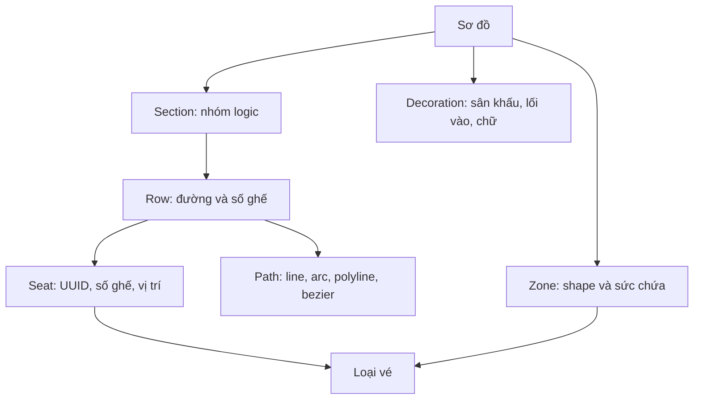
```mermaid
flowchart TD
    MAP["Sơ đồ"] --> SEC["Section: nhóm logic"]
    MAP --> ZONE["Zone: shape và sức chứa"]
    MAP --> DEC["Decoration: sân khấu, lối vào, chữ"]
    SEC --> ROW["Row: đường và số ghế"]
    ROW --> PATH["Path: line, arc, polyline, bezier"]
    ROW --> SEAT["Seat: UUID, số ghế, vị trí"]
    SEAT --> TT["Loại vé"]
    ZONE --> TT
```

Mỗi ghế nhận một UUID khi được tạo và giữ nguyên UUID đó qua mọi lần đổi hình học. Đây là điều kiện để sửa sơ đồ sau khi mở bán mà không làm lệch kho vé (mục 7.8).

### 7.2 Canvas và hệ tọa độ

- **Tọa độ thế giới**: đơn vị logic, 1 đơn vị bằng 1 px ở zoom 100%. Khung vẽ mặc định 4000 × 3000. Khung nhìn là một phép biến đổi pan và zoom (10% đến 800%), zoom quanh vị trí con trỏ.
- **Bốn layer Konva**, vẽ từ dưới lên: nền (lưới, ảnh mặt bằng để đồ theo), zone và trang trí, ghế, overlay (khung chọn, tay nắm, đường gióng, preview khi đang vẽ).
- **Bắt dính**: lưới 10 đơn vị; giữ Shift để khóa góc theo bước 15°; đường gióng thông minh khi mép hoặc tâm thẳng hàng với đối tượng khác.
- **Kích thước ghế**: đường kính mặc định 20 đơn vị, khoảng cách tối thiểu giữa hai tâm ghế 24 đơn vị; cả hai cấu hình được theo sơ đồ.

### 7.3 Bộ công cụ

| Công cụ | Phím | Thao tác |
| --- | --- | --- |
| Chọn | V | Click hoặc kéo khung để chọn, Shift để chọn thêm, kéo để di chuyển |
| Khung nhìn | H hoặc giữ Space | Kéo để pan, lăn chuột để zoom |
| Hàng ghế | R | Chọn kiểu đường, vẽ, nhập số ghế (mục 7.4) |
| Khối ghế | B | Kéo một hình chữ nhật, nhập số hàng và số ghế mỗi hàng, sinh các hàng thẳng song song |
| Khu vực | Z | Chọn shape, vẽ, nhập sức chứa (mục 7.5) |
| Trang trí | D | Sân khấu, lối vào, nhãn chữ |
| Ảnh nền | — | Tải ảnh mặt bằng, chỉnh độ mờ, khóa lại để đồ theo |

### 7.4 Vẽ hàng ghế: chọn kiểu đường, vẽ, nhập số ghế

**Bốn kiểu đường**

| Kiểu đường | Cách vẽ | Tham số lưu | Phù hợp với |
| --- | --- | --- | --- |
| Thẳng | Click điểm đầu, click điểm cuối | Hai điểm | Hội trường, phòng họp |
| Cung tròn | Click điểm đầu, điểm cuối, rồi kéo điểm giữa để chỉnh độ cong | Hai đầu mút và một điểm trên cung (suy ra tâm, bán kính, góc quét) | Nhà hát, khán đài hình quạt |
| Gấp khúc | Click lần lượt từng đỉnh, Enter hoặc double-click để kết thúc | Danh sách đỉnh | Hàng ghế bẻ góc theo tường |
| Cong tự do | Click hai đầu mút, kéo hai điểm điều khiển | Bezier bậc ba: hai đầu mút, hai điểm điều khiển | Bố cục bất quy tắc |

**Trình tự thao tác**

1. Chọn công cụ Hàng ghế và một kiểu đường trên thanh tùy chọn.
2. Vẽ đường trên canvas. Trong lúc vẽ, đường preview hiện kèm độ dài và số ghế tối đa đặt vừa.
3. Khi đường hoàn tất, một popover mở ngay tại cuối đường với ô **Số ghế** đã được focus. Người dùng gõ số và nhấn Enter.
4. Hệ thống rải ghế cách đều dọc theo đường và hiển thị ngay. Popover còn các trường: nhãn hàng (tự gợi ý chữ kế tiếp: A, B, … Z, AA), số bắt đầu, hướng đánh số, kiểu đánh số (liên tục, hoặc lẻ và chẵn tách hai phía từ giữa), loại vé.
5. Enter lần nữa để chốt. Công cụ vẫn ở chế độ vẽ để vẽ hàng tiếp theo; Esc quay về công cụ Chọn.

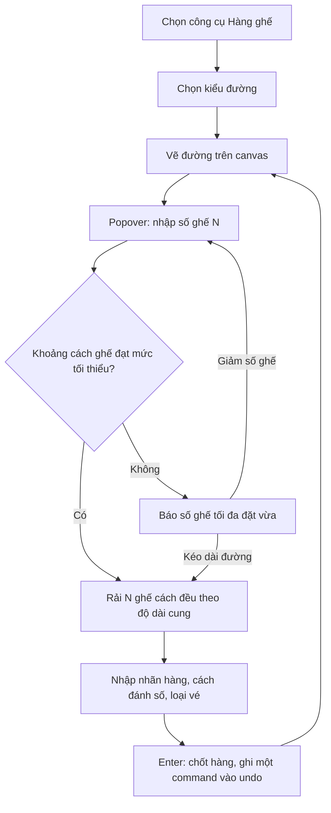
```mermaid
flowchart TD
    A["Chọn công cụ Hàng ghế"] --> B["Chọn kiểu đường"]
    B --> C["Vẽ đường trên canvas"]
    C --> D["Popover: nhập số ghế N"]
    D --> E{"Khoảng cách ghế đạt mức tối thiểu?"}
    E -- Có --> F["Rải N ghế cách đều theo độ dài cung"]
    E -- Không --> G["Báo số ghế tối đa đặt vừa"]
    G -- Giảm số ghế --> D
    G -- Kéo dài đường --> F
    F --> H["Nhập nhãn hàng, cách đánh số, loại vé"]
    H --> I["Enter: chốt hàng, ghi một command vào undo"]
    I --> C
```

**Thuật toán rải ghế.** Với đường có tổng độ dài L và N ghế, ghế thứ i nằm ở vị trí cách đầu đường một đoạn s\_i theo độ dài cung; hai ghế ngoài cùng nằm đúng ở hai đầu mút. Khi N = 1, ghế nằm ở giữa đường.

```latex
s_i = \frac{i}{N-1}\,L, \qquad i = 0, 1, \dots, N-1
```

- **Thẳng**: nội suy tuyến tính giữa hai đầu mút theo tỉ lệ s\_i / L.
- **Cung tròn**: với tâm C, bán kính r, góc đầu θ0 và góc quét Δθ, ghế nằm tại góc θ0 + (s\_i / L) × Δθ trên đường tròn.
- **Gấp khúc và cong tự do**: đường được làm phẳng thành các đoạn thẳng ngắn (Bezier lấy mẫu 64 điểm), lập bảng độ dài tích lũy, tìm nhị phân đoạn chứa s\_i rồi nội suy trong đoạn đó.

Mỗi ghế lưu thêm góc tiếp tuyến tại vị trí của nó để nhãn và biểu tượng ghế xoay theo đường.

**Kiểm tra khoảng cách.** Khoảng cách giữa hai ghế liền nhau là L / (N − 1). Nếu nhỏ hơn khoảng cách tối thiểu, popover báo số ghế tối đa đặt vừa và đề xuất hai cách sửa: giảm số ghế, hoặc tự kéo dài đường cho vừa. Người dùng cũng có thể đổi sang chế độ **khóa khoảng cách**: nhập khoảng cách, hệ thống tính số ghế.

**Đổi số ghế về sau.** Tăng N giữ nguyên UUID của các ghế cũ và sinh UUID mới cho ghế thêm ở cuối hàng; giảm N bỏ các ghế cuối hàng. Mọi ghế được rải lại vị trí.

**Nhân bản song song.** Chọn một hàng, nhập số hàng cần thêm và khoảng cách giữa các hàng. Hàng thẳng được tịnh tiến theo pháp tuyến; hàng cung tròn được nhân bản đồng tâm với bán kính tăng dần, có tùy chọn thêm ghế mỗi hàng để giữ khoảng cách ghế không đổi. Nhãn hàng tự tăng. Đây là cách dựng nhanh một khán đài hình quạt chỉ từ một cung.

### 7.5 Vẽ khu vực bằng shape

| Shape | Cách vẽ | Chỉnh sửa |
| --- | --- | --- |
| Chữ nhật | Kéo từ góc này sang góc đối diện | Tay nắm co giãn và xoay |
| Ellipse | Kéo khung bao | Tay nắm co giãn và xoay |
| Đa giác | Click lần lượt từng đỉnh; click lại đỉnh đầu hoặc Enter để đóng | Kéo đỉnh; double-click lên cạnh để thêm đỉnh; chọn đỉnh rồi Delete để xóa |

- Khi shape hoàn tất, popover mở với ô **Sức chứa** đã được focus, cùng tên khu vực, loại vé và màu.
- Sức chứa là số do người tạo nhập, không suy ra từ diện tích. Editor chỉ hiện diện tích để tham khảo.
- Nhãn khu vực (tên và sức chứa) đặt tại điểm nằm trong shape và xa biên nhất, nên luôn nằm gọn bên trong kể cả với đa giác lõm.
- Phía người mua, click vào khu vực được xác định bằng phép thử điểm nằm trong đa giác.

### 7.6 Chỉnh sửa

- **Biến đổi**: đối tượng được chọn có tay nắm di chuyển, xoay quanh tâm, và co giãn. Co giãn một hàng ghế làm đổi độ dài đường; ghế được rải lại, số ghế giữ nguyên.
- **Sửa đường**: double-click một hàng để vào chế độ sửa điểm điều khiển (đầu mút, đỉnh, độ cong).
- **Sửa từng ghế**: trong chế độ sửa hàng, click chọn từng ghế để đổi loại vé (ví dụ bốn ghế giữa hàng là VIP), đánh dấu `accessible` (chỗ cho xe lăn), `blocked` (không bán: ghế kỹ thuật, tầm nhìn bị che), hoặc ghi đè số ghế.
- **Bảng thuộc tính** bên phải hiện các trường của đối tượng đang chọn; khi chọn nhiều đối tượng thì hiện các trường chung để sửa hàng loạt.
- **Sắp xếp**: sao chép, dán, nhân bản (Ctrl+D, nhãn hàng tự tăng), căn lề, dàn đều, gom vào Section.
- **Undo/redo**: mỗi thao tác là một command có `do` và `undo`; một lần kéo chỉ tạo một command khi thả chuột. Ngăn xếp giữ 200 bước.
- **Tự lưu**: bản nháp được lưu sau 2 giây không có thay đổi, bằng `PUT /maps/{id}/draft` kèm `revision`. Nếu một tab khác đã lưu bản mới hơn, server trả 409 và editor yêu cầu tải lại thay vì ghi đè.

### 7.7 Validate

Validate chạy liên tục ở client để hiện danh sách vấn đề (click một dòng để zoom tới đối tượng), và chạy lại ở server khi xuất bản. Kết quả của server là kết quả cuối cùng.

| Quy tắc | Mức |
| --- | --- |
| Nhãn ghế trùng trong cùng Section (Section, hàng, số ghế) | Lỗi |
| Hai tâm ghế cách nhau dưới đường kính ghế | Lỗi |
| Hàng ghế không có nhãn | Lỗi |
| Ghế hoặc khu vực chưa gán loại vé | Lỗi |
| Loại vé SEAT hoặc ZONE không có ghế hay khu vực nào | Lỗi |
| Khu vực có sức chứa nhỏ hơn 1 | Lỗi |
| Đa giác tự cắt | Lỗi |
| Ghế nằm bên trong một khu vực | Lỗi |
| Tổng số ghế vượt 20.000 | Lỗi |
| Hai khu vực chồng lên nhau | Cảnh báo |
| Đối tượng nằm ngoài khung vẽ | Cảnh báo |

### 7.8 Lưu trữ, xuất bản và phiên bản

Bản nháp và các phiên bản đã xuất bản được lưu riêng. Bản nháp sửa tự do; mỗi lần xuất bản tạo một `seat_map_version` bất biến có số phiên bản và checksum. Một Event luôn trỏ tới một phiên bản cụ thể, nên một sơ đồ có thể dùng lại cho nhiều sự kiện.

```json
{
  "schemaVersion": 1,
  "canvas": { "width": 4000, "height": 3000, "seatDiameter": 20, "minSpacing": 24 },
  "sections": [{ "id": "sec-a", "name": "Khán đài A" }],
  "rows": [{
    "id": "row-1", "sectionId": "sec-a", "label": "A",
    "path": { "type": "arc", "start": [800, 1200], "end": [1600, 1200], "through": [1200, 1320] },
    "numbering": { "start": 1, "direction": "forward", "scheme": "sequential" },
    "ticketTypeId": "tt-vip",
    "seats": [
      { "id": "6f1c…", "number": "1", "x": 800, "y": 1200, "angle": 0.52 },
      { "id": "a93e…", "number": "2", "x": 829, "y": 1216, "angle": 0.48, "flags": ["accessible"] }
    ]
  }],
  "zones": [{
    "id": "zone-fan", "name": "Fanzone", "capacity": 1000, "ticketTypeId": "tt-standing",
    "shape": { "type": "polygon", "points": [[900, 1500], [1500, 1500], [1650, 1900], [750, 1900]] }
  }],
  "decorations": [{ "id": "stage", "label": "Sân khấu", "shape": { "type": "rect", "x": 1000, "y": 900, "w": 400, "h": 120 } }]
}
```

Vị trí ghế do client tính và lưu sẵn trong tài liệu, nên server không phải lặp lại phép toán hình học; server kiểm tra schema, số lượng, nhãn và khoảng cách.

**Sửa sơ đồ sau khi đã mở bán.** Người tạo sửa bản nháp rồi xuất bản phiên bản mới. Server so sánh hai phiên bản theo UUID và áp dụng trong một transaction, theo kiểu tất cả hoặc không:

| Thay đổi | Xử lý |
| --- | --- |
| Di chuyển, xoay, đổi hình học; sửa trang trí | Luôn được phép, vì UUID không đổi |
| Thêm ghế hoặc khu vực | Tạo unit mới ở trạng thái còn trống |
| Tăng sức chứa khu vực | Luôn được phép: thêm unit |
| Giảm sức chứa khu vực | Chỉ bỏ được unit đang `AVAILABLE` |
| Đổi loại vé hoặc nhãn của ghế | Chỉ với ghế đang `AVAILABLE` |
| Xóa ghế hoặc khu vực | Chỉ khi mọi unit liên quan đang `AVAILABLE`; các unit chuyển sang `REMOVED` bằng `UPDATE` có điều kiện |

Nếu có bất kỳ thay đổi nào vi phạm, cả phiên bản bị từ chối và editor liệt kê các ghế gây xung đột. Người mua đang xem sơ đồ nhận phiên bản mới ở lần làm mới tình trạng chỗ kế tiếp, vì response mang theo số phiên bản.

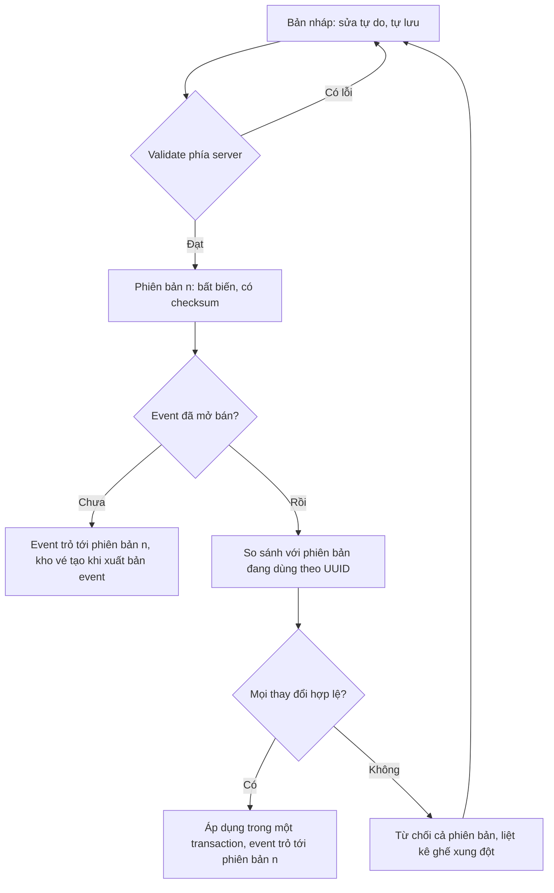
```mermaid
flowchart TD
    D["Bản nháp: sửa tự do, tự lưu"] --> V{"Validate phía server"}
    V -- Có lỗi --> D
    V -- Đạt --> P["Phiên bản n: bất biến, có checksum"]
    P --> Q{"Event đã mở bán?"}
    Q -- Chưa --> R["Event trỏ tới phiên bản n, kho vé tạo khi xuất bản event"]
    Q -- Rồi --> S["So sánh với phiên bản đang dùng theo UUID"]
    S --> T{"Mọi thay đổi hợp lệ?"}
    T -- Có --> U["Áp dụng trong một transaction, event trỏ tới phiên bản n"]
    T -- Không --> W["Từ chối cả phiên bản, liệt kê ghế xung đột"]
    W --> D
```

### 7.9 Hiệu năng render

- **Không tạo một node cho mỗi ghế.** Toàn bộ ghế được vẽ bằng một shape tùy biến duy nhất trên layer ghế; hàm vẽ duyệt các ghế trong khung nhìn và vẽ hình tròn trực tiếp lên canvas.
- **Chỉ mục không gian.** Ghế và shape được đưa vào R-tree (rbush). Xác định ghế dưới con trỏ và lọc ghế trong khung nhìn đều là truy vấn R-tree, không duyệt toàn bộ.
- **Mức chi tiết theo zoom.** Dưới 40%: chỉ vẽ Section dạng khối màu kèm số ghế. Từ 40%: vẽ từng ghế. Từ 150%: hiện thêm số ghế.
- **Kéo thả.** Trong lúc kéo, phần được chọn được vẽ ra một bitmap tạm và chỉ di chuyển bitmap; hình học được tính lại một lần khi thả.

### 7.10 Trình xem sơ đồ cho người mua

- Dùng chung bộ render với editor ở chế độ chỉ đọc, thêm lớp tình trạng: còn trống (màu theo loại vé), đang được giữ, đã bán, đang chọn.
- Hai endpoint tách biệt: `GET /events/{id}/map` trả tài liệu sơ đồ (bất biến theo phiên bản, cache dài hạn) và `GET /events/{id}/availability` trả danh sách ghế không còn trống cùng số vé còn lại của từng pool (nhỏ, cache 1 đến 2 giây trong Redis). Client làm mới tình trạng mỗi 3 đến 5 giây.
- Tình trạng hiển thị chỉ là gợi ý. Kết quả thật là kết quả của lệnh giữ vé: nếu ghế vừa bị người khác lấy, API trả 409 kèm danh sách ghế thất bại và giao diện đánh dấu lại các ghế đó.
- Click một ghế để thêm hoặc bỏ khỏi lựa chọn, trong giới hạn vé mỗi đơn. Click một khu vực để mở ô chọn số lượng. Trên điện thoại: chụm hai ngón để zoom, chạm để chọn.

## 8. Kho vé và giữ vé

Kho vé nằm trong PostgreSQL và mọi thay đổi đều là một câu ghi có điều kiện; đây là cơ chế duy nhất chống bán vượt, các lớp phía trước chỉ giảm tải cho nó.

### 8.1 Bất biến

| Đối tượng | Bất biến | Được ép bằng |
| --- | --- | --- |
| Unit (một ghế, hoặc một vé của zone hay GA) | Mỗi unit có tối đa một chủ: một reservation đang mở hoặc một vé đã bán | `UPDATE` có điều kiện trên `status`; ràng buộc `CHECK` giữa `status` và `reservation_id` |
| Pool (zone, GA) | Số vé giữ và bán không vượt sức chứa | Số dòng unit của pool bằng đúng sức chứa; không thể giữ một dòng không tồn tại |
| Reservation | Rời trạng thái `ACTIVE` đúng một lần | `UPDATE … WHERE status = 'ACTIVE'` |
| Người mua | Tối đa một reservation `ACTIVE` hoặc `EXPIRING` cho mỗi sự kiện | Unique index một phần trên `(user_id, event_id)` |

Kho vé là một bảng duy nhất, `inventory_unit`, mỗi dòng là một vé bán được. Ghế là unit có `seat_id`; vé của zone hoặc GA là unit vô danh có `pool_id`, các unit cùng pool thay thế được cho nhau. Không có cột bộ đếm nào: số vé còn lại là số unit `AVAILABLE`, nên không thể âm và không thể lệch.

Vòng đời của một unit trong `inventory_unit`:

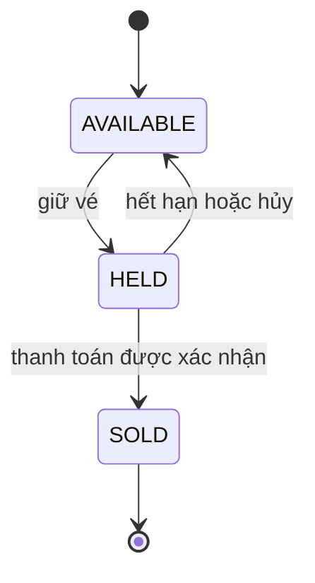
```mermaid
stateDiagram-v2
    [*] --> AVAILABLE
    AVAILABLE --> HELD: giữ vé
    HELD --> AVAILABLE: hết hạn hoặc hủy
    HELD --> SOLD: thanh toán được xác nhận
    SOLD --> [*]
```

### 8.2 Giữ vé nguyên tử

Một request giữ vé có thể gồm nhiều ghế và nhiều dòng số lượng (zone, GA). Tất cả chạy trong một transaction theo kiểu tất cả hoặc không: thiếu một ghế thì không giữ ghế nào.

**Ghế.** Khóa đúng các unit của những ghế được chọn, bỏ qua unit đang bị transaction khác khóa, rồi đổi trạng thái:

```sql
WITH picked AS (
  SELECT unit_id FROM inventory_unit
  WHERE event_id = :event AND seat_id = ANY(:seat_ids) AND status = 'AVAILABLE'
  FOR UPDATE SKIP LOCKED
)
UPDATE inventory_unit u
SET status = 'HELD', reservation_id = :rid
FROM picked
WHERE u.unit_id = picked.unit_id;
-- Số dòng cập nhật phải bằng số ghế yêu cầu.
-- Ít hơn: ROLLBACK, trả 409 kèm danh sách ghế không giữ được.
```

`SKIP LOCKED` không bao giờ chờ lock, nên không có deadlock và người thua trả về ngay: khi 100.000 request cùng tranh ghế A1, đúng một request cập nhật được một dòng, số còn lại nhận 0 dòng và kết thúc trong vài mili giây.

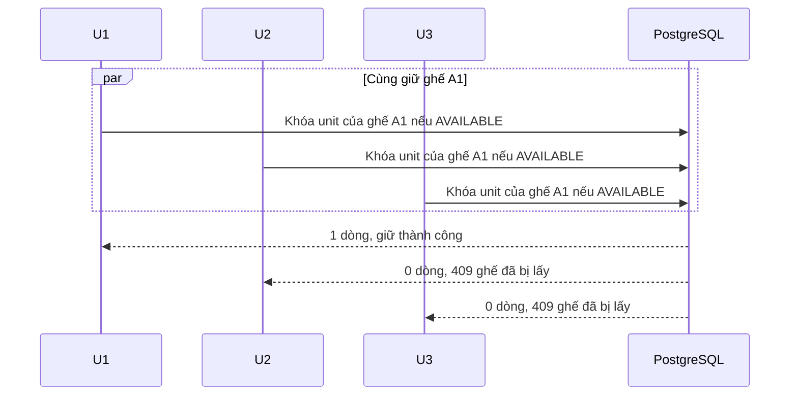
```mermaid
sequenceDiagram
    participant U1
    participant U2
    participant U3
    participant DB as PostgreSQL
    par Cùng giữ ghế A1
        U1->>DB: Khóa unit của ghế A1 nếu AVAILABLE
        U2->>DB: Khóa unit của ghế A1 nếu AVAILABLE
        U3->>DB: Khóa unit của ghế A1 nếu AVAILABLE
    end
    DB-->>U1: 1 dòng, giữ thành công
    DB-->>U2: 0 dòng, 409 ghế đã bị lấy
    DB-->>U3: 0 dòng, 409 ghế đã bị lấy
```

**Zone và GA.** Cùng câu lệnh đó, chỉ khác điều kiện chọn: lấy bất kỳ `qty` unit còn trống của pool.

```sql
WITH picked AS (
  SELECT unit_id FROM inventory_unit
  WHERE pool_id = :pool AND status = 'AVAILABLE'
  LIMIT :qty
  FOR UPDATE SKIP LOCKED
)
UPDATE inventory_unit u
SET status = 'HELD', reservation_id = :rid
FROM picked
WHERE u.unit_id = picked.unit_id;
-- Số dòng cập nhật phải bằng :qty. Ít hơn: ROLLBACK và trả 409.
```

Các transaction đồng thời khóa những dòng khác nhau, nên không transaction nào phải chờ transaction nào:

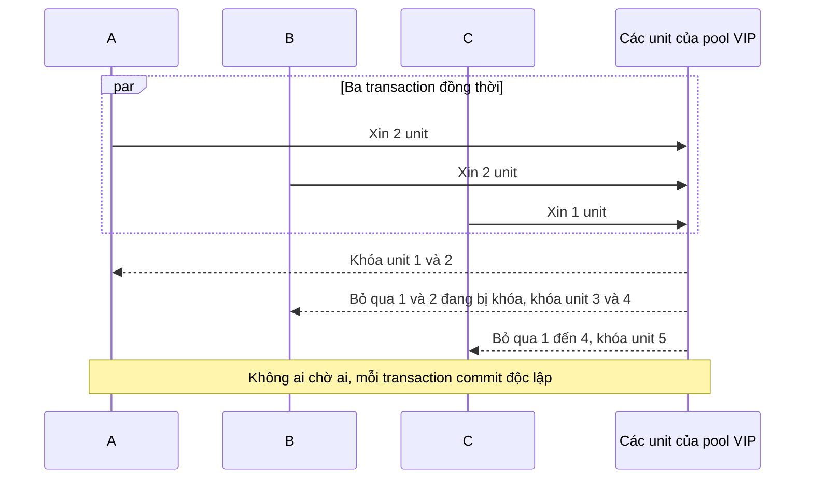
```mermaid
sequenceDiagram
    participant A
    participant B
    participant C
    participant DB as Các unit của pool VIP
    par Ba transaction đồng thời
        A->>DB: Xin 2 unit
        B->>DB: Xin 2 unit
        C->>DB: Xin 1 unit
    end
    DB-->>A: Khóa unit 1 và 2
    DB-->>B: Bỏ qua 1 và 2 đang bị khóa, khóa unit 3 và 4
    DB-->>C: Bỏ qua 1 đến 4, khóa unit 5
    Note over A,DB: Không ai chờ ai, mỗi transaction commit độc lập
```

- **Index**: một index một phần trên `pool_id` với điều kiện `status = 'AVAILABLE'` để câu chọn chỉ quét unit còn trống.
- **Isolation**: dùng `READ COMMITTED`, mức mặc định của PostgreSQL. Sau khi khóa một dòng, điều kiện `status = 'AVAILABLE'` được kiểm tra lại trên phiên bản mới nhất của dòng đó.
- **Gần hết vé**: một request có thể nhận thiếu dòng vì những unit cuối đang bị transaction khác khóa. Request đó nhận 409; nếu transaction kia rollback thì đây là một lần từ chối oan, chấp nhận được vì người mua chọn lại được ngay.
- **Xác nhận và trả vé** dùng chung một câu cho mọi loại unit: `UPDATE inventory_unit SET status = … WHERE reservation_id = :rid AND status = 'HELD'`, kèm kiểm tra số dòng.

Sau khi giữ kho vé, cùng transaction đó tạo `reservation` (`ACTIVE`, `expires_at = now() + 10 phút`), các `reservation_item`, và `order` ở trạng thái `PENDING_PAYMENT` với giá đã chụp lại.

### 8.3 Vòng đời reservation

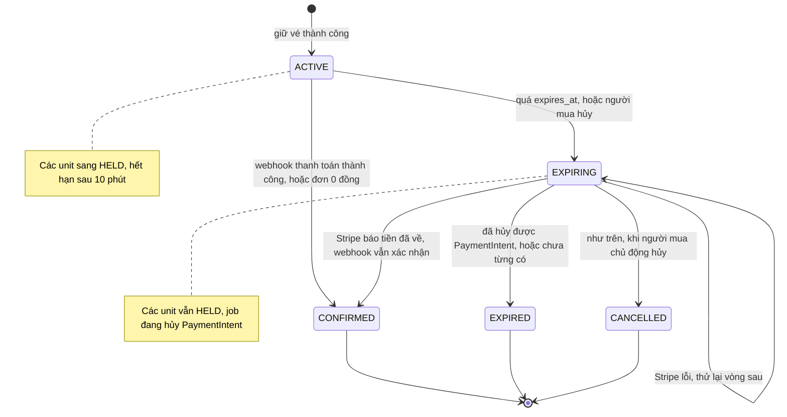
```mermaid
stateDiagram-v2
    [*] --> ACTIVE: giữ vé thành công
    ACTIVE --> CONFIRMED: webhook thanh toán thành công, hoặc đơn 0 đồng
    ACTIVE --> EXPIRING: quá expires_at, hoặc người mua hủy
    EXPIRING --> EXPIRING: Stripe lỗi, thử lại vòng sau
    EXPIRING --> EXPIRED: đã hủy được PaymentIntent, hoặc chưa từng có
    EXPIRING --> CANCELLED: như trên, khi người mua chủ động hủy
    EXPIRING --> CONFIRMED: Stripe báo tiền đã về, webhook vẫn xác nhận
    CONFIRMED --> [*]
    EXPIRED --> [*]
    CANCELLED --> [*]
    note right of ACTIVE
        Các unit sang HELD, hết hạn sau 10 phút
    end note
    note right of EXPIRING
        Các unit vẫn HELD, job đang hủy PaymentIntent
    end note
```

`EXPIRING` là trạng thái trung gian: kho vé còn bị giữ cho tới khi PaymentIntent đã được hủy xong, nên một khoản tiền về muộn vẫn tìm thấy vé của nó.

| Từ | Sang | Kích hoạt bởi | Tác động lên kho vé |
| --- | --- | --- | --- |
| — | `ACTIVE` | Người mua giữ vé thành công | Các unit sang `HELD` |
| `ACTIVE` | `CONFIRMED` | Webhook thanh toán thành công, hoặc đơn 0 đồng | Các unit sang `SOLD` |
| `ACTIVE` | `EXPIRING` | Job trả vé thấy `expires_at` đã qua, hoặc người mua bấm hủy | Chưa đổi: các unit vẫn `HELD` |
| `EXPIRING` | `EXPIRED` hoặc `CANCELLED` | Job trả vé, sau khi đã hủy được PaymentIntent | Các unit về `AVAILABLE` |
| `EXPIRING` | `CONFIRMED` | Webhook thanh toán thành công đến trong lúc đang trả vé | Như `ACTIVE` sang `CONFIRMED` |

### 8.4 Tranh chấp giữa confirm và expire

Hai luồng cùng muốn kết thúc một reservation: webhook thanh toán muốn xác nhận, job trả vé muốn giải phóng kho. Quy tắc: dòng `reservation` là trọng tài duy nhất, và kho vé chỉ được trả sau khi chắc chắn tiền không thể về.

1. Job trả vé chiếm reservation quá hạn bằng `UPDATE … SET status = 'EXPIRING' WHERE status = 'ACTIVE' AND expires_at < now()`. Kho vé chưa được trả.
2. Nếu đơn đã có PaymentIntent, job gọi Stripe để hủy PaymentIntent đó, ngoài transaction.
3. Hủy thành công (hoặc chưa từng có PaymentIntent): một transaction chuyển `EXPIRING` sang `EXPIRED`, trả mọi unit bằng `UPDATE inventory_unit … WHERE reservation_id = :rid AND status = 'HELD'`, đóng đơn hàng.
4. Stripe báo PaymentIntent đã thành công: job không trả vé. Webhook sẽ chuyển `EXPIRING` sang `CONFIRMED`; người mua đã trả tiền thì nhận được vé.
5. Stripe lỗi hoặc timeout: reservation ở lại `EXPIRING`, kho vé vẫn được giữ, job thử lại ở vòng sau.

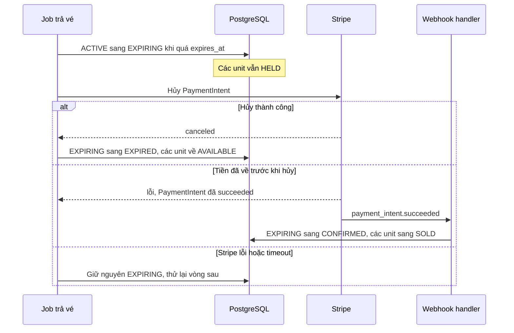
```mermaid
sequenceDiagram
    participant J as Job trả vé
    participant DB as PostgreSQL
    participant S as Stripe
    participant W as Webhook handler
    J->>DB: ACTIVE sang EXPIRING khi quá expires_at
    Note over DB: Các unit vẫn HELD
    J->>S: Hủy PaymentIntent
    alt Hủy thành công
        S-->>J: canceled
        J->>DB: EXPIRING sang EXPIRED, các unit về AVAILABLE
    else Tiền đã về trước khi hủy
        S-->>J: lỗi, PaymentIntent đã succeeded
        S->>W: payment_intent.succeeded
        W->>DB: EXPIRING sang CONFIRMED, các unit sang SOLD
    else Stripe lỗi hoặc timeout
        J->>DB: Giữ nguyên EXPIRING, thử lại vòng sau
    end
```

Phía xác nhận dùng `UPDATE reservation SET status = 'CONFIRMED' WHERE id = :rid AND status IN ('ACTIVE', 'EXPIRING')`. Hai luồng cùng ghi lên một dòng nên lock dòng tuần tự hóa chúng; luồng đến sau thấy 0 dòng và dừng. Một PaymentIntent đã bị hủy thì không thể thành công, nên sau bước 3 không còn khoản tiền nào có thể về cho một vé đã trả. Trường hợp vẫn xảy ra do lỗi vận hành được xử lý ở mục 9.5.

### 8.5 Job trả vé hết hạn

- Job chạy mỗi 5 giây trong tiến trình API; mỗi vòng lấy tối đa 200 reservation bằng `FOR UPDATE SKIP LOCKED`, nên khi chạy nhiều bản sao về sau các bản sao không giẫm lên nhau.
- Index một phần trên `expires_at` với điều kiện `status = 'ACTIVE'` giữ cho câu quét luôn nhỏ.
- Thao tác trả vé idempotent: mọi câu ghi đều kèm điều kiện `reservation_id` và trạng thái, chạy lại không trả nhầm ghế của reservation khác.
- Reservation kẹt ở `EXPIRING` quá 2 phút được lấy lại để xử lý tiếp.
- Job dừng thì vé bị giữ lâu hơn, không bao giờ bán trùng. Lệnh kiểm tra bất biến (mục 14) báo các reservation `ACTIVE` quá hạn hơn 60 giây.

### 8.6 Idempotency

Client sinh một `Idempotency-Key` (UUID) cho mỗi hành động của người dùng và dùng lại đúng key đó khi retry.

- Bảng `idempotency_key` có khóa chính `(user_id, key)`, lưu hash của request và response đã trả.
- Dòng key được chèn trong chính transaction của thao tác nghiệp vụ. Không tồn tại trạng thái "đã giữ vé nhưng chưa lưu key".
- Request thứ hai cùng key bị chặn ở unique index cho đến khi request đầu commit, rồi nhận lại đúng response đã lưu. Cùng key nhưng khác nội dung trả 422.
- Áp dụng cho giữ vé và tạo PaymentIntent. Key được dọn sau 24 giờ.

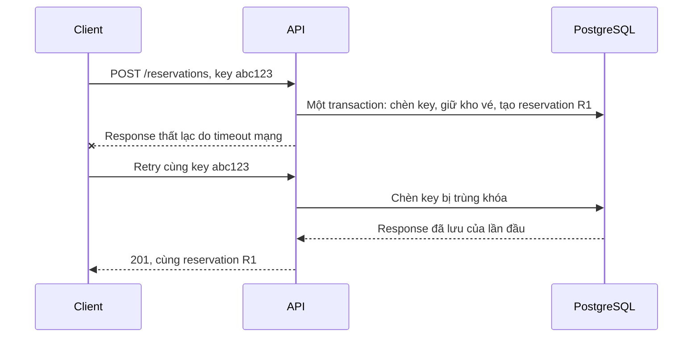
```mermaid
sequenceDiagram
    participant C as Client
    participant A as API
    participant DB as PostgreSQL
    C->>A: POST /reservations, key abc123
    A->>DB: Một transaction: chèn key, giữ kho vé, tạo reservation R1
    A--xC: Response thất lạc do timeout mạng
    C->>A: Retry cùng key abc123
    A->>DB: Chèn key bị trùng khóa
    DB-->>A: Response đã lưu của lần đầu
    A-->>C: 201, cùng reservation R1
```

## 9. Thanh toán Stripe và phát hành vé

Trạng thái đơn hàng chỉ đổi sang đã thanh toán khi server nhận webhook của Stripe đã xác minh chữ ký; mọi tín hiệu từ trình duyệt đều không được tin.

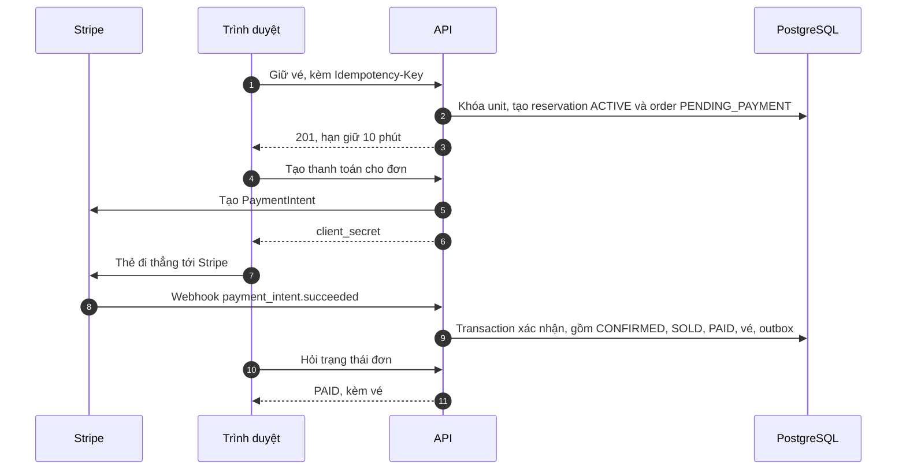
```mermaid
sequenceDiagram
    autonumber
    participant S as Stripe
    participant B as Trình duyệt
    participant A as API
    participant DB as PostgreSQL
    B->>A: Giữ vé, kèm Idempotency-Key
    A->>DB: Khóa unit, tạo reservation ACTIVE và order PENDING_PAYMENT
    A-->>B: 201, hạn giữ 10 phút
    B->>A: Tạo thanh toán cho đơn
    A->>S: Tạo PaymentIntent
    A-->>B: client_secret
    B->>S: Thẻ đi thẳng tới Stripe
    S->>A: Webhook payment_intent.succeeded
    A->>DB: Transaction xác nhận, gồm CONFIRMED, SOLD, PAID, vé, outbox
    B->>A: Hỏi trạng thái đơn
    A-->>B: PAID, kèm vé
```

Bước 8 là bước duy nhất làm đơn thành `PAID`. Nếu bước 7 không xảy ra trong thời hạn giữ, job trả vé hủy PaymentIntent rồi mới trả vé về kho (mục 8.4).

### 9.1 Lựa chọn tích hợp

- **PaymentIntent cùng Payment Element nhúng trong trang**, không dùng trang thanh toán do Stripe host. Lý do: nền tảng cần tự điều khiển vòng đời khoản thanh toán cho khớp với thời hạn giữ vé, cụ thể là hủy PaymentIntent khi reservation hết hạn (mục 8.4).
- **Chỉ nhận thẻ.** Thẻ cho kết quả gần như tức thời. Các phương thức có kết quả đến chậm không được bật vì tiền có thể về sau khi vé đã trả lại kho.
- **Dữ liệu thẻ không đi qua server của nền tảng**: Payment Element gửi thẳng tới Stripe; server chỉ giữ `payment_intent_id`.
- **Một tài khoản Stripe của nền tảng** nhận toàn bộ tiền. Tính phí và chia doanh thu cho người tạo sự kiện thuộc phần tài chính, để sau.

### 9.2 Luồng checkout

1. **Giữ vé.** `POST /events/{id}/reservations` tạo reservation `ACTIVE` và order `PENDING_PAYMENT`. Tổng tiền do server tính từ giá đã chụp, client không gửi số tiền.
2. **Tạo PaymentIntent.** `POST /orders/{id}/payment-intent`: server tạo PaymentIntent với số tiền của đơn, `metadata` gồm `order_id` và `reservation_id`, khóa idempotency phía Stripe là `order_id`. Server lưu `payment_intent_id` và trả `client_secret`. Request bị từ chối nếu reservation không còn `ACTIVE` hoặc còn dưới 30 giây. Lời gọi Stripe nằm ngoài transaction database.
3. **Thanh toán.** Client hiển thị Payment Element cùng đồng hồ đếm ngược, rồi gọi xác nhận thanh toán. Ngân hàng có thể yêu cầu xác thực 3-D Secure.
4. **Webhook.** Stripe gửi `payment_intent.succeeded`. Server xác minh chữ ký, loại event trùng, rồi chạy transaction xác nhận.
5. **Transaction xác nhận**, tất cả trong một transaction:
   - reservation sang `CONFIRMED` (điều kiện ở mục 8.4);
   - mọi unit của reservation sang `SOLD`;
   - order sang `PAID`, ghi `paid_at`;
   - tạo một `ticket` cho mỗi unit;
   - ghi outbox để gửi email vé.
6. **Kết quả.** Client chờ ở trang kết quả và hỏi `GET /orders/{id}` cho đến khi đơn là `PAID`, rồi hiện vé.

Thẻ bị từ chối (`payment_intent.payment_failed`): đơn vẫn ở `PENDING_PAYMENT`, người mua thử lại với thẻ khác chừng nào reservation còn hạn. Đơn 0 đồng bỏ qua bước 2 đến 4: server chạy transaction xác nhận ngay khi người mua bấm nhận vé.

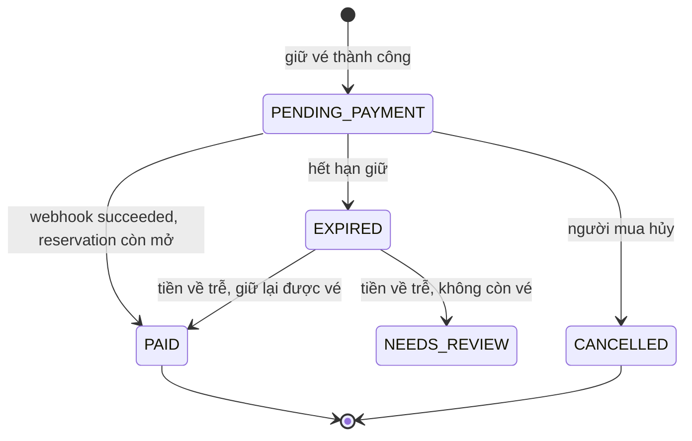
```mermaid
stateDiagram-v2
    [*] --> PENDING_PAYMENT: giữ vé thành công
    PENDING_PAYMENT --> PAID: webhook succeeded, reservation còn mở
    PENDING_PAYMENT --> EXPIRED: hết hạn giữ
    PENDING_PAYMENT --> CANCELLED: người mua hủy
    EXPIRED --> PAID: tiền về trễ, giữ lại được vé
    EXPIRED --> NEEDS_REVIEW: tiền về trễ, không còn vé
    PAID --> [*]
    CANCELLED --> [*]
```

| Trạng thái order | Ý nghĩa |
| --- | --- |
| `PENDING_PAYMENT` | Đã giữ vé, chờ tiền |
| `PAID` | Đã thu tiền, đã phát hành vé |
| `EXPIRED`, `CANCELLED` | Đóng mà không thu tiền |
| `NEEDS_REVIEW` | Tiền đã về nhưng không còn vé để giao (mục 9.5); chờ xử lý thủ công |

### 9.3 Xử lý webhook

| Event của Stripe | Xử lý |
| --- | --- |
| `payment_intent.succeeded` | Transaction xác nhận (mục 9.2), hoặc luồng thanh toán đến trễ (mục 9.5) |
| `payment_intent.payment_failed` | Ghi lý do vào order; trạng thái không đổi |
| `payment_intent.canceled` | Ghi nhận; đơn do job trả vé đóng |
| Loại khác | Ghi log, trả 200 |

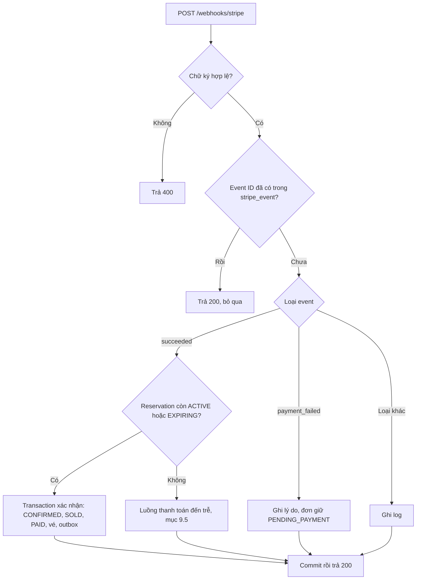
```mermaid
flowchart TD
    A["POST /webhooks/stripe"] --> B{"Chữ ký hợp lệ?"}
    B -- Không --> X["Trả 400"]
    B -- Có --> C{"Event ID đã có trong stripe_event?"}
    C -- Rồi --> Y["Trả 200, bỏ qua"]
    C -- Chưa --> D{"Loại event"}
    D -- succeeded --> E{"Reservation còn ACTIVE hoặc EXPIRING?"}
    E -- Có --> F["Transaction xác nhận: CONFIRMED, SOLD, PAID, vé, outbox"]
    E -- Không --> G["Luồng thanh toán đến trễ, mục 9.5"]
    D -- payment_failed --> H["Ghi lý do, đơn giữ PENDING_PAYMENT"]
    D -- Loại khác --> I["Ghi log"]
    F --> Z["Commit rồi trả 200"]
    G --> Z
    H --> Z
    I --> Z
```

- **Xác minh chữ ký** bằng header `Stripe-Signature` và secret của endpoint; sai chữ ký trả 400.
- **Loại trùng**: mỗi event được chèn vào bảng `stripe_event` với khóa chính là ID event, trong cùng transaction với phần xử lý. Chèn trùng nghĩa là đã xử lý, trả 200 ngay. Xử lý lỗi thì transaction rollback cả dòng đánh dấu, server trả 5xx và Stripe gửi lại.
- **Không phụ thuộc thứ tự**: mọi handler là câu ghi có điều kiện trên trạng thái hiện tại, nên event đến sai thứ tự hoặc đến hai lần đều vô hại.
- **Webhook thất lạc**: một job nền hỏi lại Stripe trạng thái của mọi PaymentIntent thuộc đơn `PENDING_PAYMENT` quá 15 phút và chạy đúng handler tương ứng.

### 9.4 Vé điện tử

- Mỗi ghế hoặc mỗi đơn vị số lượng trong đơn `PAID` sinh một `ticket` với mã vé ngẫu nhiên, duy nhất.
- Email vé gồm thông tin sự kiện, vị trí (Section, hàng, ghế hoặc tên khu vực), mã vé và link tới trang Vé của tôi.
- QR trên vé và màn hình soát vé để sau; mã vé duy nhất là đủ để thêm QR mà không đổi dữ liệu đã có.

### 9.5 Thanh toán đến trễ

Nếu `payment_intent.succeeded` đến khi reservation đã `EXPIRED` hoặc `CANCELLED`, người mua đã trả tiền cho một vé không còn được giữ. Thiết kế ở mục 8.4 ngăn điều này; đây là lưới an toàn cuối:

1. Thử giữ lại đúng các ghế và số lượng của đơn bằng câu claim ở mục 8.2.
2. Giữ được: chạy transaction xác nhận như bình thường.
3. Không giữ được: order sang `NEEDS_REVIEW` và được ghi log mức lỗi. Ở giai đoạn này việc hoàn tiền làm thủ công trên Stripe Dashboard; hoàn tiền tự động để sau.

Mỗi lần rơi vào luồng này đều được ghi log và hiện trong kết quả của lệnh kiểm tra bất biến (mục 14). Con số khác 0 là dấu hiệu cần điều tra.

## 10. Chịu tải cao

Khi 100.000 người tranh 5.000 vé, 95% request chắc chắn thất bại; mục tiêu của thiết kế là cho chúng thất bại thật rẻ, trước khi chạm tới database. Database vẫn là lớp duy nhất quyết định đúng sai.

### 10.1 Các lớp kiểm soát tiếp nhận

| Lớp | Cơ chế | Chặn được gì |
| --- | --- | --- |
| 1. Edge | Rate limit theo IP tại Nginx; cache trang sự kiện và tài liệu sơ đồ | Bot, tải lại trang liên tục |
| 2. Phòng chờ | Hàng đợi theo sự kiện trong Redis, cấp quyền vào theo nhịp | Số người đồng thời ở bước chọn chỗ và giữ vé |
| 3. Token bucket theo người dùng | Lua script trong Redis | Một tài khoản gửi dồn dập lệnh giữ vé |
| 4. Cờ hết vé | Key `soldout:{pool}` đặt khi đếm lại thấy pool không còn unit `AVAILABLE`, xóa khi có vé được trả lại | Request tới pool đã hết, không cần hỏi database |
| 5. Bulkhead | Giới hạn số lệnh giữ vé đồng thời, nhỏ hơn kích thước connection pool | Endpoint nóng chiếm hết connection của phần còn lại |
| 6. Database | Mỗi vé một dòng, lấy bằng `SKIP LOCKED` (mục 8.2) | Bán vượt |

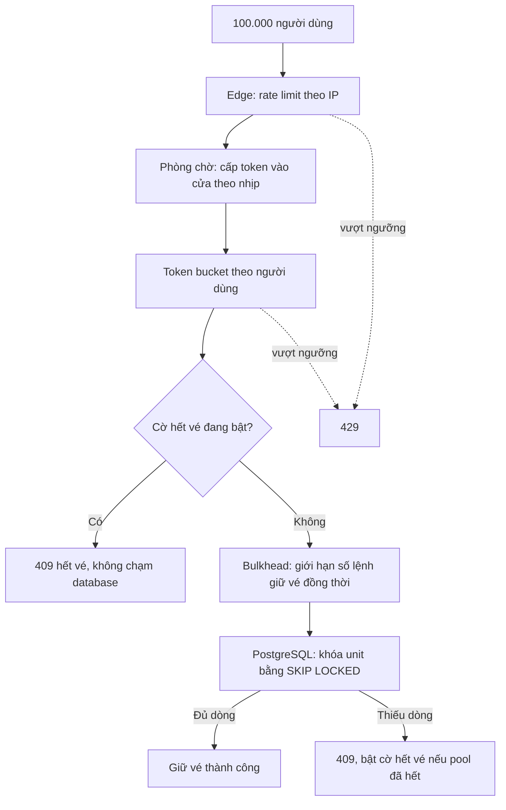
```mermaid
flowchart TD
    U["100.000 người dùng"] --> E["Edge: rate limit theo IP"]
    E --> Q["Phòng chờ: cấp token vào cửa theo nhịp"]
    Q --> T["Token bucket theo người dùng"]
    T --> S{"Cờ hết vé đang bật?"}
    S -- Có --> R1["409 hết vé, không chạm database"]
    S -- Không --> B["Bulkhead: giới hạn số lệnh giữ vé đồng thời"]
    B --> DB["PostgreSQL: khóa unit bằng SKIP LOCKED"]
    DB -- Đủ dòng --> OK["Giữ vé thành công"]
    DB -- Thiếu dòng --> R2["409, bật cờ hết vé nếu pool đã hết"]
    E -. vượt ngưỡng .-> R3["429"]
    T -. vượt ngưỡng .-> R3
```

### 10.2 Phòng chờ và hàng đợi mở bán

Khi vé mở bán, chỉ một số người có giới hạn được ở trong khu đặt vé (chọn chỗ, giữ vé, thanh toán) cùng một lúc; mọi người còn lại xếp hàng và thấy vị trí của mình. Một người rời khu đặt vé thì người đầu hàng mới được vào.

**Tham số** (cấu hình theo sự kiện; giá trị là mặc định đề xuất, hiệu chỉnh ở EXP-05)

| Tham số | Mặc định | Ý nghĩa |
| --- | --- | --- |
| `max_active` | 500 người | Số người tối đa ở trong khu đặt vé cùng lúc |
| `admit_rate` | 50 người mỗi giây | Số người tối đa được cho vào trong một giây, để khu đặt vé không đầy lên trong một nhịp |
| `pass_ttl` | 10 phút | Thời hạn của một lượt vào, bằng thời hạn giữ vé |
| `prequeue_opens` | 30 phút trước giờ mở bán | Từ lúc này người đã đăng nhập vào được phòng chờ |
| `idle_timeout` | 2 phút | Ngừng hỏi vị trí quá thời gian này thì mất chỗ trong hàng |

Ví dụ: với `max_active` là 500 và mỗi người mất trung bình 2 phút từ lúc vào đến lúc thanh toán xong, hàng đợi tiến khoảng 4 người mỗi giây.

**Vòng đời của một người trong hàng**

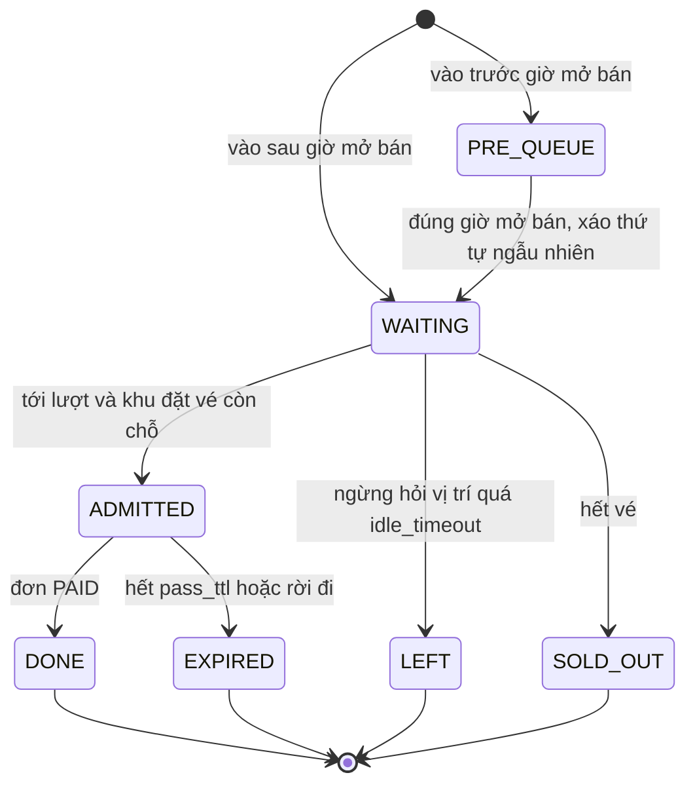
```mermaid
stateDiagram-v2
    [*] --> PRE_QUEUE: vào trước giờ mở bán
    [*] --> WAITING: vào sau giờ mở bán
    PRE_QUEUE --> WAITING: đúng giờ mở bán, xáo thứ tự ngẫu nhiên
    WAITING --> ADMITTED: tới lượt và khu đặt vé còn chỗ
    WAITING --> LEFT: ngừng hỏi vị trí quá idle_timeout
    WAITING --> SOLD_OUT: hết vé
    ADMITTED --> DONE: đơn PAID
    ADMITTED --> EXPIRED: hết pass_ttl hoặc rời đi
    DONE --> [*]
    EXPIRED --> [*]
    LEFT --> [*]
    SOLD_OUT --> [*]
```

1. **Trước giờ mở bán.** Từ `prequeue_opens`, người đã đăng nhập vào phòng chờ và được ghi vào tập chờ trước. Giai đoạn này chưa có thứ tự: đến sớm 30 phút hay 1 phút đều như nhau.
2. **Đúng giờ mở bán.** Mỗi người trong tập chờ trước nhận một số ngẫu nhiên làm thứ tự. Cách này không thưởng cho việc tải lại trang đúng giây mở bán hay cho đường truyền nhanh hơn.
3. **Sau giờ mở bán.** Người đến sau xếp nối đuôi theo thứ tự đến, luôn đứng sau toàn bộ nhóm đã được xáo.
4. **Cấp lượt.** Mỗi giây, job cấp lượt tính số chỗ trống trong khu đặt vé và cho từng ấy người đầu hàng vào, không quá `admit_rate`. Người được vào nhận một token vào cửa có chữ ký, gắn với `user_id` và sự kiện, hết hạn sau `pass_ttl`.
5. **Trong khu đặt vé.** Endpoint giữ vé chỉ nhận request có token hợp lệ. Khi đã giữ vé, lượt vào được kéo dài tới `expires_at` của reservation để người mua kịp thanh toán.
6. **Trả lượt.** Lượt vào kết thúc khi đơn thành `PAID`, khi token hết hạn, hoặc khi người mua rời đi. Chỗ trống được cấp cho người kế tiếp ở vòng job ngay sau đó.

**Job cấp lượt**

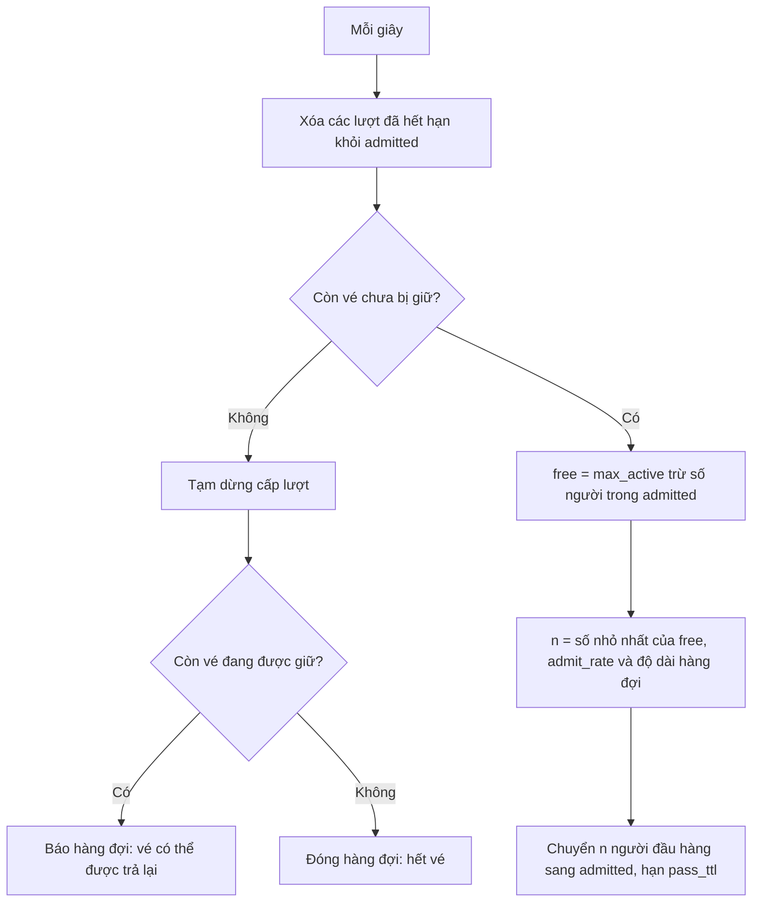
```mermaid
flowchart TD
    T["Mỗi giây"] --> A["Xóa các lượt đã hết hạn khỏi admitted"]
    A --> B{"Còn vé chưa bị giữ?"}
    B -- Không --> P["Tạm dừng cấp lượt"]
    P --> S{"Còn vé đang được giữ?"}
    S -- Có --> W["Báo hàng đợi: vé có thể được trả lại"]
    S -- Không --> X["Đóng hàng đợi: hết vé"]
    B -- Có --> C["free = max_active trừ số người trong admitted"]
    C --> D["n = số nhỏ nhất của free, admit_rate và độ dài hàng đợi"]
    D --> F["Chuyển n người đầu hàng sang admitted, hạn pass_ttl"]
```

- Toàn bộ vòng cấp lượt là một Lua script chạy nguyên tử trong Redis, nên không bao giờ cho vào quá `max_active` kể cả khi về sau có nhiều bản sao API.
- **Backpressure**: `admit_rate` giảm khi p95 của lệnh giữ vé vượt ngưỡng và tăng lại khi database rảnh. Nhịp vào không bao giờ vượt sức ghi của database.
- **Hết vé**: khi không còn vé nào chưa bị giữ, job ngừng cấp lượt mới. Nếu vẫn còn vé đang được giữ, hàng đợi được báo rằng vé có thể được trả lại; khi vé về kho, job cấp lượt tiếp. Khi mọi vé đã bán, hàng đợi đóng.

**Luồng đầy đủ**

```mermaid
sequenceDiagram
    actor U as Người mua
    participant A as API
    participant R as Redis
    participant J as Job cấp lượt
    U->>A: Vào phòng chờ trước giờ mở bán
    A->>R: Thêm vào prequeue
    Note over R,J: Đúng giờ mở bán, xáo ngẫu nhiên prequeue thành queue
    loop Theo retryAfter do server trả về
        U->>A: Hỏi vị trí
        A->>R: Đọc thứ hạng trong queue
        A-->>U: WAITING, vị trí, thời gian chờ ước lượng
    end
    J->>R: Mỗi giây chuyển n người đầu hàng sang admitted
    U->>A: Hỏi vị trí
    A-->>U: ADMITTED, kèm token vào cửa
    U->>A: Giữ vé, kèm token
    A->>R: Kiểm tra người này còn trong admitted
    A-->>U: Reservation ACTIVE
    U->>A: Thanh toán xong, đơn PAID
    A->>R: Xóa khỏi admitted, trả chỗ cho người kế tiếp
```

**Dữ liệu trong Redis**

| Key | Kiểu | Nội dung |
| --- | --- | --- |
| `prequeue:{event}` | Set | `user_id` của người vào trước giờ mở bán |
| `queue:{event}` | Sorted set | `user_id` với điểm là thứ tự: số ngẫu nhiên trong khoảng 0 đến 1 cho nhóm được xáo, 1 cộng số đếm tăng dần cho người đến sau |
| `admitted:{event}` | Sorted set | `user_id` với điểm là thời điểm hết hạn lượt vào |
| `seen:{event}` | Sorted set | `user_id` với điểm là lần hỏi vị trí gần nhất, dùng để loại người đã rời đi |

Vị trí trong hàng là thứ hạng của `user_id` trong `queue:{event}`. Thời gian chờ ước lượng bằng vị trí chia cho số người được vào mỗi giây, tính trung bình trong một phút gần nhất.

**Hỏi vị trí**

```json
GET /events/{id}/queue

{ "status": "WAITING", "position": 1824, "estimatedWaitSeconds": 420, "retryAfterSeconds": 15 }

{ "status": "ADMITTED", "admissionToken": "…", "expiresAt": "2026-10-05T03:10:00Z" }
```

- Endpoint này chỉ đọc Redis, không chạm database, và đồng thời là tín hiệu người dùng còn ở đó.
- Server quyết định nhịp hỏi qua `retryAfterSeconds`: người ở xa đầu hàng hỏi thưa (30 giây), người sắp tới lượt hỏi dày (3 đến 5 giây). Nhờ vậy 100.000 người chờ không tạo ra một lượng request ngang với chính đợt mở bán.
- Khi trạng thái là `ADMITTED`, trang phòng chờ tự chuyển sang màn hình chọn chỗ và hiện đồng hồ đếm ngược của lượt vào.

**Kiểm tra ở endpoint giữ vé.** Với sự kiện đang bật hàng đợi, `POST /events/{id}/reservations` kiểm tra ba điều trước khi chạm database: chữ ký và hạn của token, `user_id` trong token khớp session, và người dùng còn nằm trong `admitted:{event}`. Thiếu một trong ba thì trả 429 `QUEUE_REQUIRED`.

**Công bằng và chống lách**

- Mỗi tài khoản có đúng một chỗ trong hàng, vì key là `user_id`: mở nhiều tab hay nhiều thiết bị không tạo thêm chỗ.
- Phải đăng nhập mới vào được phòng chờ; token vào cửa gắn với `user_id` nên không chuyển cho người khác dùng được.
- Thứ tự của nhóm chờ trước là ngẫu nhiên, nên bot đến sớm không có lợi thế so với người thật.
- Người ngừng hỏi vị trí quá `idle_timeout` bị loại khỏi hàng, để chỗ của người đã bỏ đi không làm chậm hàng.

**Khi nào hàng đợi hoạt động**

- Bật theo sự kiện bằng cờ `high_demand`, hoặc tự bật khi số người trong khu đặt vé chạm `max_active`.
- Khi số người đến ít hơn `max_active`, hàng đợi trong suốt: người vào phòng chờ được cấp lượt ngay ở vòng job kế tiếp.
- **Redis không khả dụng**: API chuyển sang rate limiter trong bộ nhớ với ngưỡng thấp; sự kiện `high_demand` trả 503 kèm `Retry-After` cho phần vượt ngưỡng. Tính đúng đắn không đổi vì không phụ thuộc Redis.

### 10.3 Không có hot row: mỗi vé là một dòng

Kho vé theo số lượng không dùng một dòng bộ đếm cho mỗi pool mà dùng một dòng cho mỗi vé (mục 8.2). Các transaction đồng thời khóa những dòng khác nhau bằng `SKIP LOCKED`, nên không có dòng nào để tranh và không transaction nào phải chờ lock.

| Phương án | Tranh chấp | Tính nhất quán | Kết luận |
| --- | --- | --- | --- |
| Một dòng mỗi vé, lấy bằng `FOR UPDATE SKIP LOCKED` | Không có: mỗi transaction khóa dòng riêng | Kho vé và reservation trong một transaction | **Chọn** |
| Một dòng bộ đếm mỗi pool (`held`, `sold`) | Mọi lệnh giữ vé xếp hàng trên một lock dòng | Một transaction | Không chọn: hot row |
| Chia pool thành K dòng bộ đếm | Giảm K lần nhưng vẫn còn | Một transaction; vé cuối nằm rải rác ở các ngăn | Không chọn |
| Bộ đếm trong Redis (`DECR`, `INCR`) cùng database | Không có lock | Bước trừ ở Redis và bước ghi database không nằm trong một transaction, nên có thể lệch nhau | Không chọn |

Đây là mẫu Shopify dùng cho inventory reservation sau khi bỏ thiết kế `DECR` và `INCR` trên Redis: một dòng cho mỗi đơn vị bán được thay cho một dòng có cột số lượng, lấy bằng `SKIP LOCKED`, để reservation và kho nằm trong cùng một transaction ([Shopify Engineering](https://shopify.engineering/scaling-inventory-reservations)). Khác biệt ở đây: Shopify giữ một pool tối đa 1.000 dòng còn trống cho mỗi mặt hàng và bổ sung dần; sức chứa của một sự kiện hữu hạn và biết trước, nên hệ thống này tạo đủ số dòng khi xuất bản và không cần bước bổ sung.

Cái giá của phương án này:

- **Số dòng bằng tổng sức chứa.** 5.000 vé là 5.000 dòng; một sự kiện 100.000 chỗ là 100.000 dòng, vẫn nhỏ với PostgreSQL. Nếu sau này có pool hàng triệu vé thì chuyển sang pool có giới hạn và bổ sung dần như Shopify.
- **Số vé còn lại phải đếm**, không đọc được từ một cột. Phép đếm chạy trên index một phần và kết quả được cache 1 đến 2 giây trong response tình trạng chỗ.
- **Từ chối oan khi gần hết vé** (mục 8.2).

Phòng chờ và cờ hết vé vẫn được giữ. Vai trò của chúng không còn là bảo vệ một dòng nóng mà là chặn request thua trước khi chúng chiếm connection.

### 10.4 Giới hạn thật là connection pool

Khi không còn tranh lock, trần thông lượng nằm ở số connection: mỗi transaction đang mở giữ một connection, và một luồng giữ connection lâu sẽ chặn mọi luồng khác. Shopify gặp đúng điều này: truy vấn reservation không phải nút thắt, mà các đoạn code checkout khác giữ connection lâu hơn cần thiết.

```mermaid
flowchart LR
    A["Kiểm tra token vào cửa, cờ hết vé, rate limit"] --> B["Lấy connection"]
    B --> C["Transaction: chèn key, khóa unit, tạo reservation và order"]
    C --> D["COMMIT, trả connection"]
    D --> E["Dựng response"]
    E --> F["Stripe được gọi ở request sau, ngoài transaction"]
```

- **Không gọi ra ngoài khi đang mở transaction.** Lời gọi Stripe, SMTP và Redis chạy trước transaction, sau transaction, hoặc qua outbox.
- **Transaction giữ vé chỉ gồm các câu ghi cần thiết**: chèn idempotency key, khóa unit, chèn reservation, item và order. Truy vấn đọc để dựng response chạy sau khi commit.
- **Kiểm tra rẻ chạy trước khi lấy connection**: token vào cửa, cờ hết vé, rate limit đều ở Redis.
- **Bulkhead**: số lệnh giữ vé đồng thời nhỏ hơn kích thước connection pool, để webhook và job nền luôn còn connection.
- **Không xếp hàng chờ connection**: hết connection thì trả 503 kèm `Retry-After`; `statement_timeout` của transaction giữ vé là 2 giây.
- **Đọc tình trạng chỗ không dùng connection**: response của `GET /events/{id}/availability` được dựng một lần mỗi 1 đến 2 giây và phục vụ từ Redis cho mọi người xem.
- EXP-05 đo thời gian giữ connection của mỗi request và số connection đang dùng, không chỉ đo độ trễ.

### 10.5 Quy ước retry phía client

| Response | Client làm gì |
| --- | --- |
| 409 (ghế đã bị lấy, hết vé) | Không tự retry; cập nhật giao diện để người dùng chọn lại |
| 429, 503 | Retry với exponential backoff có jitter, tôn trọng `Retry-After`, cùng `Idempotency-Key` |
| Timeout mạng | Retry cùng `Idempotency-Key`; server trả lại kết quả cũ nếu lần trước đã thành công |

Server không bao giờ tự retry lệnh giữ vé thay client.

## 11. Mô hình dữ liệu

Giai đoạn này chỉ chốt mô hình khái niệm và các ràng buộc bắt buộc; DDL chi tiết được viết khi cài đặt từng module.

```mermaid
erDiagram
    APP_USER ||--o{ SESSION : "đăng nhập"
    APP_USER ||--o| ORGANIZER : "lập hồ sơ"
    ORGANIZER ||--o{ EVENT : "tạo"
    ORGANIZER ||--o{ SEAT_MAP : "sở hữu"
    SEAT_MAP ||--o{ SEAT_MAP_VERSION : "xuất bản"
    EVENT }o--o| SEAT_MAP_VERSION : "dùng"
    EVENT ||--|{ TICKET_TYPE : "có"
    EVENT ||--o{ INVENTORY_POOL : "khu vực và loại vé GA"
    EVENT ||--o{ INVENTORY_UNIT : "kho vé"
    INVENTORY_POOL ||--o{ INVENTORY_UNIT : "gồm"
    TICKET_TYPE ||--o{ INVENTORY_UNIT : "định giá"
    APP_USER ||--o{ RESERVATION : "giữ vé"
    EVENT ||--o{ RESERVATION : "thuộc"
    RESERVATION ||--|{ RESERVATION_ITEM : "gồm"
    RESERVATION ||--o{ INVENTORY_UNIT : "đang giữ"
    RESERVATION ||--|| ORDERS : "sinh"
    ORDERS ||--o{ TICKET : "phát hành"
    INVENTORY_UNIT ||--o| TICKET : "ứng với"
```

### 11.1 Thực thể

| Thực thể | Nội dung chính |
| --- | --- |
| `app_user`, `login_token`, `session` | Email; hash của token đăng nhập; hash của session |
| `organizer` | Hồ sơ tổ chức của người tạo sự kiện |
| `event` | Tên, địa điểm, thời gian, khung mở bán, trạng thái, phiên bản sơ đồ đang dùng |
| `ticket_type` | Tên, giá, mô hình kho vé (`SEAT`, `ZONE`, `GA`), sức chứa với GA |
| `seat_map`, `seat_map_version` | Bản nháp JSON kèm `revision`; phiên bản bất biến kèm checksum |
| `inventory_pool` | Định nghĩa một khu vực hoặc một loại vé GA và sức chứa của nó; không có cột bộ đếm |
| `inventory_unit` | Một dòng cho mỗi vé bán được: `seat_id` với ghế hoặc `pool_id` với zone và GA, `status`, `reservation_id` |
| `reservation`, `reservation_item` | Trạng thái và `expires_at`; từng dòng giữ (ghế, hoặc pool và số lượng) kèm giá đã chụp |
| `orders` | Trạng thái, số tiền, `payment_intent_id`, `paid_at` |
| `ticket` | Mã vé, unit tương ứng, trạng thái |
| `idempotency_key`, `stripe_event`, `outbox` | Key chống lặp, event webhook đã xử lý, tác dụng phụ chờ thực thi |

### 11.2 Ràng buộc bắt buộc

Các ràng buộc dưới đây là một phần của thiết kế, không phải chi tiết cài đặt: database từ chối trạng thái sai kể cả khi code có lỗi.

| Ràng buộc | Bảo vệ điều gì |
| --- | --- |
| Trên `inventory_unit`: `reservation_id` khác NULL khi và chỉ khi unit đang `HELD` hoặc `SOLD` | Mỗi unit có tối đa một chủ |
| Mỗi unit có đúng một trong `seat_id` và `pool_id`; `(event_id, seat_id)` duy nhất | Mỗi ghế đúng một unit |
| Số unit của một pool bằng `inventory_pool.capacity`, tạo trong cùng transaction xuất bản | Không bán vượt một pool |
| Index một phần trên `pool_id` với `status = 'AVAILABLE'` | Câu giữ vé chỉ quét unit còn trống |
| Unique index một phần `(user_id, event_id)` trên `reservation` ở trạng thái `ACTIVE`, `EXPIRING` | Mỗi người một lượt giữ đang mở cho mỗi sự kiện |
| Index một phần trên `reservation.expires_at` ở trạng thái `ACTIVE` | Job trả vé quét nhanh |
| `orders.reservation_id` và `orders.payment_intent_id` duy nhất | Một đơn cho mỗi lượt giữ, một PaymentIntent cho mỗi đơn |
| `ticket.unit_id` duy nhất trong các vé còn hiệu lực | Chốt chặn cuối: không có hai vé cho một unit |
| Khóa chính `(user_id, key)` trên `idempotency_key`; khóa chính là ID event trên `stripe_event` | Request và webhook lặp không tạo hiệu ứng thứ hai |

Số tiền luôn là số nguyên theo đơn vị nhỏ nhất của tiền tệ. Migration quản lý bằng Flyway.

## 12. Backend API

API là REST trên JSON, chia hai nhóm: endpoint công khai và của người mua, và `/organizer` cho người tạo sự kiện.

### 12.1 Endpoint

| Nhóm | Endpoint | Mô tả |
| --- | --- | --- |
| Xác thực | `POST /auth/magic-link` | Gửi magic link tới email |
|  | `POST /auth/verify` | Đổi token lấy session |
|  | `POST /auth/logout` | Đăng xuất |
|  | `GET /me` | Tài khoản và vai trò hiện tại |
| Sự kiện | `GET /events` | Sự kiện đang hiển thị công khai |
|  | `GET /events/{id}` | Chi tiết sự kiện và loại vé |
|  | `GET /events/{id}/map` | Tài liệu sơ đồ của phiên bản đang dùng |
|  | `GET /events/{id}/availability` | Ghế không còn trống và số vé còn lại của từng pool |
|  | `POST /events/{id}/queue`, `GET /events/{id}/queue` | Vào phòng chờ; xem vị trí và nhận token vào cửa |
| Giữ vé | `POST /events/{id}/reservations` | Giữ vé; tạo reservation và order |
|  | `GET /reservations/{id}` | Trạng thái và thời hạn còn lại |
|  | `DELETE /reservations/{id}` | Hủy giữ vé |
| Đơn và vé | `POST /orders/{id}/payment-intent` | Tạo PaymentIntent, trả `client_secret` |
|  | `POST /orders/{id}/confirm-free` | Xác nhận đơn 0 đồng |
|  | `GET /orders/{id}` | Trạng thái đơn |
|  | `GET /me/orders`, `GET /me/tickets` | Đơn hàng và vé của tôi |
| Stripe | `POST /webhooks/stripe` | Nhận webhook, xác minh chữ ký |
| Tổ chức | `POST /organizer` | Lập hồ sơ tổ chức |
|  | `POST /organizer/events`, `PATCH /organizer/events/{id}` | Tạo và sửa sự kiện |
|  | `POST /organizer/events/{id}/publish`, `/pause`, `/resume`, `/cancel` | Đổi trạng thái sự kiện |
|  | `POST`, `PATCH`, `DELETE /organizer/events/{id}/ticket-types` | Quản lý loại vé |
|  | `GET /organizer/events/{id}/sales` | Số vé đã giữ và đã bán theo loại vé |
| Sơ đồ | `POST /organizer/maps`, `GET /organizer/maps/{id}` | Tạo và đọc sơ đồ |
|  | `PUT /organizer/maps/{id}/draft` | Lưu bản nháp kèm `revision` |
|  | `POST /organizer/maps/{id}/validate` | Chạy validate phía server |
|  | `POST /organizer/maps/{id}/publish` | Tạo phiên bản bất biến |

### 12.2 Request giữ vé

Một request chứa một hoặc nhiều dòng thuộc ba kiểu:

```json
POST /events/{eventId}/reservations
Idempotency-Key: 7b0e6c1a-…

{
  "items": [
    { "type": "SEAT", "seatIds": ["6f1c…", "a93e…"] },
    { "type": "ZONE", "zoneId": "zone-fan", "quantity": 3 },
    { "type": "GA", "ticketTypeId": "tt-standard", "quantity": 2 }
  ]
}
```

```json
201 Created
{
  "reservationId": "…", "orderId": "…",
  "status": "ACTIVE", "expiresAt": "2026-10-05T03:10:00Z",
  "amount": 2500000, "currency": "VND"
}

409 Conflict
{ "code": "SEATS_UNAVAILABLE", "unavailableSeatIds": ["a93e…"] }
```

### 12.3 Quy ước

- **Lỗi** theo dạng problem details, luôn có trường `code` để client xử lý:

| HTTP | `code` | Khi nào |
| --- | --- | --- |
| 401 | `UNAUTHENTICATED` | Chưa đăng nhập hoặc session hết hạn |
| 403 | `FORBIDDEN` | Không đủ quyền hoặc không sở hữu tài nguyên |
| 409 | `SEATS_UNAVAILABLE`, `INSUFFICIENT_CAPACITY` | Ghế đã bị lấy; pool không đủ vé |
| 409 | `RESERVATION_NOT_ACTIVE`, `REVISION_CONFLICT` | Reservation đã đóng; bản nháp sơ đồ đã bị tab khác ghi |
| 422 | `VALIDATION_FAILED`, `IDEMPOTENCY_KEY_REUSED` | Dữ liệu sai; cùng key khác nội dung |
| 429 | `RATE_LIMITED`, `QUEUE_REQUIRED` | Vượt giới hạn; chưa có token vào cửa |
| 503 | `OVERLOADED` | Quá tải, kèm `Retry-After` |

- **Tiền** là số nguyên kèm `currency`; **thời gian** là ISO 8601 theo UTC.
- **Phân trang** bằng cursor cho mọi endpoint trả danh sách.
- **Hợp đồng**: OpenAPI sinh tự động bằng springdoc-openapi; kiểu TypeScript và client của frontend sinh từ OpenAPI.
- **Truy vết**: mọi response mang `X-Request-Id`, trùng với `trace_id` trong log.

## 13. Giao diện

Một ứng dụng React/TypeScript phục vụ hai khu vực: trang mua vé và studio của người tạo sự kiện; phần canvas chỉ được tải ở những màn hình cần nó.

### 13.1 Màn hình

Luồng màn hình của người mua:

```mermaid
flowchart LR
    A["Sự kiện"] --> B{"Đã đăng nhập?"}
    B -- Chưa --> L["Đăng nhập magic link"]
    L --> B
    B -- Rồi --> Q{"Phòng chờ đang bật?"}
    Q -- Có --> W["Phòng chờ"]
    W --> C["Chọn chỗ"]
    Q -- Không --> C
    C --> D["Thanh toán, đếm ngược 10 phút"]
    D -- Webhook xác nhận --> E["Kết quả: vé"]
    D -- Hết hạn giữ --> C
    E --> F["Vé của tôi"]
```

Luồng màn hình của người tạo sự kiện:

```mermaid
flowchart LR
    T["Tổng quan"] --> I["Thông tin sự kiện"]
    I --> TT["Loại vé và giá"]
    TT --> M["Seat map editor"]
    TT -- Chỉ có vé GA --> P["Xem trước"]
    M --> P
    P --> X["Xuất bản và mở bán"]
    X --> S["Theo dõi bán vé"]
```

| Khu vực | Màn hình | Nội dung |
| --- | --- | --- |
| Mua vé | Đăng nhập | Nhập email; màn hình nhắc kiểm tra hộp thư |
|  | Sự kiện | Danh sách, chi tiết, loại vé và giá, đếm ngược tới giờ mở bán |
|  | Phòng chờ | Vị trí trong hàng, thời gian chờ ước lượng |
|  | Chọn chỗ | Sơ đồ pan và zoom, chú giải theo loại vé, giỏ đang chọn, nút giữ vé; sự kiện GA chỉ có bộ chọn số lượng |
|  | Thanh toán | Tóm tắt đơn, đồng hồ đếm ngược thời hạn giữ, Payment Element |
|  | Kết quả | Chờ xác nhận rồi hiện vé; hoặc báo hết hạn, thẻ bị từ chối |
|  | Vé của tôi | Đơn hàng và vé kèm mã vé |
| Studio | Tổng quan | Các sự kiện và số vé đã bán |
|  | Soạn sự kiện | Các bước: thông tin, loại vé, sơ đồ, xem trước, xuất bản |
|  | Seat map editor | Thanh công cụ, canvas, bảng thuộc tính, danh sách vấn đề (mục 7) |
|  | Bán vé | Số vé đã giữ và đã bán theo loại vé; sơ đồ tô màu theo trạng thái ghế |

Các màn hình soát vé, tài chính của studio và admin console để sau.

### 13.2 Kỹ thuật

- **Tách bundle theo route.** Konva và mã sơ đồ chỉ tải ở màn hình chọn chỗ và editor; Stripe.js chỉ tải ở màn hình thanh toán.
- **Trạng thái server** qua TanStack Query. **Trạng thái editor** nằm trong một store riêng cùng ngăn xếp command, tách khỏi chu trình render của React; layer ghế vẽ trực tiếp lên canvas.
- **Đồng hồ đếm ngược** tính từ `expiresAt` của server và độ lệch giờ so với server, không tin đồng hồ máy người dùng.
- **Không có trạng thái chỉ nằm ở client.** Tải lại trang thanh toán sẽ dựng lại từ `GET /reservations/{id}`; nút giữ vé sinh `Idempotency-Key` một lần cho mỗi lần bấm và dùng lại khi retry.
- **Chọn ghế lạc quan**: ghế đổi màu ngay khi click; nếu lệnh giữ trả 409, các ghế thất bại được đánh dấu và bỏ khỏi giỏ.
- **Khả năng tiếp cận**: canvas không đọc được bằng trình đọc màn hình, nên màn hình chọn chỗ có thêm chế độ danh sách (Section, hàng, ghế còn trống) dùng được bằng bàn phím.
- **Thiết bị**: trang mua vé ưu tiên điện thoại; editor chỉ hỗ trợ màn hình rộng từ 1024 px.
- Mọi màn hình có trạng thái rỗng, đang tải và lỗi rõ ràng; khi API quá tải, giao diện báo đang đông và tự thử lại thay vì trắng trang.

## 14. Triển khai và chịu lỗi

Giai đoạn này chạy trên một máy bằng Docker Compose với một tiến trình API. Mọi sự cố đơn lẻ phải dẫn tới từ chối bán hoặc giữ vé lâu hơn, không bao giờ dẫn tới bán trùng.

### 14.1 Triển khai

```mermaid
flowchart LR
    B["Trình duyệt"] --> N["nginx: file tĩnh và proxy API"]
    N --> A["api: Spring Boot, gồm job nền"]
    A --> P[("postgres")]
    A --> R[("redis")]
    A --> M["mailpit: hộp thư dev"]
    A --> S["Stripe, test mode"]
    S -. webhook .-> C["stripe-cli"]
    C --> A
```

| Container | Vai trò |
| --- | --- |
| `nginx` | Phục vụ bản build của frontend, proxy `/api` |
| `api` | API và job nền, một bản sao; chạy migration Flyway khi khởi động |
| `postgres` | Database |
| `redis` | Rate limit, phòng chờ, cache |
| `mailpit` | Nhận magic link và email vé ở môi trường dev |
| `stripe-cli` | Chuyển tiếp webhook của Stripe test mode về `api` |

Cấu hình (khóa Stripe, webhook secret, SMTP, `PLATFORM_CURRENCY`) nằm trong file `.env` không commit. Chạy nhiều bản sao, tách worker, CI/CD, observability và backup để sau.

### 14.2 Hành vi khi có sự cố

| Sự cố | Hành vi hệ thống | Phục hồi |
| --- | --- | --- |
| PostgreSQL không khả dụng | Mọi thao tác ghi trả 503; không có đường dự phòng nào ghi kho vé ở nơi khác | Tự tiếp tục khi database trở lại |
| Redis không khả dụng | Rate limiter trong bộ nhớ; tình trạng chỗ đọc từ database có giới hạn tần suất; phòng chờ tạm ngừng cấp token | Tự phục hồi |
| API dừng giữa transaction giữ vé | Transaction rollback, không ghế nào bị giữ | Client retry cùng `Idempotency-Key` |
| API dừng sau commit, trước khi trả response | Reservation đã tạo | Client retry cùng key và nhận lại response đã lưu |
| API dừng hẳn (job trả vé dừng theo) | Vé đang giữ bị giữ lâu hơn | Khi khởi động lại, job xử lý hết reservation quá hạn |
| Stripe chậm hoặc lỗi | Tạo PaymentIntent trả 503; reservation vẫn giữ tới hết hạn | Người mua thử lại trong thời hạn giữ |
| Webhook đến trùng | Bảng `stripe_event` loại trùng | Không cần can thiệp |
| Webhook không đến | Đơn ở lại `PENDING_PAYMENT` | Job hỏi Stripe sau 15 phút và chạy handler |
| SMTP lỗi | Outbox thử lại có backoff; vé vẫn xem được ở trang Vé của tôi | Tự gửi bù |
| Người mua mất mạng khi đang thanh toán | Kết quả do webhook quyết định | Mở lại trang thấy đúng trạng thái đơn |

### 14.3 Kiểm tra bất biến

Một lệnh duy nhất chạy các truy vấn dưới đây và ghi kết quả ra log: tự chạy mỗi 5 phút, và chạy tay sau mỗi thực nghiệm. Lệnh chỉ báo cáo, không tự sửa.

| Kiểm tra | Sai lệch phát hiện |
| --- | --- |
| Số unit chưa bị `REMOVED` của mỗi pool bằng `capacity` | Thiếu hoặc thừa unit |
| Unit `HELD` trỏ tới reservation đang mở; số unit của mỗi reservation khớp các `reservation_item` | Unit bị giữ mồ côi; giữ thiếu hoặc thừa |
| Unit `SOLD` có đúng một vé còn hiệu lực | Unit có hai vé; vé không có unit |
| Reservation `ACTIVE` hoặc `EXPIRING` quá hạn hơn 2 phút | Job trả vé kẹt |
| Mỗi order `PAID` có reservation `CONFIRMED` và đủ số vé | Đơn thiếu vé, vé thiếu đơn |
| Order ở `NEEDS_REVIEW` | Thanh toán đến trễ cần hoàn thủ công |

Đối chiếu định kỳ với Stripe, cảnh báo và sửa tự động để sau.

### 14.4 Bảo mật tối thiểu

- **Thẻ**: dữ liệu thẻ chỉ đi từ trình duyệt tới Stripe; server chỉ giữ secret key và webhook secret trong biến môi trường.
- **Đăng nhập**: token và session chỉ lưu dạng hash; rate limit theo email và IP; CSRF token cho request ghi.
- **Quyền sở hữu**: mọi endpoint `/organizer` kiểm tra tài nguyên thuộc tổ chức của session.
- **Đầu vào**: tài liệu sơ đồ bị giới hạn 5 MB và phải khớp JSON schema; ảnh nền bị giới hạn loại và kích thước.

## 15. Kiểm thử và đánh giá

Tính đúng đắn được chứng minh bằng thực nghiệm có đo đạc, không chỉ bằng lập luận: mỗi thực nghiệm kết thúc bằng một lần chạy lệnh kiểm tra bất biến (mục 14.3), và chỉ đạt khi không có sai lệch nào.

### 15.1 Chiến lược kiểm thử

| Loại | Phạm vi | Công cụ |
| --- | --- | --- |
| Unit | Thuật toán rải ghế, validate sơ đồ, các máy trạng thái | JUnit 5, Vitest |
| Property-based | Rải N ghế cho ra đúng N điểm cách đều nằm trên đường, với mọi kiểu đường và mọi N | fast-check |
| Integration | Giữ vé, hết hạn, idempotency, webhook trên PostgreSQL và Redis thật | Testcontainers |
| Đồng thời | Nhiều luồng cùng giữ một ghế hoặc một pool | JUnit 5 với executor, Testcontainers |
| Contract | Hợp đồng OpenAPI giữa API và frontend; payload webhook mẫu của Stripe | springdoc-openapi, fixture từ Stripe CLI |
| E2E | Vẽ sơ đồ, xuất bản, mua vé bằng thẻ test, nhận vé | Playwright, Stripe test mode |
| Tải | Kịch bản mở bán đông người | k6 |

### 15.2 Thực nghiệm

| Mã | Thực nghiệm | Cách làm | Chỉ số | Kỳ vọng |
| --- | --- | --- | --- | --- |
| EXP-01 | Tranh một ghế | 10.000 request đồng thời giữ ghế A1 | Số lượt giữ thành công; số ghế có hai chủ | Đúng 1 thành công; 0 ghế trùng |
| EXP-02 | Tranh một pool | 100.000 người dùng ảo, pool 5.000 vé, mỗi request 1 đến 4 vé | Tổng unit đã giữ và bán; tỉ lệ 5xx | Không vượt 5.000; bán hết |
| EXP-03 | Idempotency | Gửi lại một phần request với cùng key, cả tuần tự lẫn song song | Số reservation trên mỗi key | 1 |
| EXP-04 | Hết hạn dưới tải | 5.000 reservation hết hạn cùng lúc; dừng API giữa chừng rồi khởi động lại | Thời gian trả hết vé; số vé trả nhầm; số unit `AVAILABLE` sau cùng | Đạt NFR-03 khi job chạy; 0 trả nhầm |
| EXP-05 | Chịu tải và connection pool | Tăng dần nhịp vào cửa của phòng chờ; so với baseline không kiểm soát tiếp nhận | Số lệnh giữ mỗi giây, p95, số connection đang dùng, thời gian giữ connection mỗi request, điểm gãy | Xác định nhịp tối đa đạt NFR-02 và trần do connection pool |
| EXP-06 | Confirm đua với expire | Bơm webhook thành công trong khoảng 2 giây quanh `expires_at`, dùng Stripe giả lập | Số vé không có tiền; số khoản tiền không có vé | 0 và 0 |
| EXP-07 | Webhook trùng và sai thứ tự | Phát lại mỗi event ba lần, xáo thứ tự | Số vé trên mỗi order | Đúng một bộ vé |
| EXP-08 | Sự cố | Dừng API giữa transaction, khởi động lại PostgreSQL, tắt Redis khi đang có tải | Số vé bán vượt; sai lệch bất biến sau phục hồi | 0 và 0 |
| EXP-09 | Hiệu năng editor | Sơ đồ 1.000, 5.000, 10.000, 20.000 ghế | fps khi pan và zoom, thời gian mở, kích thước tài liệu | Đạt NFR-06 ở 10.000 ghế |
| EXP-10 | Một dòng mỗi vé so với một dòng bộ đếm | Chạy kịch bản EXP-02 trên hai cách cài đặt kho vé, cùng mức đồng thời | Số lệnh giữ mỗi giây, p95, thời gian chờ lock | Ghi lại mức chênh; bản một dòng mỗi vé không có thời gian chờ lock |

EXP-01 đến EXP-04 là bằng chứng trực tiếp cho yêu cầu không bán vượt; EXP-06 và EXP-07 cho việc tiền khớp vé; EXP-05 và EXP-08 cho giới hạn tải và khả năng chịu lỗi; EXP-10 kiểm chứng lựa chọn ở mục 10.3 bằng số đo. Mỗi thực nghiệm về đồng thời được chạy thêm trên một bản cài đặt ngây thơ (đọc rồi mới ghi, không điều kiện) để cho thấy lỗi bán vượt xuất hiện khi thiếu cơ chế tương ứng.

## 16. Kế hoạch triển khai

Thứ tự đi từ lõi đúng đắn ra ngoài: làm chắc kho vé và tiền trên mô hình đơn giản nhất (GA) trước, rồi mới thêm sơ đồ và chịu tải. Mỗi giai đoạn kết thúc bằng một kết quả chạy được.

```mermaid
flowchart LR
    P1["GĐ 1: Nền tảng"] --> P2["GĐ 2: Kho vé GA"]
    P2 --> P3["GĐ 3: Thanh toán"]
    P1 --> P4["GĐ 4: Seat map editor"]
    P3 --> P5["GĐ 5: Bán theo ghế và khu vực"]
    P4 --> P5
    P5 --> P6["GĐ 6: Chịu tải"]
    P6 --> P7["GĐ 7: Hoàn thiện"]
    P7 -.-> L["Để sau: tài chính, rút tiền, soát vé, hoàn tiền, admin, vận hành"]
```

Seat map editor chỉ phụ thuộc nền tảng, nên làm song song được với kho vé và thanh toán.

| Giai đoạn | Nội dung | Kết quả đầu ra |
| --- | --- | --- |
| 1. Nền tảng | Docker Compose, Flyway, magic link, khung React | `docker compose up` chạy được; đăng nhập được |
| 2. Kho vé GA | Event, loại vé, `inventory_unit` với `SKIP LOCKED`, job hết hạn, idempotency, lệnh kiểm tra bất biến | Nhận vé GA 0 đồng đầu cuối; số liệu EXP-02, EXP-03, EXP-04, EXP-10 |
| 3. Thanh toán | PaymentIntent, webhook, transaction xác nhận, vé và email | Mua vé bằng thẻ test; số liệu EXP-06, EXP-07 |
| 4. Seat map editor | Canvas, bốn kiểu đường, zone theo shape, chỉnh sửa, validate, bản nháp, phiên bản | Vẽ và xuất bản được một sơ đồ hoàn chỉnh; số liệu EXP-09 |
| 5. Bán theo ghế và khu vực | Unit gắn ghế và unit của khu vực tạo từ sơ đồ, trình xem sơ đồ, chọn ghế, tình trạng chỗ | Mua ghế cụ thể và vé khu vực; số liệu EXP-01 |
| 6. Chịu tải | Rate limit, cờ hết vé, phòng chờ, bulkhead theo connection pool | Số liệu EXP-05, EXP-08 |
| 7. Hoàn thiện | E2E, tài liệu, kịch bản demo | Sẵn sàng trình diễn |

Nếu thiếu thời gian, thứ tự cắt giảm là: phòng chờ (giữ rate limit và cờ hết vé), kiểu đường gấp khúc và cong tự do (giữ thẳng và cung tròn), sửa sơ đồ sau khi mở bán. Giai đoạn 2 và 3 không được cắt vì là phần chứng minh yêu cầu không bán vượt.

### 16.1 Kịch bản demo

1. Người tạo sự kiện đăng nhập bằng magic link, vẽ một cung, nhập 20 ghế, nhân bản song song thành 10 hàng; vẽ một khu vực đa giác sức chứa 1.000.
2. Gán loại vé và giá, validate, xuất bản, mở bán.
3. Hai trình duyệt cùng chọn một ghế: một bên giữ được, bên kia thấy ghế đổi trạng thái.
4. Thanh toán bằng thẻ test; email vé về hộp thư Mailpit.
5. Để một lượt giữ hết hạn: ghế trở lại còn trống trong vòng 30 giây.
6. Chạy k6 với 100.000 người dùng ảo tranh pool 5.000 vé, rồi chạy lệnh kiểm tra bất biến và cho thấy không có sai lệch.

## 17. Rủi ro và giới hạn

| Rủi ro hoặc giới hạn | Ảnh hưởng | Cách xử lý |
| --- | --- | --- |
| Connection pool cạn khi có luồng giữ connection lâu | Thông lượng chạm trần dù database còn rảnh | Không gọi ra ngoài trong transaction, bulkhead cho lệnh giữ vé (mục 10.4); đo ở EXP-05 |
| Email magic link đến chậm đúng lúc mở bán | Người mua không kịp đăng nhập | Session 30 ngày; trang sự kiện nhắc đăng nhập trước; phòng chờ chỉ nhận người đã đăng nhập |
| Chưa có hoàn tiền tự động | Đơn `NEEDS_REVIEW` phải hoàn tay; không hủy được sự kiện đã bán vé | Thiết kế ở mục 8.4 ngăn thanh toán đến trễ từ gốc; hoàn tiền là hạng mục đầu tiên của giai đoạn sau |
| Chưa có observability | Sự cố khó phát hiện sớm | Log có `reservation_id`, `order_id`; lệnh kiểm tra bất biến chạy mỗi 5 phút |
| Một bản sao API, chưa có backup | Hỏng máy là mất dữ liệu; API dừng thì job trả vé dừng theo | Chỉ dùng cho dev và demo; không bán vé thật trước khi làm phần vận hành |
| Phần để sau buộc đổi dữ liệu đã có | Phải migrate khi thêm tài chính, soát vé | Order lưu đủ số tiền, vé có mã duy nhất; phần sau chỉ thêm bảng mới |
| Stripe chỉ chạy ở test mode | Khác biệt khi dùng tài khoản thật | Tiền tệ là cấu hình; đối chiếu tài liệu Stripe hiện hành khi cài đặt |
| Canvas chậm với sơ đồ rất lớn | Editor giật | Mức chi tiết theo zoom, R-tree, giới hạn 20.000 ghế, đo ở EXP-09 |
| Sửa sơ đồ sau khi mở bán | Lệch giữa sơ đồ và kho vé | UUID ổn định cho ghế; server so sánh phiên bản và áp dụng theo kiểu tất cả hoặc không |
| Đồng hồ của API lệch với database | Hết hạn sai thời điểm | Mọi so sánh thời gian dùng `now()` của database |
| Số liệu tải đo trên một máy | Không đại diện cho production | Ghi rõ cấu hình máy; đọc kết quả theo tương quan với baseline |

**Điểm còn mở**

- Thời hạn giữ vé 10 phút và giới hạn 8 vé mỗi đơn là giá trị mặc định đề xuất, cần chốt.
- Stack backend (Java và Spring Boot) là lựa chọn đề xuất; thiết kế không phụ thuộc vào nó ngoài mục 4.3 và phụ lục.
- Quốc gia và tiền tệ của tài khoản Stripe thật chưa được xác định.
- Phí nền tảng (dự kiến 5% giá vé) và quy trình rút tiền sẽ được thiết kế chi tiết ở giai đoạn sau.

## Phụ lục: Cấu trúc repo

```
event-ticketing/
  backend/                              # Gradle, Java 21, Spring Boot 3
    src/main/java/…/
      auth/                             # magic link, session, phân quyền
      event/                            # event, loại vé, vòng đời sự kiện
      map/                              # bản nháp, validate, phiên bản, so sánh phiên bản
      inventory/                        # inventory_unit, inventory_pool, claim bằng SKIP LOCKED
      reservation/                      # giữ vé, job hết hạn, idempotency
      order/                            # order và trạng thái đơn
      payment/                          # Stripe client, webhook, thanh toán đến trễ
      ticket/                           # phát hành vé, mã vé
      admission/                        # rate limit, phòng chờ, cờ hết vé
      notification/                     # outbox, email
      invariant/                        # lệnh kiểm tra bất biến
      common/                           # lỗi, cấu hình
    src/main/resources/db/migration/    # Flyway
    src/test/                           # unit, integration (Testcontainers), đồng thời
  frontend/                             # React + TypeScript (Vite)
    src/
      features/
        auth/
        events/
        seat-picker/                    # trình xem sơ đồ, chọn ghế
        checkout/                       # Payment Element, đếm ngược
        tickets/
        studio/
          event-form/
          map-editor/                   # tools/, geometry/, commands/, validation/
          sales/
      map-core/                         # mô hình tài liệu sơ đồ, rải ghế, render dùng chung
      api/                              # client sinh từ OpenAPI
    e2e/                                # Playwright
  deploy/compose/                       # docker-compose.yml, nginx.conf, .env.example
  load/                                 # kịch bản k6
  experiments/                          # runner EXP-01 đến EXP-10 và phân tích kết quả
```

`map-core` là phần dùng chung giữa editor và trình xem của người mua, nên một sơ đồ luôn được vẽ giống nhau ở hai nơi.
